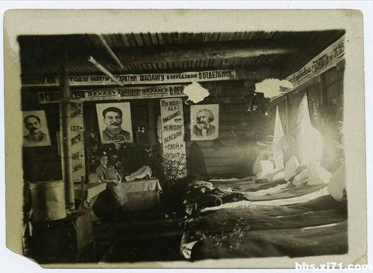

# ＜北斗荐书＞本期主题：苏维埃劳改营中的“苏维埃人”

**这是共产主义美学的经典场景：我们在各社会主义国家的电影中经常看到那唱着歌冲向死亡的镜头，最让我印象深刻的是《莫斯科保卫战》中波多利斯克步兵学校的学员们唱着《我们的一生漂泊四方》冲向德军阵地。所不同的是，这个故事里罢工者们面对的正是“革命者”的子弹。在苏德战争的初期，德军也经常遭遇绝望的失去退路的苏军类似的冲锋；苏联人应该去怎样面对德国人的机枪，就能够怎样面对内务部的机枪。**  

# 苏维埃劳改营中的“苏维埃人”

# ——对《伊凡杰尼索维奇的一天》阅读

## 荐书人 /李昌懋（复旦大学）

 

“你们没有权利在冰天雪地里脱去人们的衣服！你们不知道刑法第九条！……”

他们有。他们知道。只有你老兄还不知道。

“你们不是苏联人！”中校大叫道。“你们不是共产党员！”

法典的条文，沃尔科夫依还能容忍，可是这句话却使他像闪电似的发起火来，脸都气歪了：“禁闭十天！”——《伊凡杰尼索维奇的一天》，第23页。

 **一**

当然，索尔仁尼琴的这部成名作不是为了塑造“苏维埃人”的形象；但是，“让人感到奇怪的是，在《一天》发表的前后，对于舒霍夫这个形象的肯定，却大多是由于他的‘农民身份’和‘劳动素质’。”而据说赫鲁晓夫对本篇，“最喜欢的也是‘伊凡杰尼索维奇怎样保护了灰浆’的劳动场面”，显然，这篇小说被批准出版不仅仅是为了迎合苏联当局反对“斯大林主义”的需要，更不是因为艺术技巧上的特出；正像索尔仁尼琴自己所说：“甚至不是诗歌，甚至不是政治决定了我的小说的命运，而是一种真正的乡下人精神。”

索尔仁尼琴认为赫鲁晓夫和舒霍夫分享的这种精神特质叫做“乡下人精神”，对此赫鲁晓夫是显然不会同意的。西蒙诺夫说：“这些被监禁在一起的人不是别的，而只不过是我们的社会的一部分，它是从这个社会上被血淋淋的撕下来并囚禁在劳改营里的。”既然如此，这些人也就依然带着“我们的社会”所应该拥有的那一种伟大品质；而这部作品也就可以用来说明，即使是在被“血淋淋的撕下来”的部分里，苏维埃社会所也造就了一批“苏维埃人”——社会主义新人。

赫鲁晓夫和西蒙诺夫们（他们当然都秉持当时苏联社会的主导观念）对于这部作品的看法是不是一种纯粹的歪曲呢？这是一个值得讨论的问题。毕竟索尔仁尼琴理想中的“乡下人”和赫鲁晓夫理想中的“苏维埃人”在其最高意义上都不存在于俄罗斯大地的任何一个角落。所以先得在理论上确认二者的区别。别尔嘉耶夫早就指出过，从第三罗马存在一条直通第三国际的大道；保尔一类人物形象的圣徒精神也不用多说：都要忍受苦难，救赎大众。 我以为最显著的区别在于“乡下人”只有和精神贵族复合时才能代表完整的俄罗斯精神；而“苏维埃人”则要同时承担两个角色：他是自己知识的终极对象，他要用高贵的精神和伟大的哲学去激发自己的天赋良善。马克思评价法国农民的名言“他们不能表达自身，他们只能被表达”正是俄罗斯知识分子们面对农民的潜台词，而索尔仁尼琴的这部小说中恰恰是以作为“乡下人”的可见主人公和叙述者的复合完成了本书的主旋律，因此这故事里的舒霍夫确实是带着一种“乡下人“气质。  **二**

然而，我们以上讨论的只是索氏和自己主人公的意识形态上的“共谋”，索氏可以让舒霍夫为自己的主题服务，但只要他坚持现实主义的创作方法，他就不得不让他的作品渗透进某种时代精神。马克思论巴尔扎克的话我想已经无需再被引用了，卢卡奇据此建立了他宏大的现实主义文学理论。当他在晚年谈及本篇小说时，举出了当全体劳改犯被叫回营房时，舒霍夫冒着卫兵发怒的危险也要砌完最后几块砖，并且在临睡前回忆起这一点时依然感到很高兴的例子，认为这个情节标志着即使在劳改营这样残酷的环境下，作为创造性活动场所的区别于资本主义生产的“社会主义生产”也依然存在。的确，这里的砌墙劳动对舒霍夫的切身利益是完全无补的，因此这里的“热爱劳动”的对象是纯粹的“劳动本身”。而且即使只是从宏观上我们也很难相信纯粹的奴隶劳动能够造的成西伯利亚的那么多座新城市和厂矿道路。但是，对这种热爱不仅可以做一种马克思主义的解释，也更可以做一种存在主义的解释：舒霍夫只是在被“抛入”这种生活后选择承担责任，从而赋予自己的存在以本质；劳动在这里只是一种抵达本质的中介或对存在周围的空虚的填充物。不过，不论是卢卡奇的读法还是存在主义的读法，都启发着我们能够也应该对这一文本进行一番别样的阅读。

 **三**

除了卢卡奇举出的例子，在这篇小说里是否还存在“苏维埃人”的影子呢？如果把一个“苏维埃人”投入苏维埃的劳改营，他将以什么方式捍卫自己的信仰？在这部小说里是否有着这样的人物？索氏对这样的人持有怎样的态度？有趣的是，在索氏的文本中寻找“苏维埃人”是一场三重性的历险，而一旦成功也将提供三重的反讽；因为这样的人物之存在对于索氏来说是越位；对于人物本身来说是失位，而对于苏联当局来说则是一种错位。

本文篇首引文中指责看守“不是苏维埃人（即‘苏联人’）”的，是一位前红海军中校布伊诺夫斯基。在对看守喊叫之前，他只出场一次，却已经表现出于众不同的精神面貌：“布伊诺夫斯基从厕所回来了，他好像有点幸灾乐祸地嚷嚷起来：‘喂，坚持住，红海军水兵们！准有零下15度！’”别人眼中的“幸灾乐祸”正是他乐观的体现，因为他自己并没有自外于这“灾”和“祸”，而称大家为“红海军水兵”，也正说明他不认为劳改营的环境和军营中有本质的不同，而是把囚徒们视为同“红海军水兵”们一样的具备主体性的人。他按照“苏维埃”的标准来看待一切，所以他不能容忍那些和刑法等原则不一致的行为，但对于制订了刑法的人却抱有充分的信心。在早上的争吵后，他没有因此改掉“喜欢发议论”（p24）的习惯，而继续评论天气，“他越来越衰弱了，两腮也塌陷了，可是精神很好。”这是苏联主流小说中常见的描写，只不过一般是在讲疗养院或医院中的身残志坚的革命者罢了，而这里可是劳改营。

当然，布伊诺夫斯基中校不是圣人。他“已经养成了指挥别人的习惯，他对所有的人说话，都像是在发号施令。”但是这一评价是紧接着海军中校让费久科夫不要再检烟头来抽之后，中校并不傲慢，只是有点清高。在随后的砌墙劳动中，他充分展现了和别人不一样的价值观。“海军中校这个人把在劳改营里干活看成是在海上出勤：叫你干什么，你就得干什么！近一个月来，他已经瘦多了（第二次提到瘦了！），可他还是卖劲儿干活。”不仅如此，他还抓着费久科夫的领子叫他干活——“抬沙子去，混蛋！”当舒霍夫用老祖宗证明太阳最高的时候是中午时，他却抢白说苏维埃政权的法令让太阳最高的时候成了一点， 这段对话点明了在舒霍夫和中校心中最具权威性的东西分别是什么。

在午休之前，作者虽多次让中校出现，但都是漫画式的匆匆宕开几笔。在午休中，作者给中校整段白描作为特写。这时的中校“感到周身疲乏”，“而五分钟前，他还扯着洪亮的嗓门吆喝别人呢”。他坐在挡道之处，对于“别人大声喊着叫他走，不停地拍着他的背，叫他让位”毫无反应。这明显的萎靡引起了大家的同情，所以帕夫洛把舒霍夫多弄来的一钵粥给了他喝。“这位环绕整个欧洲并且在北极航线上航行过的中校，张开干裂的双唇，露出一丝歉疚的微笑”，接过粥吃了。值得注意的是，这几段重复地存在两段对中校的相似评价。先是以叙述者的身份：“他来劳改营不久，干这种苦活也没多久。其实像现在这种时刻（这一点他自己还不知道），对他来说就已经是特别重要的时刻了,因为这种时刻已经把他从一个只会扯着嗓子发号施令的海军军官变成了一个行动滞缓谨小慎微的犯人。而他也只有这样才能熬过他这二十五年的监禁。”后面是舒霍夫的评价“在舒霍夫看来，把粥给中校是对的 。中校将来会学会生活的，而他现在还没有学会。”

显然索氏是把少校的精神面貌理解为一种暂时状态的；这两段评述是索氏试图控制少校形象的发展因而也就是少校形象的发展可能超出索氏控制的例子：在舒霍夫的身上明显栖息着作者的幽灵；然而却也带着那索氏自己也未必意识到的时代精神的烙印；而少校则更带着无法否认的从“乌托邦主义”文学中喷射而出的品质，并且这种品质在召唤舒霍夫等人身上潜在的类似物，同时也在挑逗着索氏的意识形态洞见或偏见，渴求他的回应。虽然我们不能肯定索氏塑造这一人物没有故意制造“反乌托邦”效果的用意，但是由于作为一种意识形态再生产形式的文学与一般意识形态相比，具有开放性——作者的意识形态以一种确定的形式表征于作品，而读者在阅读中永远可能涌现出新的问题式，所以这种意识形态因其非能动性将不能自动生产出新的回答，从而不断暴露其裂缝，从这些裂缝中将流出作者意识形态下文本世界的本质——所以这里中校形象的重要性从根本上与索氏创作他的目的无关。中校证明了“苏维埃人”这一人物类型的生命力，又因此特殊场所而避免了自身的过度类型化，从而成为和主流小说中的“苏维埃人”相比更值得人玩味的形象。

 **四**

海军中校在听了小队长丘林讲述了自己的长长故事后，问他：“后来您再也没有见到您弟弟吗？”（丘林的弟弟和几个流浪汉走了），这说明他对别人命运的关心，也说明他对丘林的故事感到有些陌生；毕竟和本来就在苏维埃制度下作为边缘人（富农子弟）存在的丘林相比，他是苏维埃社会的有机部分和产物。

在下午的劳动中，他继续表现得十分出色。抬灰浆时，面对又陡又滑的马道，“起初他不怎么卖劲”，但在舒霍夫的催促下很快就“越干越麻利”，并恢复了严格要求别人（和自己）的本色，说自己不跟费久科夫这个孬种抬；在换了搭档后，他没有那么凶了，而是鼓励他和自己一起加劲干。直到“脸累得发灰”来为止。直到这时，作者才告诉我们，“这位海军中校大概四十来岁了，即使不到四十，也差不离儿了。”，在第一遍读这篇小说时，我看到这里前一直以为他要比这小得多；因为他似乎只有《青年近卫军》的主人公们才会像他一样这么认真地对待苏联主流意识形态。

但是他的年龄几乎和保尔柯察金一样大了——保尔比他的创造者小一岁，是1904年的。这样说来，中校就不仅仅是被苏联造就的一代，更是造就了苏联的一代。在下午劳动的最后，他已经“像一匹驯顺的骟马”，“累得连站都站不住了，强撑着”。

在返回营地的路上，中校先是和舒霍夫进行了一番关于月亮的谈话。他相信科学，告诉舒霍夫月亮一直都在，只是有时有的部分看不见；而舒霍夫则相信每一轮月亮的圆缺都是新月亮的诞生，旧的月亮被上帝弄碎做成星星了。这种见解得到了中校的嘲笑；看得出中校充分展现出来了“苏维埃人”和“乡下人”的又一个不同：这是具备现代性的形象，他的自我之根是现代话语下的启蒙，理性和解放。

后来他又和采扎里谈起了《战舰波将金号》和军舰上的真实生当有人问起他为什么这样熟悉英国海军的生活方式时，他才谈到自己在一艘为北极航线护航的英国巡洋舰上待了一个月，充当两军的联络官。当别人听到后说：“啊，原来如此！这就足够判您二十五年的了”时，中校说：“不对，要知道，我不赞同这种不负责任的推断。我对于我们国家的法制还是看好的。”

当然，可以毫不费力地批评他这里的态度是被洗脑了；但是怎样解释中校下面这句话呢？“已经是战后了，一个海军上将，鬼迷心窍，送给我一件纪念品，‘聊表谢意’。我很惊讶，真该死。”有论者认为这一段话意在说明苏联当局罗织罪名的恶劣。我以为非也，这里只是说：中校把这件事理解为自己被捕的原因。斯大林主义的清洗的特点就是受害者的不确定性，纳粹的集中营里几乎只有犹太人和共产党员，在这座劳改营里却同时有官员工人农民流浪汉和真正的间谍，因此批评说斯大林主义比纳粹主义更“残酷”是可以接受的——然而正是这种“残酷”决定了斯大林主义和纳粹主义的本质不同：苏联在为了真实的原因消灭虚构的敌人，而纳粹则为了虚构的原因消灭真实的敌人：斯大林清洗的无限性正说明他愤怒而恐惧地试图防止自己结构的固结和革命本质的完全流失。

因此，也许使中校失去信任的正是他在英国军舰上的一个月而不是某一种更具体的罪名。然而中校本人试图让自己相信的理由却是一个符合苏维埃法治的理由：既然自己收到了帝国主义者的礼物，又没有办法证明这礼物里毫无问题，那么被指控为间谍就是合理的；中校的这种理解赋予自己的行为以苏格拉底接受死刑判决一样光辉的意义：他对“苏维埃法治”的确信并不来自于被灌输的信条，而是对于苏维埃制度正当性的根本肯定。

回到营房后，采扎里和中校分享了自己的面包。中校谈到了为了迎接雅尔塔会议，在赛瓦斯托波尔开出了一家专门给美国海军上将看的商店，里面应有尽有。中校不是个不敢面对苏联现实中一系列黑暗的犬儒主义者，他的信仰不意味着过滤自己看到的一切，也不意味着接受自己所看到的一切。即使在苏维埃的劳改营中，他依然自豪地高扬着自己“苏联人”——“苏维埃人”的身份，他接受劳改，但不接受劳改中的虐待；他用自己的行为在苏联现实的丑恶面前实践着苏联理想的高尚；固然可以说，这是虚假的理想。

然而这种“虚假的”理想所造就的真实的人使得这种虚假理想比“真实的”残酷的苏联社会更加真实。徐葆耕先生讲过一个故事，一位他的同龄人对他说，自己正是看过苏联电影《金星》中的农村生活后才报考的北京农业机械化学院，她想让家乡的田野像电影中的库班草原一样麦浪滚滚。可是这部电影现在却被普遍认为虚假和做作——我没看过这部电影，我想也许是这样吧，但这位老人的选择却是真实的。

 **五**

让我们再一次回到本文开篇的引文。值得注意的不仅仅是布伊诺夫斯基对看守批评的独特性——能想象集中营的犹太人对看守大怒道“你不是雅利安人，不是纳粹党员”吗？，更包括了看守的反应。他“闪电似的发起火来”。为什么看守会恼羞成怒？是因为这种表达和指责表面上的错位吗？我们都无法容忍对我们最深层的身份认同的挑战，这种反应说明看守和囚犯分享着对“苏联人”的身份认同。

我们不难举出一系列今天被认为是偏狭或虚假的文学形象，比如《真正的人》中梅列西耶夫对自己无腿也能飞的信念来源“因为我是苏联人”，但是在异议小说如本篇里我们却找到了这种认同存在的真正证据。当然，看守心目中“苏联人”的概念是否有中校所表现出的那样具体而丰富的内涵另当别论，但是在索尔仁尼琴的这部直刺苏联最黑暗一面的小说中，却到处弥漫着一种纯粹属于苏联文学的味道；不仅如此，他和苏联三四十年代主流小说的文本相关性是很难被低估的，二者完全可以互为注释。

索尔仁尼琴对于布伊诺夫斯基海军中校和他所代表的价值观的意义当然不会也不愿做这么高的估计。除了上文引用过的评论外，不难发现，中校在小说中这一天的生活是以低音结束的。他最后一次出场是被看守叫去，开始执行这十天的禁闭——要不是他自己莫名其妙地应答了看守叫他的名字，几乎就能躲过去了；而禁闭室的环境极端恶劣：“十天十夜！要是在这个牢房里把这十天十夜老老实实地蹲满，这一辈子的健康就算完蛋了。你会害上肺病，住一辈子医院。”和舒霍夫临睡前的“心满意足”相比，中校的这一天可以说是很不幸了。作者在这里未必不是在重申自己的结论：“中校还没有学会生活”。不错的，劳改营里有些太认真的人，但是残酷的环境会教会他们一切的。

就让我们看看索氏认定了会屈服的布伊诺夫斯基们在劳改营中待得久了会变成个什么样儿吧：

在这个世界里，集体蔑视和示范性民众团结仍可能表现出道德的奇迹，如1953年发生在沃库塔29号矿的传奇性事件。斯大林逝世后几个月，整个西伯利亚的劳改营里都爆发了大罢工；罢工者的要求是有节制且“合情合理”的：释放年龄过大和过小的劳改犯，禁止监视塔楼里的卫兵随意枪杀劳改犯，等等。那些劳改营一个接一个地屈服于来自莫斯科的威胁和假承诺，只有沃库塔29号矿坚持了下去，结果被装备着坦克车的内务人民委员部两个师的军队包围。当军队最后攻进大门时，他们看见囚犯们集结列阵站在门后，胳臂挽着胳膊，高声齐歌。在片刻犹豫之后，重机枪开火了——矿工们保持队形屹立不动，反抗着继续唱下去，生者架扶着死者。约莫一分钟之后，现实占了上风，地面上到处凌乱地躺着矿工们的尸体。然而，这短暂的瞬间——其间，罢工者的反抗似乎终止了自然规律，把他们筋疲力尽的躯体变化成不朽的歌者的集体之躯——是最纯洁的延长了的时刻的升华，在某种意义上，在这延长的时刻里，时间静止不动了。

这是共产主义美学的经典场景：我们在各社会主义国家的电影中经常看到那唱着歌冲向死亡的镜头，最让我印象深刻的是《莫斯科保卫战》中波多利斯克步兵学校的学员们唱着《我们的一生漂泊四方》冲向德军阵地。所不同的是，这个故事里罢工者们面对的正是“革命者”的子弹。在苏德战争的初期，德军也经常遭遇绝望的失去退路的苏军类似的冲锋；苏联人应该去怎样面对德国人的机枪，就能够怎样面对内务部的机枪。

 《伊凡•杰尼索维奇的一天》 索尔仁尼琴著 斯人等译 人民文学出版社 2008 《俄苏文论十八题》 邱运华著 安徽教育出版社 2009 《西方马克思主义美学研究》 冯宪光著 重庆出版社 1997 《解冻文学和回归文学》谭得伶 吴泽霖等著 北京师范大学出版社 2001 《乌托邦与反乌托邦：对峙与嬗变——苏联文学发展历程论》董晓著 花城出版社 2010 《有人说过集权主义吗？》齐泽克著 宋文伟 侯萍译 江苏人民出版社 2005  

（采编：徐驭尧；责编：陈芝）

 
