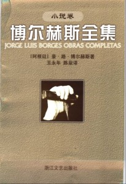
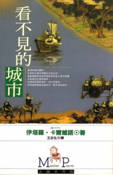
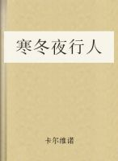

# ＜北斗荐书＞本期主题：虚构的艺术  ——关于“无限”的想象

**To see a World in a Grain of Sand**

**And a Heaven in a Wild Flower,**

**Hold Infinity in the palm of your hand**

**And Eternity in an hour.**

**——William Blake**

 

# **本期主题：虚构的艺术**

# **——关于“无限”的想象**** **

## **荐书人**** /**** ****慕愁空（中国矿业大学）**** **

每一个文学青年或者立志要成为文学青年的人都会有一个觉得自己非常文盲的时期：玛格丽特·杜拉斯的《情人》多大成分是自传？米兰·昆德拉的《不能承受的生命之轻》里的“轻”到底指的是什么？卡夫卡在《审判》里写到的那扇门到底有什么隐喻？加西亚·马尔克斯的《百年孤独》又是怎样的一种孤独？普鲁斯特在《追忆似水年华》里写到的“玛德琳娜蛋糕”究竟是什么滋味？……当在阅读中遇到像弗拉基米尔·纳博科夫、杰克·凯鲁亚克或者弗朗索瓦丝·萨冈这类又长又不好记的外国人名字时，心里唯一的想法就是非要把这些人的作品全都找出来看一遍不可。——这样即使后来没搞成文学，至少可以拿出来跟人吹吹牛骗骗小姑娘，看，我读的书可不是一般人读的！当然啦，前提是这姑娘不是我。 这次给大家推荐的两位作家可是大师中的大师，被称为“专为作家写作的作家”——阿根廷的豪尔赫·路易斯·博尔赫斯和意大利的伊塔洛·卡尔维诺。他们的作品对很多中国作家影响深远，文学青年们也是动辄便提这二位的大名来显示自己的品味，具体事迹我就不介绍了，请自行维基。 先说博尔赫斯。《盗梦空间》这部片子相信很多人都看过，其导演诺兰最喜欢的作家就是博尔赫斯，这部电影可谓是向博尔赫斯致敬之作。梦中梦的灵感来源何处呢？依我看最接近的是《环形废墟》这一篇：魔法师在环形废墟里做梦，在梦中制造了一个少年，并把他当做自己的儿子一样教养，唯有火能够告知他的幻影身份，因为幻影不会被灼伤。然而故事的结局却是魔法师发现自己不过是别人梦中的幻影。由此又可以推测出，可能自己不止是梦中人，而是身处梦中梦，而自己的梦中人亦可能在梦中制造他自己的幻影，永无止境。谁又分得清自己是梦是醒？ 博尔赫斯探索无限的小说还有很多，比较著名的有《阿莱夫》、《沙之书》、《通天塔图书馆》等，我最喜欢的小说集是《小径分岔的花园》。博尔赫斯写的多为短篇小说，但是相当难懂，要追求很强的故事性的话还是另寻他处吧。以上提到的都是短篇。 卡尔维诺是另外一位属于难懂的作家。平心而论，他的语言并不晦涩，但是包含众多象征，写作技巧多样，让人搞不清他想表达什么。卡尔维诺的重要特点就是“探索小说表达的无限可能性”，这也是他成为诸多作家的精神导师的原因。最有名的作品当属《看不见的城市》和《寒冬夜行人》。 《看不见的城市》描述了很多个虚构的城市，叙述者是马可·波罗，倾听者是忽必烈汗，当然，这也是虚构。比如这一段：从那儿出发，向东走三天，你便会抵达迪奥米拉，这座城有六十个白银造的圆屋顶、全体神祗的铜像、铺铅的街道、一个水晶剧场，还有一头每天早上在塔楼上啼叫的金公鸡。旅客熟悉这些美景，因为他在别的城市见过。然而这城市有一种特别的品质，如果有人在九月的一个黄昏抵达这里，当白昼短了，当所有的水果店子门前同时亮起多色彩的灯，当什么地方的露台传来女子叫出一声"啊！"他就会羡慕而且妒忌别人：他们相信以前曾经度过一个完全相同的黄昏，而且觉得那时候快乐。 城市，只有一个个城市。卡尔维诺给所有虚构的城市取了一个女人的名字。他唯一不提到的是自己的城市威尼斯，但是每个城市似乎都有威尼斯的影子。 《寒冬夜行人》则是另一种探索。怎样让一本书对读者有持久的吸引力？答案是，不结束。开头是一个故事，但是马上戛然而止，作者告诉你这本书出现了印刷错误，故事里的读者便去调换，但是又是看了一个开头便出现了错误。最后你发现作者根本无心把故事写完，你落入了一个无限的圈套，并且无法自拔。 

**推荐书籍（点击蓝色字体书目可下载）：**

**1、****《[博尔赫斯小说卷全集](http://u.115.com/file/bh5iy7mi)》**

********

 

**2、****《[看不见的城市](http://ishare.iask.sina.com.cn/f/12217409.html)》**

********

 

**3****、《[寒冬夜行人](http://ishare.iask.sina.com.cn/f/4673278.html)》**** **

****

 

（采稿：徐毅磊 责编：徐毅磊）

 
