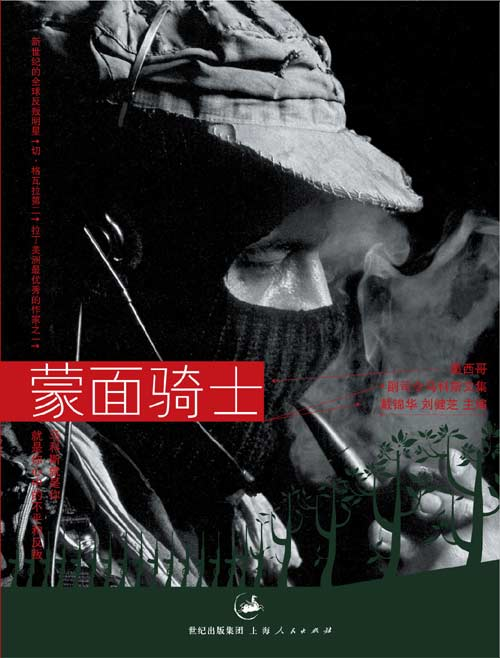

# ＜北斗荐书＞本期主题：让我们来说说马科斯

**如果不是戴锦华的这本《[蒙面骑士](http://book.douban.com/subject/1790005/)》，我现在也不认识他。但他究竟是谁，我也说不上来。不过你可以记住他的样子：黑色的滑雪帽、永不离口的烟斗、毛式的破帽、胸前的子弹带、腰间的短枪、还有他唯一可见的眼睛。今天，我们就来说说他，还有他们。墨西哥印第安原住民们。**

# **本期主题：让我们来说说马科斯**

## **荐书人**** / ****范承刚（暨南大学）**

** **  

今天我们来说说马科斯。 你知道马科斯吗？ 不是写资本论的那个大胡子，也不是你搜索出的那个足球运动员。 我们说的是副司令马科斯。 他谁也不是，但谁也都是他。他没有名字，没有身份，没有面容，没有财富，没有任何可供推论出他的性格、特长乃至家庭住址的线索。 他是个副司令，是个文学家，是个演员，是个布道者、诗人，以及侦探小说的写作者，是一切你可以随意想像和塑造的神秘人。 如果不是戴锦华的这本《[蒙面骑士](http://book.douban.com/subject/1790005/)》，我现在也不认识他。但他究竟是谁，我也说不上来。不过你可以记住他的样子：黑色的滑雪帽、永不离口的烟斗、毛式的破帽、胸前的子弹带、腰间的短枪、还有他唯一可见的眼睛。今天，我们就来说说他，还有他们。墨西哥印第安原住民们。  **对抗遗忘**  1993年的最后一天。一声枪响在墨西哥的老城圣克利斯托瓦尔回荡。随后的元旦之晨，这个老城，还有占领这个老城的数千军人出现在全世界人民的眼前。这群由墨西哥的少数民族组成的军队无疑很不敬业，装备破旧、衣服各异、连女兵也拉上来了。但是这支头蒙着面具或者土布手帕的队伍却实实在在地攻陷了一座城市，并向全世界发布了他们的宣言：我们是五百年斗争历史的产物…… 随后，更令全世界媒体和人民惊奇的事发生了：在这群原住民中，一个白色皮肤的战士成为了他们的副司令，而他们的总司令却无踪可寻。 这个头戴滑雪帽的副司令马科斯，无疑吸引了更多的目光，而随后他优雅的谈吐、有趣的言语则令世界为之一振。在如今这样一个世界，还有比发现一个佐罗更令人兴奋的事吗？ 这支原住民军队在攻陷城池的第二天就放弃了城池，转而隐匿在墨西哥蜿蜒的大山中。之后的几年，枪声寥寥。然而，战争却仍在继续。从墨西哥群山中发出的一封封公告、信件，成为了在世界回响的枪声，也为世界拼凑出了这场斗争的缘起缘灭，这群拿起枪的萨帕塔人的前世今生…… 简略地说，这场战争，是墨西哥东南部群山中的萨帕塔社区的原住民，为争取生存空间、争取自治权力而发起的一场战争。新自由主义的政策、全球化的浪潮、墨西哥政府推行的土地私有制等，摧毁了他们的原有的土地共有制度，剥夺了他们原有的生活空间，这使得这群原住民拿起了枪。 但也不尽然，需要补充的是，这场斗争似乎并不仅仅只为三餐温饱而战，也并不等同于咱们“王候将相宁有种乎”的农民兄弟起义。这场斗争中频频谈起的有一个响亮的关键词，叫做“尊严”；这群萨帕塔人自称有一个共同的敌人，叫做“遗忘”。 还是戴锦华先生说得好：“在除夕之夜奔赴圣克利斯托瓦尔的队伍，不是去开启一次战斗、征服、胜利之旅，而是自觉踏上了不归之路。死亡，但首先被看到、被倾听。因为别无选择，只有武装起义，才能让整个遭受到文明灭绝的印第安原住民的苦境闯入主流社会的视野。萨帕塔人说，我们准备去死，但我们不想死。” 于是马科斯的笔成为了最有力的武器，不停地揭开历史的伤疤，重提遗忘的旧事，挑动人们的眼球，嘲笑我们的无知。这是一场我们从来没有看过的战争。萨帕塔人说，我们是一种因武装而获注视的声音，一张因隐匿而获注视的面庞，一个因匿名而获命名的称谓。 枪声寥寥，但战争一直继续，萨帕塔人的声音，让我们发现了这个世界的遗忘与无声。  **永恒悖论**  热衷枪炮战争的人一定很恼火，马科斯和萨帕塔人自从起义之后，就几乎没有怎么正经地动过枪了，甚至其中很多人用的还是木头枪。咱们党还打得过就打打不过就跑，而他们是连打上一打的力量和心情也没有的，墨西哥政府的枪炮一来，他们就自觉走进大山了。 虽然这非常地不务正业，有违毛老头子“枪杆子里出政权”的真理。但马科斯本人无疑找到了比枪炮更为厉害的武器，那就是他的语词，他不断发自墨西哥东南群山中的语词。或是语调铿锵的公告演说，或是幽默调侃的嘲讽小文，或是陈述或是哀思，或是书信或是寓言，人们通过这些出自大山却刊登在各大媒体报纸上的语词认识了马科斯，认识了萨帕塔人，以及这群人的斗争、尴尬和沉默。 很多人成为萨帕塔运动的支持者，很多人怀着这样或那样的目的走进墨西哥群山去开会去朝拜，这些语词借助媒体，构成了一个网络，把整个世界构建成了战场。 马科斯的笔下，永远充满了前后的矛盾与永恒的悖论，就比如这些：无梦之梦，无名之名，无面之面 ，无枪之争，无望之愿，又比如丰饶之泥泞、喧哗之沉默、无言之言说、温柔之狂怒、遗忘之征服……似乎这些语词、这场斗争、这个世界，连同马科斯这个人，都是一个矛盾体。但仔细一想，这似乎又是事情的本来面目。 就像马科斯所揭示出的这样一种状态：当萨帕塔人带上面具，他们成了战士，但是当他们脱下面具，他们就隐密在了人群当中，好让墨西哥政府无从寻找；当萨帕塔人带上面具，他们获得了发言的机会，但是当他们脱下面具，世界就会遗忘或者疲惫。 他们没有面容，人们反而记住了他们。这就是二十一世界的悖论，而马科斯及其语词，在这样的环境里却也获得了最大的舞台。 声明一点，马科斯的语词并不是义正词严的，他不会高喊一切反动派都是纸老虎。相反，它很有趣，还带带有着后现代主义文学的风格，甚至你可以从中读出小说、读出童话、读到寓言、读到神话。但在这里我只想谈谈马科斯笔下的两个朋友，小甲虫杜里托和老人安东尼奥。 关于杜里托，马科斯说：“成人以后，出于耻感，我们都完全遗忘了自己心里的那个孩子。” 要怎么形容杜里托呢？ 他是自大的、幼稚的、冲动的、蛮横的，也是有趣的、自恋的、脆弱的、激情的，他有时是小甲虫，有时是游侠骑士，有时是侦探小说爱好者、有时是海盗……但更多的时候，他是堂·杜里托，是西班牙那个固执骄傲的骑士在墨西哥的一面倒影，是为大战风车五百回合而出生的勇敢骑士，是马科斯梦中的玩伴也是他和萨帕塔人的代言者。 嬉笑怒骂中，我们可以看见杜里托战斗着的小小身影。杜里托会清清喉咙说：“夜已破晓，我憔悴的持盾人！时辰已至，夜已披衣作别，日已磨利了阿波罗的尖刺以窥见世界！游侠骑士应启程寻觅令他誉满天下的奇遇！”这就是有趣的杜里托。 关于安东尼奥老人，马科斯说：“某些时候，我们都拥有自己的安东尼奥老人。如果你没有，就把我的借给你。” 安东尼奥老人无疑是一名智者，是萨帕塔千百年文化中的长者。安东尼奥老人总会讲很多故事，这些根源于古老玛雅文明，生长在萨帕塔社区，流传于孩子之间的故事，此时在马科斯的笔下倾泻而出，伴随着的是烟的涡旋，与夜的清辉。 比如安东尼奥老人讲的一个关于剑、树、石和水的故事。远古时，树倒在剑的锋芒中，石头也在剑的刀锋下粉碎，而最后，剑在水的奔流与时光的流逝中，变得老旧、布满锈迹，而溪水依然歌唱。安东尼奥老人说：“我们要继续奔向大河，大河会将我们带往汪洋，大神会在那里痛饮以疗伤他们的焦渴，那是创世之神、原初之神。” 又比如银河的故事。原初之神创造世界之后，男人与女人生活在大地上。一条吃人的巨蟒，也出现在镇上，洗劫了每一个村庄，吃掉了村庄里所有的男人。直到有一天，村庄里的女人将巨蟒团团围住，用尖棍从四面八方刺进了巨蟒的躯体。巨蟒投降，交出了吞食的男人，也被人们赶到了群山之巅，以阳光为食，入夜，光芒便从那成千上万的细小的伤口中流淌出来。 于是萨帕塔人称之为银河的，是那白日为光所喂养、夜晚伤口泻出光芒的巨蟒在远方小憩；萨帕塔人称之为希望的，是那永不终了、死而永生的抗争。 初生与古老，抗争与睿智，这也是马科斯用他的笔构建的一个悖论，一个在土壤中生长千年、也将永远流传的悖论。  **群体狂欢**  围绕着马科斯，一个人的孤独成就了一群人的狂欢。 军队、政府、媒体记者、知识分子、青年学生、家庭主妇、摇滚青年，当然还有马科斯所自诩的，旧金山的同性恋，南非的黑人,欧洲的亚洲人，以色列的巴勒斯坦人，德国的犹太人，波兰的吉普赛人，夜晚二十二点地铁上的单身女人……当他带上面具的那一刻，人人都可以从中看见自己的影子。群体狂欢，言语大海，人皆可取一瓢饮。 许多的人跑到了大山中去开会，或者以各自的方式参与到这场狂欢中。从这个意义上说，我们的知识分子不是管得太多，而是看到得太少，既不能将视野投向内心，又不能所言有物，耐不住寂寞，又放不开自己。 不过话说回来，马科斯作出一个独一无二出现的人，还是被我们的猎奇心理加上发达的通讯传媒娱乐化消费化了，比如现在，我就在这里煞有其事地说起他。又比如，频繁出现在酒吧衬衫足球赛摇滚音乐会的那个红色大胡子，谁又会在意他是谁，曾经为了什麽战斗，还曾经很光荣与毛老头子握手会晤曾经走进玻利维亚的丛林中去作一个现代的唐吉柯德。 然而在大家将焦点聚向副司令时，人们却似乎忘记了有一位正司令——马科斯所代表的、所为之言语的，墨西哥东南部群山中的萨帕塔社区。 在华丽的语词下面，我们忽略了这群的人苦难。这群从人类最神秘的玛雅文明之乡走出的原住民，为争取自治，争取社区文化的延续与自身的生存，已经走进山林有六年两千多个日夜了，又或者如他们所说，他们为反抗奴隶制、帝国主义、全球化、新自由主义，以及民族同化，已经有五百年的历史了。 当我们又将焦点聚向萨帕塔社区时，我们也可以借由他们的滑雪帽、木头枪和种种言语，去回溯和发现拉丁美洲千百年来我们所不知的历史、抗争与变迁。比如，欧洲文明对古老玛雅文明、印加文明的摧毁和杀戮；比如，印第安人被迁移、夺掠、遗忘的身影；比如，自称为“强奸之子”的拉美知识分子，如何反思历史、重整文化，并独立言语。 借由这群恰帕斯东南群山中的原住民，或许可以给予太平洋彼案的我们一些警醒和启示。当我们身旁那些生长在大山群中、树林深处、长河两畔的人们被迫远离家园，当我们自觉或者不自觉间、参与或者目睹着这片土地上的民族丢弃或者遗忘原属于自己的根，当哈达不再洁白米酒不再香醇歌声不再热情舞蹈不再有篝火相伴，我们是否会有所察觉，然后在恍然间想起，在墨西哥东南部的群山中，有着一个叫做萨帕塔的原住民社区，这样激烈而平和、单纯而顽固，为保留文化争取生存（而非获得政权），而自觉套上了滑雪帽，站在了世界的舞台上。 这是拉丁美洲这块土地千百年磅礴奇幻中生长出的一朵浪漫之花，不知有一天能否结出现实之果。但是谁在乎呢，至少现在它还在开放着，而且开得还不坏。 

### **推荐书籍（点击蓝色书目可下载）：**

** **

**《[蒙面骑士](http://ishare.iask.sina.com.cn/f/15234938.html)****》**

** **

作者: （墨）马科斯 译者: 戴锦华 / 刘健芝 等 出版社: 上海人民出版社 

（采稿：黄理罡 责编：徐毅磊）

