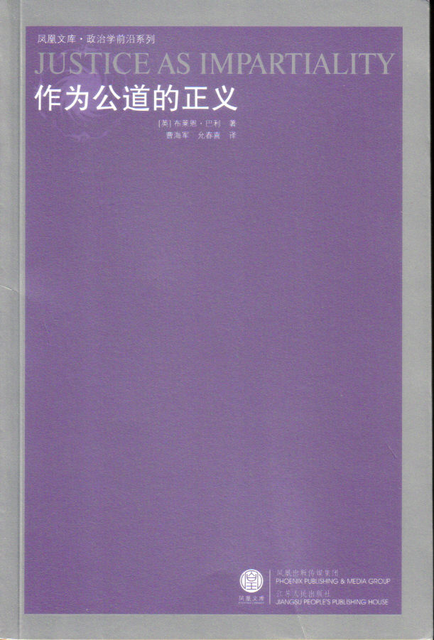

# ＜北斗荐书＞本期主题：读Brian Barry《作为公道的正义》的思路

**《作为公道的正义》是Barry正义三部曲的第二部。这本书读起来较简单，不像第一部《正义诸理论》那样会涉及到某些复杂的技术细节，可以说是Barry研究的入门之选。Barry提出了impartial justice的观念，还展开讨论了多元论、自由主义的中立性等重要概念，是理解现代自由主义的一条良好路径。**

 

# 读Brian Barry《作为公道的正义》的思路

## 荐书人 / 江绪林（华东师范大学）

 

#### 推荐书籍（点击蓝色字体书目可下载）：

**[《作为公道的正义》](http://ishare.iask.sina.com.cn/f/15332153.html?retcode=0)**

_（Justice as impartiality）（巴利：《作为公道的正义》，曹海军译，江苏人民出版社2008年版）___

 

《作为公道的正义》是Barry正义三部曲的第二部。这本书读起来较简单，不像第一部《正义诸理论》那样会涉及到某些复杂的技术细节，可以说是Barry研究的入门之选。Barry提出了impartial justice的观念，还展开讨论了多元论、自由主义的中立性等重要概念，是理解现代自由主义的一条良好路径。可惜的是，在基本观念上，Barry严重依赖于Rawls, Scanlon的概念框架，鲜有自己的首创，这或许是Barry影响不若Rawls和Scanlon等人的原因。另外，这本书的中译也让人对译者失去了敬仰，英文并不甚难的著作，译作却依然错谬甚多。

该书第一编中接续上一部申明了justice as impartiality优越于justice as mutual advantage，第二编提出了Justice as impartiality的核心论证，尤其是justice as impartiality在不同的善观念之间持守中立性（neutrality），从而为持有不同的善观念的人之间的共识提供了公平基础的概念。【02】第三编则回应了一些批判。

在第一章“公道”中，Barry“一直认为，提出一种有利于自由平等主义原则的普遍有效的论据是可能的。”【4】而各种反普世主义图景则可能摧毁人权运动，也夸大了不同社会中的观念的不可通约性。普世论述都诉诸理性（reason），而Barry将诉诸理性协议（reasonable agreement）的正义理论称为justice as impartiality，“满足这一条件的正义诸原则就是公道的，因为它们在某种程度上把握了平等：所有相关者必须感到，他们所做的就是他们所能理性地希求的事情。由此，正义的诸原则与任何特权主张不相兼容，这些特权主张是以他人无法自由地接受的根据为基础的。”【9】理性协议的机制可以在Rawls《正义论》中的“原初状态”找到典范，不过Barry说，相比之下，Scanlon的替代方案更合适，后者提出不能合理拒绝的标准。

Barry说，impartiality概念并不在道德思维中扮演核心组织性角色：“有些问题不是公道所能全部涵括的。对于其他问题而言，大部分时间，公道的作用是为可以接受的行为设立外部界限。”【21】Barry关注了一些预备问题：譬如impartial conceptions of the good：对所有利益或关切之物一视同仁。Barry还持守一种多元论：“我们必然会预料到：正常的事态是一种对善的本质产生分歧的事态。”【30】

Barry在第二章“Justice as mutual advantage and justice as reciprocity”中批评了这两种正义观。“作为互利的正义”可以回溯到Thomas Hobbes，其当代棋手则是David Gauthier,“利益”可以容许广泛理解。Barry说，任何正义理论必须回答三个问题：1、正当行事的动机是什么？2、正义规则的标准是什么？3、1与2的答案如何勾连？在互利的正义中，动机是：与不服从规则相比，服从正义规则是增进善的更有效的途径；标准为：“与所有人不受约束地追求自身的善之观念的自然状态相比，倘若对规则的普遍服从会对所有人更为有利，这一套规则就是正义的。”【52】1与2都基于利益考量。但是互利的正义从根本上是有缺陷的，问题在于：“当你认为你可以通过违反规则来更为有效地增加自己的善的观念之时，你有何种理由在某一场合下遵守规则呢？”【37】“以各种形式出现的作为互利的正义的本质乃是，人们不会放弃一心一意对自身目的的追求，无论是一己私利还是别的什么目的。”【41】以互利为基础的规则具有脆弱性，不过是休战协定而已。互利的正义的整个观点就是要将强势尽可能平稳地转化为利益。

作为一种修正，相互性的正义（justice as reciprocity）是一种将互利性（准则）和公平感（动机）结合在一起的混合理论，见之于Allan Gibbard的理论：“正义的基准的确是相互有利；但蕴含的主张确是，“公平协议”可以从所有相互性结果（与不合作或冲突的底线相比）的范围内择选出一个唯一的后果，由此来规避对利益划分的争夺。”【55】但相互性的正义也有内在缺陷，即动机（利益）与基准（公平感）的分离。Barry总结说，互利的正义（以及衍生的相互的正义）是不稳定的，“因为它具备了囚徒困境的结构。”【58】而Barry所打算提倡的就是具有保险游戏结构的justice as impartiality。

第三章展示了“公道的正义”。在公道的正义中，“服从公道规则要求的动机乃是公平行事的意愿。”【59】，而基准呢，则“公道的规则是基于处于平等地位的人们自由地许可的规则。”【59】Barry先从Rawls的理论入手，不过却说Rawls的原初状态的建构无法充分地把握隐含的公平观念，“关键的问题在于罗尔斯对原初状态的规定以及他建构原初状态的目标之间缺乏契合之处。”【66】原初状态下预设的动机是各自的善观念，而需要用无知之幕来导向公平的结果，这样做高度建构性，也取消了人的分立性。

在Barry看来，无知之幕下其实功利主义是一种极为合理的选择，而Rawls采纳了“承诺的约束（the strains of commitments）”这样一种论证将功利主义排除掉，功利主义可能导致对特定个体不可接受的后果。“承诺的约束”是一种道德的论证，而这种道德性恰好诠释了Scanlon选择处境（choice situation），而Barry认为，Scanlon的建构比Rawls的更有效。

Scanlon的选择处境有几个特点：各方清楚自己的身份和利益，但不仅仅为增进自身利益的意愿所驱使，而是为“能够达到合理的一致意见的愿望”所驱使。其一个表述是：“如果一种行为在某种情境下的表现为任一适合于普遍行为规定的规则体系（没有人能够合理地反对它作为在充分知情且无强制的条件下达成一般协议的）都不允许的，这项行为就是不当的。”【79】

Barry本来要说明的是，公道的正义是如何提议解决不同的而且有时是相互冲突的道德体系的存在的。而他的结论则是：“公道的正义所认可的规则至关重要，不过，这些规则却为生活于其中的人们根据自己的道德观念生活留下了大量的空间。”【84】在公道的正义中，正义与道德的关系是这样的：“正义是一种道德意义上的概念：行为不端是不当的，因为这违反了用于相互约束的公平协议条款。不过，公道的正义提供了基石规则，为任何特定道德体系的命令探求设定了合法性的限度。因此认为公道的正义是要构造一个本身是完整而自足的道德体系，是一种误导。”【89】

在接下来一章“公道正义的政治理论”中，Barry致力于赋予公道的正义某种内容，结果是，公道正义只是为了生活于其中的人们提供了一个框架，而不是告知他们如何生活，公道的正义并没有就所有问题做出实质性的回答。【130】Barry先比较了功利主义和公道的正义两种立宪路径，其中公道的正义是一种top-down的路径。Barry也拒绝将伤害原则或排除原则（preclusion principle,主张道德争议一般由个人决策加以解决，一般不适用普适的约束性规则）等同于公道的正义。Barry还强调了程序的重要性。

第五章到第七章“公道的正义是一种骗局”、“中立性概念”和“证成公道的正义”开始界定和证成公道的正义，而这一论证始于对MacIntyre的批评的回应，后者认为“公道的正义实际上是一种偏私的论调，蕴含了自由个人主义（liberal individualism）的特殊假定。”【137】在具体展开回应之前，Barry先拒绝了MacIntyre的一个大指控，即公道的正义是一种启蒙的筹划（enlightenment project），即完全从合理性（rationality）这一单纯概念演绎出道的和政治原则的做法。

自由个人主义可能有三种定义：与一种原子论式的社会学或一种自然的、前社会权利理论等同起来，这种定义很容易被驳斥，因为它“预设了人类能够在那些使他们成为自己的特征和能力的任何社会和文化母体之外发展进步。…这与一些众所周知的关于人类发展和任何社会中成员间的必要的相互依赖的事实是根本抵触的。”【144】Nozick在《无政府、国家和乌托邦》中就采纳了类似定义。第二种定义：在竞争中的善的观念之间保持中立；第三种：一种关于善的特殊的自由个人主义的观念。MacIntyre的骗局指责就是：公道的正义表面上采取第二种定义，实际上却是采纳第三种定义。第二种定义就是将自由个人主义等同于中立性，这是一种古怪的定义方法。Barry采纳和这种分析了第三种定义，即自由个人主义有一种特殊的善观念。在一种形式意义上，MacIntyre的指责是正确的，不过Barry通过对善做出阶位分析来维系中立性。

有两种善观念可以被看做自由个人主义的，一种是自主（autonomy）的观念，另一种是欲望-满足（want-satisfaction）的观念。两者都是二阶观念（second-order conceptions），因而可以容纳一阶的、实质性的善观念，并在一阶善观念之间保持中立。Kymlicka和Ackerman是自主的善观念的代表人物。不过自主的善观念并不真正中立，因为“一种作为自主的善观念并没有表示，对所有实质性的善观念的追求具有相同的价值。只有那些有着正当起源的观念---也就是那些以满足依据自决信仰的标准而产生的观念----能够形成拥有价值的行动的一种基础。”【154】Barry说公道的正义未必非得支持自主的善观念。

欲望-满足的善观念将各种实质性的善观念转化为偏好，而这是MacIntyre所辨认出来的唯一可理解的中立形式。如Paul Kelly就说，“功利的标准提供了一种在诸多个人关于幸福、快乐和福利的观念之间保持中立的正当原则。”【160】Barry则试图将公道的正义呈现为一种替代的中立性方案。公道的正义“将自己非常明白地呈现为一种作为由冲突着的善之观念所引起的问题的解决办法。”【163】其基本构想十分简单：“没有人能够以善之观念的正确性或相对于其他观念的优越性为基础，为任何善之观念要求一种特权地位。”【166】内在于公道的正义的中立性要求：决策的原则不应该给予某个善之观念以任何超于其他的优势。“公道的正义在许多场合可做的只是为那些可以接受的事物设定外部界限，而在其他场合它可做的就是明确说明决策必须通过一个公平的程序而做出。”【168】我个人感觉，因为要区别于自主，又为了对抗功利主义，Barry不得不强调了公道的正义的程序因素。“这里需要的中立性是程序上的：决策应该向公共争辩开放，可能被理性论证所支持，等等。”【190】但这种做法，似乎使得程序的道德性含混不清，因为正如Barry所说，公道的正义本身是一个道德概念。

Barry进而讨论了在公道的正义中对善的追求自动设限的动机的理由。一个因素涉及达成协议的动机、Scanlon说，“能够以一个人关于接受的根据像其他人证明某人的行动（和制度）是正当的这种愿望在大多数人那里是非常强烈的。”【195】Rawls理论也很重视协议的形成；Larmore则认为“向中立立场的撤退”是一种明智的策略。另一个因素涉及诉诸历史的实践的怀疑主义，在宗教改革的历史上，怀疑主义是促进宽容和自由的例子。第三个因素是Larmore提倡的平等尊重。“继续同他们会话的中立理由，必须存在于希望表明人人平等的尊重。”【209】Barry说，这种平等的尊重只有与怀疑主义携手才行。最后一个因素是Nagel所提出的“认识论约束（epistemological restraint）”,即在私人和公共领域之间的认识论区分：“在确定背景下，我被强迫认为我自己的信仰不过是信仰而不是真理，无论我有多么相信它是真理，这与怀疑论并不相同。”【212】Barry说，Rawls的方案包含了所有这四个因素。

第三卷讨论了对公道的正义的若干误解。从略。

 

（采编：黄霄 责编：徐毅磊）

 
