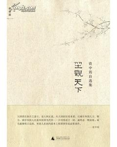

# ＜北斗荐书＞本期主题：资中筠《坐观天下》一书读后感

**在刘瑜的《民主的细节》出来之后很多人觉得美国就是民主的典范，于是经常性的犯两个错误，一是把美国当作民主灯塔，所以认为民主灯塔的作为就应该是理想主义的，为了全人类利益的。而老美非常实用主义化的外交政策往往让右派们觉得困惑。为什么一个民主国家就不能在国际社会上讲公理？这样一个问题往往表现了部分右派在外交知识上的欠缺，尤其是应该恶补一下天朝在50-60年代理想主义的外交给国内带来的害处，甚至在三年自然灾害时期还大量出口粮食。**  

# 本期主题：资中筠《坐观天下》一书读后感

## 荐书人 / 张韧刚（北斗撰稿人）

 

我是在首发式上拿到这本资中筠老奶奶的书的。之前在理想国的沙龙上听过资中筠老奶奶的一些观点，觉得颇为中肯。之后，开始关注她的这套新书，最后在首发式上买到了这本坐观天下。

资中筠老奶奶是1930年出生的一代人，到今年80多岁的高龄，但是思路清晰，观点敏锐，功底扎实。资老奶奶出身大户人家，在年幼时就弹得一手好钢琴，精通英语法语，而且在文学上亦有很高的造诣，翻译过不少巴尔扎克的作品。年轻时她曾经因为工作原因访问过亚非拉的多个国家。后来常驻维也纳3年多。这些经历带给了资老奶奶一个非常特别的，几乎是无与伦比的观察历史的角度。也练就了她超群的理性。

但是从另一个角度讲，资老奶奶同时也遇到了另外的东西——建国反右和文革，在那个年代整个世界的知识界都在左转。资奶奶的一些观点也深深的打上了这些时代的烙印。

良好的家庭修养，广泛的爱好，对生活的热爱，和开阔的眼界，丰富的经历，让这位饱经沧桑的老奶奶有着无与伦比的睿智。这本的大部分篇幅里提到的观点笔者都无比赞同与钦佩，但是在一些经济等问题上还是倾向于政府干预，这也可能是出于实用主义的考虑。但是笔者作为奥派的支持这多少有些不赞同。

真心的赞美就写到这里。更多资料可以维基百科里去找资中筠，那个条目也是我写的。下面来聊聊这本书：

书里文章很多，提供了巨大的信息量，但是贯穿始终的思想可以概括一下：

一，美国的实用主义外交政策，和老美的自由民主对内并行不悖。并不是中国人认知的那样，一个对内民主的国家，对外也应该讲公理。

二，对外反对帝国主义，与对内反对封建专制，在中国的矛盾。也许是由于天朝是一个东方专制主义国家，所以，我们的历史上，反对帝国主义侵略，与学习西方先进思想技术总是不断的冲突，最后的结果“反帝总是压到反封建”。

三，从二战之后，三巨头划定势力范围到，联合国成立，到冷战结束，直到今天，国际外交依然“是社会达尔文主义占主导地位，也就是为强权所主导。”

四，在意识形态的斗争中，无论是西方还是我们，都翻过一样极端的错误，他们有麦卡锡主义，我们有文革。

五，但是最终决定胜负的是谁的理论更务实，更优秀。正如书中所言，“年轻的苏维埃政权顶住了14国武装干涉，却在掌握了核武器之后害怕在对等基础上的和平的思想交流？”最终，伟大的苏联在戈尔巴乔夫的开放性的政策下轰然解体，其实这“正说明了苏联的凝聚力实际上已经相当脆弱”

六，东方专制主义的控制下的国家，既不可能回到原先苏联的社会主义，也不可能被全盘西化。如果说在战争年代“马克思主义思想体系更有吸引力的话”那么在经济建设的环境下，“美国及西欧国家的优势日益明显。”

七，输入民主不靠谱。尤其是在“有东方专制传统的国家，美国人一项向低估民族主义情绪，高估广大民众的民主要求”“多少次都是反帝压着反封建，而且统治者从来都能顺利的用爱国口号镇压民主诉求。”

八，也是笔者唯一不完全赞同的一点。政府要干预经济，避免经济过热，控制游资流向。通过政府的干预让游资实体经济所用。

个人认为我们要找到的不是政府干涉经济的时间或者是方式，而是有效的约束资本的规则。从这一点上来说，我认为每一次政府的救市，注资，经济刺激，干预经济行为后面都应该有人严谨的去思考这次行为的原因和它的意义，同时立法，限制资本流向并且设法避免下一次类似的崩溃情况发生，杜绝用纳税人的钱来救济大企业。

除了上面几点之外，书里还有几个非常有意思的观点，虽然昙花一现，但是耀眼无比。

“苏联的社会主义制度中，个人改善境遇之道在于政治上绝对服从的前提下，在官僚化的各个社会领域沿着解体往上爬，达到这一目的的手段却较少与创造性的劳动相关，甚至相反。”

第二个是冷战期间，美国对内“兼顾大炮和黄油”对外，“顺我者昌，逆我者亡。”但是在冷战结束之后“美国放弃了千载难逢的带头走和平道路的机会，却选择了确立一家独霸为宗旨的对外路线。造成今天的局面。”

我所以喜欢这本书，其中很大一部分原因就是对资老奶奶的比很多人更明白。

一个国家的外交应该做什么？

在刘瑜的《民主的细节》出来之后很多人觉得美国就是民主的典范，于是经常性的犯两个错误，一是把美国当作民主灯塔，所以认为民主灯塔的作为就应该是理想主义的，为了全人类利益的。而老美非常实用主义化的外交政策往往让右派们觉得困惑。为什么一个民主国家就不能在国际社会上讲公理？这样一个问题往往表现了部分右派在外交知识上的欠缺，尤其是应该恶补一下天朝在50-60年代理想主义的外交给国内带来的害处，甚至在三年自然灾害时期还大量出口粮食。

左派们则经常以美国的实用主义的对外政策为突破口，经常让右派们在这些事情上哑口无言。我们需要知道的是民主，在某种环境中是一种对内的分配方式，这种分配方式不对外。对外事务上，美国也曾经是一个非常理想主义的国家，但是在一些现实面前，美国还是选择了更实际的道路，这样的选择，在相当长的时间里给美国带来了巨大的利益。为自己的国民负责，才是一个政府应该做的事情。

老美在诸多外交上的失误，也让其蒙受了颇多损失，如果在90年代放弃把国防边界设在自己国界之外的战略的话，可能绿教也只会在中东的沙漠里互相折腾，美国在中东的干涉政策，给中东，中亚地区的民族主义生长提供了良好的土壤，以至于后来出现针对美国的极端恐怖主义。民主化的政府，最终还是要符合民意，当民族主义控制了国家，那么一个运行良好的民主制度也会选出一个非常民族主义的领袖。

我想这本书提供了一个非常好的国际视角，它梳理了联合国成立，美国外交政策从理想主义转向实用主义等历史片段，从这个视角上我们看到了很多原先的很多认识偏狭。它可以让我们重新思考民主本身的含义，民主并不是一个理想主义的代名词，而是一个非常实际，非常实用的决策方式而已。

这种决策方式也需要有人的因素参与其中，从基金会到新闻监督，民间的力量在美国民主中有着无与伦比的力量，他们是让民主这种决策方式正常运行的很重要的因素。

而我们在除了选举之外的其他方面还非常的落后，除了选举制度之外，中国在未来的民主化进程中实际上还有非常多的事情要做，比如寻求一种适合中国文化的选举之外的力量来作为政府的补充，比如在公众中间建立一种监督权力的意识等。这些方面虽然书中没有明确提及，但是必然是我们未来发展的一个方向。

总而言之，坐观天下这本书用一种冷静而清晰的思考，从历史和外交方面，给我们带来了一个新的审视我们自己的问题的角度。这种角度，难能可贵。

  编辑注：本自选集为新近出版，故不提供下载链接，喜欢的读者可以去购买实体书予以支持。  

（采编：黄霄 责编：徐毅磊）

 
