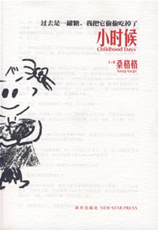
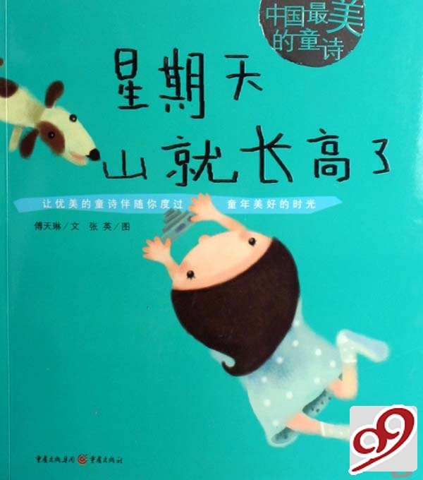
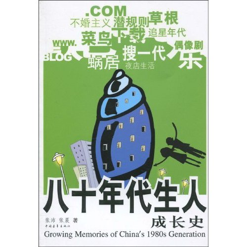
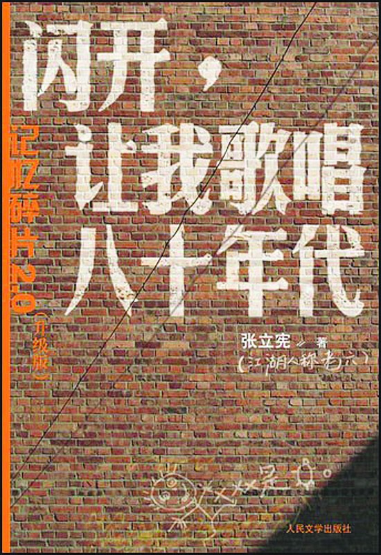
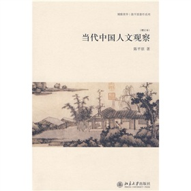
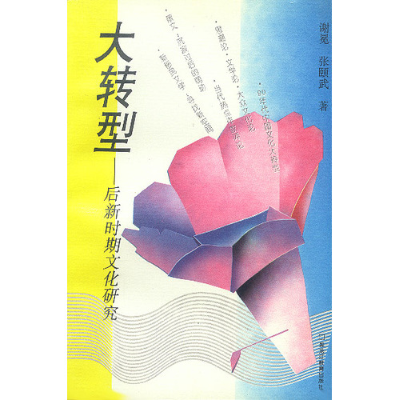
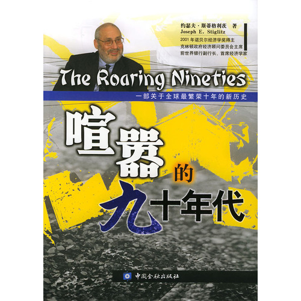

# ＜北斗荐书＞本期主题：超越认同——我们的文化想象

 

# **本期主题：超越认同——我们的文化想象**

##  荐书人 / 谷卿（暨南大学）

 

出生于80年代或90年代初期的人们，大多有着相似的经历，这一时期电影、电视的繁荣不可避免地给我们这一代人造成了明显的影响，参与到我们认识世界的过程中来，甚至起到更为巨大的作用。同出生于这一时段的我们在很大程度上都是在学校-家庭、家庭-学校间过着大体类似生活的独生子女。共同的接受教育的经历和“独苗”身份（相对而言的多数）让我们的共同话语更多，关注的事物重合程度也更大。而小学、中学毕业之后，由于个人的机遇、选择会导致生活环境的不同，话语的共同性则显得越发不明显，甚至极为迥异，但是，却有一些东西使我们已经形成了一种最基本的、最核心的、属于我们这一代人的世界观与价值观。正是由于学校-家庭生活近似乏味的单调性，使得我们对于新兴的影视剧所营造出的虚拟而真切的氛围感到异常兴奋，并且抱有相当大的关注热情。而这样的一种心态是与成人不一样的——他们或许将之视为一种消闲的手段，或许有极少对之加以研究者，而孩子们的态度却是介于这两者之间的：既有认真对待的一丝不苟，又非纯粹理性地看待，而是不自主地把身心投入进去进行感受。这种影响之大自不待言。

常常有人评说我们是“港台泡沫剧养成的一代”，这是有其客观依据的，因为在我们成长的初期，正值第三媒体普及的时候，在城市里一个一般经济条件的家庭中，拥有一台中低档的电视机是可能的。联合国教科文组织的统计显示，1996年，中国内地居民的电视机普及率为31.9%。而到了上世纪末，电视机的普及率达到99.3%，拥有两台以上电视机的家庭更是占36%。自1997年开始，电视观众的规模就达到了饱和，全国已经有10.94亿人能够看到电视。另一方面，港台影视作品的发展在这一阶段也达到一个巅峰的状态，如果从电影电视发展的历史眼光来审视，一定不会否定这种说法；大陆对港台文化作品的大量引进和借鉴，造成了它们对我们的生活形成合围之势。也即是这样的几点最关键的原因：首先，以图像为媒介的电视机在大陆的普及；其次，港台影视发展的高度繁荣；第三，大陆影视尚处在向港台及国外作品的学习借鉴期；最后，处在观念形成期的我们这一代人，成为这一现象的最受影响者。

改革开放特别是千禧以来，全球化对我们产生的影响在不断地深入和细化，尚未成长定型的“80后”、“90后”尤其处在多元文化思潮和文化事物、文化现象的强势包围圈的核心，边缘化的、自动抗拒主流的意识形态更容易对我们发生作用。这里特别要提到网络的普及，它促迫着大众文化在文化场域形成了燎原之势，这一现象不但打破了精英文化与通俗文化以相对峙的形态统领的局面，而且给人们的生活带来了天翻地覆的改变，它延续并加剧了以电视为代表的第二媒介的影响世界的程度，并直接参与到社会发展的每一点具体而微的变化中。 作为接受能力和创造能力最强的群体，正值就读于中学和大学阶段的我们，以极为充裕的时间和不可不谓过分的热情投入到网络技术的体验中。网络让我们的知识、见闻急速膨胀，让我们以各种视角观察、了解、体会世界的存在方式。只要是人类史上已经探知的事物、已经发明的成果，我们都可以花费一定的时间以后轻松占有。我们的眼界开始愈加开阔，对世界的认知因获取过众多不同的信息而显得清晰，对事物的解决能力因处理的手段多样而显得快捷，正由于这些改变，另一种不良的效应开始发生：我们不再虔诚地坚守某一家的信条，不再对这个不再神秘的世界产生敬畏，甚至我们的文化想象开始崩逸、模糊，更不再关心现实。娱乐的方式占据了我们精神的领导层域，所有的事物在一片狂欢声中被肆意地解构，多元主义的极度异化开始警示我们急需一种现实的棒喝来进行自我拯救。在这种大的环境背景下，有人借此来给我们这一代的年轻人定性，背离传统、自私无知甚至其它各种极不客观的评语被强加于尚未完全掌握任何一种经济、政治、文化资源的“80后”的身上。虽然问题仍然值得我们关切和注意，但中国的年轻一代有着更开阔的国际观，也有着比上几代人更灿烂的梦想。在前辈曾经有着如此深沉的悲情，曾经付出过如此巨大的努力的地方，我们有了更好的机会去力争上游，有了更加宽阔的舞台来展示自己。

担忧理应化作新的自信。“80后”、“90后”这一类称谓，正不断建立我们这一代人的文化认同感和我们以在全球化的网络之中的地域文化与超地域文化为资源而形成的新的现代性文化想象，它们不但被标记上了很深的时代印签，还给予我们一种把我们共同的文化想象不断衍新并促其形成现实的动力和信心，从而为我们提供了不竭的理想支持。文化的繁荣与发展，也恰恰依赖于此。

###  推荐书籍（点击蓝色字体书目可下载）：

**1、[《小时候》](http://ishare.iask.sina.com.cn/f/13528107.html)**

### ****

** 2、《星期天山就长高了》**

**3、《八十年代生人成长史》**

** 4、[《闪开，让我歌唱八十年代》](http://ishare.iask.sina.com.cn/f/9681523.html)**

**5、《当代中国人文观察》**

**6、《大转型：后新时期文化研究》**

**7、[《喧嚣的九十年代》](http://ishare.iask.sina.com.cn/f/16458778.html)**

 

（采稿：徐毅磊 责编：徐毅磊）

 
