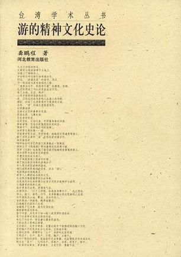
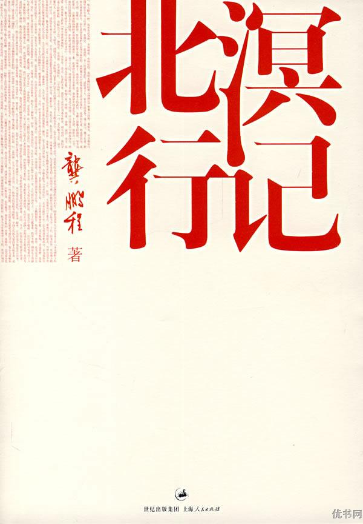
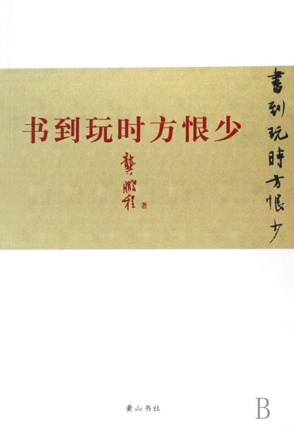
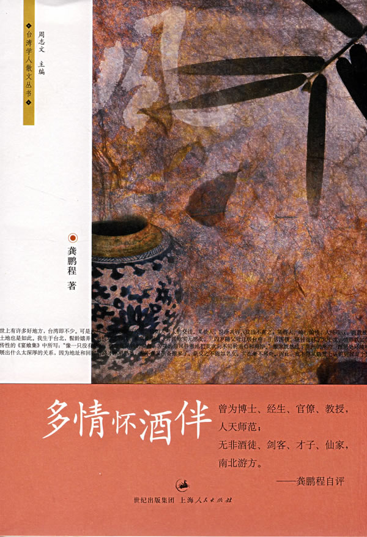
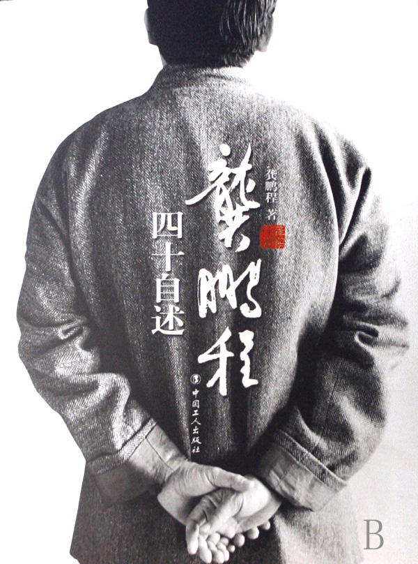

# ＜北斗荐书＞本期主题：逍遥游于艺

 

# 本期主题：逍遥游于艺

## 荐书人 / 谷卿（暨南大学）

 

龚鹏程教授是我最佩服的当世学人之一，不仅因为他的博雅，更因为他的通达。龚先生治学，凡触手所及之领域，论说皆能出新，也因为观点独到、思维缜密而使其所言入骨三分、精辟确凿。说他是当代中国为数不多的“思想家”，实在不为过。

一位朋友想研究龚鹏程，却不知如何入手，遂来我处商讨，我说是啊，龚先生本身即一大宝藏，我们骤然被置身于宝山之中，往往手足无措、空手而归；若要“研究”，莫如以“游”为切入点，结合龚先生的生活经历、读书经历和治学经历来考察，或许能有所发见。确实，龚先生人如其名，就像北溟飞来的大鹏，无待而逍遥游于天地之间，学艺双携，超然自在。

龚先生最值得我们学习处，乃在他对于学问的态度，他曾在《国学入门》一书的自序中言：“治国学须有通识，亦在养成通识、成就通人。知识是分门别类的，但读书的却是个人。人的知、情、意，必然整合为一体；其知性知觉知识，来源虽繁，门类虽别，亦乃是内在整合于人的。读书人焉能舍己徇物，依从外在知识分类而忘了自己呢？”

大多数文科专业学生或从事文科教研者被人轻视、瞧不起，恰恰缘于他们自己本身都没有坚定的信仰，对自己学习和研究的对象更缺乏基本的认知和必要的情感，他们总是把人文学科的“知识性”看得过重，也常常担忧这门“手艺”是否真的“有用”、常常怀疑传统的价值观在当下是否“吃得开”。孔子说，志于道、据于德、依于仁、游于艺，用心去体会体会，或许我们都能把“生存”变成“生活”。

### 推荐书籍（点击蓝色字体书目可下载）

**[1、《游的精神文化史论》](http://ishare.iask.sina.com.cn/f/10898331.html)**

**[2、《北溟行记》](http://ishare.iask.sina.com.cn/f/21575657.html)**

**[3、《书到玩时方恨少》](http://ishare.iask.sina.com.cn/f/12487806.html)**

**4、《多情怀酒伴》**

**[5、《龚鹏程四十自述》](http://ishare.iask.sina.com.cn/f/13019328.html)**

 

（采稿：徐毅磊 责编：徐毅磊）

 
