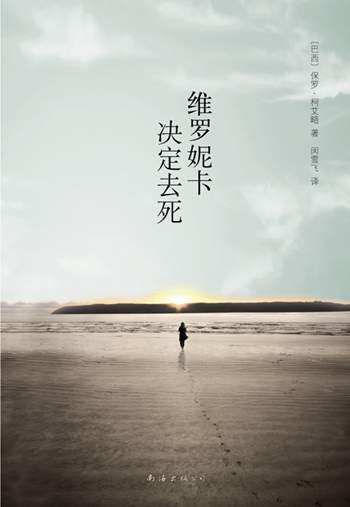

# ＜北斗荐书＞本期主题：飞越疯人院——读《维罗妮卡决定去死》有感

# **本期主题：飞越疯人院**

# **——读《维罗妮卡决定去死》有感**

## **荐书人 / 李冰心（重庆大学）**

 

**推荐书籍（点击蓝色字体书目可下载）**

**[《维罗尼卡决定去死》](http://ishare.iask.sina.com.cn/f/15113347.html)**

** **

断断续续的用了两个星期才看完了这本书，阅读过程艰难是因为体验压抑和探索生命不是一件轻轻松松就可以享受到的事。**在一个不惜任何代价也要活下去的世界里，该怎么评价那些决定去死的人呢？**答案不清晰，于是便可以有理由充满激情的去探讨生命的意义了。

一个黄昏，图书馆工作员维罗妮卡在修女出租屋里一粒一粒的服下了四盒安眠药，兴奋的准备经历人生的最后一次体验：死亡。**死亡将终结一切，这是最后的自由，这是永远的忘却。**不过她的计划没有实现，抢救之后被送到了维雷特，斯洛文尼亚的一座疯人收容所。初进维雷特，维罗妮卡依旧为自己了无新意的人生寻找结束的理由，但当她得知因为心脏遭受了损害最多还有一个星期的生命时，一种奇妙的磁场开始把她从死亡边缘一点一点的拉回来。有句俗语叫大难不死必有后福，那么维罗妮卡被送到疯人院就是她的幸运号迎着暴风雨正在起航。

为什么要自杀？因为失恋，因为缺少家庭温暖，因为经济问题，因为罹患不治之症？可以为自杀找出多少理由，相应的就可以为活着找出多少理由，所有当事人经历着的不可承受的痛苦客观来讲都不是什么非死不可的事。但是有一个问题是每一个人或早或晚都要面临的：一不小心，生活就会逐渐变成一场一日复一日不断重复的悲剧**。一些人不在乎答案，他们很早便放弃了，早已属于一个没有生命没有死亡，没有空间也没有时间的世界，另一些人却被迫思考。**无视这个悲剧的人们可以幸福的生活着，做不到假装看不见又寻找不到有效解决办法的人成了疯子。

正在上学的孩子跟父母说，我要休学去环球旅行，父母会充满爱意的说，傻孩子，你疯了吧。前途光明的人决定辞掉工作去公园里卖画，朋友会惊异的问，脑子坏掉了，你疯了吧。马路上有个跌倒的老人，拥挤的围观人群中有一个去把老人扶起来，大家在心里默想，这个家伙疯了吧。所谓的正常是一个常识性的问题，大多数人认为它是对的，它就是对的。**她说自己谈不上幸福，也谈不上不幸福，正因如此，她再也没法忍受这种生活。**很长时间里我们用所谓的正常掩饰了自己的疯狂，熄灭了自己的欲望，生命中最有意思的东西都被杀害了，生命本身不值得留恋也就不足为奇了。

维罗妮卡在维雷特，遇到了帮助她了解疯子的泽蒂卡，遇到了为她开启封存已久的欲望之门的玛丽，遇到了可以听懂她钢琴声的爱德华。由于受到了死亡意识的激励，维罗妮卡重燃了对生活的希望。**爱高于智慧，正如圣母高于蛇。对于她来说，一切都是启示。她不会去判断善与恶。**在爱的介质里，维罗妮卡跟随爱德华逃离了维雷特，两人大醉在斯洛文尼亚的废弃城堡里，相拥而眠。

我们都是自身经历的囚徒，活在别人目光的枷锁之下。生命中的关键一点在于需要经历痛苦才能摒弃恐惧，唯唯诺诺的总是低迷，想要高潮迭起，需要技巧和勇气。

 

（采稿：徐毅磊 责编：徐毅磊）

 
