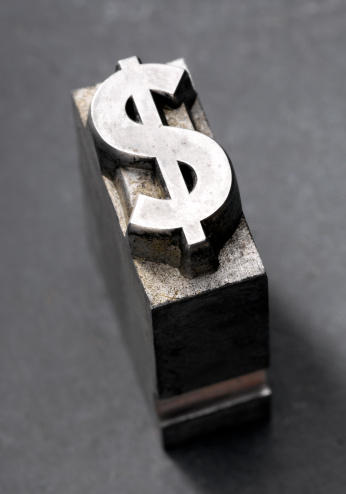
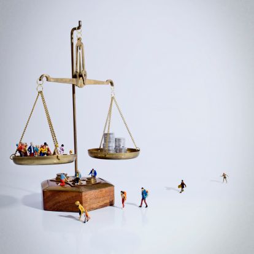
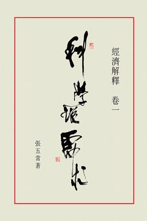

# ＜北斗荐书＞经济学爱好者的自我修养 ——随着爱好学习经济学吧

**现在的经济学已经发展到了“帝国主义阶段”，凡是你感兴趣的社会学方面的知识，都可以找到经济学家的相关论述。从法律到民主，从婚姻到家庭生活，从犯罪理论到核武器的大国关系，莫不可以用经济学理论解释。即便是你思考自己为什么说的是老陕，而不是普通话，也可以从语言经济学寻找线索。**  

# 经济学爱好者的自我修养

# ——随着爱好学习经济学吧

## 文/邓辉（安徽大学）

 

一、为什么要读一读经济学的书？

读经济学的书能给我们带来什么呢？我觉得一个人如果想让自己变得酷酷的，以便使自己在把妹的时候好装深邃，那么读几本经济学的书就再合适不过了。因为根据统计研究，和经济学家、“开明人士”相比，普通人的观念普中遍存着在4种偏见：悲观主义偏见、就业偏见、排外偏见和反市场偏见。而读经济学恰恰可以逐渐消除这四种偏见。

假如某天你和妹子聊中国特色——中国人开车的时候不爱系安全带，那么你一展深邃的时候就到了。你可以站在爱国主义的高度说：“其实这是中国人比较在意路上行人同胞安全的表现！因为根据美帝经济学家的研究发现，系安全带虽然可以使车内的人在高速行驶中更安全，但是这同时会导致驾驶员开车的速度加快，从而使得车外的路人更危险了。同时统计结果也恰恰显示这种担忧不无道理，因为更多路人因为车祸死亡了。”妹子这时就会倾慕于学识渊博的你，想着：如此爱党爱国爱人民，思想又深邃的人，谁能不爱呢？

是的，读几本经济学入门书籍，就会使你逐渐摆脱“第一阶段的思维”。所谓“第一阶段的思维”就是想“这么做是为了什么”；读了经济学，你就会想“这么做接下来会发生什么”——这就是第二阶段的思维了。有了第二阶段的思维，那么你就会被周围人夸为“神人”了，就像我被朋友们夸的那样。

有了第二阶段思维的神功，你当然也要表现啊。如果你同学不小心把教室的玻璃打碎了，辅导员要求记过，你就可以辩解到：“XXX同学的行为是爱党爱国爱人民的表现啊！他舍小家为大家啊！X老师您想想，这块玻璃被打了，XXX花钱重新买块玻璃会带来什么效果？那就是玻璃店的老伯多收入了5块钱啊！玻璃店的老伯收入多了，肯定会给孩子多买菜吃。结果就是农民伯伯的收入也增加了！农民伯伯的收入增加了，不正是XXX同学相应党中央3个一号文件的具体表现吗？不正是弘扬科学发展观的优良作风吗？不正是促进和谐社会的具体行为吗？XXX同学一心为党、大公无私，他为了党中央、国务院保8的目标，少吃了多少肉啊！？对于XXX同学的行为，您不但不应该批评，反而应该鼓励，我们就是要鼓励一切打砸抢烧以促进扩大内需！”

在你义正言辞之下，我想你们辅导员一定会被XXX的行为感动的哭了！当然，如果这时你再能强挤出几滴眼泪，那就更加完美了。

二、入门阶段的神级读物及攻读要略

看到如此的把妹神功，大家一定急迫的想让我介绍几本“武功秘籍”了。我觉得读经济学的一个目的就是为了让大家消除脑中的不良偏见，同时培养经济学的学习兴趣是学习的第一步，那么一开始介绍的读物肯定要生动有趣了。所以我推荐第一阶段的入门读物是：张五常的《卖桔者言》、《经济解释》（易宪容译的节选版）、弗里德曼的《自由选择》、曼昆的《经济学原理·微观部分》。至于《如何伪装成一个经济学家》一文中提到的那些书，我觉得没必要看的。

不是有一个经典笑话嘛，说两个人遇到一只熊，其中一位是经济学家。看到这只熊后，经济学家选择快跑，而另一个人选择原地坐着，并说：“你跑再快也没用，因为熊比你跑得快多了。”而经济学回道：“我不需要比熊跑得快，只需要比你跑得快就行了。”是的，同样的逻辑，不论你是读罗斯巴德还是哈耶克的书，对你在妹子面前装深邃，影响不大。因为如果你读了三四本经济学的书，那么你可以逐渐消除自己思维中4种陈见，从而使自己与其他屌丝区别开来。所以为什么装逼要从哈耶克或者罗斯巴德晦涩的书入手呢？

对于这四本书的阅读顺序，我的建议是先读《卖桔者言》。因为此书很薄而且文风诙谐，所以容易攻克，于是看完书的成就感容易生成。本书的第一部分提到三文鱼养殖的例子，在这里我就多谈一谈。很多绿色环保主义者，认为保护动物很重要，必须防止其灭绝，所以提倡建立自然保护区。“立法设立保护区保护动物”就是第一阶段思维，第二阶段思维就是“这会带来什么”，我们慢慢分析一下。

首先，为了防止盗猎滥捕行为，就会禁止此类市场出现；接着，饲养贩卖这些动物就会成为非法；后来，由于猎捕和消费的成本提高了，所以产品的价格就会提高；最后，在更高价格的刺激下，盗猎滥捕行为导致保护区中的动物数量缓慢下降。可是如果我们允许贩卖饲养食用这些动物呢？结果就是在利益的引诱下，有人大规模饲养这些动物，导致此类动物脱离灭绝的边缘。典型的例子就是我国的娃娃鱼和扬子鳄，当这两种动物的销售市场被放开后，娃娃鱼与扬子鳄的数量大增。这就是张五常在书中强调私有产权的重要性的结果。

读完《卖桔者言》就可以读弗里德曼的《自由选择》。此书涉及的面比上一本书更广、更宏观、更数据化。读完此书，你观念中的各种偏见就会消除很多。比如对最基本的贸易自由，你就会明白国际贸易强调的是“比较优势”，而双方的自由会给双方人民带来长远的利益。前段时间，有人反驳我[《强力远不如利益》](http://blog.renren.com/blog/242943260/786858831?frommyblog)一文的观点时说： “交流语言的比较优势能把文化上的绝对优势灭掉，你再谈普通话的推广是如何如何有需求造成的吧。”

对于这类反驳我比较懒得反驳，因为他和我的思维差了近200年，我该向他如何解释？1817年李嘉图发表《政治经济学及赋税原理》之后，在经济学界就不存在“比较优势能不能消灭绝对优势”的疑问了。因为答案是肯定能啊！

什么是“绝对优势”？假如你在造电脑方面比我在种小麦有效率，那么你就在造电脑方面存在绝对优势；同样，如果我在种小麦的方面比你在造电脑方面有效率，那么我就在种小麦方面存在绝对优势。所以你造电脑、我种小麦，大家交换，对大家都有好处。可是如果你在种小麦和造电脑两方面都比我强呢？那么就要看你在种小麦和造电脑两者中更擅长哪个了。如果更擅长造电脑，那么你就在造电脑的方面存在比较优势。所以你可以尽量少种小麦，多造电脑，然后再用电脑和我换小麦。对你有好处，对我也有好处。

读完《自由选择》脑袋里就会减少许多类似残渣，这时再读曼昆的《经济学原理·微观部分》就不会和哈佛的某些力薄儒一样，空是在道德高度反对书里的理论。曼昆的经济学入门书写的相当不错，一方面举得例子涉及面很广，另一方面他对经济学的基本框架把握的很好；所以读他的书你既不会觉得书中内容空洞而脱离实际，又不会觉得书的内容没有逻辑体系。

最后你就该对张五常的《经济解释》下手了。选这本书作为最后一本入门读物，是因为它是一本古典经济学论文范式下的作品，所以内容不太强调空洞的数学模型；其二，这本书相比于前三本还是难了些，所以放在最后读。我想这本书对许多人来说还是有些枯燥，所以在攻读这本书的过程中，可以适当读一读张五常其他随笔集，比如《凭栏集》、《学术上的老人与海》等等。这些书里讲了张五常和很多经济学大师谈笑风生的例子，又讲了他痛斥某些经济学旧论naive的例子，还讲了某些经济学大家生活与教学中的趣事。人总是有偷窥隐私的冲动，也怀有驳斥大家的成就感，看了张五常的这些书就能满足你的这些欲望；在此激励下，读《经济解释》时，就觉得更加有力量了。

三、学会聆听不同的意见

很多朋友肯定有疑问了：为什么我没有介绍宏观经济学的入门书籍？我觉得多数人没必要第一阶段就读宏观经济学有三方面原因：一是大多数人脑中的思维残渣，和宏观经济学某些理论有些切合，一开始就读宏观可能会适得其反；其二是很多人大学根本不会读完5本书，所以不如劝他先从有趣、简单而能消除偏见的书入手；其三是相比于经济学的微观部分，宏观部分有太多的争议。

这第三个原因，也就是我建议第二阶段读书的重点——就同一个问题，看不同人的观点。宏观经济学刚好提供这样最经典的论题，所以我把宏观经济学的学习放在第二阶段。而我推荐的读物是曼昆《经济学原理·宏观部分》。值得指出的是曼昆还有一本单独出版的《宏观经济学》，这本书是宏观经济学的中级教程，并不适合朋友们一开始就读。

现在初级宏观经济学教材的理论框架其实是基于4个定律：

1 奥肯定律。奥肯定律是指经济的增长和失业的下降成正比。也就是说经济增长越快那么失业率的下降就越多。

2 菲尔普斯曲线。菲尔普斯曲线则是指出了短期的通货膨胀和失业率下降也成正比。也就是说在短期政府通过制造通货膨胀可以降低失业。

3 索罗模型。索罗模型强调则是经济的长期增长是资本积累的果。

4 消费乘数。消费乘数是指消费者的收入增加后，会提高自己的消费，他消费的增加会带动其他人消费的增加，从而产生了一系列影响——增加内需。

为什么我要把这四者列出来呢？因为关于后三个定律其实一直是有争议。关于菲尔普斯曲线，弗里德曼、卢卡斯等人都提出不同意见，后来的经济学教程也加上了他们的补充意见。关于索罗增长模型的争议则更多，如果把经济学的“增长理论”列为“发展经济学”的一个分支，那么很多人都对索罗增长模型提出了异议。很多人认为资本的积累是经济发展、劳动分工或者产权保护的果，而不是经济发展的因；如果单方面强调资本的积累，就会出现斯大林体制似的悲剧。即便是按统计的口径与系数设定，很多经济学家也对此有异议，《经济增长理论—一种解说》这部文集里便有不同统计（计量）经济学家对索罗模型的争议。至于消费乘数则是基于凯恩斯消费函数，它很快就被弗里德曼和莫迪利安尼推翻了。什么又是宏观经济学的长短期分割点？那就要看利率的变动了。谈到利率，费雪（也被翻译成费舍尔）《利息理论》也会让你对凯恩斯理论有些异议。

宏观经济学就是这样一面充满争议的学科。我们在学习宏观经济学的时候，恰恰可以通过了解不同经济学家对同一个现象的不同解释和研究，学会聆听不同的意见。在别人的批评中进步，听不同的意见完善自己，这才是进步的最佳捷径。

在上文中我提了几位经济学家和几本书，在第二阶段的学习中，我觉得我们还应该额外地看一下“经济学说史”。懂得不同思想体系发展的脉络，是了解争议的一个很好途径。经济学说史看谁的都行，哪怕是某些大学的“红宝书”也可以，就是别读汪丁丁的《经济思想史讲义》。这到不是因为汪丁丁的水平差，而恰恰是因为他水平太高，那本书根本不适合入门者看。

同时在这一阶段可以试着看一看经济评论了，而我推荐的第一本经济评论集就是巴斯夏的《诡辩的经济学》。巴斯夏估计是经济学说史上唯一一位凭写经济评论而被尊称为大家的思想家了，当然熊彼得等人也在挖苦他。还记得我第一部分提到“XXX打破玻璃”的那段话？其实这段话是为了挖苦在曼昆《经济学原理·微观部分》一开始提到的一位银行家。这位银行家提到“破窗理论”，他说经济学家从破坏中看到机遇——增加就业；可是他的这种愚蠢想法，正是第一位提到“破窗理论”寓言的巴斯夏所挖苦的。经济学家的思想是不是倒退了？

四、在自己的爱好引导下看书

我说了第二阶段的看书主要是就一个议题聆听不同的意见，如果你对宏观经济学不感兴趣，那么第二阶段的学习就不一定非要在宏观经济学上耗费太多精力。当然宏观经济学的教材还是要看的，但是没有必要对每个论点研读不同的书籍了。因为现在的经济学理论已经分化已经相当细致了，不同的经济学理论牵扯的实证分析结果大相径庭；所以你可以选择自己爱好议题，然后再读相关的文献就可以了。

如果你对人类的行为感兴趣，那么你就可以读一读贝克尔的书。行为经济学的著作很多，而且都很实用。比如国家总是倡导拾金不昧，你在看了行为经济学方面的书后，你就会觉得如此倡导，不如法律规定拾捡者可以获得拾捡物品价值的10%。很多人都会觉得不拾金不昧是不道德的，而你却会说：“给拾捡者钱，恰恰可以真正的保护失主的利益。因为人都是自利的，而保管与寻找失主也是有成本的。人们不会简简单单的归还遗失物。”假如有人就此对“人性本恶”提出异议，你就可以说：“根据统计研究，一个人工作后去他父母家的次数和父母的能给他的遗产成正比。如果一个人对他父母的孝敬的行为都会受钱财影响，你还指望他对谁善良呢？” 

当然，肯定有人对那三年大饥荒产生的原因感兴趣，那么你就可以读一读相关的文献。从林毅夫、周其仁、奥尔森等人的著作读起。然后再从林毅夫著作的线索读博弈论与新古典发展经济学，从周其仁的著作的相关线索读产权经济学，从奥尔森的著作线索读广义的制度经济学派。

现在的经济学已经发展到了“帝国主义阶段”，凡是你感兴趣的社会学方面的知识，都可以找到经济学家的相关论述。从法律到民主，从婚姻到家庭生活，从犯罪理论到核武器的大国关系，莫不可以用经济学理论解释。即便是你思考自己为什么说的是老陕，而不是普通话，也可以从语言经济学寻找线索。

当然你做出任何行为都会有机会成本。当你选择读自己喜爱的经济学知识，而不是读国际贸易、金融等宏观方面的知识后，那么你就放弃了自己拥有轻松理解报刊中各种经济评论能力的机会。但是评论世界只有一种角度吗？

五、停笔后说几句话

我是学图书馆学的，我深知像这类有关导读类的书目信息文章，不会有几个人按部就班地读的；所以我觉得大家如果能读完我第一部分提到的4本书，那么就算我功德圆满了。至于经济学研读的最后阶段——获取科学论、简单逻辑等方面知识，也不是仅仅只能通过学习经济学才可以获得，条条大路通罗马嘛。你在任何一个学科学习培训下，拥有缜密的思维后，都会与经济学家一样对各种理论的可信度与条件假说持有不信任感。

比如我前文提到的孝顺行为和父母拥有的财富有关，任何一个爱观察细节的朋友都会觉得这两个变量相关性的设置可能有些问题。因为父母拥有财富量可能和孩子的受教育可能程度正相关，而孩子的受教育程度可能和孩子的孝顺程度成正比，所以在孝顺行为和父母的财富量关系中间可能少了一个重要的中间变量。于是，也许穷人如果加强对孩子的教育，也可使得孩子很孝顺。

好了，我也不多说了：不论读什么书，或者读经济学的书读到什么程度，微观经济学都是要过段时间翻一翻——这是我最后一个忠告。

 

（采编：徐海星，责编：黄理罡）

 
