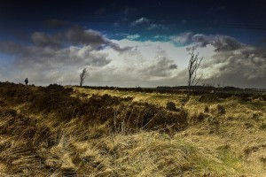

# ＜北辰·铁皮鼓＞我说的是一个荒原里的人(外二首)

**我说的是一个荒原里的人** **藤蔓的爱情被金色马车碾碎了** **马扬起鞭子 那落难的人儿啊** **正飞在低空里打发着他装满血的行囊**  

# 我说的是一个荒原里的人(外二首)

## 文/汪海鸣（上海戏剧学院）

 

### **我说的是一个荒原里的人**

我说的是一个荒原里的人 

他的好多滴血 

都在一颗雪人的眼睛里流浪 

一个猎人的影子是蚊虫的舰队 

远行者镂刻在雪原上的步履 

孤儿 一样在荒野的情人里 追踪 

——我同他倒血脉相连 

我的船也是梦和海水私生的花 

也是在父亲的狂怒里丢了母亲的 

在热情的年纪里 

和渔网一起 收拾着壁炉上的风 待客 

湿沉沉的 是火边牙齿咬出青痕的木头 

我说的是另一个荒原里的人 

黑雪是素白喑哑的眼神 

每一颗子弹都想去血管里取暖 

一整个迎春花的季节 

在冰雪的玻璃屠宰场上 

这个老实人都在默默晾晒着光 

背着空空的花园 

在另一颗彩虹的眼睛里 流浪 

我说的是一个荒原里的人 

藤蔓的爱情被金色马车碾碎了 

马扬起鞭子 那落难的人儿啊 

正飞在低空里打发着他装满血的行囊 

我说的是另一个荒原里的人 

虽然尘世的美好像水的姻亲那样多 

他仍未死于自己建筑的诸多墓穴 

一具行走的墓棺里有鸟有鱼 

而最美的王冠都不愿变节啊 

在他的喉咙里受辱 

多惨啊我说的是一个荒原里的人 

整夜整夜在烟草的骨灰里 

翻捡着一缕丰腴的过往 

所有的屋檐下都挤着躲雨的花朵 

瞪着天空的血 

一个孤独而温柔的巨人 

正伸着被暴雨砍伤以后的七根手指 

安抚着 

一捧在他的阴影里颤抖的凶狠的眼睛  

### **我孤独像一个人类经过另一个人类**

我孤独 

像一个人类经过另一个人类 

像小蛇惊慌花园 

像黑跌倒在黑 

像湿透的寒，在桥洞下打磨剔骨的暖 

像手斫毁纸墨 

而旋律撩拨耳朵 

于是我与空气发酵，碰撞，摩挲，亲昵 

于是我和季节交替，流失，屠杀，对决 

于是我和雨水纠缠，往来，覆压，毁减 

如果我的嘴唇不会出血 

如果我的眼睛不能对你行刑 

而你也无欲将我囚禁 

可我不能经过你 

像沉默卷起一个男人 

而矜持辜负一个女人 

像我的山羊经过你院墙的花椒树 

像石榴许诺我的却无下文的秋 

当地球拥在我的怀里 

榕树拄着手杖在我的头颅上梦游 

撞碎我的眼睛 

撕裂我的嘴唇 

而我仍和一千万个死人一样温柔 

我如何对你诉说 

当我举起我的小白旗 

我不能经过你 

孤独 ，像一个人类经过另一个人类  

### **我们不能再争吵**

呀呀小女孩儿我们不能再争吵 

如果我们公路上的家 

就是一车简陋的风声 

而你的裙子是颜色流淌的壁画 

狼群把黑烧出绿莹莹的血 

火源就是我注视你的大雾弥漫的眼睛 

如果在大病初愈的荒野里 

指南针的睫毛沾满叶子和白霜 

如果你疲倦，枯干像毛榉树的肋骨 

如果你的眉毛生出驯鹿的犄角 

而两只燕尾蝶在你的太阳穴安家 

有一天早晨你蹲在房车瞎掉的走廊里 

告诉我你冷因为森林里所有的鸟都穿着羽毛 

我亲爱的小女孩儿啊我们不能再争吵 

如果我们看上了哪块燃烧的田野 

说出了“请停一停吧”的遗言 

如果我不得不得把你的南瓜马车埋进鲜花 

如果我狠狠把稻草人的礼帽瞄准你跳舞的头颅 

如果自由在我们的喉咙里锈蚀 

卡住歌唱的舌头 

可我的小女孩儿啊那时我们不能再争吵 

如果我们此行的尾巴不是贝壳的家 

如果我是一个糟糕的猎人 

丰腴的仁慈比饥饿的子弹更早起航 

如果你突然失语 望着天好像一湖落拓的秋风 

而突然沉默的我 望着你好像一捧溺水的羽毛 

如果我在闪电和飓风里丢盔卸甲 

如果我不是英雄而是抱着你发抖的小男孩儿 

如果你说 时间到了 

我的小女孩儿啊我就永远站在失神的秋千上 

在松鼠的隔壁架起阁楼 

等你抓着我的胡子爬到我的脸颊 

嘟着嘴猛砸我那两扇长满青苔的石门 

——那时我的小女孩儿我们不能再争吵 

你可知我们错过了多少布谷鸟和紫藤萝相爱的时辰啊！ 

  

（采编：应鹏华；责编：周拙恒）

 
