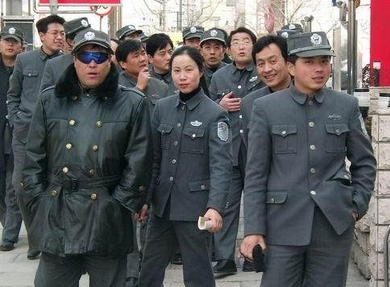

# ＜反思“暴力”特稿 ＞书斋里的暴力革命

**几个涉世未深的大学生坐在书斋里鼓吹暴力革命，颇有意味。它或许只是反映了这个群体悲观失望的情绪吧，革命不会因此而到来，普罗大众也不会因为他们的几个信念就揭竿而起，不要以自己在书斋里的想象代替社会民众的真实感受。我在深圳打工的妈妈觉得生活很美好，我在家里种田的爸爸觉得生活很美好，我的拿着70块钱一个月的补助的奶奶也觉得生活很美好。那个别人，不要再一次用自己的理想信念绑架这个民族，这跟你们要打倒的东西没什么两样。**

# 书斋里的暴力革命

## 文/刘桂新（武汉大学）

### **一**** **

有人将我国当前政权对公民各种合法诉求的镇压称为公权力的暴力化，我认为这种表述不确，因为共产主义政权都是以暴力和恐怖作为其统治的根基，当前当局的专制统治虽然已经进入了一个所谓的后极权主义时期，但其统治的本质特征没有发生改变，仍然是以暴力和恐怖作后盾。这种暴力不仅表现在以军队、警察等表现出来的硬暴力，还表现在一套完整的官僚制度的结构性暴力，包括一套覆盖各个领域的自下而上环环相扣的行政效忠体系以及一套严密的思想文化审查和宣传机构。民众在强大的公权力面前无所依凭，既不能将自己的利益诉求通过一定的民主渠道输入到政治系统中，也不能在自己的权利遭到侵犯的时候寻求正义的最后一道防线——司法的救济，因为司法也是政治化了的，充当着公权力的打手；同时，民众也不能通过一定方式联合起来，形成对抗公权力侵害的社会力量，只能是以原子式的个人暴露在公权力的随时凌辱和暴虐下。当他们的权益受到公权力的侵害时，他们求告无门，通过孤注一掷的暴力手段来挽回他们心中被侵蚀殆尽的一点尊严和正义感或许是他们能选择的唯一方式。 

社会性暴力事件的频发有以下几个原因： （1）贫富差距持续扩大，社会不公。 （2）公权力的蛮横。 （3）受公权力侵害的公民权利得不到有效的救济。 （4）利益表达、社会怨恨被压制，没有通畅的纾解渠道。 

### **二**** **

基于人类朴素的正义情感，我们对于现实生活中对我们的权益发生现实侵害的行为具有正当防卫的权利。普通民众对于一个对民众以暴力相向的政权是否也有正当防卫的权利？特别是当我们已经找不到任何体制内的权利救济方式的时候。 看到接二连三发生的官民暴力冲突，唤起的不是我理智上对暴力的反对，反而是情感上对“一个民族已经起来”的内心的窃喜。我想抱我这种心态的人应该不少。在网上就看到很多鼓励暴力对抗的言论。 首先我要表态，这个政府在我心里不具有合法性。但我并不因此就认为我用暴力对抗该政权具有正当性： （1）一个政权的合法性不是根据每个人的自由心证，也不是几个知识分子的表态或者说理论证能推翻的。 （2）现政府是一个得到国际社会承认的政府，具有国际法上的合法性。 （3）公权力的行使绝大多数时候还是披着合法性的外衣。行政诉讼制度和国家赔偿制度的建立更是补强了公权力的合法性。 当然，用暴力对抗现政权尽管在我这里不具有正当性，但依然是每个人自由选择的行为方式，那些在网络上鼓励暴力对抗的人完全可以自己背着炸药去炸政府。但他们似乎只愿意享受对于暴力的旁观性乐趣，而不愿自己去付诸实践，因为付诸实践的风险太大。 

### **三**** **

我很能理解他们为建成一个现代中国的拳拳之意和急切心情。我也很急，怕有生之年看不到。而且也很悲观，看不到希望。但暴力应该成为我们最后选择的一种手段，“圣人不得已而用之”。我之所以不主张使用暴力，是因为我虽然悲观，但我还没有绝望。 不管怎样，我们有一个共同的目标，那就是，建立一个以宪政、民主、法治为特征的人权得到保障的现代制度体系。我想这是我们沟通的起点。 但我有以下几条意见： （1）专制机器过于强大、残暴，鼓励暴力对抗无异于以卵击石。不仅如此，反而会遗专制者以口实，借机消灭艰难成长起来的些许进步力量。杀个二十万，稳定二十年。 （2）即使暴力推翻了政权，如何在此基础上顺利进入到民主法治的轨道这是一个问题。我很恐惧那个历史的咒语又开始应验，又进入到那个治乱循环的怪圈。 （3）暴力革命不是选择和鼓吹的结果，暴力革命不会因为个别人的鼓吹而到来。他要来的时候谁都挡不住。 

### 四

原生性的现代政治制度正是以暴力革命的方式建立的，如英国17世纪的市民革命、美国的独立战争以及法国大革命，其中最为暴烈的是法国大革命。 后来由列宁开启的共产主义革命继承了法国大革命的残忍和暴烈，但共产主义革命不同于西方社会的市民革命，市民革命仅仅以暴力为革命手段，其目标是建立现代民主制度；而共产主义革命则是通过暴力建立专制政权，这种专制政权必须以暴力和恐怖作为其统治的支撑性力量。这也符合对我国当前政权性质的解读。 

 但从二十世纪后期的民主化浪潮中发生的革命，特别是苏东国家发生的革命来看，后共产主义时期的革命具有明显的非暴力化特征。最典型的是哈维尔领导下捷克的丝绒革命。 革命不一定与暴力相关联，通过非暴力的方式也能够实现革命，而且这是全球民主化浪潮中的一个发展趋势。 那天看到徐超写的《[不要让诅咒自我实现](/?p=10261)》，里面有这样一段话：“研究历史的秦晖、许纪霖都没有放弃，研究政治哲学的刘瑜、崔卫平都没有放弃，研究农村问题的于建嵘都没有放弃，研究法制的蔡定剑、贺卫方、江平都没有放弃，研究经济的茅于轼都没有放弃，从体制中走出来的秦晓都没有放弃，体制内的温家宝、辛子陵都没有放弃，奔走在维权一线的许志永、滕彪都没有放 弃，致力于社会观察的笑蜀、熊培云都没有放弃，我们到底有什么资格妄下断言，中国是片被诅咒的土地？” 我也想说，只要他们还在，只要南方报业还在，我们就不应该选择暴力，而是： （1）继续挖掘公民社会成长的空间，特别是通过网络的途径。 （2）有担当的知识分子和各界精英继续坚持抗争。 （3）通过当权者提供的法治空间争取自身的正当权益。 （4）积极在体制内进行政治参与和表达。 

### 五

我其实并没有担忧网上的这些言论会带来什么消极影响。持这种立场的人只是极少数，其影响范围也就是一个极小的圈子，而且很多人都是不支持他们的观点的。 我想当局也不会因为他们的这些言论而感到惶恐不安。 但对于官民对抗的暴力化，我在这里则要善意地奉劝当局一句，如果想要以一个稍微体面一点的方式退出历史舞台，不能再按原有的统治方式和统治思维进行统治了。有以下几点建议： （1）可尝试先把司法还给人民，即法治先行。让司法独立出来，让民众的权力遭到侵害的时候至少有一个说理的地方。 （2）逐渐放开舆论管制。 （3）对不触动现有体制的政治参与形式予以鼓励和提倡。 

### 六

几个涉世未深的大学生坐在书斋里鼓吹暴力革命，颇有意味。它或许只是反映了这个群体悲观失望的情绪吧，革命不会因此而到来，普罗大众也不会因为他们的几个信念就揭竿而起，不要以自己在书斋里的想象代替社会民众的真实感受。我在深圳打工的妈妈觉得生活很美好，我在家里种田的爸爸觉得生活很美好，我的拿着70块钱一个月的补助的奶奶也觉得生活很美好。那个别人，不要再一次用自己的理想信念绑架这个民族，这跟你们要打倒的东西没什么两样。 又让我想到了另一个问题：网络言论自由与公共责任。 （1）你有发表任何言论的自由。可以极端，可以说谎、可以谩骂，可以哗众取宠沽名钓誉。这是网络言论自由的应有之义。 （2）如果你想就公共问题发出更大的声音，如果你想拥有更大的话语权，请你珍视你在观点市场里的声誉。 （3）诸如人人网这样的论坛可以是一个很好的信息共享平台，但难以成为一个严肃的思想交流平台。如果你想从这里的网络言论里寻找真知灼见，那无疑是找错了地方。 （4）我们应该通过更可靠、更权威的媒介去获取我们的观点。信息快餐化了，但真理没有快餐化，他还是在青灯黄卷、皓首穷经里。要想让自己活在一个更真实的世界是需要付出很大的努力的。 

(采编：王倩茹 责编：黄理罡)
