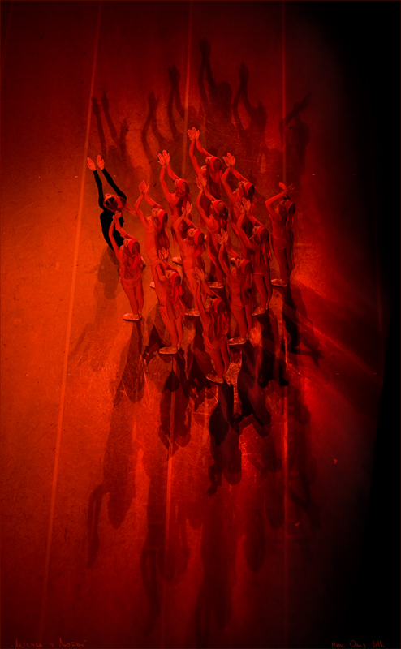

# ＜反思“暴力”特稿＞血与糖的抉择——谈暴力革命与改良

**面对血与糖的抉择，我们似乎要一筹莫展，因为两个选项似乎都是通向死胡同。但事实上，我们并非一定要严格地二选一，既不选择漫无边际、不达目的誓不罢休的暴力革命，也不迂腐之至地坐等改良的降临，而是还有中间道路可走的。那便是利用暴力革命的阴影，促使当权者加快改良的步伐。** 

** **

# 血与糖的抉择 

# ——谈暴力革命与改良

## 文/令霸贤（北京）

人的一生中总会有许多岔道口，让人在做出选择时颇为苦恼。国家也是这样的，种种迹象都已表明，中国现在又走到了一个新的十字路口，不管怀着怎么样的心态或态度，大变必将来临。但在这十字路口，怎么走就是一件让人颇为费解的事情，远不像当年邓小平打左灯向右转那么简单。贯穿于历史长河的两个选项又在“改革开放”后的这么多年风风雨雨中被洗刷得清晰，并摆在国人的面前。暴力革命还是改良，这是一个问题。改良一直都是公众议题，自“改革开放”之后都是，因为大家都知道中国不是毛泽东时代宣传词藻中的红色乌托邦；暴力革命虽然因为当局的言论压制无法成为公众议题，但这种思潮依旧在暗处汹涌澎湃，而且很多“意见领袖”都持有这种观点。

 面对血与糖的抉择究竟如何是好？暴力革命还是改良，这真的是一个问题。这个问题最近又被推到风口浪尖，持这两种观点的两派也已经开始了言辞颇为激烈的论战。下面谈谈本人对二者的看法。 在当今的中国，主张暴力革命的主要是体制外人士，这也不难理解，因为革命本身就是革体制内的命。从表面上看，暴力革命的一大优势就是改变得彻彻底底，绝不拖泥带水。在革命者的铁血洪流之下，旧社会的一切都显得不堪一击。但问题在于，改变不等于改善，让附身于旧制度的吸血鬼人头落地，人民的新生未必能到来。要说暴力革命的话，中国近代史上可谓是不计其数，但这些革命都只有两种结局，一种是被当权者消灭，如太平天国，捻军等；另一种是革命者成事之后变成与旧势力几乎一模一样，甚至更糟糕的当权者，如辛亥革命后的国民党，内战获胜后的共产党等。前一种结局没有太多讨论的价值，这里我们重点谈论后一种结局，暴力革命的这种结局在世界范围内也屡见不鲜。 十七世纪的英国内战中，国会军队战胜国王军队，处死国王查理一世，废除君主制，建立共和国。这看起来本应是一场非常成功且具有进步意义的革命，但是国会军队的领导者克伦威尔却很快成了新的独裁者。他解散议会，自封为护国公，垄断所有国家大权，实行军事统治，血腥镇压异己，限制宗教自由，成了真正的无冕之王。 以“自由、平等、博爱”为旗号的法国大革命则重蹈英国的覆辙，断路易十六头颅容易，建立新制度难。推翻路易十六的那天起，在法国政治舞台上依次粉墨登场的依旧是一丘之貉的阴谋家，更甚于路易十六。吉伦特派取得政权后，立刻费尽心机去用权力打压反对派雅各宾派和山岳党。雅各宾派通过再次革命夺得政权后，便开启了史称恐怖时代的雅各宾专政，雅各宾派头目罗伯斯比尔毫不留情地以反革命罪处死异议者和反对者，以至于设在巴黎协和广场的断头台三年砍下六万余头颅。接着又是革命将罗伯斯比尔送上了断头台，但没多久拿破仑·波拿巴称帝，轰轰烈烈的法国大革命在给法国带来了第一位皇帝后狼狈收场。 十月革命也是如此，列宁通过暴力革命夺得政权后，开启了更为血腥残暴的红色恐怖之门。布尔什维克解散立宪会议，实行独裁统治，其党魁成了魔王般的无冕沙皇。列宁杀了末任沙皇尼古拉二世的全家，沙皇政权在1826年到1905年的八十年间，处决的政治犯共只有894名，而布尔什维克执政第一个月，死于政治原因的人数就达几十万。之后在斯大林统治下，死于大清洗，古拉格群岛和秘密警察之下的无辜者，更是不计其数。 上述三场革命有一个共同的特点，它们的初衷都是推翻现制度以建立平等、民主、共和这样的进步制度，但结局却是建立的新制度与被推翻的旧制度相差无异，甚至更恶一筹。古今中外的暴力革命结局大都如此，它们带来的往往都是轮回效应。这着实让人费解，但细细分析起来的话，也不难发现其原因所在。 首先，暴力革命没有且不需要广泛的民意基础。当一群人准备发动暴力革命时，他们会去调查一下民意基础吗？他们会拿着问卷上街头，咨询大家“是否支持发动革命”、“何时发动革命”、“革哪些人的命”这样的问题吗？或者能不能搞一个投票看看支持暴力革命的人口比例？显然不会，因为这样事情就提前败露了。事实上纵观历史，不管是由军方主导的还是民间发动的暴力革命，都是建立在小群体的密谋之上的，而这也就注定了暴力革命最终只会为这个小群体服务。而且就算是在具备全民革命愿望的情况下，革命的发生也依然是在小群体的密谋中发生的，尽管“天下苦秦久矣”，但陈胜和吴广依旧要密谋再三，各路反秦起义者也都一样，故他们的起义也只能是为一个小圈子内的人利益而服务的，所以秦末起义推翻的只会是政权而非政体。虽然法国大革命有全民色彩，但之后血腥厮杀的几个派别都是革命前就已经在国民制宪议会里结成政治利益集团的，他们也只会想着如何瓜分革命成果，而非借着革命建立一个有益全民的体制。因为没有民意基础，所以暴力革命就很难成为推动民主的武器 其次，暴力革命会产生政治军事强人。不管是军方主导的还是民间发动，只要是成功的暴力革命，就肯定会产生独掌大权的政治军事强人。因为一盘散沙是无法使革命成功的，必须有一个强有力的核心人物。但问题就出在这么一个核心人物上，暴力革命成功之后，他要何去何从？是果断放弃手中的权力，将政治与军事权力交还给人民和国家？还是继续独揽大权，建立一个类似于旧制度的独裁体制，从而维护自己的既有权力和利益？这显然是领导革命成功的“核心人物”都要面临的问题。选择前者的有没有？当然有，华盛顿不就是一个么？但是除了华盛顿，恐怕再也难以找出第二个，自私心与权力欲注定了华盛顿这样人物是凤毛麟角，绝大多数革命领袖都会选择后者。而且从革命中诞生的独裁者拥有从革命中得来的强大的能量，再次用暴力革命推翻它的可能性更是微乎其微。查理一世解散议会引发英国革命，但革命领袖克伦威尔在后来也解散了议会，这回却没有人能用革命去推翻他。俄国临时政府迟迟不肯召开立宪会议成了引发十月革命的原因之一，但后来列宁用武力强行解散立宪会议之后，没有人再有能力去发动一场革命与之对抗。 最后，暴力革命的胜利者未必是更优秀，却很有可能是更阴毒更无耻，这甚至可以成为其取胜的手段。列宁在被沙皇流放期间还可以阅读马恩的“反动著作”，宣扬他的革命观点，但他胜利之后就开始了可怕的思想控制、言论钳制和血腥统治；沙皇灭亡前八十年间，被处决的政治犯一共只有894名，连列宁这种“反动集团头目”也与断头台无缘，但列宁革命胜利之后就将沙皇一家人屠杀殆尽，他上台的第一个月，因政治原因的被处死的人就达数十万。国共相争也是如此，当年国统区有一定的言论自由，可以较大尺度地批评国民政府当局，结果共产党就借此通过宣传机器在国统区四处造谣，动摇国民党的民意根基，而在共产党统治的地区，早就完成了对言论和思想的强力控制，批评的声音一律清洗抹杀。王实味在国统区大肆撰文针砭时弊，谴责蒋介石独裁，赞美革命，但他都安然无恙，可结果他去延安后就因一篇《野百合花》而在整风运动中死于非命。显然，共产党能战胜国民党并非因为其更优秀，其胜利后很长一段时候中国都停留在比国民党统治还黑暗的时期，而恰恰是因为其更阴毒更无耻。暴力革命往往不是在竞优而是在竞劣，也就是所谓的逆向淘汰。 综上所述，鲜血难以达到我们想要的目的，那蜜糖又怎么样呢？与暴力革命派一样，改良派也纵贯人类的整个历史，而就当下的中国而言，改良派体制内外皆有。 改良是用和平的方式实施变革。值得一提的是，非暴力的革命，如天鹅绒革命等也属于改良，只是较为激烈。相对于暴力革命，改良的最大好处就是成本小，无论是社会、国家，还是人民付出的成本都比较低。而且改良就像是在体制上精雕细琢，能最大地保留旧体制固有的优势和长处，可以避免在大破大立中丧失基本良性秩序，风险较暴力革命而言要小得多。同时，改良的功效持久，不像某些革命成果那样转瞬即逝，可以在成功之后发挥深远的影响。但改良也有显而易见的缺陷，这也是丝毫不能回避的。 其一，改良需要耗费相当长的时间。苏联人等了七十余年才等来政治解冻，台湾人也等了几十年才等来解除戒严和民主化，而大陆人等了六十余年却还在等。不说政治方面，政策方面也是如此。一代又一代人在对教育公平和教育体制改革的等待中走完学生时代，户籍制度的废除也等了一代又一代人，还有计划生育、社会保障体系等等的改良我们也等了太久太久，而且还有太多太多的政策改革让我们在遥遥无期中等待。改良之所以要如此耗费时日，是因为改良必然要触动很多既得利益的权贵阶层的利益，这是他们不愿意看到的，所以他们就形成了一股强大的阻力，用他们手中的大权和社会关系极尽阻挠之事。昔有“五不议”，今有“五不搞”，就是这个道理。再比如高考的教育公平问题，如果各省按相同的比例录取，自然北京的考生利益就要受损，而北京的考生父母很多都是大大小小的官员，这自然就不是他们想要看到的，所以他们动用手中的优势资源极力阻挠，以至于很多教育公平的推动者都受到了像政治异议者一样的迫害。而且在非民主制度的情况下，官员没有主动改良的动力，改良的进程自然会极其缓慢。当改良缓慢到一定程度时，比如在一个人的一生都难以看到，那这样的改良方案是不可接受的，也必然是不得人心的。 其二，改良几乎完全取决于政治高层的意愿。这点是显而易见的，也给改良带来的很大的不确定性，因为单纯取决于人的成分太多太多。而且今天的高层中的改革者，明天很可能就变成了保守派，只要他们的利益受到损害。红色中国的历史就是这样的，就这后三十多年来看，在经历了毛时代后奄奄一息的中国先是在邓小平的主持下，由胡耀邦、赵紫阳等人进行了“改革开放”，政治、经济、文化等方面都有较大的改善，但接着邓小平又通过“清除精神污染”、“反对资产阶级自由化”甚至是血腥镇压的方式变成了改革的最大阻碍者，然后是江泽民当政后改革几乎停滞的十年，而后来的“胡温新政”却大有开历史倒车的趋势。这种令人失去耐心的改良并非中国大陆独有，苏联亦是如此。经历了斯大林血雨腥风的暴政，苏联人终于迎来了政治较为开明的赫鲁晓夫时代，但赫鲁晓夫时代一结束，勃列日涅夫就在台上开始倒行逆施，一直等到戈尔巴乔夫上台才迎来真正的改良。改良的极大不确定性让人难以接受，也是暴力革命派对其诟病的主要依据之一。 面对血与糖的抉择，我们似乎要一筹莫展，因为两个选项似乎都是通向死胡同。但事实上，我们并非一定要严格地二选一，既不选择漫无边际、不达目的誓不罢休的暴力革命，也不迂腐之至地坐等改良的降临，而是还有中间道路可走的。那便是利用暴力革命的阴影，促使当权者加快改良的步伐。 

 就当权者而言，他们自然打心底里不希望发生暴力革命，因为不管暴力革命成功与否，他们的利益都会受到损害，这就是为什么群体性事件无论大小都会让中国的官员们敏感不已的原因，他们自然不愿看到暴力革命的发生。但就如同上面所说，在非民主制度下，当权者没有动力进行改良，而且改良也会使得他们的利益受损。如果当权者与民众仅仅是短期的一次博弈，当权者知道民众选择暴力革命的可能性小，所以他们就会拒绝改良，而民众也会选择等待改良，因为这个在短期内的成本也最小。这就有点类似于囚徒困境，但它依旧与囚徒困境拥有一样的解法，那便是长期多次博弈。民众与当权者打交道是一辈子的事，而且肯定会在各种各样的政策上与当权者有冲突，这就有了长期多次博弈的条件。所以民众对待当权者的态度应该是“优先以非暴力手段要求改良，但绝不放弃使用暴力革命”。等待改良，但如果当权者较长时间皆无改良行动和诚意，则使用一些非常规的暴力手段，重复多次之后，就能给当权者无形的压力，让他们再面对改良的诉求时也不得不细细斟酌。 在中国，以暴力革命做后盾的改良是完全有基础的，每年数万起群体性事件就能说明这一点，大大小小的个人暴力抗权事件更是不计其数。当然暴力也是要适可而止的，不能无限制使用，否则会逼得当权者狗急跳墙，以暴力要求改良可以使用在较小的政策层面。比如对待城管问题，当他们在街头打砸时，小贩用刀与之搏斗是完全正确的，如果越来越普遍，则城管在“执法”前也定要三思。再比如强拆，汽油不应该浇到自己的身上，而是应该洒向那些穷凶极恶的强拆者，增加他们的作恶成本和风险，给予他们威慑。基于中国的现状，民众对改良的诉求无法用选票做政治上的筹码，那就只能退居其次，使用适当的暴力做与当权者博弈的筹码。 下面谈谈知识分子的责任。虽然现在就有人嘲笑“百无一用是书生”，认为暴力革命与否是下层社会决定的，而改良与否是高层当权者决定的，知识分子完全没有说话的份。但事实上暴力革命与改良皆离不开知识分子。暴力革命的过程中也许不需要多少知识分子的参与，但革命过后的烂摊子还是要由知识分子来收拾，因为革命永远是手段，不能拿来当饭吃，治国是个需要知识需要技术的精细活儿，光靠革命的一腔热血是不行的，看看只会革命了一次又一次的毛泽东就知道了。同样，改良依旧需要知识分子来出谋划策，当权者改良前必然需要倾听知识分子的声音。没见过哪个国家的成功变革是不需要知识分子的。 正因为知识分子的这种特殊的中间角色，所以他们可以且应当充当民众与当权者在博弈之中沟通的纽带。当权者的某些政策引发一些民众的暴力反抗时，知识分子应站出来借此呼吁，敦促当权者反思，替他们权衡利弊，为改革创造契机。就像这回钱明奇制造的爆炸案，很多学者都出来告诫当权者，已经是到了在炸药和选票之间做出选择的时候了。 同时知识分子应该利用自己有限的话语权去呼吁双方的妥协，因为妥协是政治的艺术，是和平变革的前提。政府的毫不让步或民众对改革一日千里的要求都是不可取的，政府不让步的归宿必然是暴力革命，民众的操之过急也会引发当权者的强烈反弹。在这方面可以借鉴英国，光荣革命后的英国政治史，就是君主将不断权力交出给民选政府的历史，前不久英女王又将王室财务控制权交出给了内阁。这种在妥协中的变革是英国崛起的基础，当法国人还在热火朝天地进行大革命的时候，英国人已经走在了通向日不落巅峰的大道上。 知识分子还应当通过自己并不单薄的影响力为开启民智而努力，因为公民意识的普及是建立公民社会的根基。而且也应号召民众更多地通过非暴力手段表达自己的诉求，因为抗议是改良的前奏，也不能否定底层民众走投无路之时对当权者的暴力反抗。但对于民间的极端民粹主义和暴戾之气，则必须加以批判，因为暴民与奴才一样，都是无法构筑起公民社会的。 面对血与糖的抉择，做出选择也许并不困难。用少量的鲜血去争取蜜糖，用适当的暴力去争取选票以及其他方面的改良是可行的。我们应当优先使用橄榄枝去索取蜜糖，但绝不承诺放弃使用铁与鲜血。 又走到了历史的十字路口，对于每一个人而言，不管你愿不愿意，历史的列车都注定要前进。但我们自己应该做的，是看清历史的列车前进的方向，以及想清楚自己应该如何行动。不要被历史远远地甩在后面，更不要跑到历史的铁轮下螳臂挡车。 ——2011年6月8日于中国·北京  

(采编:黄理罡 责编：黄理罡)
