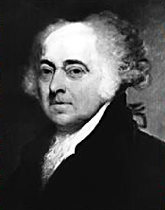

# ＜反思“暴力”特稿＞风暴中的良知——在社会暴力的背景下，知识分子何去何从？

中国的近代史上，一群鼓吹“枪杆子里出政权”的人，在一开始又何尝没有带着救国救民的良好动机？对枪杆子的膜拜、对“硬道理”和博弈的追崇、对法治和人性的极度蔑视，导致最终领导国家的人，也是暴力的信徒，这样的国家不可能走上法治的道路。而要跳出这个死循环，就必须有人带头提倡非暴力，无论是通过推动司法改革，还是通过独立参选。非暴力是社会成员之间订立的契约，虽然带头遵守契约的人，未必会使得后来的人也遵守契约，但如果没有人带头遵守契约，那么后来的人更没有一丝一毫遵守契约的理由。 

# 风暴中的良知

# ——在社会暴力的背景下，知识分子何去何从？

## 文/黄陀 （Yale University）

美国人民曾经是一群忠君爱国的不列颠子民，然而十八世纪末的一场革命中，他们与英王陛下的政府彻底翻脸。在此之前，激化殖民地人民与英国之间的矛盾、促使这场革命发生的历史事件林林总总，其中一件，便是1770年3月发生的“波士顿惨案”，五名向驻扎在波士顿的英军士兵投掷雪球的波士顿市民被士兵开枪打死。这种事件，对于流淌着英格兰人血液的美洲殖民地居民来说，是格外无法忍受的，因为作为英格兰人所享有的政治自由之一，便包括了和平时期没有常备军驻扎在他们当中。英国的驻军对于殖民地人民来说，就是英王暴政的象征；《独立宣言》列举的英王罪状当中也包括了“在和平时期，他（英王）在我们当中维持常备军，并不经我们的议会同意。”所以，可想而知，当这些英军士兵枪杀了手无寸铁的平民之后，公众是何等地义愤填膺。 

 这些士兵遭到殖民地当局谋杀罪的指控，然而，没有律师愿意冒天下之大不韪为这些士兵辩护，因为律师本身也要靠在社区、城镇中的口碑来立足吃饭。英军士兵在走投无路的情况下，找到了后来成为美国国父之一的当地名士约翰·亚当斯。此时的亚当斯，已经在殖民地声名鹊起，当时正打算参选公职，为英军士兵辩护要冒巨大的风险，轻则政治前途泡汤，重则无法继续在殖民地立足。可是亚当斯还是毅然接受了这个请求，因为法治的基本要求，就是无论是多么罪大恶极的人都有权得到公正的审判，而公正的审判就要求当事人有律师代表出庭。离开了律师的辩护，这些英军士兵在法庭上就处在一个不利的位置上，不但他们不知道如何为自己辩护，而且，没有自己律师的保护，控方律师也有可能威逼、引诱他们说出对自己不利的话，从而不正当地影响陪审团的判决。 虽然是出于程序正义的需要才帮英军士兵出庭，亚当斯并没有敷衍了事，而是极尽所能为当事人作出最好的辩护。殖民地当局为了审判的公正，也费了相当大的心思，不但故意把庭审拖延到了受难者入土为安过后半年、让市民情绪稍作冷静，而且特意到波士顿以外的居民中选取陪审团成员。在法庭上，亚当斯慷慨陈词，谆谆引导陪审团成员理性分析证据的重要：“事实是顽固倔强的，无论我们的愿望是怎样，我们的倾向是怎样，抑或是我们心中充满了怎样的激情，都无法改变事实和证据。”经过一个多星期的庭审，八名遭到谋杀罪起诉的士兵，其中六名因为证据不足而被陪审团宣告无罪，剩下两个被认定直接向人群开火的人只被判一般杀人罪，并因其带有神职人员身份而免于死刑。值得一提的是，亚当斯最后得到的律师费，只不过是一双鞋子的价钱。 波士顿惨案的公正审结，长远来讲，对美洲殖民地的独立运动是有益的，更对美国的长远发展是有利的。如果当时的殖民地的领袖们纵容甚至支持民众报复英军，那么不但会招致英国的报复、导致更多的流血，而且独立运动也会丧失温和派（对英王不满但仍然忠于英国者）的支持。更重要的是，殖民地当局以一场公正的审判，昭告世人，美洲人民不是一群暴徒，他们有能力管好自己的事情；或者说，美洲人民当中也许有暴民，但也不乏能够以身作则、引导民众遵守法治的精英。英军士兵在殖民地人民眼里，固然都是英王暴政集团的一员；但对这八名士兵的审判、最终六人被宣告无罪，则体现了对每个人不同程度责任的区分，而这也是自由主义法治的基本要求。每个人的有罪与否、罪责大小都是不同的，将他们一概贴上暴政集团的标签加以随意的暴力迫害，只能用野蛮来形容——无论这种野蛮所声称的目标是多么地高尚。 相比之下，当今中国某些人对被暴力伤害的央视女工作人员表现出一副活该的态度，声称当今中国体制内的人都是暴政集团的一员、都是有原罪的，所以让所有体制内的人共同承担暴力的风险可以抑制整个体制作恶，这种论调已经超越了文明人所能接受的底线。 首先，哪怕是再罪大恶极、并且已经定谳有罪之人，譬如一个冷血连环杀手，也首先是一个人，也必须被作为一个人来对待。如果有罪之人被判监禁，那么要尽可能确保监狱环境符合基本的人道要求。囚徒生病了，要给他看病；囚徒被人施暴了，要惩罚施暴者；更不可能处以割鼻、割耳、宫刑之类的处罚——这些并不因为囚徒本人是个罪恶的人而改变。甚至对于那些因罪恶极大而被判死刑的人，也要尽可能地减少处死过程中的痛苦，所以现代国家一般采用注射死刑，中国也在朝这个方向发展，而像古代的凌迟、车裂等给受刑人造成极端痛苦的处死，在现代社会是不可接受的。对待负个人责任的罪人尚且如此，对待所谓的“暴力集团”中受上级指令行事的个人，即便要加以惩罚，更没有理由不去秉持基本的人道底线。 第二，所谓的暴政集团，由谁来定义？谁又有权力去审判、去贴标签？如果是人人都以自己的自由心证行事，这和文革中无法无天的揪斗没有任何区别。本来暴力就不是值得提倡的，没有程序正义的肆意的暴力，更是错上加错。程序正义的存在，就是为了防止一个人或一群人为了追求实质正义（姑且认为他们是真心的）而实际上伤害实质正义。没有了程序正义，实质正义是空洞的、更是无法保证的。比如，如果你要惩罚体制内的人，对于在广东省委领导下却同时是中国自由派代表的南方系媒体，他们是不是体制内的人，要不要惩罚？ 而如果你认为南方系都是可以放过的，那么南方系当中写亲政府文章的记者，是不是也要放过？ 如果你认为虽然南方系都是可以放过的，但亲政府的记者不应该放过，那么，如果亲政府的记者，只是受命写一些歌颂政府的稿件，平时仍然做了大量的舆论监督工作呢？ 如果你认为虽然南方系都是可以放过的，但亲政府的记者不应该放过，但平时仍然做了大量舆论监督工作的仍然可以放过，那么如果某个记者只是小骂帮大忙实际上还是遵守“新闻纪律”的呢？ 如果你认为虽然南方系都是可以放过的，但亲政府的记者不应该放过，但平时仍然做了大量舆论监督工作的仍然可以放过，但不包括那些小骂帮大忙实际上还是遵守“新闻纪律”的，那么如果这个记者虽然在工作上遵守“新闻纪律”，但在工作之外仍然支持民主自由呢？ 如果你认为虽然南方系都是可以放过的，但亲政府的记者不应该放过，但平时仍然做了大量舆论监督工作的仍然可以放过，但不包括那些小骂帮大忙实际上还是遵守“新闻纪律”的，但在工作之外仍然支持民主自由的可以放过，那么如果这个记者只是在网上放放炮，真正事情来了马上又表示拥护共产明哲保身呢？ 这些问题可以无限继续细分下去，直到区分每个个体。而审判的作用，正是在于对每个人的情况予以区别对待，比如对波士顿惨案中那八个英军士兵中只选择惩罚能明确确定有罪的两个。只有这样，惩罚才有意义，实质正义才不是空洞的、情绪化的口号。没有程序正义，哪怕一个人或一群人抛出再崇高的实质正义的目的——打黑也好，民主也罢，都是决然不可相信的。并不是说暴力在任何时候都是恶的，如果和平行动的人，遭到了暴力的镇压，自然有权自卫反抗；而革命中武装力量之间的对抗也同样是被接受的行为。但这并不意味着不经正当程序的暴力可以被肆意拓展到任何人身上，哪怕这些人与旧政权联系紧密。 有些人声称，今天的中国没有法治，所以以暴易暴是应该的。不少打着自由旗号的人，一方面感叹中国人就是没有英美人“素质高”、守法治，另一方面又认为反正中国就是这样一个无法无天的社会，所以就“应该”这样用野蛮社会的法则继续无法无天下去。然而这样下去，必然会建立另一个专制政府、另一个丛林社会，因为在暴力有理逐渐变成主流意识的同时，起稳定社会作用的知识分子的作用就被边缘化了。中国的近代史上，一群鼓吹“枪杆子里出政权”的人，在一开始又何尝没有带着救国救民的良好动机？对枪杆子的膜拜、对“硬道理”和博弈的追崇、对法治和人性的极度蔑视，导致最终领导国家的人，也是暴力的信徒，这样的国家不可能走上法治的道路。而要跳出这个死循环，就必须有人带头提倡非暴力，无论是通过推动司法改革，还是通过独立参选。非暴力是社会成员之间订立的契约，虽然带头遵守契约的人，未必会使得后来的人也遵守契约，但如果没有人带头遵守契约，那么后来的人更没有一丝一毫遵守契约的理由。 任何国家的法治精神，都是或早或晚，一步一个脚印地建立起来的，而不是天生的。即便是能够对英军士兵进行公正审判、堪称法治典范的美国，也有过暴乱，在废奴之后的南方相当长的一段时间都还有过对黑人的残酷压迫和私刑（lynching），直到二战以后的十几年间还有3K党横行、甚至占据了某些地方的警察力量一手遮天（他们可以随便杀掉一个黑人然后声称他袭警），也有直到1970年代还条件恶劣、时时发生命案、被重犯恶霸所统治的监狱。罗马不是一天建成的。不错，当今中国的权利都是民众争取来的，而绝非当局大发善心突然开恩；但如果没有那些不主张暴力的知识分子去倾听底层民众通过下跪、暴力等朴素的方式表达出来的诉求，用法律、政策的语言将其表述出来、一点一滴地向当局争取，事情绝不会是今天这样。孙志刚的惨死，如果没有俞江、腾彪、许志永、贺卫方等体制内法律人的努力，也许顶多引发一场孙志刚老乡牵头的骚乱、然后骚乱被政府镇压下去，而不是《收容遣送条例》的废除。更多的暴力、更多的镇压，结果是民众以更激烈的暴力去对抗、政府更变本加厉地压迫，最终无法收拾，然后一个新的专制政权脱颖而出。 知识分子固然不能左右暴力的发生，但暴力漩涡中的知识分子，如同既能挺身而出冒天下之大不韪为英军士兵辩护，又同时对自由事业矢志不渝、鞠躬尽瘁的约翰·亚当斯等人一样，坚守的，是人性、智识和良心的底线。人性的底线，决定了他们不会赞成无节制、无正义的暴力，更不会去主动煽动暴力——革命虽然可能会流血，但并意味着就不应当珍惜民众的鲜血；智识的底线，决定了他们所要考虑的，是暴力以后该怎么办——民众的鲜血不能白流，一个缺乏了智识构建的体制，必然成为又一次专制轮回的起点；而良心的底线，则决定了他们决不会因为对暴力的担忧和不赞成就走向人民的对立面、就投向旧政权的怀抱——革命造成的流血，并不能掩盖旧政权的血债——相反，良心的底线决定了知识分子将举起民众的血衣，勇敢地对当权者站起来要求权利与自由——为自己，也为民众。这，是比复仇更为高贵的举动。 

(采编：尹桑 张韧刚； 责编：陈轩 黄理罡)
