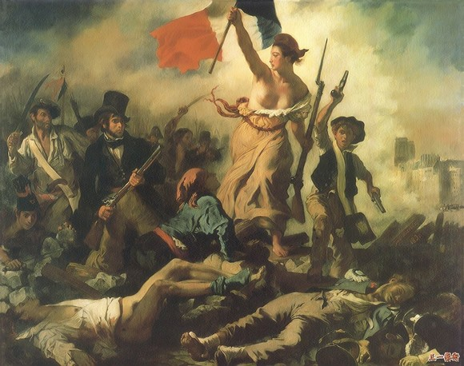

# ＜向左走、向右走特稿＞自由主义的两面

**自由主义右派坚持彻底的消极自由，只支持基于自愿契约之上的市场至上原则，而反对政府对财富进行再分配以矫正道德运气对个人造成的不利影响，同时也反对政府对于双方自愿而又不损害他人的契约的限制。自由主义右派认为市场的扩展和自愿性的慈善组织能够解决很多的社会贫困问题。而自由主义左派则认为正义对个人的财产权具有一定的约束，市场和慈善组织不能解决很多问题，这时政府以税收调节贫富差距、缓解贫困符合正义原则。并且自愿且不伤害他人的契约并不一定符合正义原则，对这样的契约进行限制符合自由。**  

# 自由主义的两面

## 文 / [罗文全](http://www.renren.com/profile.do?id=282958695&from=opensearch)（四川师范大学）

  **【小编导读】** _本专题的上一篇文章《非“左”即“右”与“左”“右”为难的中国知识分子》简单概况了中国两个主要思想派别新左派和自由主义的一些历史渊源和主张。但该文章是就中国现状而谈，并没有体现出这些思想体系的复杂性。本文《自由主义的两面》就试图分析自由主义思想体系的内部差异。自由主义往往被贴上右派的标签，但是自由主义中也存在左派主张。本文作者罗文全首先在文中比较了这两派的共识和分歧，继而分析了自由主义左派主张相较右派主张所具有的合理性。_ _本文语言风格比较学术化，耐心读是会有很大收获的。_  左派、右派的称呼通常用以辨别政治倾向，这种倾向主要是政治哲学上的差异（政治哲学学者不一定会同意这种简单而“粗暴”的分类法）。左右派的标签通过简单的问题而划分出鲜明的政治立场，但是这也容易忽略其内部的差异。秦晖先生在《极左、左派、右派、极右的区分与现状》一文对左右派的区别作出了一个清晰的说明，笔者不打算对广义的左右派划分提供理据了。只是毛泽东说过“党外有党，党内有派，历来如此”[1]。而在中国，自由主义却被很多人贴上右派的标签，这无疑忽视了自由主义内部的差异。本文的主要任务是对自由主义的左右派的异同点作出一个简单的说明，并对自由主义左派的主张提供一个基本的辩护。 

#### 一、自由主义的共识

尽管在自由主义内部，左右派对于很多问题有不同的看法。但至少以下在几点上，双方还是能达到基本的重叠共识。 **1、基本自由的优先性** 伯林在《两种自由的概念》里说：“我们一般说，就没有人或人的群体干涉我的活动而言，我是自由的。在这个意义上，政治自由简单地说，就是一个人能够不被别人阻碍地行动的领域。” [2]正是言论自由、人身自由、宗教信仰等基本自由为个人划定了一个不被任意粗暴干涉的领域，在这个领域内，个人可以运用其理性能力实现自己的生活理想。 就基本自由豁免于功利主义式的简单的效用加总比较而言，基本自由具有优先性。基本自由的优先性构成了“对行为的边际约束”[3]，这样多数人就不能通过选票来剥夺个人的基本自由。 **2、基本权利与法治** 在消极自由范围内，个体具有了基本的权利。而对于权利的辩护，权利的利益理论同样属于左派自由主义。权利的利益理论以后果主义的效用比较为手段，这样“道德权利的基础就是每个人作为一个人类存在者都应该被赋予的根本利益”[4]。 自由是可欲的，但是自由的状态需要一定的条件，而其中最重要的条件之一即是法律保障。在政治生活中，只有通过法律才能保障所有人有享受平等的自由，以强力为后盾的法律使得自由不被任意侵犯。基本自由(或者是道德权利)的法律化形成了一系列的基本权利，这种法定“权利指的是在一定的法律关系中，法律关系的一方对另一方所享有的可以要求作出一定的作为或不作为，并为法律规范所认可的一种资格”[5]。在特定的时刻，或者在不同的基本权利冲突之时，基本权利会受到一定限制。例如战争时期，可以缩减言论自由。的确不存在绝对的权利，但是对于权利的限制而言，限制是特殊的而非一般的，是需要辩护的而非不证自明的。 **3、个人主义方法论** 个人主义方法论指的是“我们在理解社会现象时没有任何其它方法，只有通过对那些作用于其他人并且尤其预期行为所引导的个人活动的理解来理解社会现象”[6]。因为个人理性、知识的有限性和局限性，自由主义反对消灭个人选择的极权主义式计划体制。个人主义方法论认为个体是所有的价值最终承受者，因此反对“集体”、“国家”这样的抽象实体有凌驾于个体之上的价值，尤其当他们以拟人化的血亲关系来形容个人与民族国家之间的联系，并以此对个体进行道德绑架。但个人主义并非在一般意义上反对集体，个人主义完全认同基于自愿而形成的集体组织。 

#### **二、自由主义左右派的主要差异**

由于天赋的差异、社会生活的复杂性，人类不可避免的受到运气的影响。身体具有缺陷或者出生于穷困家而不识字、营养不良等现象都可以使得个体在参与社会合作时具有巨大的障碍。自由主义左右派在何如面对这种障碍造成的问题时，有不同的理解。 自由主义右派坚持彻底的消极自由，只支持基于自愿契约之上的市场至上原则，而反对政府对财富进行再分配以矫正道德运气对个人造成的不利影响，同时也反对政府对于双方自愿而又不损害他人的契约的限制。自由主义右派认为市场的扩展和自愿性的慈善组织能够解决很多的社会贫困问题。而自由主义左派则认为正义对个人的财产权具有一定的约束，市场和慈善组织不能解决很多问题，这时政府以税收调节贫富差距、缓解贫困符合正义原则。并且自愿且不伤害他人的契约并不一定符合正义原则，对这样的契约进行限制符合自由。 

#### 三、对自由主义左派的主张的辩护

**1、正义对财产权的内在约束** 自由主义左派大多赞成类似于罗尔斯的差异原则 ，即“那些受上天眷顾的人，不论是谁，只有在改善那些先天不幸的人处境的条件下，才可以利用他们的好运获得好处。在天赋上占优势者，不能仅仅因为他们天分较高而得益，而只能通过抵消训练和教育的成本，以及利用他们的天赋帮助那些较不幸者而得益。没有人应得他较高的自然能力，一如没有人应得在社会中一个较为有利的出发点一样。” [7] 这种正义观对个人的财产权持有施加了义务。而诺齐克这样的自由主义右派则认为通过对富人征税来改善贫困者的处境和奴隶制无异，因为“劳动所得税与强制劳动是等价的。有些人认为下述命题显然是真实的：拿走几小时的劳动所得就跟从这个人那里拿走几小时是一样的，就跟强迫这个人为另一个人工作几小时一样。”[8]解决个人的财产权是否拥有拒绝正义观念约束的正当性的问题，需要我们思考财产权的来源。 诺齐克认为财产权的持有正义需要满足三个条件，最初获得的正义、转让的正义和对持有中的不正义的矫正。简单来说就是如果一个人最初获得财产符合正义，财产的转让和流动符合正义，并且对不正义的获取和转让、流动进行了矫正、赔偿，那么一个人的对于财产权的持有状态就符合正义。[9]这时政府如果再对个人征税进行再分配，就侵犯了个人的财产权。 

 在这三个条件中，最重要的是获取正义，因为人类中的每一个个体最初对于外部世界的土地、河流、矿产等资源并不存在排他性的权利，财产权的正义性并不是不证自明的。如果我们承认财产权需要道德基础，那么先占先得和劳动价值论显然解决不了最初获取的正义性，毕竟“如果可以改善的无主物品是有限的，那么，把改善一物品看作是创造了一种对它的全部所有权看起来就是不合理的。因为，当一个物品归于某人所有时，就影响到其他所有人的状况。”[10] 正是因此，诺齐克认为“关键之点是对于无主物的占有是否使他人的状况变坏” [11]于是他对最初获取财产权施加了一个约束条件，即“洛克的条件‘还留有足够好的和同样好的东西给其他人共有’——意味着使其他人的状态不至于变坏。”[12]诺齐克认为这个约束条件很弱，因为“这一比较基线相对于私有制社会的生产率来说是如此之低，洛克式条款受侵犯的问题仅仅出现于面临灾难的事例中” [13]，并且“一种市场体系的自由运转实际上不会与洛克式条款相冲突” [14]。他的理由在于，在初始的占有后，其他人的物质条件并不会低于无人占有时的状态。好比现在出生在美国贫困家庭的孩子的物质条件，当然要优于无人占有的史前时代。市场交易提高了其他人的生活境况，使得初始占有满足了洛克式约束条件。于是无限制的初始占有，哪怕形成了极大贫的贫富差距状态同样满足了正义。[15] 而金里卡指出诺齐克对于私人财产权的辩护更多是“依物质福利条件来界定‘恶化’”，并且“把占有前的公共使用当成了判断是否‘恶化’的比较标准。”[16]，这忽视了自主性和道德平等这样的道德理由对于初始获取财产的限制。假设在未经占有的史前时代，一个残障人士无法占有任何财产，但他可以在当时的市场上可以通过劳动获得工资。于是相比无人占有时，他的物质条件没有恶化（因为他在无人占有时会饿死）。但是为什么他必须得接受这一选择并认为这不是“恶化”？假设他更偏好自主性和对自己时间的自由支配，原初占有的排他性当然可以是恶化了他的状况，毕竟他只有接受被雇佣的选择。如果我们充分考虑到人的自主性和道德平等的价值，那么财产权初始获得过于悬殊当然不能满足正义原则的检验。 对于诺奇克的获取正义的驳斥，是为了拒斥自由至上主义的对财产权的绝对权利观念。但是对于绝对财产权的拒绝，并非是反对私有财产权。一般而言，区分自由主义左派与马克主义左派、无政府主义左派的重要依据，即后两者反对私有财产权，只支持公有制、共有制这样的财产权利。而自由主义左派并不反对私人财产权，正如罗尔斯所言“这种权利的一个理由是，它能够赋予人格独立和自尊感以足够的物质基础，而人格独立和自尊感对于道德能力的全面发展和使用是极其重要的。” [17]不管是对原初获得的财产权的做较平等的安排，或者是支持再分配政策以缓解过于悬殊的贫富差距，又或者对个人的天赋差异和道德运气进行部分矫正，自由主义左派都不是要抹平一切差异。自由主义左派考虑到了威廉斯的那个批评，即“在任何具有重要性的层面上，人们只剩下纯粹的道德动机，而且这种道德动机的运用是没有极限的。”[18]自由主义的矫正安排也考虑到了激励性而更多采取了罗尔斯式的差异原则，故而并未支持一种绝对平等的财产权利安排。另外，最重要的是自由主义左派都尽量使得这些主张能够相容于自由主义对于个人的责任的承诺，毕竟“如果我们承认个人责任，如果我们接受个人选择具有重要性，那么这种责任不可能只是控制性责任。这也就是说，人们可能得承担一些他们不能控制的事情的后果，即承担一些运气的后果。”[19] 

 **2、自由的积极一面** 自由主义强调消极自由，不过“即使否认积极自由具有内在的价值，完全把焦点放在非强制和消极自由相关的论题时，问题仍然会出现。因为即使对于消极自由而言，还是会引起多边的相互依赖性，而这会破坏基于约束的义务论方法的理论依据。”[20]森以一个例子解释了多边的相互依赖性，假设唯一使得A不被B强奸的手段是C去偷D的车，这样C就能快速到达现场。对于消极自由至上的自由主义右派而言，消极自由的约束性决定了不允许C侵犯D的财权权来解决这里出现的困境。而我们的正义观念并不能忍受这种困境的存在。我们应该考虑，是否自由还有另一面。 自由主义对于消极自由的重视在于个人的完整性与消极自由不可分离。如果一个人能够被他人、集体随意干涉其行动，他个人的生活目标将失去意义，这无异于把他当成工具来使用。这违背了康德意义上的人是目的，而非手段。哪怕消极自由信奉者认为法律是对消极自由的侵犯，消极自由也并不是把所有类型的干涉都看做是对自由的侵犯。可是为什么要把这种而不是那种行为看做是对自由的干涉？不伤害他人即可自由行动的原则中的伤害边界在哪里？如果我们认识到各种自由之间存在冲突，自由需要为其划定一条界限，那么我们就要避免把对自由的理解集中在行动者不受干涉上。而要恰当的理解干涉的含义，我们需要对于行动的目的、后果进行分析。麦卡勒姆就指出“不管是谈论某个行动者的自由还是某些行动者的自由，它始终是指行动者摆脱某些强迫或限制、干涉或妨碍，去做或不做什么、成为或不成为什么的自由。”[21] 消极自由以不干涉他人为界限，但是为什么干涉或者伤害他人不能成为自由的一部分？可以说正是在对后果的评价中，我们通过对每个人的消极自由进行限制才能建立了相容的消极自由，可见自由必然需要指向积极的一面。事实上极权主义政体和自由民主政体都存在对公民的行动的物理意义上的干涉，而我们的政治自由观念却不会认为这两种政体中的干涉是同等地侵犯了政治自由。一旦我们对自由采取单纯的消极自由概念，我们对于自由行动的理解就会发生概念上的错误理解。这并不是说消极自由不具备内在的价值，但是我们可以采取“相当一般的立场是承认消极自由的重要性，而不是宣扬自由意志论（又译自由至上主义）的绝对免于侵犯权利的完全优先地位。”[22]这意味着，我们必须同样重视自由的积极一面。森就指出自由与能力有关，自由存在两个方面，即“机会方面”与“过程方面”。在过程方面，自由意味着免于侵犯的自主性。在机会方面，自由是指赋予我们以机会来追求我们的目标，于是自由与可行能力相关。因此，我们可以说灾荒、饥恶和贫困等自然和社会现象，剥夺了一个人的可行能力，使其失去了自由。[23]而“如果我们赋予每个人在可行性的前提下所拥有的过他愿意过的生活的实际机会以重要性的话，那么自由的机会方面必定在社会评价中处于中心地位。”[24]  

### 【注】

[1] 毛泽东，在党的八届十一中全会闭幕会上的讲话(一九六六年八月十二日)，转摘自一九六八年四月二十七日《人民日报》） [2] 伯林，《自由论》，胡传胜译，南京：译林出版社，2003年版，第189页 [3] 罗伯特·诺齐克，《无政府、国家与乌托邦》，何怀宏等译，北京：中国社会科学出版社，1991年版，第39页 [4] 徐向东，《自我、他人与道德——道德哲学导论》下册，北京：商务印书馆，2007年版，第767页。一般而言，似乎自由主义左派更青睐从道德平等的价值来论述自由主义，但是从功利主义，或者说更广义一点的后果主义式的效用评价，笔者认为，同样属于自由主义左派。因为这两者在对自由的能动性的理解上有相似之处，尽管前者通常以道德平等来论证道德权利，而后者通常以效用评价论证道德权利， [5] 林来梵，《从宪法规范到规范宪法》，北京：法律出版社，2001年版，第76页 [6] 哈耶克，《个人主义与经济秩序》，贾栈等译，北京：北京经济学院出版社，1989年版，第6页 [7] 约翰·罗尔斯，《正义论》，何怀宏等译，北京：中国社会科学出版社，1988年版，第 97页 [8] 罗伯特·诺齐克，《无政府、国家与乌托邦》，何怀宏等译，北京：中国社会科学出版社，1991年版，第173-174页。在本文中，笔者把诺齐克当成自由主义右派的代表，而忽略哈耶克和弗里德曼等学者，最主要的原因在于哈耶克与弗里德曼等人对于权利尤其是财产权的论证主要不是从道德哲学的角度出发的。 [9] 同上，第156-158页。在本文中，笔者主要考察初始的占有。尽管哪怕是极端平等的初始占有，随着后来的市场交易、天赋差异、道德运气，也会逐渐产生不平等的财产占有，甚至是极大的贫富差距。但是如果我们论证了正义对于财产权的初始占有具有限制，正义的约束内在于财产权的初始获取，那么后来的转让同样也应该受到正义的约束。 [10] 同上，第180页 [11] 同上，第180页 [12]同上，第180页 [13] 同上，第186页。在灾难中，例如船只遇海啸沉没后，附近岛屿的所有者不能拒绝幸存者靠岸的请求。诺齐克认为对于财产权的这种限制是内在于权利的，但是他认为这种情形非常少，以至于可以忽略。诺齐克同时还认为除了初始占有的洛克条件限制，在后来的转让行为中，洛克条件还是对财产权有所限制，例如不允许个人购买全部的可饮用水。但这种情形同样很少见，所以可以忽略不计。可见，诺齐克亦同意正义对财产权有约束，只是这种约束式强条件的，还是弱条件的。但是为什么我们不能采取一种强条件的约束，毕竟考虑到人的自主性与能动性，弱条件约束无法对“恶化”作出更合理的说明。 [14] 同上，第187页 [15] 同上，第181-182页 [16] 威尔·金里卡，《当代政治哲学》上，刘萃译，上海：上海三联书店，2003年版，第214页。金里卡认为，如果这是这两个弱条件，那么任何财产权利安排都能通过其检验，毕竟任何社会都通过不同的财产权利安排避免了公地悲剧而繁衍至今。 [17] 约翰·罗尔斯，《作为公平的正义》，姚大志译，上海:上海三联书店，2002年版，第185页。 [18] 伯纳德·威廉斯，《道德运气》，徐向东译，上海：上海译文出版社，2007年版，第56页 [19] 葛四友，《平等：责任与运气》，载《外国哲学》，2006年第10期 [20] 阿马蒂亚·森，《权利与能动性》，载《后果评价与实践理性》，应奇编，北京：东方出版社，2006年版，第41页 [21] 杰拉尔德·麦卡勒姆，《消极自由与积极自由》，载《第三种自由》，应奇 刘训练编，北京：东方出版社，2006年版，第41页 [22] 阿马蒂亚·森，《理性与自由》，李风华译，北京：中国人民大学出版社，2006年版，第472页 [23] 同上，第468-472页 [24] 同上，第473页  

（采编：吴志伟 责编：刘一舟）

 
