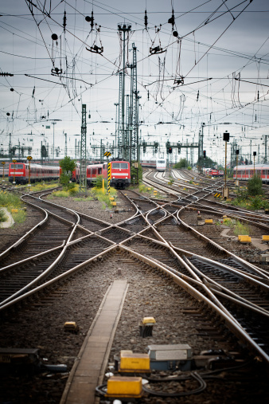
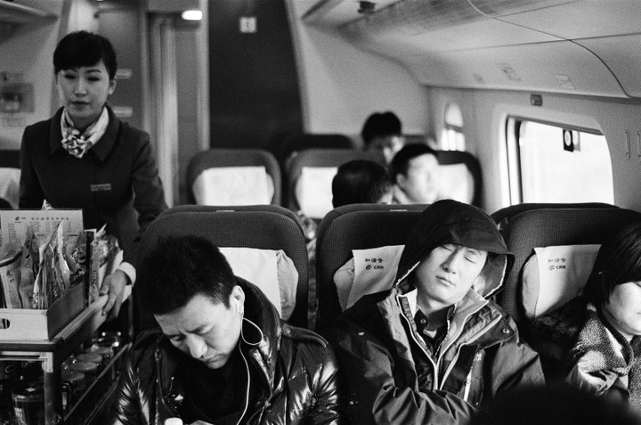
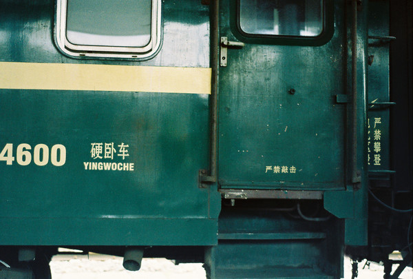

# ＜壬辰年新春专题＞列车上的中国

**是的，在火车上你能够读懂下层的中国，中层的中国乃至于上层的中国。我们在硬座车厢里，看到农民工辛勤一年之后的疲惫与欢欣。我们在硬卧车厢，读到另一些普通人的喜怒哀乐。我们在动车高级软卧车厢，看到的则是中国的富裕阶层对新事物的体验。**  

# 列车上的中国

## 文/元淦恭（中国人民大学）

 

这是农历辛卯年的最后一天。

我所在的城市，成都，到了一年中最安静的时候，除了零星的鞭炮声，再没有其他的人声鼎沸。

根据2011年公布的人口普查结果，这座城市的城区人口已经位列全国第八，这是数十年来成都首次跻身全国十大都会的行列。在新世纪以来的十多年里，成都市是四川省唯一一个常住人口增加的市，她的市区人口在十年内甚至翻番，然而这个省的乡村，却是中国最大的人口外流源泉。

成渝两市在2011年成为了中国经济增长最快的两个大城市，双双进入中国内地城市经济总量的十强。然而这片土地上的许多其他地方，却依然笼罩在人地尖锐矛盾的阴影之下，承受着中西部地区“落后”状态所逼迫的背井离乡。将近20年前的1994年，四川省人口已经突破1.1亿，但2010年川渝常住人口还不及1.1亿。因为有许多川人离家在外，20年过去，中国最大盆地的居民，已经变成人类最大规模的迁徙群体。

我家隶属水井坊街道，这个街道因为水井坊酒窖而闻名。1999年，因为天然气改造，成都酒厂的曲酒厂车间下面发现了一个元末明初时代便开始生产的古酒窖遗址，昔日的“全兴大曲”连同其生产者都“摇身一变”，成了“水井坊”。

现在的“全兴大曲”已经不是昔日的好酒，只是以次充好的产物，原来做“全兴酒”的那些浆液，现在都只用于灌装“水井坊”了。沱牌大曲变成了“舍得酒”，泸州老窖厂出产了“国窖1573”，川酒市场上，酒的名字越来越洋气，价格越来越高昂，可是酒的品质，却并没有实质性的改善，反而因为产量骤增而每况愈下。

二十年里，川酒的变化让我都有许多伤感和唏嘘，然而川人却依然和二十年前一样，在每一个春节的前后，如候鸟一般往返在中国的大地上。

表弟去年考上了湖北的一所军事院校，踏上了离家之旅，赶在春节前十天回来。二十年前，他的父亲，也就是我的舅舅，也曾往返在成都与珠三角之间。如今，父亲回家了，在四川重新安顿，儿子却开始远行，成为四川的过客。

两百多年前，这个家族的先祖就是从湖南，一路西行，渡过长江，越过山脉，筚路蓝缕，来到四川盆地中部的丘陵。

这是全体四川人命运的隐喻。数百年前，那些因为家乡人多地少或是其他种种原因来到人烟稀少的四川开拓的移民，却又要回到他们祖辈的土地去打工赚钱。然而，或许他们正是广东、福建、江苏移民的后裔，却已经没有在那先祖土地上的家园。他们是那里的外乡人，他们唯一的家在山的这一边。

于是，他们挤在列车里。

不管手持一张什么样的车票，“回家过年”是四川人，也是中国人历经多次文化劫难之后保留在生命里的唯一的最重要的文化符号。在信仰逐渐崩解，帝王权威褪色的中国大地上，回家，变成了许多人事实上的宗教，变成了一年中唯一最温暖的渴望。

我曾坐在从北京到成都的临客上，那是四十多个小时的长途硬座旅行。每一个有过这样经历的人，都知道“逢车必让，逢站必停”的临客，将会是怎样的煎熬。

朋友雷磊踏上了今年广铁的临客L946，从广州到重庆，要30个小时。长途硬座旅行的故事，多多少少是相似的，归心似箭的人们，过道上躺满的乘客，刚刚怀孕不久的少妇，还有高谈阔论国际形势的人们。而我还知道的是，在十多年以前，因为没有重庆到怀化的铁路，同样的旅程还会更漫长。

一个朋友说，在火车上能够读懂中国。

是的，在火车上你能够读懂下层的中国，中层的中国乃至于上层的中国。我们在硬座车厢里，看到农民工辛勤一年之后的疲惫与欢欣。我们在硬卧车厢，读到另一些普通人的喜怒哀乐。我们在动车高级软卧车厢，看到的则是中国的富裕阶层对新事物的体验。

火车上的谈笑风生，有许多是抱怨，对高物价的抱怨，对世道艰辛的感叹，对世风日下的愤懑，对贪污腐败的痛恨。当然，还有许多是关于国际形势，日本、美国、台湾、中东。

这是最普通的中国人眼里的世界。他们对于自己的社会，有着最朴素和最直观的认知，而对于自己身处的时代，却只能通过电视和广播模糊地感知。任何人都不能苛求或嘲笑这些在《环球时报》忽悠下的所谓“民族主义者”，他们只是信息不对称时代中最卑微的个体。

他们似乎都在当“军委顾问”，但并没有多少真的想着“保家卫国”，没有本国政治八卦的地方，大家只好聊聊国际关系。

“过年回家”，本是一个简单的愿望。可是在这片土地上，却带着太多的心酸和苦楚。

每年都有许多买不到回家车票，无法踏上回家旅途的人。每年平均会有7000人在回家的路上遭遇意外，永远无法再感受到自己家的温馨。

最近一期《南方周末》，向即将告别中国春运的绿皮车致敬。我却想起了许多列车上过去的故事。2011年的1月22日，大学生赵伟蹊跷地死在1301次火车旅途中。2008年，那是个大雪纷飞的冬季，安徽的大学生冷静，生命定格在芜湖火车站冰冷的铁轨上。1999年，那是个乍暖还寒的春天，河南的四个打工妹，被挤死在南下的火车车厢。

在一年一度的团聚背后，是数以亿计的人们年复一年的盼望，是老迈的父母始终不渝的守候，是5800万留守儿童无法拭去的泪光。

当拥挤的列车从京沪穗深的月台缓缓开出，它比任何其他交通方式都更贴切地象征着这个国家，象征着“春运”这一场每年都上演的超级迁徙。

每一列满载归家人的列车，都映射着这个国度的意念与现实。

列车上的摩肩接踵，代表着这个国家交通资源的极度短缺，列车上的善行与恶行，也正是中国社会每个个体的投影。

20年前，邓小平在南巡的列车上，再度改变这个国家的轨迹。20年后，中国人依然在列车上苦苦地追寻。

2011年7月，当温州动车追尾之后，有人发出了这样的呼喊：在这趟历史的大动车上，作为中国人，没有看客，我们都是乘客。

而早在十三年前，甫创刊的《财经》也在发刊词中写道： “当经济列车隆隆向前的时候，我们将关注在车头里的人们，我们深知，他们的思想、策略和手法，将深刻地影响到前进的速度和方向； 我们将关注车厢里的人们，不管他们坐的是软卧还是硬座，哪怕只是手持一张站票。”

火车，早已成为中国媒体语言中一个不可或缺的符号。

在最新一期的《南方周末》上，编辑部写道：

（绿皮车）它们一定会到达你的那一站。你看到它们在每一个偏远的小站喘息，你看到铁轨咬住它，就像生活咬住你。从年头到年尾，你可能会有种种的不顺利，你虽然焦急，但你明白，日子终会抵达你要的那一刻。

乘坐绿皮火车的人，绿皮火车就是时代背景里的你。你在寒暑之间，奔波于异地。你攥着一张最廉价的票根，走进繁华包裹的工地。在春天，你看到异乡的花开，却忘记故乡的油菜；到年底，你点算一年的收成，却发现你很难跟上涨幅越来越快的物价。

我们把春节前的最后一期报纸，献给即将退役的绿皮车，以及这么多年乘坐过绿皮车跋涉山川河岳的你。在绿皮火车的纪年里，每一个冗长而短暂的年度，无非是从这一公里到下一公里。就像你们花整整一年或者更长的时间来筹备一个个梦想，就像火车经历无数次停靠后积攒一次旅程。慢，艰难，但终会到达你的那一站。

“慢，艰难，但终会到达你的那一站”

每一辆没有脱轨没有追尾的绿皮车，都会到达属于它的那一站。然而列车上的中国，能否到达我们梦想中的那一站？这是时代留给我们的一个大大的问号。

高铁和高速公路在大地上延伸。如成都和重庆一样，每一个省份和城市都在刷新GDP的记录。然而我们知道，经济成就的意义，并不在于这些空洞的数字，而在于绝大多数人福祉的进步。

十多年前，《财经》发刊词里，编辑们说要为诚实的成功者鼓掌，向经济生活中的被损害和被侮辱者伸出手掌。因为他们认为“转型的欢乐与痛苦，应由公正的规则来衡量。”

愿这个像列车一样的国度，能够真正用公正的规则和多数人的福祉，作为掌舵的方向盘，作为前行的动力。惟其如此，这个国家才可能有一个美好的明天。

这是农历年的除夕，这是一个结束的开始。

站在中国这一趟列车之上，“我们将继续眺望前进的方向，也将审视向远方逝去的轨道。”辞旧迎新的时候，我更加坚信，对这趟列车过往行踪的记录，对这个国度过去经历的反省，将是通向未来的桥梁。

 此文中所有下划线句子均系引用，未注明出处者均来源于1998年4月18日号《财经》。  

（采编：尹桑；责编：麦静)

 
