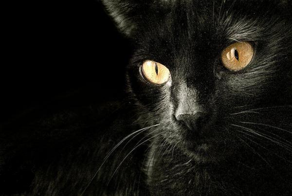

# ＜天权＞19楼

**一个人的生活平平淡淡，不温不火，我渐渐在这座城市扎根下来。属于这所公寓的所有关于小艾的故事，也渐渐被我遗忘掉了。** **然而漫漫长夜那深入骨髓的寂寞，却如猫爪挠心一般日复一日地在无尽的黑暗里吞噬着我的心。**  

# 19楼

## 文/陈谌（厦门大学）

 

来到这个城市第三个月，我依然在给自己找一个栖身之所。

前些天在报纸上看租房信息，无意中看到一所处在繁华地段的高层单身公寓才租一个月一千，第一反应是自己看错了，毕竟在这样一座大城市里，这个价格简直就跟白送的一样。

揉了揉眼睛凑着报纸读了好几遍，才确定上面白纸黑字写的就是“2室1厅1卫，精装修 楼层19，1000/月”，我琢磨着八成是报纸印错了，要么就是发租房信息的房东吃错药了，就算很缺钱也不至于登这样的一个价格吧，我深信这样一间公寓一个月2000都是妥妥有人抢的，不知道这究竟是搞的哪一出。

我半信半疑地打了个电话过去问，房东说房子还在，有不少人看过但依然没有人租，还说我随时都可以过来看房子。在好奇心的驱使下，我下午就迫不及待地坐公交车到了那边想看一看究竟。

这是一个很高档的小区，环境绿化，基础设施都非常好，里面停满了私家车，房子的楼层也都非常高。我寻着地址找到了那栋楼，坐电梯直达了19楼，房东就在门口等我。

房东是一位六十来岁的老人，神色语气都很平静，和我简单寒暄几句后，他就带我看了那间公寓，采光啊通风啊都非常好。因为是19楼，视野非常开阔。房子装修得也很不错，有空调有电视有热水器有网络，所有东西都一应俱全。

我转了一圈，确定一切正常后，转头问房东道：“这房子确定一个月租一千吗？这么便宜？”

他很和蔼地笑了一笑，然后缓缓地说：“是啊，已经有无数的人问过这个问题了。”

我很惊讶地追问道：“那他们为什么都不租下来呢？”

他说：“你别着急，我还没有跟你说这所房子的故事呢。”

我心里一惊，这房子还有故事，难道是闹鬼的鬼宅吗？

他找了张凳子坐了下来，也示意我坐在他对面，然后跟我讲了这个不可思议的故事。

“这个房子的主人原本是我一个老朋友的。他姓艾，年轻时奋斗了很多年，后来经营了一家公司，有了不少钱。可是他直到四十岁才有了一个女儿，名叫艾落落，家里都叫她小艾。因为他老来得子，这个女儿对他而言就像掌上明珠一样宝贝。”

“女儿长大后，婚姻大事就成了首要问题。小艾长得很不错，但是由于她老爸对她的管束向来很严，她平时很少会和男生接触，而即使有看上她的人，她家庭的条件也让他们望而却步，不敢高攀，所以她一直都没有找到什么好人家。”

“大概三年之前，小艾觉得自己被她老爸管得太多，也为了有机会去认识自己想认识的人，就想搬出来自己生活。她老爸为她买了一栋房子，就是我们现在所在的这所单身公寓，而这应该也是这个地段最高档的公寓了，她老爸真的很疼她，为她花多少钱都愿意。”

“她搬进来以后，起初过得挺自由，但是日子一长也难免觉得寂寞。直到有一天晚上，她忽然听到卧室窗外传来了猫的叫声。这个小区里有钱人多，养宠物的也不少，尤其养猫的居多，但是从19楼的窗外传来猫的叫声还是非常诡异的一件事情。”

“她就打开窗户往外看去，原来在19楼的窗户底下有一个很窄的平台，在楼道里游窜的猫可以很轻而易举地跳到那些平台上来，而猫这种动物，在春天发情的时候，半夜叫得厉害也是很正常的一件事情。你可以随我过来看一看这个平台。”

我随着房东到卧室的窗外向下望去，果然有一个很小的平台，虽然很窄，但是以猫的身手，跳到上面真的不成问题。

靠在窗边，房东清了清嗓子继续跟我说道：“接下来发生的事情，都是后来小艾自己说的，我至今也觉得难以置信。她是一个很喜欢猫的女孩子，就趴在窗口把猫给抱进了卧室，没想到猫一碰到地板忽然就变成了一个男人，长得也俊美无比，她站在原地愣愣地看了很久，还以为是自己的幻觉，可是对方非常恭敬地给她鞠了一个躬，牵起她的手就跟她跳起舞来。”

“由于她从来没有如此近距离地跟男人接触过，于是一舞过后，她很快就迷恋上了这个俊美的男子，并和那个男子发生了关系。事毕后，那个男子起身走到窗边，做了个手势让小艾帮助他落到那个台子上，他一触到台子瞬间又变回了猫，然后便迅速消失在了夜色里，期间他一句话都没有跟小艾说过。”

“从今以后每天晚上都会发生这样的怪事，一到晚上窗户底下就会有猫的叫声，小艾打开窗户都会看见一只不同毛色的猫，把它抱进房间后它就会变成一个男子，虽然每天都不是同一个人，却总是无一例外地俊美。两人共度良宵后，小艾就会帮助男子回到台子上，他又会变成猫走掉，不留下一点痕迹。”

“她说她也曾想过和那些男子交流，和他们聊聊天，甚至谈一谈感情。但是他们似乎从来都不会说一句话，总是跟她做完就走，也不曾想过留下来。小艾隐隐觉得这应该是一种不允许被破坏的规则，大概他们的本质依然是猫，只有交配的能力，没有与人交流的能力，更不用提谈感情了。自己反正每天都有人作伴，有乐子可以找，又不用担心会被猫搞怀孕，既然没有任何后顾之忧，这何乐而不为呢。”

“不过她最终还是到了要结婚的年龄，她也说服自己不能沉浸在这种无果的快乐之中，所以当他爸爸介绍了一个门当户对的男人给她认识时，她坦然接受了这段婚姻。她告诉自己，婚姻和爱情是两回事，过日子肯定不会有那么多激情，自己也该收收心，当一个持家的本分女人了。”

“他爸爸给他们举办了一场非常盛大的婚礼，当天的来宾非常多，都是这个城市里有头有脸的人物。小两口敬了一圈的酒难免有点微醺，婚宴过后大家把他们送回新房就散了，也没有闹洞房，只希望他们能好好休息一下，而他们的新房也正是这间公寓。”

“那天晚上新郎大概喝得胃不太舒服，就靠在卧室的窗户上想透一透气，而小艾此时也有点醉得意识模糊了，看见新郎站在窗口，竟然习惯性地误以为是猫准备要跳上台子走了呢。于是后来的故事我不用说你也想得到了吧，小艾亲手把她可怜的新郎推下19楼摔死了，毕竟人和猫不一样，那个台子接得住猫，却没法接得住一个人，19楼呢，啧啧，当时我不在现场，但可以想象有多么惨。”

听房东说完，我的背后一阵冷汗，心想原来这个房间发生过杀人案啊，但是这个故事未免也太离奇了一点，就好像童话故事一样。

我对房东说道：“难怪这个房子这么便宜都没有人租呢，可是它为什么会到了你手里呢，还有小艾她后来怎么样了？”

房东笑说：“小艾后来去了哪里我不知道，也不能告诉你，我只能告诉你他爸爸最终把这房子给了我，而我因为自己有房子，所以就把房子拿出来出租。但我是个讲原则的人，我觉得我有义务把属于这间公寓的故事告诉租房的房客，价格就是这么便宜，至于你敢不敢住，那就是你的事情了。”

我听毕哈哈大笑，觉得这一定是房东在跟房客开一个不大不小的玩笑，我向来是个不信邪的人，于是我便租下了这间房子，以一个月一千块的房租。

而搬过来之后，我也从来没有在夜里听到过窗外的猫叫声，甚至连猫的影子都不曾见到过。于是我释然了，故事终归是故事而已，信则有不信则无，那些房客真的是太天真了，白白把这么大的一个便宜给丢了。

一个人的生活平平淡淡，不温不火，我渐渐在这座城市扎根下来。属于这所公寓的所有关于小艾的故事，也渐渐被我遗忘掉了。

然而漫漫长夜那深入骨髓的寂寞，却如猫爪挠心一般日复一日地在无尽的黑暗里吞噬着我的心。

 

（采编：周拙恒；责编：应鹏华）

 
