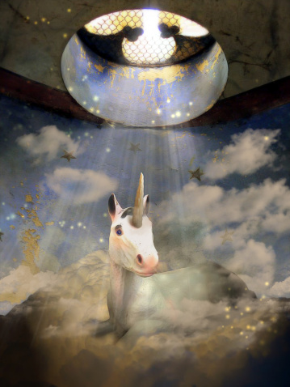

# ＜天权＞The intersection of the past and the future

**延绵不绝的梦，是稳固现实的逆反或者延伸。存在于我们眼前的现实只有一个，而这唯一的现实既是一块黑铁。若鸡蛋和高墙的隐喻的确存在，它代表的当是人的柔软内心和这一块黑铁，而梦是一个与之对抗的重要工具。**  

# The intersection of the past and the future

## 文/张益清（Syracuse University）

 

秋天的时候，头发就开始大规模地掉。又或者是头发太长所以掉下也尤其醒目。隔一个星期就从卫生间的下水口处看到积攒的一团头发，黑而且潮湿，看起来悲凉可怖，她总不相信这曾经是自己身体的一部分。也总想起一个早年的黑白悬疑电影，女主角在洗澡时被陌生人闯入杀害后，头发不甘心地混合着血水漂在下水道的入口处。

又或者多年前听过的一个故事，女主角溺死，头发像水藻漂在水面，而救援的人竟真误以为那是水藻，任由她死了。听这个故事的时候是夜晚，她坐在春运回家的拥挤火车上，听邻座的人绘声绘色讲各色市井传奇。外面一团漆黑，车身和铁轨撞击的持续不断的声音叫人麻木起来，渐渐觉得这火车是在时间凝滞的真空中穿行。夜深了下去，身边的人东歪西倒睡去，她有些困意，但睡不着，迷糊中身上渐渐渗出汗来。

清醒过来的时候天空开始发白，她发现火车正在经过大桥，桥下是颜色浑浊的江水，江水上有船只停顿或者穿行。冬日的江面非常安静。火车缓慢穿行过这个江边的城市，城市尚未苏醒，一片破败的工业灰白色建筑，看上去潮湿而寒冷。她恍惚觉得自己来过。

或许那是很小的时候，他的父亲出差到过这里，给她的母亲写的信上附了站在江水边的照片。也是这样冬天中的萧瑟感。她还不记事，只看见照片上的父亲穿着深蓝色布料的西装，瘦而英俊，照相的时候略抬头，往下冲着镜头，不笑。他所有的照片都是这样，严肃桀骜。

他是不许她留长发的。他让她留男孩样的短发，每次出差回家，也总给她买男孩的衣服叫她穿。他的方式，是不让她有任何自怜。10岁，他带她回去农村老家，带她在他小时长大的院子中种下核桃树，叫她一个人走了很远，挑两桶水来浇树。热天，她冒着高原毒辣的太阳去村里的井里取水，把木桶放下去，却怎么也打不上水来。探头进去看，由地底冒出的凉意直冲头顶。井水微微摇晃，拉长了头部的轮廓，看起来像满头长发。她有些贪恋地看了一阵。

也不叫她听软绵绵的音乐和看软绵绵的书。初中的时候好友来看家中看她，悄悄在怀中藏了一本彼时最流行的言情小说，却不小心在吃饭时掉下。好友走后，他命她和这个女孩断绝交往。家里满满几抽屉的古典音乐磁带，不时就拿出来放。又给她布置阅读《理想国》的任务，一天只读一点，要她读完讲给他听。教她书法，批评她的字也只得一个标准，就是这字是否从容与大气。

自然地，头发长过耳朵，就要剪掉。她暗自羡慕班里的女孩，头发垂腰部，每天早晨由母亲仔细地编成一根一根的小辫子。父亲只跟她说，等你上大学，你再自己决定头发的长度。

她看着被河岸边布满参差不齐的住宅和小工厂的江水，想起了电影里的美人鱼。下意识地，她摸了摸前额被汗水打湿的头发，对自己无声地笑了一下。

后来看撒切尔的传记，讲她儿时，他的父亲命她每周读至少两本non-fiction。这才是他期望中的女儿，聪明与天分自不用说，重要是绝无阴柔造作。而她本人，她想，像下水道口掉落的头发，潮湿冰凉，阴郁绝望。像《理想国》，她读时不理解，只有很后来，才在大学的读书会里认真读过。她也没有按他期望去读一个理工科的学位，再认真严谨地安排和规划自己的人生。她上了艺术学校，修的专业是art journalism，整日和无所事事的青年男女混迹在要倒闭的酒吧和廉价的出租房，偶尔给杂志报纸写一点边角料的栏目得些稿费。

无疑地，在他面前，她是一个彻底的失败品。她能从他一切衰老的征兆中，看出这样的失败。他年轻时一双灼灼的眼睛已经发黄和浑浊。又因为喝了太多酒，皮肤暗红，还开始长老年斑。他开车时开始会分神，几次险些酿成事故。她每次回家，他都要打量她一番，第一句话永远是，头发太长了，去剪了吧，女孩子精神些好。

她只是笑笑，说，你说过我上了大学就能自由选择头发长度的。

他就有些着急地说，那当然那当然，我一向给你自由。我只是说，我觉得剪了精神些。

她终于也成为了他无力掌握的命运的一部分。

延绵不绝的梦，是稳固现实的逆反或者延伸。存在于我们眼前的现实只有一个，而这唯一的现实既是一块黑铁。若鸡蛋和高墙的隐喻的确存在，它代表的当是人的柔软内心和这一块黑铁，而梦是一个与之对抗的重要工具。

入睡的时光是恬静的。她习惯在睡前阅读，从小如此。小时父母命她9点上床睡觉，并要确保她关灯，她偷偷藏了手电筒，在被窝里看杂志和小说。她对文字有一种喜欢反复咀嚼的贪婪嗜好。

长大了也如此。有时在下班回家已经极为疲倦，她还是极力让自己清醒，洗澡，上床，阅读。这已经成为她生活中若干用来确认自己存在的若干仪式的一种。

她极少做噩梦。然而一旦入睡，梦就是蓝色的海水，灌满了她的狭小房间。极远的地方，星辰与月亮无声运行。

她常常梦见外婆的老房子。那房子老城区的安静一角，非常狭小，但是每一个角落都干净得一尘不染。那是那种让人喜悦的洁净和秩序，一个年久的闹钟，看上去都有叫人心安。雕花的毛玻璃的窗子看出去，是外婆费心打理的院子。她在里面起码放了上百盆不同的花，一角的花坛里又种了浓密的竹子。骄阳之时，这院子有舒适的凉意，而如果阴雨延绵，看着被雨水冲刷的绿叶和干净的地面，也叫人心中敞亮。

她喜欢在外婆家呆。外婆小时裹过小脚，但十几岁时又放开了，所以比一般的小脚女人灵活许多。外婆走前走后地做家务，照料一个院子的花，她在身后跟出跟进，现在看来那每一步都是快要溢出来的喜悦。

她又喜欢看外婆吃梨子。外婆牙齿已经掉光，只能把梨子切开用勺子刮着梨肉吃。外婆穿蓝色对襟外衣，衣服上是暗色的龙凤图案，坐在木头榻子上，一个梨要吃半个钟头，一边跟她说话。她喜欢外婆从来不以跟小孩讲话的口吻对她，凡事讲得这样有条理和秩序。当地有种传说中的鬼怪，是个老太婆的模样，白头发着地。有个故事说，一个这样的妖怪，化身成少女的模样去到人家中，男主人就恋上了她，晚上去她留宿的房间偷看，看见解下了头饰的及地的白发，才知道是妖怪来了，就偷偷请人作法赶了出去。外婆讲这样的故事也不避讳里面男人偷看女人的情节，依然是理所当然慢条斯理的口吻，一边从勺子中吃梨肉。

自然外婆信佛，在家中专门腾出一个屋子供奉着神像。也是异常干净的小屋子，一个核桃木供桌上放了铁架子，上面点油灯，两边常年点香，并常有供品。供品都是极好的水果和饭食，从桌子上供过撤下后就专门留给她吃，因据说这样的东西小孩子吃了会聪明。她也每次懵懂地接过尽数吃下。后来想起，其实是拿去上供的水果都是外婆能买到的城中最好的水果这个缘故。

梦里她总是坐在那房间的小小一角，望向窗外院子里的一点天空。院子破败了，但因为整洁和有花草的缘故，叫人安心。每次梦中都无尽地下雨，雨水顺着红色的剥落的泥土墙流下来。她知道外婆就在某处走出走进地做事，在等她做完事来找她。雨拍打地面，花盆和窗子的声音那样真切，真不像梦。

外婆去世时她8岁。放了学发现表哥在学校门口等她，带她直接回了外婆家。进了院子，就看见外婆一动不动躺在院子中央的棺木上，白发绾在脑后。根据她的遗愿，要做三天法事，才能入土。那三天院子里热闹非凡，人人都穿着白色的亚麻孝衣进进出出。外婆享年82，已经到了寿数，算得善终。她不记得有看见人悲伤，反而人人有礼钱花圈数给作法事的先生的报酬这样的事在操心，才知道原来死也是生活日常诸多事的一种。

只是丧事不久后的一个星期六，晚饭过后，她妈妈收拾好碗筷，叫她换上出门的行装，自己拿了钥匙和雨伞准备出门。回头看见她迷惑的眼神，才忽然醒过来。妈妈的脸一瞬陷入几近惨烈的悲伤，茫然和无措，站在门口站了一会儿，才像为自己辩解似的对她说，记性真是不好了，一到周六吃过饭，就想着要带你去外婆家了。

她一直没有在梦里等来外婆，只有永远不停的雨水。

(采编：何凌昊； 责编：尹桑)

