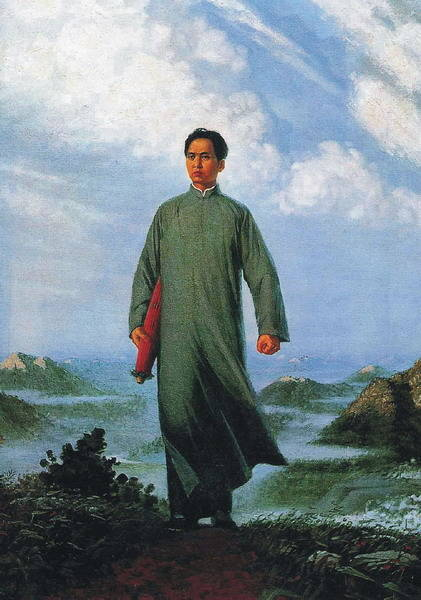

# ＜天权＞“风来激涌当年梦，名遂惧如梁饮冰”——21世纪少年们的诗词梦

# “风来激涌当年梦，名遂惧如梁饮冰”

# ——21世纪少年们的诗词梦

## 文/徐毅磊（上海理工）

40多年前发生了一场浩劫，使我们失去了祖先留下的诸多宝贵财富，从此它们更大程度地存在于对岸。在这其中以文化首当其冲。 文化的力量究竟有多强大？它可以超脱于经济军事实力之外，使得一个原本被吞并的民族，不被亡国灭种而反将侵略者本民族化并最终囊括进了自己的领土——这已经反复地发生在我们的历史之中。 然而在文化复兴的过程中，有的人矫枉过正，有的人以之为借口来达到自己不可告人的目的——例如最近新闻出版署的某条不准夹带英语的规定。而更可悲的是我们会看到，诸如已故季羡林先生那样的印度学大师，居然会被冠以国学大师的名号来为我们撑了多年的场面。 其实单从唐诗宋词来说，究竟是因为那些名流青史的大师，还是全国文化人都能写诗鉴诗的风气，才使其得以流传至今？ 庆幸的是我们不需要太过悲观。因为即使是浮夸的现在，也有一批和我一样生于80末、90初、于21世纪步入少年的朋友们热衷于诸如诗词的古典文化；而以《仙剑奇侠传》这样受众面广的游戏为载体之下，诗词在一定范围内受到了大众追捧，即使它破韵而又不守格律。 当然，在民族主义者仍然盛行的当下，我们更应该提防的是民族文化被扭曲成民粹的帮手。 “风来激涌当年梦，名遂惧如梁饮冰。” 刚开始写诗词时给自己起了个笔名叫“少翁”，盖因当时我的思想和外貌（当然主要是外貌）都很老成，随着时间的推移，当那些故作深沉的犬儒者成为我最讨厌的人后我便想要换了它。不过现在已经释然，因为有一句话叫“永远年轻，永远热泪盈眶”。少年时不盲目，老年时不妥协——这也是我们致力于一些事业中的准则。 故此摘选平生所作诗词凡五篇，望诸君多加提点，以之共勉。 

**朝中措**** **

_破旧_

周秦楚汉宋明唐，旗落复称王。有乐无缘倾泻，一斟残酒愁肠。

久诗成癖，闲刀乱舞，断想书狂。怒语时日曷丧，笑谈身死国殇。

**定风波******

_作失_

风卷残枝脉脉纠，俗尘散尽为仇雠。吟苦天涯重霄九，楚囚。此生自断惧危楼。

前度竭诚成晚柩，非谬。道深不量解恩仇。得丧魂归谁复有？清酒。断弦一曲梦缘休。

**七绝******

_仿伊藤博文_

道德文章丧人伦，哗窃名节失国魂。

他年廊庙栋梁器，曷得松门施教人。

注：戊子年冬末阅伊藤氏原诗，忆其昔日之嘴脸，犹觉讽意。然其人尊师之言行，不禁令人汗颜。夫瀛洲于危急存亡之际得以兴者，盖因伊藤诸君鞠躬尽瘁之力，而松门亦可谓居功矣。复观华夏宇内，才学不下伊藤氏者岂止万人？地物之广博又孰与海上孤岛？然自诩天朝谓彼为倭夷，自似泥足巨人，空求浮名而物力维艰、民生日蹙、义正之士揣揣不可终日、伪行之风不下伊藤氏者，为师者恒无过乎？为政者独无异心乎？感世风之悲怆，叹松门之难寻，悲甚至哉，仿歌以咏志。 

**沁园春******

_沧州_

豪雨无休，佯登北固，独醉南楼。叹神州万里，天心梦糜，殿前俯首，一语皆囚。云散风收，骄阳西去，渺渺苍生天未愁。酣歌后，迷梦中幻旅，正道曷求？

天涯踏苦难休，教今古骚人悲怨秋。伫秋千墙外，老夫狂止；沈园墨晞，忽倦封侯；醉里连营，浮生自断，战骨销残易水流。纵皆谬，看微蛾振翅，见凤惊游？

**浪淘沙******

_思御守_

孤树乱猿鸣，风起风平。失足困旅驻边陵。几度丹心词里恨，书罢谁吟。

风止树难停，谬若同龄。芳凋青帝亦绝情。百代殒身民砥柱，多是无名。
