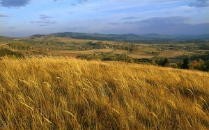
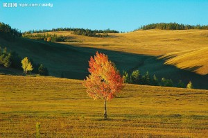
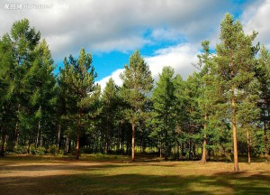

# ＜天权＞《Survivors of Siberia》

**所谓交待身世，大约不过如此。你们的身后，是西伯利亚白茫茫的冰原。而你们，是两个幸存者。** ** 所有的冬天，都好像很漫长。你对他说。** ** ****必须这么漫长不可。他低头沉吟一阵后说。** ** ****是的，必须这么漫长不可。你看着窗外的无边风雪，无声地说。** 

# **Survivors of Siberia**

## 文/张益清（Syracuse University ）

  **1， ** 

那个冬天，真是漫长。

落雪的时候，北国的秋意似乎还未完全脱去。这里的秋天极美，漫山遍野的树木，全部变成深浅层次不一的黄色和红色，和地上的草还为未褪去的绿色相映，眩晕的色彩胜过春天。

色彩正值正绚烂时，暴雪来临了，伴随着毫无预兆的狂风与呼啸。那光景，叫人颇能想象到西伯利亚的十倍严酷的场景。这吞噬和消灭一切生命，又给人一切生命的力量的秘密放佛就藏在漫天冰雪不见人烟的荒地上。

你不晓得为何，总是想到西伯利亚。在革命和动荡的狂潮中，那是世界的尽头，是人间绝望之境地。你一本接一本看苏俄小说，最后有些颠三倒四起来，在梦中不停和自己辩论：带着恋慕自己的女人去到流放地的究竟是《罪与罚》里面的大学生，还是《复活》的主角？乘着驯鹿拉的雪橇狂奔两天两夜逃出流放地的，究竟是托洛斯基，还是不幸的刚逃脱了砍头厄运的陀思妥耶夫斯基？

你站在公寓的阳台上看纷扬的大雪。你只穿了睡衣，风吹得你全身不受控制那样瑟瑟发抖。此刻的西伯利亚，和革命时的西伯利亚，又有什么不同？想必建起了工厂什么的。搞不好有沃尔玛大型超市也说不定。你对自己摇摇头。这样想着西伯利亚，到底是一种病态吧。

你的身后的窗子透出黄色灯光。你转身，凑近透过百叶窗的缝隙看进去。他还在温暖的床上沉睡。手臂摊开的姿态，仿佛你还在依偎着他在梦中。他的下巴上，刚长出的胡须蔓延开大片阴影。

如果一直能在大雪的夜晚，在有壁炉的房间和所爱的人这样沉睡，你是否会停止想象西伯利亚？

实在太冷了。骨骼开始以疼痛发出抗议。你走进屋子，关上阳台的门。倒了一杯热水，蜷缩在沙发上。

此刻应当喝酒。你想着。最好是像俄罗斯人，喝一口烈得呛人的伏特加。这个国家盛产臭名昭著的酒鬼，喝得天昏地暗不醒人事，最后在冷风的街道上被人发现冻得硬梆梆的尸体。身后或许还留下一屁股债和几个不知如何是好的寡妇和儿女。

而他喜欢威士忌。你们去卖酒的地方挑酒，他一口气买5瓶，连同一瓶给你的红酒。他嫌你的冰箱里冰块不够多，总是每次都在便利店买回一袋子冰块。你们的晚上，就这样经常在这样无言的对饮中度过。你只是象征性地喝。你同你父亲一样，酒精仿佛能够点燃你们全身的血液，红通通，难看极了。还有你一喝多，就不受控制地傻笑。

一个这样的冬天里，你们已经喝着酒把所有的话都说完。他来自中国南方，12岁离家，环游过你能想象到的大部分地方。

意大利？乱糟糟的地方。

新西兰？树倒是很绿。

墨西哥？到处都是鸡笼。

越南？都是一厢情愿的美国佬。

如此这般，简洁明了。

甚至南极也是去过的。去看肥胖的企鹅，在水边不停扇动可笑的翅膀。坐在小艇上，穿着笨重的保暖衣，和站得笔挺威严的企鹅家族对视。

惟独没有去过俄罗斯。俄罗斯对于他，是完全不值得考虑的场所。圣彼得堡或者莫斯科，都是没有任何印象附着于上的城市。

不喜欢俄罗斯的国旗。他说。

他说这话的时候，你才发现你压根对俄罗斯的国旗这回事情毫无印象又一无所知。大概国旗这种东西，是你从来不会作为一个标志来和这个国家加以联系的。但你记得美丽的安娜在前往圣彼得堡的火车上或心神荡漾或失魂落魄。列文在乡间的猎场追逐猎物。与放荡的波兰军官彻夜饮酒的格鲁辛卡。头发曲卷长着俏皮雀斑的卡嘉小郡主。苍白而又神经质的梅诗金公爵。当然，还有你亲爱的阿廖沙。

并且你一度想要学习俄文。但像你生命里想做的很多事情一样，最后不了了之。通晓一门语言的艰深，和被不同的语言隔住的无望，哪一个是让人值得停留的深渊？如果此刻，你跪在佐西马长老面前，你要以怎样的语言和方式开始你的请求和诉说？

他在房间里面叫你的名字，声音带着睡意。你在黑暗里走进去，光着的脚踩在暖和的地毯上。他在床上坐起身来，在黑暗中说，半夜你不睡觉，起来做什么。

你在他身边坐下来。他赤裸的上身散发温热近乎灼人的体温。你伸手过去放在他的胸膛。冰凉的手让他本能地往后一缩，然后假装恼怒地抓住你。 

和他的吻总是绵长。你们的口舌似乎蓄意要释放在相对的沉默中积蓄的能量。他的一半意识，还停留在没有完全结束的梦境中。他咬着你的嘴唇含混地喊你的名字。你停下来，看着他。

他笑起来，手轻轻抚摸你在接吻中发热的脸颊。他说，我渴了。去厨房给我倒水

 **2，**

那个冬天，出行艰难，路上行人车辆罕见。日本菜馆只有你们两人。男侍应和你们寒暄，他说你们看外面的大雪，已经连续不断，下到第100个小时。

你们今晚，可能会搁浅在我们餐厅。男侍应笑嘻嘻，一边在桌子上放下小瓶清酒，一边说。请尽情喝酒。男侍应转身走开，而他那似乎永远不会消逝的笑容，依然停留在你们周围的空气里。

喝到第三杯，你脸颊和手心，都泛出红来。太阳穴跳得厉害。你抑制不住嘴角，露出近乎出愚蠢的笑。他给你满上第四杯，放下酒瓶，手伸过来，手背试探你额头处的温度。

我父亲告诉过我，好的酒，喝再多，只使人沉醉而不会头痛和呕吐。你求证一样地看着他。

他沉吟了很久，似乎在思考一个很重大的命题。想了大约一分钟，才说，可能是。

他很少喝多。唯一一次，是在青海，被路上偶然相识的人灌得烂醉。在青年旅社的床铺上醒过来，全身的东西都不知了去向，只剩一条内裤。去问青旅老板，说一个30岁左右的男人给神志不清的他办的入住，男子什么时候走的不清楚。 

你接到他从青海打来的求助电话。信号不好，你只听到断断续续的只言片语。他问，能否想法借给我一些现金。

那时，你们只不过在社区周六的难民义工活动里共同服务过两个月。城中聚集来自不丹的难民，有机构组织捐赠、救济和提供安置服务。每周六早晨，你裹着白色围巾分配奶油汤和三明治。他也是一份子。他从货车上帮忙卸完面包，也站到你旁边，把奶油汤盛到碗里递给你，再由你递给面前排队的不丹人。

食物发放结束，他会负责开车送其他几名不驾车的义工回家。路上闲聊，大家说自己如何得知这机构以及来做义工目的。

有人说，这是善事。有人说，我要为我的社区服务。有人说，为将来致从事慈善和非政府活动做准备。轮到他，他说，我为了能吃免费三明治。

没有表情那样说的。即使在大家笑，他也没有表情，握着方向盘看前面的路。是不是玩笑都分不清。 你的公寓远，是最后一站。通常两个人也都无话，车上放乱七八糟的音乐。有时是Chet Baker，有时是Cold Play，有次放了Nina Simone，还有张史塔克的无伴奏大提琴组曲。总之是参差不齐。放到一半音箱里传来嘈杂声音，他狠狠地敲几下音箱，又好了。问他，他只说，都是朋友的CD，别人给什么他就听什么。

那天路在车上坏掉。他停车在便利店，进去买口香糖，出来后车怎么都无法发动。你坐在副驾驶座，看他拧钥匙。

问题严重吗。你问。

他不接你的话，下车打车前车盖察看。看了一会儿，叫你下车，说，我们走回去。

你问，车怎么办？

他耸耸肩，不置可否的表情。他又转身进便利店买两瓶啤酒。你们就这么喝着啤酒，走了十公里的路。

那是夏末，阳光灼人，知了四下鸣叫。啤酒很快就温吞了，不到一半的路程，你已经出了很多汗。你跟在他后面，看着汗水顺着他短发浓密的脑袋挂在脖子上。他穿牛仔裤，文化衫，旧的运动鞋。走路速度不慢，但是总是摇摇晃晃的样子。

你试着问，车以前这样过吗？

他放慢一些脚步，和你并排，说，经常。

他开的是一台大约10年的福特车，车身多处已经磨掉了油漆。这种人，你心里想。保险想必都早已过期。

那你每次就这样，弃车走人？

他又想了想，说，十之八九。

沉默地走了一段，你尝试新的话题。你父母都在中国吗？

他摇头。我父母都去世了。

你说，对不起。

他摇摇头。没关系。表情也看不出悲喜。

你不知道说什么好，就这样沉默地到了家。出于礼节，你本想邀他上去坐一坐，但这个邀请却无论如何都说不出口。只说了下周见，就转身上了楼。进屋后从阳台看，街上已经找不到他的身影。

渴得要命。你从冰箱里取出大罐的柠檬水，一口气喝掉半罐，想着便利店门口停车场的那台福特。

后来几个月的周六，他都再没有出现过。再后来，你就接到了他从青海打来的电话。

 **3，**

父亲藏上好的酒，在屋子后面偷偷挖了一个酒窖，用医院装药水的那种大玻璃瓶装起来，一瓶一瓶放在地底。

父亲说，走，跟我去拿酒。也是暮色淡薄的冬天，家里来了客人。客厅一角，取暖的老式炉火发出炭特有的，靠近了会呛人的气味。一桌子冒着热气的菜，还有电视机里歌舞节目的喧哗。你听不懂，也不关心一桌子大人的谈笑。你尚未成形的灵魂里面，对世界的理解是那样破碎，而又无法分割地整全。后来的你会惊异，那样一个只靠动物般本能对外界的不管是残酷还是温柔的刺激作出反应的小小身体，是怎么在漫长的岁月中一点一点地，完全苏醒。

他们在谈论什么呢？无非是远处的时光和事件在他们世界的平静水面引起的回响罢了。不管是交通事故死掉的人，某处政权的更迭，更远的暴乱和流放，社会名流的韵事，都不外如此。女人们更热衷于谈论她们看得见的事情，比如街角新开的理发店理发师的手艺。所有的这些，对于你那颗心灵来说，都是新奇而又无关的。正如一只小狗伏在主人的脚下听主人训诫自己的孩子，那时的你，只有一样的近乎漠然的懵懂。

你站在窗外等进屋子穿外衣的父亲。隔着起了雾气的窗子和白色的窗纱，你听不见屋子里的话语和笑谈，当然也听不见炭在火中轻轻裂开，听不见壶里开水沸腾。南方冬天潮湿的寒风吹过你的头发，漆黑黑的天空一颗星星也看不见。包裹你的黑暗叫你恐惧也叫你安心，因为此刻，没有什么来伤害你。你看着窗子里无声的画面，一种长久的喜悦俘获了你。

父亲穿着厚厚的棉衣出来，带着屋子里的热气，拉起你已经开始发凉的手。他的另一只手拿着一只铅制的手电筒，和一个小小的酒瓶子。在黑夜中划出一道黄色的光。他拉着你，走到酒窖的入口处。他熟练地把地上厚实的木板打开，挪放到一边，然后把手电筒交给你，说，给我照路。

说完，他就侧身顺着木板搭起来的楼梯走了下去。地窖不大，两三平米而已。你举着对于你的手来说太重的手电筒，闻到了潮湿厚重的泥土气味。电筒在父亲的后背上投下了一个黄色的光圈。他招呼你说，往旁边站一点，我看不到酒瓶。

你往侧边挪了一步。你看见父亲手里捏着一根橡皮管。就是医院里打针用来扎手臂的那种橡皮管。高大的父亲弓着腰，站在十几个瓶子面前，犹豫不定。那些瓶子里，有的泡了枸杞，有的泡了山药，而让你印象最深刻的，就是其中一瓶里一只半闭着眼睛的海马。你尤其喜欢看海马卷曲的下肢，长长的灰色身体，像一个优雅的海的精灵。在各种中药和植物中间的漂浮着的海马，倒像依然生活在大海的珊瑚礁石中间，从未死去。而父亲最喜欢的酒，通常是那些什么都没有泡的。他犹豫了半天，打开了角落里的一个瓶盖。

父亲把橡皮管插进酒瓶，在这端用力吸了一口。昏暗的电筒光中，你也能看到纯净的液体顺着橡皮管流出来，流入父亲的口中。他一边满意地咂嘴，一边放开橡皮管，用小酒瓶接源源不断流出来的酒。一会儿，小酒瓶就满了。他盖上酒瓶，伸手递给你。

你迟疑着。父亲说，帮我拿上去，我把酒瓶盖好。你顺着木头的楼梯往下走。楼梯总共5级。地窖的黑暗不同于天空的黑暗。天空的黑暗是广阔自由的，它迟早被黎明后的光明取代，然后周而复始。而地窖永恒不变的黑暗则让人窒息。父亲就在距离你不到2米的地方，可是你们四周的黑暗，似乎比父亲更为强大。你走到父亲面前接过酒瓶时，黑暗彻底包围了你们，只有手电筒在狭小的空间里散发出并不温暖的灯光，似乎随时准备迎接暗黑的吞噬。酒精混合着腐烂的泥土味道。你想到，在周围看不见的地方，那些神秘可怖的生灵和支配它们的力量。

那恐惧，在几秒钟内扩张到无法忍受的地步。你迅速转身，走上地面。你看着父亲也走出来，转身盖上地窖的木板。你仰头看到一丝灰色的云掠过沉寂的冬夜天空。

那天，你第一次尝到了酒。席间，父亲夸赞这酒的醇香。他留意到你困惑的神情，而这让他发笑。他招呼你到他面前，用筷子蘸了酒杯里的酒，送到你嘴里。不悦的辛辣感在口腔里蔓延开来。你的五官挤在一起。这让每个人都开怀地笑了出来。父亲大笑，笑的末端，抬起杯子，意犹未尽地抿了一口酒。

父亲终身痴迷于这神秘的液体。

 **4，** 

酒的好坏似乎没怎么在意过。他补充说到。

你点点头，觉得自己的脑袋沉甸甸的，有点失去控制。你面前的寿司几乎没有动。他用筷子夹一个，把上面的生鱼片吃掉，把米饭卷送到你嘴边。他知道你不吃生鱼片。

你紧闭着嘴唇摇头，忍不住想要笑。男侍应在餐厅旁边笑嘻嘻地看着你们。

他说，你得吃东西。不然会吐。

从日本餐厅出来，他搀扶着你。你手里捏着侍应同账单一起送来的巧克力，带着酒气的呼吸在空中凝结成白雾。他说，你站在这里等我，我去开车。说完捏着你肩膀让你靠在门口的柱子上。

你看着黑色的天空里不断落下的雪。远处的高速公路上没有车。你想象着横穿欧亚大陆的火车在上面飞驰。

火车会经过沃尔玛大型超市，餐馆，饭店，医院，和住宅。它将沿着这条高速公路最终抵达西雅图。然后是茫茫大海。

你对自己摇摇头。冷风吹在你滚烫的脸上，你深深呼吸。我们最终，什么也不会剩下。你想。

西伯利亚，那是世界终结的地方。在那意图清洗和去除一切记忆身份情感人性的，寒冷和无意义的受苦中（世间又有多少种受苦，是在当下能够体现其意义和后果的呢？），大概人才得以从往昔岁月的痛苦与荣光，甜蜜和不幸中，看到一些什么。

这不就是你一心脱离过去，来到这里的目的吗？

怕是非去真正的西伯利亚不可。

你持续地做关于西伯利亚的梦。父母牵着你的手，在海滩上急速行走。你们受到了原因不明的迫害与追杀，已经跋涉千里万里，从内陆的家园来到海边。海滩上的游人嬉戏，浪潮的声音时大时小，夹杂着人的笑声和尖叫，和冰冷潮湿的海风。

你低头跟住前面的两双脚。陌生人不断从你身边经过。

你的脚下，是被海水冲刷到岸上的无数锋利的匕首。它们刺入你的脚底，而你丝毫不觉得疼痛。你在身后留下了比大海的味道更咸腥的血迹。

忽然大海褪去。海水先是从中间分开，然后分开的部分越来越大，直到灰色的海底赤裸裸地出现，延伸到天际。游人在一瞬间消失了。

你沉默地注视着消失的大海。

天空开始以惊人的速度落雪。一瞬间，大海变成了茫茫冰原。一片叫人发盲的白色中间，只有你血色的足迹鲜红刺目。

欢迎来到西伯利亚。你听见父亲说。他对你和母亲张开双臂，像一个导游一样热情地笑着。

 **5，**

你辗转找到一个在西宁的朋友，把钱送到他手里的时候，他已经在街头露宿了两天。朋友不可思议地跟你说，真跟流浪汉一样。你从哪里认识这种朋友?

电话再打来，已经过了两周。那端能听见机场的登机广播。他自报姓名。你问，你现在在哪里？

他说，北京，机场。

去哪里？

东京。他说。你这才想起来，他持日本护照。

东西丢了费了一翻周折吧？你问。

不算太糟。他说。在大使馆遇见投机的日本人，和他住了一周。拿到新护照就买了机票。

你沉默了一阵。他说，我在日本待三个月，之后回美国。顿了一顿，又说，非常感谢。没有你的帮助可能要多很多麻烦。回去后会把借的钱还你。

好。你说。旅途顺利。说罢，挂了电话。

三个月后。你想。是春节。

父亲是5年前的春节去世的。此前腊月间，他中风引发脑溢血，在医院昏迷不醒。你从学校告假，整整一个月，你在医院里守着全身水肿的父亲。

他带着呼吸面罩。鼻子因为喝酒过多而生了痤疮，倒不至于就成酒糟鼻，但是也发炎而红的可以。

偶尔有清醒的时候，他只是看着你，说不出话。你也这样看着他。

或许应当握住他的手。可是你不行。难过是难过到了极点。就这么和父亲对视。有时整夜整夜地坐在医院冰凉的椅子上看着昏迷不醒的他，全身僵硬。

病房窗外是高大的梧桐树。树干上白色的不均匀斑点看起来像生了白化病的病人。你扭过头，尽量不去直接看它。那斑点在你眼睛的余光里逗留不散。

医生说父亲的情况无法预测。常年烟酒过度的父亲，未到60岁，已经不是第一次中风，还有心脏病。

你看着他垂在病床上的黄色的手指。父亲抽烟狠得要命，一口能几乎把半根烟燃到底。你怀疑他的白色眼球，都是被烟熏得浑浊发黄的。

母亲是从什么时候不见的呢？你不记得了。大约是那个和父亲去地窖里取酒的次年夏天。又或者在那个时候母亲已经走了。你不记得在那天的聚会中看到母亲。不过，她缺席这样的场合也司空见惯。她是一个短发的小巧女子，鹿一样的明亮眼睛。穿旧的的确良裙子，坐在画板后面，叫你做她的模特儿。一边画，一边说，我的眼睛……我的鼻子……我的下巴……你和我小时候简直一样呀！

你看着母亲，心里想，这个成年的女人也有和你一样的小时候。并且那时的她和你一模一样……多么神奇。你心中有许多疑惑，但是你一个都没问。你已经坐了3个小时，她不许你动，只是把几乎不带感情的，审视和分析性的目光投向你，再专注地盯在画板上。

终于你作为模特儿的任务完成了。你饿得要命，可是母亲转身又钻进了她用作画室的储藏间。你不敢去问她要吃的，她会在一瞬间勃然大怒，嫌你打扰了她的创作。你自己在储物柜里找到了一个铁皮罐子，在昏暗的房间一声不响地里面吃已经受潮而变得软绵绵的，表面撒了白糖的饼干。

可是在不忙于画画并且心情好的时候，她是一个好母亲。她花一个月的工资给你买一条罕见的蓝色牛仔背带裙，在你穿好后不胜怜惜地看着你，抚摸你拥抱你，和你说话，应答你每一个无聊幼稚的问题。她和你一起制作手工课的作业。过新年的时候，她亲手画画和设计，做了20张的卡片。你送给班上的同学，赢得许多羡慕眼光。

她对你的父亲，有不容置疑的权威。这权威表现在，她对所有的家务不闻不问，不参与他所有的胡闹的朋友聚会和无聊的家人聚会。在他喝得酩酊大醉的时候，她既不劝阻，也不试图给他倒醒酒的茶。她坐在旁边，一边吸烟一边用那种你很熟悉的，分析和审视的目光，看着那个鼻子红通通的喃喃自语的男人。

她的貌似平静的眼睛里，有你见过的最坚定的傲慢和蔑视。

无论如何，被她抛弃的父亲，也被生活抛弃了。目前他作为一个失败者躺在你的面前，意识已经不在这个他几乎很少清醒地看过和思考过的 

世界。和他的红通通的大鼻子同样醒目的，还有他那个臃肿肥胖的下巴和腹部。

如果他醒过来，并且好转，我就在他身边待一阵子。至少不让他再喝那么多酒。你心里想着。

你还有许多许多的问题，等待他的解答。

在那些困扰过每一个孩子的黑暗的夜晚，你蜷缩在被窝里面，家里是可怖的、持续的黑暗和寂静。母亲和父亲都不知去向。你已经连续一个星期吃泡面，胃时常隐隐疼痛。有一次一阵气体在你胃里翻腾。你先是打了个嗝，然后开始了长达十分钟的持续呕吐。吐到后来，你的嘴里发苦。那是胆汁的味道。你虚弱地躺在小床上一动不动。你觉得自己已经来到了世界的尽头，人间的炼狱。

周围的每一个家具和物件，都像是一个随时可能变活的怪物。你还受着呕吐后各种并发症的折磨。而比这些更可怕的，是你的父母的不知所踪。只有你是这个世界唯一的活物。你哭，你的哭声被无边的黑暗包围。你呼喊，永远无人应答。

直到快要天明，才传来了钥匙开门的声音。你从床上一跃而起，打开卧室的门，奔向门口。

父亲和母亲一起出现在门口。母亲的脸上没有一点血色。她伸出手摸你的脸，抱歉地对你笑了一笑。万分虚弱的笑容。父亲沉着脸，不理会你投来的疑问眼神。你看见母亲右手的手腕上，缠了白色的纱布。

你后退一步，惊叫出来。然后你站在原地，又开始了持续的剧烈呕吐。

 **6，**

春节那天他打来电话。手机上显示的是他在境内使用的号码。

他说，你怎么过节。

你咬着嘴唇想了一会儿，说，晚上自己做饭。

没有朋友一起么?

没有。你说。

他说，你冰箱里有什么？

你拿着电话走到厨房里，打开冰箱查看。牛奶。即食披萨。一颗西兰花。一袋速冻水饺。三罐可乐。你逐一如实汇报。

他说，我1个小时后到你家。说罢欲挂电话，又问了句，欢迎的吧？

肯问问你的意思，可见他本身心情不错。你说，帮我买条鱼。

你对节日向来并不怎么关心。时间的流逝，无非是日复一日相同日子的叠加罢了。你想不出这个世界上

有什么是你值得纪念的。你也不明白这个世界上的人为什么着迷于纪念日这回事。你连自己的生日都不记得。父亲母亲都是这样的。一个是因为喝酒喝太多而把所有他可能会认为重要的节日昏睡了过去。一个则是出于一种植根于心的对世事的漠然。

他买来新鲜的三文鱼，大块牛肉，两包切好的生菜，啤酒。你看着他用吹着口哨在你的厨房做饭。他动作熟练，在你并不宽敞的厨房发出叮叮当当的声响。中途他需要黄油。你从冰箱的储物格里找出来递给他，他接过去，像赞赏表现良好的小孩子一样，手指尖拍了拍你的脸，转身去看锅里煮着的牛肉。

你转身走入客厅，在沙发上坐下来。脑袋空掉，听见血液流过全身的声音。

红烧牛肉，煎三文鱼配西兰花，生菜沙拉。他把这三道菜端上桌。坐下来的时候，从裤子的后兜里拿出一个信封，推到你面前，说，谢谢你的信任。

会随便把车丢弃在停车场走掉的人，大概不会坏到哪儿去。你说。

哪里。他说。我动过不还你钱的念头的。表情够郑重其事。又说，那车反正已经是一堆破烂，被拖走也不可惜。

被偷得只剩一条内裤，真够可以的。你说。

他喝一口啤酒，说，是够可以的。

醒来只剩一条内裤，不懊丧？

狠狠地把能骂的东西用能想起来的脏话都骂了一遍。他笑着说。

想象不出来。

总之是狗屎一样的经历。他摇摇头说。

怎么会喝到那个程度。

自己也不想。那天的确是难过得很，不喝醉的话大概只有去死掉才能熬过那一天了。他说。

你点点头，也喝了一口啤酒。怎么去了那种地方？

他迟疑了一会儿，说，父母在那里去世的。

父母是中国人？

他放下手里的筷子，又迟疑了一会儿。不好说。他说。又抱歉地对你笑了笑。故事说起来很长。

你点头，又沉默下来，低头吃面前碟子里的三文鱼。三文鱼煎得很好。你说。

他笑了笑。

奶奶是日本人。他突然说。

你放下筷子，再打开一罐啤酒，推到他面前。

是二战时跟随她做军官的父亲来中国的。身世大概也很可怜，没有母亲和其他亲人，才会跟着父亲过来的。来的时候只有16岁。

结果她父亲死了。日军投降的前几个月死的。死的原因难登大雅之堂。据说是在当地感染了当地无法治疗的性病。得病后几个星期，全身就长满了水泡。没有多久就死了。正直日本军队内部人心惶惶垂头丧气的时候，军备物资都非常匮乏。没火化，就在当地的村子旁边找了块荒地埋了。

他一边说，一边往下一口一口吞啤酒。语气和神情都非常平静。

处理完后事，她动身准备回日本。军部那边为她做了遗属的安排，给她在日本找了临时的住处。回日本的路程也安排了两名需要回国养伤的军官陪同。没想到经过贵州一个村子的时候，她和其中一个军官感染了当地的流行病，染病的那名军官本来就有病在身，这一病，生命垂危。他们不得不在村子里又停留了几个星期。期间，日本天皇下了投降诏书，而生病的那名军官也死了。另一名军官在诏书下达的当天切腹自杀。 

作为一个日本人，为了活命，她只能拖着生病而肺水肿的身体连夜逃走。逃亡的情形不说也能想象到是艰难的。也不知道往哪里去，只是连走带爬，最后昏死在一个村子边上。居然给人发现，也救活了，就此在村里生活下来。

不敢透露自己的身份，怕有生命危险。所幸中国话说的大致可懂，就说自己家是云南的少数民族，挨了饥荒，只剩下她一个。先是在人家里帮工。后来在当地结了婚。爷爷是个木匠，耳朵从小聋了，娶她的时候已经快要40岁。

就这样，她变成了一个中国人，在中国生活了下来。

沉默。

我说过，这个故事很长。他看着你说。

我有时间和耐性。你起身收拾桌上的餐盘。在厨房，你泡好热茶。期间他在客厅漫不经心地把飞镖一个一个扔向墙上的靶子。

而窗外又开始了纷纷扬扬的大雪。

 **7，**

那年母亲35岁，距离她下乡插队到父亲的老家，已经15年。

那年你8岁。你35岁的母亲离家出走后自杀未遂，被父亲带回。之后的半年，是酗酒的父亲难得的清醒的一段时间。他给你和母亲做饭，并强迫母亲定时吞服镇定药丸。在空闲的时候，他坐在客厅里摆弄一把二胡琴身上的蛇皮。

要捕来碗口那么粗的蟒蛇，才能做得一张好的二胡皮。他说。

你连绳子那么细的蛇都没见过。

父亲的二胡是在乡下的生产队里自学的，拉的曲子通常是些革命歌曲和小调。吱吱呀呀，荒腔走板。他将母亲软禁后，你才第一次听到他拿起这把二胡。他用琥珀色的松香擦拭琴弓。松香的气味在狭小的客厅里四处蔓延。空气纹丝不动。

又讲起了蛇。说蛇最害怕的动物是猫。说他亲眼见一只5个月大的猫用前爪不断拍打一跳欲抬头的水蛇，水蛇吓得瑟瑟发抖。 

又讲到怎样驱蛇毒。说他割草时被毒蛇咬伤，用老人烟斗里燃尽的烟灰在手臂伤口以上的位置抹一圈。这样，毒素就不会顺着手臂蔓延到身体。

又说小时割饲料草卖，以支付自己高中的学费。

就这样，絮絮叨叨，一件接着一件，和你说各种各样遥远而琐碎的事情。

又谈母亲。你妈妈是上海人。他说。她以后要回上海去。你也跟她去。

上海在哪儿。你问。

在海边。是发达的地方。他回答说。去年的蓝羽绒服，就是上海买的。

你想了想。妈妈什么时候回去？

他说，病好了就回去。

你还不懂得忧郁症的含义。但是这个在街头巷尾捕风捉影的谈话中不断进入你耳中的名字，已经带有一种神秘而沉重的含义。你看不出母亲生了什么病。除了寡言少语（而这是她一贯的样子），她和平时没有任何区别。长时间关在储物间画画和看书。用家里的笨重录音机播放磁带里的歌剧。被播放了好多次的磁带里，女歌手的声线时时走音，低沉和尖细，滑稽不已。可是母亲乐此不疲。

她让你看她给你作的肖像。没有相框。画布上的你神情傲慢古怪，颧骨不成比例地高，嘴唇紧闭。眼睛非常大，像课本里的非洲难民。她关切地看着你，问，喜欢吗，喜欢吗。

你不想撒谎，紧紧咬着下嘴唇，不说话。

她的表情黯淡下去。我以为你懂。你听见她轻轻地说。不许让他知道这幅画。听见没有。

她说到你父亲的时候。 她只说“他”。

你点头，看着她把画小心地在衣柜里放好。

她把你抱在膝盖上看她的画册。有一个画册全是裸体的男女。你不好意思起来，但是母亲若无其事一页一页翻过，并在其中一些上停留。你更喜欢她给你看的建筑画册。空间的构架和转换，在空气里凭空构建起不同的灵魂。那是最有象征性和生命力的创造。

母亲的手指，小巧纤细，并且洁白。她带着你上街买水果，小贩盯着她递过钱的手。母亲牵着你的手，无数次走过了尘土飞扬的小城街道。以后你每次梦见她，都在跟着她走路。她逆着人流穿行，行人纷纷侧目，而她似乎一个也看不见他们。

多年后你看到莫奈画中举阳伞带孩童凝望镜头的少妇。少妇看起来丰腴富足。画中的风吹起她洁白裙子，看镜头的那张脸，却和小城里泥泞街道上的母亲大步行走的傲然表情，一模一样。

后来你买来这幅画的仿品，挂在床头。

那是一段最为安详的时光。松香气味，油画颜料的气味，永远不会移动的太阳光线，父亲茫然而絮叨的话语，和持续笼罩屋子的安静。你还太小了，还没有从这凝滞的空气中嗅出变故的先兆。

三个月后，母亲再次出走，从此不知所踪。

 **8，** 

1952年，她嫁给木匠的第二年，生下了一个男孩儿。再过一年，又生了一个女孩儿。

她和木匠， 偏安一角天高地远，她种地，木匠做木工，过着艰难但还可以维持的日子。她已经完全被认作一个中国女人。她很少说话，也很少有空闲的时候。不是在地里，就是在打扫屋子和做饭。因为沉默勤勉尽责，村里的邻舍对她也颇有同情和好评。

木匠是个好心的聋子。聋的时间太久，已经不会说话。他干活儿得来的钱，全部交给她。唯一的爱好是抽烟斗。他把从地里摘来的烟叶烘干，切碎，裹成烟丝，放在铁皮烟斗里。他坐在老屋里的门前抽烟斗，对着他忙前忙后的妻子和在身边乱跑的一双儿女，露出近乎痴呆的傻笑。一斗烟要抽半个小时，而时间随着浓烈呛人的烟雾，迅速流逝。

文革来临了。

文革来临的前一年，木匠死了。公社在炸山挖矿，木匠也去了。程序简单，大家把炸药运到指定的地方，点燃引线，然后撤到两百米之外。如此反复三四回，毫无问题。到了一回，引线怎么也点不着。派人回去拿新的引线，其余的人在原地等待。回去的人迟迟没有返回。等待的时间太长，大家或蹲或坐，开始闲聊。谁也没注意到跑到岩石后面背风的角落里抽起了烟斗的木匠。他没有听见人拿来新的引线，也没有听见大家喊跑。50多岁的木匠，被炸药炸死，尸骨无存。

而他没有听见的事情，还有很多。比如他的妻子在深夜和田间的哭泣。比如妻子和孩子在没有旁人在场的时候，说的是日语。

男孩14岁，女孩13岁，已经知道自己和周围的人有所不同。他们知道自己来自那个海上的岛国，知道自己的外公是一名日军军官。她对他们说，你们要回日本去。那里是你们的家。

懵懂的孩子已经知道自己从海风吹来的地方来，而生活在的敌人的大山里。同村的孩子会唱打死日本人的童谣，而家里的母亲，则时时哼唱来自日本的柔软民歌。

那些民歌，歌颂的大多是这个陷于异国的少女，这一辈子都没能仔细体会过的爱情。

没有人怀疑过他们。村民有偶然听到过母子交谈，都以为讲的是她的少数民族语言。直到村里的中学，来了一名下乡的大学生。哥哥和妹妹不同年级，按照那个时代乡下小学的惯例，在同一间教室上课。放学后，兄妹俩以为没人，习惯性地说起了日语。大学生作为代课的教师，在窗外听到了二人的对话。

第二天，他把俩人叫到办公室，开始了严厉的拷问。小孩单纯懵懂，在威胁中，说出了真相。

学生告发了他们。

她在众人的冷漠，谩骂，嬉笑和批斗、游街的折磨中，爬上了山顶，往下一跃而死，留下了身后一双年少的儿女。那个男孩，就是他的父亲。

 **9，**

安稳的时光持续了一阵子。你照常上学放学。父亲照常做饭，喝酒，拉二胡。外部的不安，闲言碎语，周围的人的眼神，都难以在你的心灵里激起波澜。你还不知道，这些石块，会多年后怎样在海底，变成呼啸的风暴，并最终跃出海面。

你怯生生地把考试试卷和笔一起递给父亲签字。他抬起浑浊的眼睛看了一眼，似乎不认得那是什么。喝了一口酒，又低头陷入他混沌的出神中去了。

爸爸，签字。你小声说。

他像被惊醒一样猛然抬头，看着你。看了一会儿。去找你妈。他好像不耐烦那样地说。她字写得好。说完，发出了一阵莫名的傻笑。

你说，我找不到妈妈。

他突然用力把手里的酒杯往桌子上一摔。你被吓得往后退了一步，跌坐到地上，捏着试卷，惊惶地看着站在你面前的父亲。

你以为我就能找到你妈妈吗？啊？你以为我能找到她?

你，他指着在地上瑟瑟发抖的你说，不要妄想你还能找到她。

你哭了。不敢出声地哭。更多地是出于对面前这个突然变得像怪兽一样的父亲的恐惧。

你哭什么？ 父亲弯腰看着你。你有什么好哭的？她亲口告诉过我，她嫁给我是个错误。她有没有告诉过你，她生下你也是个错误？这样的妈，走了就走了，有什么好哭的？

他一把从你手里抢过已经被攥得皱巴巴的卷子，展开，努力想要看清上面的字。看了一会儿，放弃了，把卷子往旁边一扔，重重跌回沙发，喘着粗气。

沉默。

就这样不知过了多久。你停止了哭泣，身下的地板渗出透心的冰凉。你缓缓起身。父亲仍然斜躺在沙发上，沉重地呼吸，闭着眼睛。说不清他的意识，是在世界的哪一边。你悄悄地走回了自己的房间。

你没有听见外面传来一丝声响。你躺在床上，心中凄惶。

你说不清自己是否想念母亲。你对她几乎一无所知。只知道她是上海人，被下放到你父亲出生长大的农村的时候，是一所艺术学校的学生。她和父亲的婚姻是怎么发生的，常年困扰她的神经的是什么样的幻象，她为何一言不发出走，她是否爱你和父亲……你什么都不知道。

你混沌的心灵，本能地怀着不切实际的憧憬和掩耳盗铃的不闻不问，不去想一切你还不能理解，不能承受的变故和灾难。可灾难还是发生了。你只是惊奇地发现，它发生的时候，一切只好像如常。

第二天，你在客厅的小茶几上看见了被展平的试卷。在红色的分数旁边，写上了父亲的名字。试卷旁边还有一张小纸条，上面写着，原谅爸爸。

你咬着下嘴唇。那一瞬间，你已经开始怜悯这个男人了。

 **10，**

他面前的啤酒打开到第五罐。你沉默不语，沉浸在他的叙述所展开的时空中。

他父亲18岁的时候，志愿去了青海支援建设。这种放逐对于他来说，是一种解脱。他作为日本人的后代这个事实，已经不容置疑地记载在了他的档案中，势必要跟随他一生。去参与所谓的建设，在如同世界尽头的地方，长时间地从事繁重的劳动，是他唯一和最好的选择。

后来在青海结婚了，和一个国民党军官的后代。他出生的时候，耻辱和苦难，已经只是过去的风浪。只是从父亲沉默的性格里，他能瞥见父亲的苦难史的一角。

从来没有听过他说日语。他缓缓地说，一边摇头。也只是简单地跟我讲过奶奶的故事，梗概性的。

对谁都不多话，妈妈也是这样。大概两个人在一起觉得安全才结的婚。两个人一起被分配到一个当地的工厂里工作的，都是工人，吃苦耐劳，从来没听他们抱怨过。俩人最大的愿望，似乎无非安静地终了此生。

我姑姑倒是完全不一样。一个女孩儿，受的侮辱无论如何是要大得多，但坚强得不可思议。30岁的时候，硬是通过考试争取到了去日本的留学机会。本来也从小就会日语的。到了日本，就开始了孜孜不倦地寻找，寻找她母亲的故乡和住所。很多信息，是小时被母亲要求牢牢记住的。终于在千叶县找到了几个母亲的家人，一起长大的表妹的孩子之类。

后来也在日本结婚了，对象是一个定居在那儿的中国人。我12岁的时候，父母相继去世了。都是病死的，早年像集中营那样的劳作，身体早就不行了。这么一来，姑姑就顺理成章地收养了我。我从那个时候离开了中国，今年是第一次回去。

故事讲完了。他说。现在轮到你了。

 **11，** 

所谓交待身世，大约不过如此。你们的身后，是西伯利亚白茫茫的冰原。而你们，是两个幸存者。

所有的冬天，都好像很漫长。你对他说。

必须这么漫长不可。他低头沉吟一阵后说。

是的，必须这么漫长不可。你看着窗外的无边风雪，无声地说。

 

（采编：刘铮；责编：周拙恒）

 
