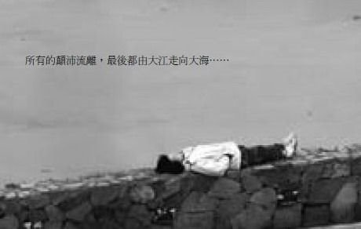
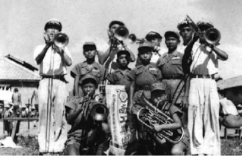
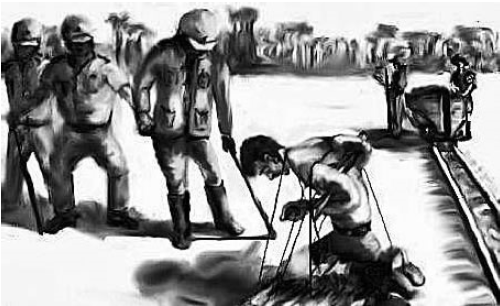
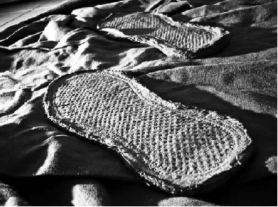

# ＜天权＞《大江大海一九四九》读书笔记

**一九四九，对于我们的兄弟姐妹来说，究竟意味着什么？在那样的年代，也许就一个念想，一个决定， 就带来另外完全不同的命运。追火车的女人，追火车的孩子，他们也许永远都互相看不见彼此。一些人眼中的“躲躲雨”，这一下就是六十年。谁的责任，国民党？ 共产党？还是我们的国家。可是太多太多的不公平，六十年来，连一声对不起都没有。**

# 《大江大海一九四九》读书笔记

## Joachimbene （上海海事大学）

我们的历史，总是那零星几个伟大领袖的历史。我们的历史，总是被一些人有意挑选，篡改的历史。历史，究竟本来是何等模样？埋藏在一将功成的背后的万骨谁又 会去诉说？还好，有龙应台，淌过大江大海，使一九四九年埋藏在中华民族身上的切肤之痛，慢慢地流淌在我们面前。 一九四九，对于我们的兄弟姐妹来说，究竟意味着什么？在那样的年代，也许就一个念想，一个决定，就带来另外完全不同的命运。追火车的女人，追火车的孩子， 他们也许永远都互相看不见彼此。一些人眼中的“躲躲雨”，这一下就是六十年。谁的责任，国民党？共产党？还是我们的国家。可是太多太多的不公平，六十年 来，连一声对不起都没有。 

对于发动的战争机器来说，战争机器在失败之前总是处于最疯狂的年代。中华大地上只要是男性，不管你多大，统统都有可能被国军抓壮丁。娃娃兵可以说是这个国 家一个畸形的玩笑，可是却又活生生发生在那样的年代。我永远记得书中的管管的老母亲，“老太太不能走路了，从梯田那边用屁股往下滑，碰到那个堑子，碰了以 后往下滑”。看到这里总是不由自主和管管一起哭泣，这才是那个年代真真切切的我们的母亲，看孩子最后一眼，受了多少的罪。把家里最好的东西给孩子，彼此都 知道这是最后一眼，却又奢望着战争结束能够重逢。多少中原的少年就这样和自己的父母生生分离，一面就是诀别，更多的少年甚至连一面都见不上。他们无处诉 说，绑架他们的是国家这个机器。家乡永远是心头的一个梦，异乡反而成了生长最久的地方。再回首，房屋也许在，也许不在，但是父母们，变成了一个个凸起的坟 头。“父母在，不远游”，而他们，这群被战争隔开的人们一走就是六十年。坟前一炷香，怎能满足得了他们的日思夜想。一九四九年，对于他们实在是太痛太痛。

国军收复台湾，对于台湾人民来说，究竟是沦陷还是解放？面对着日本苦心经营五十年之久的台湾，多少青春少年对于日本的认同很有可能超越对于中国的认同。对 于那些土生土长的当地人来说，中国更是一个陌生的字眼。也许，他们只是台湾人。解放以前的台湾人参加日军，解放之后的台湾人参加国军。不变的是军队，变的是山头已经换了大王旗。对于很多台湾青年来讲，军队只是一种职业，一种谋生的手段而已。 福尔摩沙的少年们，有的加入了日军的别动队，还有的成了战俘营的监管员。对于他们来说，日本反而是一个更加容易亲近的字眼，从日本在台湾招募军队的踊跃程 度就可以看出一些端倪。他们响应着那时的国家号召，一个又一个奋不顾身地走向了战场。如要凋谢，必做樱花。台湾是日本的台湾，就如同以前中国是满族的中国 一样。也许他们比日本军人仁慈，但是也逃脱不了被审判的命运。我无意为他们昭雪，错误就是错误。只是他们的错，到底是谁的责任，在大江大海之中，他们的错 只是他们不能改变的命运，在战争的机器中，每个人都是绝对的失败者。命运把他们扯向那座监狱，他们无能为力，只是按照命令日复一日做下去。对与不对已经不 重要了，遵从是唯一的字眼。大江大海中，浮沉的是那一代台湾人特有的辛酸。 

国军来了之后的台湾少年，有一些和他们的先辈们一样参了军，只不过他们的枪口此时对上了解放军。在那个物资贫乏的年代，战争无关信仰，有奶便是娘。被俘虏的国军，吃了顿饱饭，换上一身行头，调转枪口就变成了解放军。解放军就是以这种方式源源不断地补充着自己的兵源。而国民党那边，也是抓壮丁，抓壮丁，四面八方地抓壮丁。战争的交战双方都以这种不光彩的方式进行着。也许在交战之 中，很多枪口的方向对的就是自己的兄弟。支持朝鲜的志愿兵在书中也给我们这样一个答案。志愿兵，志愿兵，多少又是真真正正志愿兵呢。陈清山，吴阿吉们便是 以这种姿态重逢，阿美族的少年们战争结束后永远留在了大陆。流落在日本的台湾人，很多都回了故乡，流落在大陆的台湾人呢？故乡也和流落在台湾的大陆人一 样，永远是一个遥不可及的梦。一道铁幕在海峡两岸中慢慢垂下，横亘在他们之间的便是——国家。 掩盖在黄沙下的历史，真相究竟是如何书写。一九四九，对于现在的我们来说，时光已经无声无息地淌过了这么多年。一九四九，早已经成了一个极度陌生的字眼。 对于一九四九，我们的书本上是这么写的。国民党贪污腐败，民怨颇深。共产党公正廉明，百姓拥护。共产党所到之处，民众相迎，国民党兵败如山倒，溃不成军。 但是，历史往往被我们的教科书高度脸谱化了，要记住，历史从来都只是胜者的历史。有时候想想，历史真是开了一个很有趣的转弯。还是宋美龄女士一语点破梦魇：他们还没有尝到权力的滋味。 “女儿，我很冷……”我从来不相信佛家所云的心灵感应，但是我宁愿去相信这份来自水底的亲情联结。这是美君心里面抹不去的、海峡彼岸的父亲的悲鸣。出生于 现在的我们，很多人可能知道“千岛湖”，可是又有多少人了解淳安，一座埋藏在千岛湖下面的城市。现在当地的政府又动了一个开发水底千岛湖的旅游招牌，可是 当初为什么要把一座如此美丽的城市给淹没。背井离乡的淳安老少爷们，成了寄人篱下的异乡人，成了无立锥之地的野蛮人。掩藏在背后的“拆迁”历史，反倒永远 无人去与国家诉说。“一张柏树古式八仙桌只卖六角四分”，一些不愿搬走的老人被五花大绑出去，然后房子就在拆迁队手下变成废墟。历史总是让人与现实产生错 乱，这一幕在现在的中国也一幕幕上演。为了国家的项目，真的就要牺牲个人的幸福么？而国家创立这些项目为了什么？还不是为了个人的幸福。现实给了我们这个 悖论。我不知道，是否有人去调查流落异乡的淳安人可好，有人去调查三峡人可好？对于历史，那大言不惭的“开除球籍”的话还依旧在耳边回响，谁给你权力去为 所欲为？可惜，历史从来没有这种质问。 

教科书总是那样鲜明，我清楚地记得毛泽东这样描述长春围城——“关起门来打狗”。可是这些所谓的“狗”是谁，他们是我们的兄弟姐妹啊。我曾经有一个幻想， 让那些战争狂人跑到了个无人岛上去自己单挑解决战斗。国家大事，与老百姓何关？历史在这里开了一个天大的玩笑。长春围城，围的更多不是士兵，是长春的那些百姓们。在历史的教科书中，我们只看到歼敌多少多少，俘虏多少多少，可是民众的伤亡是多少多少呢？历史缄默了，或者视而不见。当时也许有这样或那样的考虑，放行的贫民之中也许会夹杂着士兵。就算是士兵又怎么了？放下武器，他们都是平民。何况他们都是我们的兄弟姐妹。长春围城的死亡人数总是让人不敢正视， 龙应台打了个对折也超过了南京大屠杀。我们对待自己的历史总是那么健忘。视而不见的死亡，这究竟要有多么残忍的心肠。想起三年人为灾害里面的同样的故事： “一个个乡村不允许外出去逃荒，整个整个乡村遂饿绝”，历史真的不忍细读。 “崇礼血案”对于绝大多数人来说闻之未闻，这也是一段被教科书掩盖掉的历史。我们知道日军的“南京大屠杀”、“旅顺大屠杀”，知道国军的“五卅惨案”，可 是解放军的屁股在战争中真的就干干净净么？一个不敢去反思自己错误的政党永远是不合格的政党。这段历史，教科书不说，龙应台给我们道了出来。基督教在共产 党眼里无疑是清朝人的辫子是非剪掉不可的。在一个几近于专制的国家里，谈宗教自由无疑是痴人说梦。在国军进攻崇礼时，崇礼人民鼎力相助。毕竟对于国军，崇 礼人民有一种天然的亲切感，蒋介石与宋美龄就是虔诚的基督徒。但是，很快崇礼又被解放军攻破了。崇礼人民为他们的选择付出了惨痛的代价，龙应台教授没有给我们一个具体的数字，但是悲恸之声不绝一定不会很少。杀一人等于杀全世界，错误就是错误。对于基督徒，中国现在的政党也是压制其发展。前几个月的事件永远 是基督徒里面的不可回绝之痛。请原谅我的卑鄙，也许在他们看来，基督是西方的神，反华势力一定在暗中操纵。如果有上帝，请保佑那些死去的崇礼人民，阿门。 “苏联红军击败满洲里百万日军”究竟意味着什么？是对我国抗战的无私相助，还是又一轮新的洗劫。历史的脸谱是这样书写，苏联是我们的老大哥，是帮助我们赶 跑侵略者的亲密战友。征服者？还是解放者？书中给了我们一个不忍看到的画面，苏联士兵大街上光天化日强奸一个女人。“多少人上过她，女孩突然变成了女人， 然后女人变成了尸体。”历史沉默了，才去虎豹，又迎豺狼。虎豹早已经不是虎豹，豺狼还是那头豺狼。管中窥豹，可见一斑，这样的军队，给满洲里人民带来的灾 难会少么？现在的长春街头依旧耸立着“红军英雄纪念碑”，在满洲的土地上犯下累累罪行的人真的有资格享受被祭拜的资格。我曾经写过这样一句诗：“如果/他 们真的/能步入天堂，那么/我情愿/头也不回的/走向地狱。”历史不忍亵渎，事实需要真相，红军还是红匪，那些倒下的长春人民说了才算。死去的满洲里市民 啊，你们的冤魂，还看得到么？ 

历史不忍细读，总是赚取我们的眼泪，请原谅我，在这里单独把书中的名字一一道来。因为他们的历史，才是我们真正意义上的历史，他们的命运，才是我们真正意 义上的命运。历史淌过一九四九，这是我们共同的国家，被时代所践踏、侮辱、伤害的人们，正是你们，用失败教导我们，什么才是真正值得追求的价值。 

（采编：安镜轩；责编：黄理罡）

