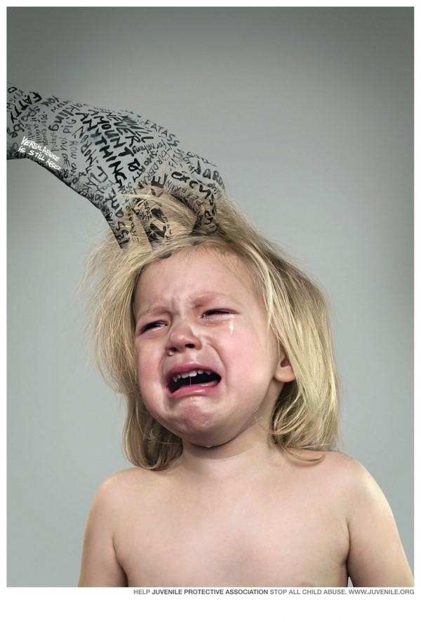

# ＜天权＞《女心理师》——比死更大的赌注是活着

**从柴绛香到贺顿，是一个传奇的故事，我不知道这个世界上有多少人还是这样为自己改了名字，改了命运。或者，他们也没有改变名字，也没有整容，什么都没做，但是他们的心变了。他们放弃了很多看似纯真但是实则脆弱的爱恋，他们不再固守那些虚幻的原则和底线，他们背弃了曾经的梦想，他们懂得了人生不是随遇而安而是强取豪夺。**

### 

### 

# 《女心理师》——比死更大的赌注是活着

### 

## 文/鲁雨洲（黑龙江大学）

### 

### 

心理咨询本身就是一个丰富和艰深的工作，它呈现了人世间很多灰色地带，也呈现了很多绝对的黑暗，人们的外表绝对是体面和光鲜的，但是内心却可能有无数蛆虫在吞噬着纯洁的灵魂。心理咨询师可以面对芸芸众生那简单又不简单的生活实质，看到了记忆、往事、波折、情感、性格、变故、玄机给人们带来的一系列痛苦和恐惧。心理咨询师是用自己的灵魂去医治他人的灵魂，同时要随时抵御自己内心的阴暗面和潜意识中的痛苦，不因为来访者的悲痛经历而让自己心潮翻滚。

《女心理师》的故事里有堕落了一次就得了艾滋病的二十多岁的男孩，有因为政治历史原因而产生极大罪恶感、而后从101个洋娃娃身上找安慰的老奶奶，有极其痴情的女同性恋者，有周旋于两个女人之间而极度内疚的政府官员，有在丈夫死之后才知道丈夫生前风流史的绝望的寡妇。每一个来访者都带着动人的故事来了，他们来寻求拯救和解脱，但是最终还是依靠自己。咨询师只是一条猎犬，随时i跟在咨询者身后，却万万不能代替来访者本人做出任何决定。人生是自己的，输赢和别人无关。

虽然书中描写的一些咨询故事比较落俗，而且有一些没有一针见血地指出了来访者心病的根源。我想这是因为这是一本小说，一部文学作品，而不是给心理学人士的专业读本。所以，它还是本着小说应有的曲折离奇和惊心动魄为原则，给读者呈现的是源于生活但是高于生活的艺术作品。如果是一本纯粹的案例分析集合，它就会无法更好地表达毕淑敏女士的思想和体会。

女心理师贺顿，原名是柴绛香。从柴绛香到贺顿，并不是一个简单的名字的转换。它承载了一个又丑又穷的女孩变成了一个独立的知识女性的艰难过程。柴绛香12岁的时候被继父强奸。那个禽兽不如的男人在自己的生殖器上涂满了清凉油，然后进入了这个12岁女童的身体。从此，柴绛香就患了一个毛病，下半身总是冰冷的。去看了很多家医院，都无法诊断。同时，她对性的态度也是不正常的。她不渴望性，但是她利用性。

说句刻薄一些的话，她的事业就是建立在她的性付出的基础上的。性对于她而言，不是目的，而是手段。她曾经为了推销化妆品，和一个五十多岁的老头睡了。后来，她为了能得到十万元的开心理诊所的启动资金，她和同事钱开逸睡觉；为了能得到房子开心理诊所，她嫁给了下岗工人且患有小儿麻痹的柏万福。

她不美丽，但是她肯放低自己的身体，她也可以把情感看得很廉价，所以她可以得到为她办事的男人。她赤手打天下，从不同的男人那里得到了房子、钱、学识。她把身上的一切资本都看得非常随便，非常开，觉得这些只有可以换来价值，它们才真的拥有价值。

贺顿，这个经历了贫穷、伤害、经历了举目无亲、走投无路、经历了堕落、做过了坏女人之后，她的理想却从没有低落下去。她的理想实在是太伟大了，她要医治别人，医治那些和她一样有痛苦心灵的人，她觉得自己的人生已经不堪重负，如果能从别人日渐明朗的生活中得到安慰，那么自己也算是不那样沉重了。

看看她的创业史，是一个女人对自己命运的最大颠覆。她步步为营，用尽心机，但是没人恨她。没人怪罪这个失去了底线也违背过道德的女人。因为如果明白人性的复杂，明白活着的不容易，明白了一个女人要想有尊严地活着，就是一件需要投入的事情。而后来，她为很多人造福，甚至在事业如日中天的时候放弃了心理诊所，选择继续深造。这样的女人，是有社会责任感的，是有人生使命感的。她背负着自己心灵的创伤，去医治更多创伤的心灵。她利用了一个又一个可以帮助自己的男人，一次次将良心暂时搁置。她也有自己的情爱，也有自己的幻想，但是她知道情爱无法给自己带来其他人生理想的实现，情爱无法让她成为真正有尊严的人，她放弃了情爱。

而后，她却在自己明白了生而为人的意义，拥有了真正立足于世的资本的时候，她却拥有了一份真正的情爱。她和丈夫柏万福产生了真正的依赖和感情。柏万福宽容了她的出轨，原谅了她的自私，因为柏万福明白她的爱不是男欢女爱的局限，也不是追求荣华富贵的虚荣。她的爱，是人性的成全，是救赎，是博爱，是寻找。我相信，他们的婚姻会展开另外一页。因为有一个真正宽容的男人，一个懂得爱的男人，也因为有一个真正的女性，一个知道自己需要什么的女人。

从柴绛香到贺顿，是一个传奇的故事，我不知道这个世界上有多少人还是这样为自己改了名字，改了命运。或者，他们也没有改变名字，也没有整容，什么都没做，但是他们的心变了。他们放弃了很多看似纯真但是实则脆弱的爱恋，他们不再固守那些虚幻的原则和底线，他们背弃了曾经的梦想，他们懂得了人生不是随遇而安而是强取豪夺。然后，他们就变了。他们进了一回地狱，甚至不止一回，只是为了到达天堂。他们不甘心做人间的平庸者，不甘心吃着的饭是平凡，过着的方式也是平凡，说着的话也是平凡，他们寻找意义，寻找对他人的意义。他们是死过一次的。

如果人生真的可以圆满，谁都愿意和青梅竹马的恋人，双双得到了有着优越物质生活的工作，得到无数祝福，没有走过弯路，没有过遗憾，然后生儿育女，让孩子明白父母一直以来的高贵和不俗，然后安详地老去。老了之后还是优雅和智慧。因为被幸福滋润很多的人生，是很难发霉的。直到完满地死去。如果人生真的可以圆满。我们就不会面临爱情和理想的原则，也不会面临成功和违背良心的选择，就不会面临一个个自我的丧失。在这个特殊的时候，我读到了这本小说。这并不是我读到的最好的小说，但是女主人公贺顿的经历让我无法平静。和她相比，我多了很多立足于世的资本。但是，我没有她那颗坚强的心灵，那颗将柔情扔掉的决心。不过我不知道，日后的人生会不会很艰辛，让我不得不选择同样的人生方式，才能完成我的人生。我也不知道，我心里时常暗含的那些冲动、那些颠覆、那些魔鬼般的心魔、那些不顾一切的疯狂，是否注定我也不可能一直这样过着平安的生活。

死是一瞬间的事情。虽然我们用很多瞬间来想过死。活着是一辈子的事情。虽然我们很少感受到“活”字的真正意义。

我们总是幻想幸福在以后，然后牺牲了今天的一次宁静和知足。

我们也总是幻想拿物换物，可是往往在交换的过程中一无所有。

我们读了别人沧桑的故事，然后泪眼婆娑地回忆起自己的沧桑。

而在想表达自己的时候，却往往容易哽咽住。

我依旧在寻找自己的道路，和曾经的贺顿一样。我有着一颗敏感的心灵，喜欢释放仁慈。我愿意和她一样帮助更多的人，但是在我没有立足社会之前我什么都不能做。希望时光快快流失，快快给我答案，不要让我在混乱复杂却荒芜的心灵里，沉寂下去。

### 

### 

（采编：安镜轩 责编：黄理罡）

### 

### 
