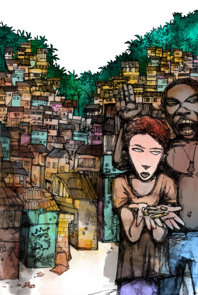
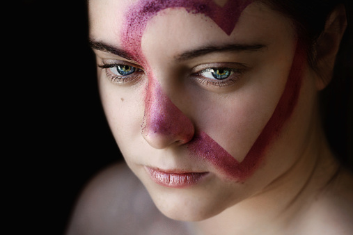

# ＜天权＞一个女孩，一部独立电影

**你给她一颗枯草，她对着它弹琴唱歌竟然她还你一盆绿意盎然。你给她一片沙漠，她用废弃物品创造了帐篷的温馨小屋。你给她一只三脚架，她在灿烂的笑容里带给你温暖的自信与阳光。爱笑的女孩运气不会太差，而有能力让自己笑的女孩，一定会是个传奇。不去做冗长连续剧的其中一集，剧情拖沓可有可无。每个女孩都应该是一部自导自演的独立电影，有个性有爱好有坚持，更有她那教人深深迷恋的独立之美。**  

# 一个女孩，一部独立电影

## 文/陈嘉倩（荷兰海牙大学）

 

**1.**

在巴塞罗那的时候认识了塔奇拉，四十多岁的中东女人，总是穿着素色的民族风长衫，配一条深色牛仔裤，脚上一双运动鞋。看似平凡简洁的家庭妇女，手里拎着的包也是没有牌子的，但其实每次出门都会有保镖和豪华私家车接送。后来才得知，她丈夫是巴基斯坦的使馆大使，多年来她和孩子们随着丈夫隔三差五地辗转旅居各地。

即便穿着传统衣服，在她身上，早已失却了中东妇女的特性，从她开口那一腔伦敦音英文便可窥探。

有次聊到了一个话题，“如果你可以重新选择，你想要怎样的生活？1.结婚，只生一个孩子 2.结婚，生很多 3. 结婚，不生孩子 4. 单身 5. 当个单亲妈妈”

当众多的友人在1和 2 之间徘徊时，她不假思索地说，我想当个单亲妈妈。

听到这个答案，我目瞪口呆。在伊斯兰宗教的熏陶下，中东妇女的社会地位根本不高，当我行走在土耳其叙利亚边境时候，大街上走的，基本上都是男人，寥寥无几出街的女人，也都裹得只剩下一对眼。至于路边大半的清真寺，更是只有男人可以入内。甚至有新闻报道，一个妇女被她的表叔强奸，结果那位妇女却被绞死了，罪行是她侮辱了家庭荣誉。

塔奇拉在众人沉默之中，严肃认真地说，“我可以用自己能力把孩子带大，过自由的生活，就算穷就算辛苦我也很快乐。”

**2.**

想起塔奇拉，不由感慨起上周发表的日志。一夜之间被收入了分享首页，点击全部评论，逐条看下来，洋洋洒洒四五千条，三分之一的人留言大半如此，“真是折腾，也真是够寂寞，找个男人不就省心了，还能省下单反和三脚架的钱。”“我也想要好看的照片，但是我在等一个会拍照的男朋友。”

并不是我的每次旅行都没有同伴，也并不是没有男友，恰恰相反，旅行同伴有摄影高手，男友是电影学院专业摆弄摄像头的。即便如此，我还是间或地享受一个人架起三脚架拍照的乐趣。

一个爱写字的人，但凡需要独处，好的作品是必须在心沉气定的状态下，文字缓缓流出的。人的成长，也需要独处。总是狐朋狗友寻欢作乐，未必能够在群众智慧中寻到生命真谛，像是X光般明了透彻自己。

当给自己摄影成为一种爱好，并且上升到寻找生活点滴之乐趣、探寻自己最独特的美处，同样是需要在独处时才能真正将它做好，做得精致。

一部单反，一个爱人，还有一颗说走就走的心。的确是浪漫之事，但生活固然不能成全所有人的任性。最美的青春年华恰恰一无所有，单反太过奢侈；爱人或许并不会摄影，拍出来的照片连构图都无，总不见得因此休了对方；不工作将来的爱巢没有着落，况且另一半或许是个技术宅男。

难不成男友的功能就是三脚架和拎包？

万一男友未必能提供这些功能，岂不是一辈子都无好看照片，更岂不是因此一辈子郁郁不乐？

  

**3.**

冯唐在《叫我如何不想她》中写道，“女人的魅力武库里有三把婉转温柔的刀。”分别是：面貌形容、权势、以及态度。但是“形容不如权势，权势不如态度。”“形容与权势不足持”，都不会长久，而落到最后，还是态度。“媚态入骨”的“态”，“气度销魂”的“度”，态度是性灵。

我常在想，爱情到最后，是什么让一切坚持的？换句话说，我们在时光流转之后，真正爱上对方的是什么？

美女满大街都是，身材如舒淇火的，脸如林青霞美的，声音如林志玲嗲的，大有人在，在闹市里一抓便是一大把。有个有权有钱的老爸，这样的千金不难找，往往在堵车时候，透过一辆辆奔驰宝马，可以看见玻璃窗内一个个头发柔顺发亮，低头玩弄苹果手机。

如果爱美女的，美女老后，又有何作为支撑的原动力？如果爱权力的，丈人垮台后，又怎能勉强度日？

冯唐的品女人一说，倒是让这个问题豁然开朗。

女人最有杀伤力的魅力，是在于她内在的性灵。能够在肉身老去，胸部下垂，家庭末路之时，她独特的个性仍然让男人为之疯狂。一个女人老去的只有容颜，而真正的美却会随着时间日渐浓烈。

而依赖，恰恰是无个性的体现。依赖男人才能存活，才能拍出好看照片，才能展露笑容，才能有心情打扮，才能对未来对人生对世界充满喜爱。如此依赖的女人，男人未必会真正爱上。或许是一时的怜惜，又或许是尚未遇到令其真正心动的人之前的预备罢了。

这个世界没有小三，只有容易被替代的无个性“悲情女主角”。

**4.**

我并不高大，身形瘦小，走出门和人打架必然吃亏，与人吵架之时说话却也并不犀利。

但我相信那一股强大来自于内心，每个女孩都可以是独立的。 这样的强大，可以在面对风风雨雨，甚至一切消失之后，她依然如一棵大树，让父母依靠，与男友齐肩战斗。纵使环境再差，遇人不淑，她依然有能力让自己快乐，并把快乐感染给在乎的人。

你给她一颗枯草，她对着它弹琴唱歌竟然她还你一盆绿意盎然。 你给她一片沙漠，她用废弃物品创造了帐篷的温馨小屋。 你给她一只三脚架，她在灿烂的笑容里带给你温暖的自信与阳光。

爱笑的女孩运气不会太差，而有能力让自己笑的女孩，一定会是个传奇。

不去做冗长连续剧的其中一集，剧情拖沓可有可无。每个女孩都应该是一部自导自演的独立电影，有个性有爱好有坚持，更有她那教人深深迷恋的独立之美。

扛起三脚架，背着相机，即使不是一个人在路上，爱人牵着我的手，我也保持一颗自由独立的心。

 

如有想法，可与作者交流。

微博： http://weibo.com/mejiaqian

博客：http://blog.sina.com.cn/mejiaqian

 

（采编：何凌昊；责编：尹桑）

 
