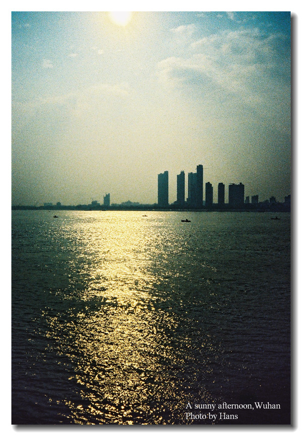

# ＜天权＞一个百年的纪念：这是我生于斯长于斯的武汉

**看到那些充满了历史的建筑也要遭到铁蹄无情的践踏，看到那些已经被评为优秀历史建筑的房子也难逃一劫，看到那些深深印刻在老武汉人心目中的地标们一个个要为新的城市建设让路，看到江汉路施工现场那个“拆出文明 拆出和谐”的令人哭笑不得的横幅，看到那些“不拆就对不起武汉人民 对不起历史”的堂而皇之的理由，我惊讶了，哀叹了，遗憾了，无奈了，几近落泪。**  

# 一个百年的纪念：

# 这是我生于斯长于斯的武汉

### 

## 文 / 廖汉斯（University of Michigan Ann Arbor ）

#### 

#### 

#### （一）

我总对别人说，我不算做一个合格的武汉人。不热衷于吃热干面，不怎么会说武汉话，不喜欢武汉的脏乱差。刚刚从北京回来的时候，的士司机听着我一口京腔，说：“这伢是北京的吧？”这么多年过去了，京腔早已荡然无存；对于京城的记忆也早已模糊。毕竟我是生于武汉，浸润了生命中十几年时光的地方，也是武汉。

父亲母亲都不是武汉人。他们来自湖北县城中那些美丽的小村庄或者是小镇，尤其是母亲的家乡，离武汉驱车只有两个多小时，是一个叫做洛阳店的小地方。春天的时候开满各种无名的野花和金黄的油菜花，秋天是满坡金黄的银杏叶和带刺儿的板栗。那儿民风淳朴，村民的笑容和皱纹都是阳光晒出来、溪水雕琢出来的。他们都有一颗善良的心。妈妈也是一个善良单纯的人，然而在武汉生活久了，她终于也开始学着用蹩脚的武汉话在菜场里和人讨价还价锱铢必较，甚至在大街上对着手机那头的天然气公司大发雷霆破口大骂，这总不禁让我思考，是不是武汉这炎热的夏天造就了这火爆的脾气。

#### 

#### （二）

武汉的天气恐怕让每个来武汉的人都叹为观止：人类怎么能在如此极端的天气里存活下来呢？我想学子们的感触尤其深刻：北方的学子来了发现冬天很有可能和北方一样寒冷，但却没有暖气；南方的学子来了发现夏天的温度比南方有过之而无不及，还多一份湿气。每年到了冬天极为寒冷、冻得人脑袋过分清醒的时候，我都在脑海中努力搜寻上一个夏天的种种迹象回忆；而到了夏天，坐在仿佛是桑拿房的房间里，看着柜子里挂的厚厚的羽绒服和呢子大衣，我都我都百思不得其解武汉何以有如此寒冷的季节，冷得冰冻三尺，甚至让我那身体硬朗的外公一病不起，终究没能熬过那个寒冬。而正是这样的天气仿佛就能勾勒出武汉人性格的一部分：一半海水，一半火焰，水与火缠缠绵绵地交融，风风火火，爱憎分明。今年武汉下了几场暴雨，给生活增添了许许多多的麻烦，然而看着那些网络上疯传的去武汉看海的相册，心里还是一笑：苦中作乐的精神，武汉人是一向有的。说不定大水淹到腿的一半了，该打的麻将还是要打，该啃的鸭脖子还是要啃，该玩的水还是要玩，该跳的东湖还是得跳。

曾有一个南宁的学子来了武大上学之后，对武汉百般嘲讽；他假期去了一趟上海之后更是感慨，上海才是真正的城市，武汉相比完全就是乡下了。也难怪，武汉素有“中国最大的县城之称”；最后这位无法与武汉相恋的同学终究是半路离开了武汉，去了他觉得更好的地方。我又忽然忆起那句不知道是谁说的“我们武汉这座小庙，供不起你们这些外地的大佛”。我的另一位北京的友人，偶尔与我流窜在武汉的大街小巷，有一天竟对我说，她爱上这个城市了，她明白这个城市是需要时间去沉淀、去品味的。那一瞬间我忽然觉得很感动。

这一样一个百味的武汉，也许就隐藏在那些大街小巷里，隐藏在汉口民众乐园背后的烧烤摊上，隐藏在不知是前进四路还是前进五路的打口碟店里，隐藏在美术馆门廊上石头柱子在夕阳中投射下的影子里，隐藏在早已荡然无存的精益眼镜店和四季美汤包的旧址里，还有那修葺一新遍地开花的户部巷，不知芝麻酱是变浓了还是淡了？古德寺的钟声和念经声，还是让人恍恍惚惚，如同有神在罢？感恩堂里的赞美诗唱了一遍又一遍，依旧是那些歌词和旋律吗？昙华林在胭脂路旁“大隐隐于市”了那许久，现在也渐渐崭露头角，吸引着许许多多追逐内心平静的人们罢？我最心仪的武汉长江大桥，依旧是稳稳妥妥伫立在江中，纵然被油轮撞了桥墩却纹丝不动，让人怀念起那个年代的单纯与美好罢？大桥上丝丝游人的心，在白日被武汉的骄阳烤化，在夜晚被江滩的霓虹照亮，望着滚滚桥下滚滚逝去的巧克力色的江水，那颗漂泊的心会不会想家了？江上的轮渡还在来来回回运行，斑驳的船儿在江中划出白色的浪花，吹着江风，会不会想到百年前汉口港口万般繁华，往后数年江滩边竖起异国风情的建筑种种，上面飘扬着英国德国法国美国日本俄罗斯的国旗，夸耀着它们自己的国家的同时却也见证了武汉的兴衰？武汉关钟塔的钟声，那个腔调响过多少春秋，我幼时住在江边听到那旋律和江上行船的汽笛声，“呜——呜——”，如今都还在吗？

#### 

#### （三）

如果没有了珞珈山，没有了东湖水，武汉恐怕也是要失色不少。于我而言，国立武汉大学是中国最美的大学，没有之一。有很多人眷恋武汉，有很大一部分原因是眷恋着武大。坐拥山水的大学，又有古老而辉煌的历史，诚然不多见；武大的气质又和武汉的整体气质不太相似，仿佛是辣婆子家里藏着一位灵韵的妹妹似的。许多人说，近些年武大衰落了，好在瘦死的骆驼比马大，回不到过去的辉煌，好歹还能以这个理由自我安慰一番。这美丽的珞珈校园里，故事不少；就连每年造成武昌交通瘫痪的樱花，也是大有来头，更不用说抗日战争期间，日本人也不忍心毁了这宝地，留着作他们的司令部；往后，又纷纷召开过一些会议，落脚过许多名人；时至今日，漫步于珞珈山的绿树之中，看着丛林掩映的十八栋，我还是禁不住幻想当年的光景；然而我却无法想象出个什么名堂。

珞珈山是一方净土，无论外面有多么肮脏和喧嚣，躲入山林之中心就静了。武大倒是很适合做一个“象牙塔似的大学”——这也是刘道玉老校长曾呼吁过的，中国也该多几所象牙塔似的大学。夜晚的时候，国立武汉大学的牌坊被灯光照亮；每每从家中归武大，在夜色中远远看到它，我心中总会响起旧时的校训：明诚弘毅。再登上樱花大道，抬头望望老斋舍，不知当年学子晨读之时，会不会也在那儿摇头晃脑悠悠地念叨着，“ 天地玄黄，宇宙洪荒，日月盈昃，辰宿列张……”

#### 

#### （四）

武汉，诚然让人又恨又爱。这感觉和谈恋爱有些相似：你爱上这么一个性格如火如水的女人，跟她在一起腻久了，突然有一天你觉得受不了她的脾气，想要离开；结果等你真正离开了，想念她的念头却从身子的每一个细胞里钻出来，你却说不出是具体为什么想。

按我说来，我是想念武汉这生活的气息的。在武汉十几年，我从未住过什么高档的小区；幼时住在江边的破房子里，听听江上行船的汽笛和钟楼的铛铛；其后搬了家住到现在，也是在市中心看上去似贫民窟的地方，到处都是破旧的工厂、垃圾堆，密密麻麻的违章建的高房子，永远都坑坑洼洼的路，门前没有公汽，也少有的士，附近没有大商场，然而有的是什么呢？菜场，小学，鸭脖子店，露天烧烤摊子，修鞋修拉链卖床帘，没有名气的蛋糕店，佬表汤馆，老社区，定做大号皮鞋的鞋店，小照相馆，做铝合金门窗的门面，还有一整条街全是卖菜的，还有一整条街全是卖碎布和纽扣的。我一个人在家的时候，早上起来穿得极其邋遢就出门了，拎一个大塑料袋子去那条卖菜的街买吃的；街上总是很脏，所以还得穿一双破鞋。在这种地方，菜不算是贵，生活也可以过得很滋润，而且没有必要衣着光鲜，自己给自己平添一份压力。虽然我知道，武汉现在高档的地方渐渐多了起来，有钱人也渐渐有了将钱大把大把花出去的地方；今天开了一条新步行街，明天开了一家XX天地，后天又一家高档会所剪彩了。看着武汉的生活水平和质量向着上海和北京看齐，也许我会很高兴，然而我印象中的武汉之所以是武汉，还是那份市井生活带给我的浓厚的活着的气息。

#### 

#### （五）

武汉，一个百年的纪念就要到了。

作为一个历史知识极其匮乏的人，我没有办法在脑海中勾勒出百年前的武汉到底是个什么光景；我只能通过旧时的明信片，一窥当年汉口何其繁华，租界的建筑何其宏伟，民族实业何其昌盛……这座城市曾经的盛况好像已经被历史的洪流掩埋，她的光辉黯淡了；直到这个百年的纪念到来之时，武汉这个响亮的名字才被又一次提上了舞台。为了这个纪念，政府拿出了大的手笔，于是现在的武汉千疮百孔，成了一个大工地——到处都在修缮，或是重新修建基础的交通设施；拆了又拆，挖了又挖，就连《纽约时报》的报导中都戏称武汉的市长为“Mr.Digging Around The City ”——眼看着洪山广场竟然消失了，眼看着江汉路那么熟悉的一块儿竟然消失了，我什么也不能做，我只能揣测这一切的一切结束以后，武汉会变得更好。前段时间武大一位文学院学长拍摄的纪录片《汉口 汉口》终于和我们见面了，我看了之后唏嘘不已，甚至在看到交通路那一段之时留下了热泪：作为一个武汉人，对于城市历史文化的消逝，怎能无动于衷呢？ 一同流泪的却也有外地的孩子。我们都在惋惜，然而也只能惋惜了罢？这武汉的这些年，消逝的东西还不够多吗？看完纪录片的那天，我写道：

在我还没有买相机的时候我就有一个愿望，那就是拿着一台单反把那些历史悠久的漂亮房子全都照下来，尤其是中山大道上那些汉协盛营造厂做的房子，然而到今天这个愿望一直没有付诸实践。看完文祥的纪录片之后，看到那些充满了历史的建筑也要遭到铁蹄无情的践踏，看到那些已经被评为优秀历史建筑的房子也难逃一劫，看到那些深深印刻在老武汉人心目中的地标们一个个要为新的城市建设让路，看到江汉路施工现场那个“拆出文明 拆出和谐”的令人哭笑不得的横幅，看到那些“不拆就对不起武汉人民 对不起历史”的堂而皇之的理由，我惊讶了，哀叹了，遗憾了，无奈了，几近落泪。如果我离开武汉几年再回来，武汉是不是就会变的认不出来了？我的愿望，如果现在不去做，是不是以后就无法实现了？是不是每一天都有历史在消失，不记录下来就再也看不到了？……回顾历史，这需要理由吗？反思当代，这需要理由吗？展望未来，这需要理由吗？将一个真实的武汉呈现在我们面前，这需要理由吗？等到年轻的孩子长大了，他们只能从照片和明信片上看到武汉曾经有那么多美丽动人的建筑，曾经有那么多辉煌的历史，而那些残存的历史，也许就如同汉口那栋俄国人建的巴公房子里的木头楼梯一样腐朽不堪、摇摇欲坠，说不定哪一天就湮灭在了历史的洪流里，连个气泡都未曾留下。

#### 

#### （六）

有无数次坐在公汽上，眼巴巴望着窗外的长江。车行驶在大桥或者是二桥上，有可能是一个早晨，我从汉口的家中赶往珞珈山，二桥底下一片芦苇滩，在春夏的时候绿油油一片，秋日冬日则如同漂浮着的大片白棉絮一般令人神往；有可能是盛夏的午后，暴雨之后的江水全都涨了起来，桥面被骄阳烤的冒了烟，远处的车流看起来被扭曲了，然而公汽里的空调开得正旺；有可能是一个江风吹拂的夜晚，我打开车窗，看着远处江滩边上各种建筑散出的霓虹和光束，在江水里倒映出斑斓的五彩；那些高楼大厦的轮廓，在夜晚勾勒出江城的轮廓；车缓缓驶过，从武昌到汉口，从汉口到武昌，来来往往；我出神望着窗外，那一瞬间忽然觉得，

武汉也很美。

#### 

汉斯，落笔于珞珈山

2011，夏

#### 

#### 

（采编：张韧刚 责编：黄理罡）
