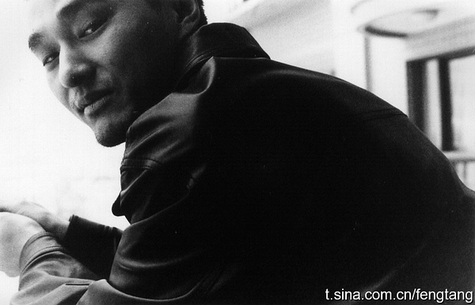
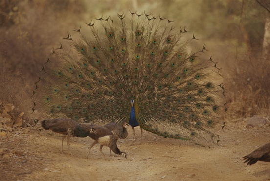
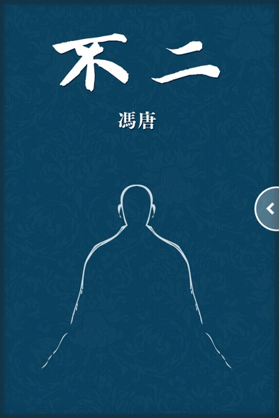

# ＜天权＞不朽的荷尔蒙：小论冯唐

**那“不朽”何在？其只能是一个假说，一种虚妄，无时无刻不提心吊胆地等待被终结，被打破，被嘲讽，被遗忘——而对不不朽的渴望与创造，却只能于当下进行：曹雪芹于北京西山红叶村“字字看来皆是血”时，能确定自己将会不朽？——这么说来，倒是爱因斯坦比较幸运了，毕竟相对于艺术，科学的发展可近似看做一部承前启后的进步史，后人总归是要借上前人的些许光照的，多少也要提及，乃至念念不忘，或偶尔忆起。由是，每个渴望不朽者，多少都会被心魔侵蚀，其眼下所做之事，无不着眼于未来能否延续，能否传递，能否记忆，能否不朽，然而，这又偏偏是自己绝难把握的。**  

# 不朽的荷尔蒙：小论冯唐

## 文/董泽宇（中国传媒大学）

 

**1.自恋的文艺青年**

去年年末的时候，李海鹏要发《晚来寂静》，许知远要发新版《那些忧伤的年轻人》，在北京单向街书店开了一个小见面会，当时我也去了。

一个记得比较清楚的细节是，有读者问二人怎么看待冯唐。李海鹏没回答，许知远则说，冯唐以及一些其他作家非常沉迷于自己的个人化书写，总是沉浸在一种浅薄的情绪中，简单地说，就是自恋。

我当时便觉得这个回答挺有意思的，李海鹏不答，是因为在写小说方面，他大体上也是冯唐那路子的——不妨看看《晚来寂静》，便知一二——具体风格不太一样罢了；而许知远，身为“公知”，肯定是要批判一下文艺青年这种“文艺腔”的。不晓得李海鹏坐在那儿听身边的许知远这么评价“一些其他作家”，心里怎么想。

冯唐自恋吗？在我看来，是的。

说起来，他的小说——除了《不二》，因为《不二》内地没出版，我不喜欢看电子书，也许以后去香港会买一本，想起来的话——我都看过，总的来说，有一种感觉，就是看着累。

累，首先因为没什么情节，或者说是情节不通畅。但凡看过冯唐小说的人大概都会同意，冯唐的小说不是传统意义上的靠矛盾解套和情节发展不断推进的小说，不过这也无妨，因为冯唐本来就不是靠情节出彩的，他一直在乎的，是自己的文字。

但是他的文字，却总给我纠缠不清之感，比如这段：

我的房间是一只杯子，屋里的书和窗外的江湖是杯子的雕饰。我的初恋是一颗石子，坐在我的椅子上，坐在我的杯子里。小雨不停，我的眼光是水，新书旧书散发出的气味是水，窗外小贩的叫卖声是水，屋里的灯光是水，屋外的天光是水，我的怀抱是水，我的初恋浸泡在我的杯子里，浸泡在我的水里。她一声不响，清冷孤寂而内心狂野，等待溶化，融化，熔化，仿佛一颗清冷孤寂而内心狂野的钻石，等待象一块普通木炭一样燃烧。这需要多少年啊？我想我的水没有温度，我的怀抱不够温暖。（ 《万物生长》 ）

这一段的上文是“我”请“我的初恋”到“我的房间”来，然后就插入了这么一段，下面是一段日常性的对话。

我觉得，单独对一段文本进行评判其实是没多大意义的，因为这玩意儿实在是说不清楚。比如上面这段，我觉得“纠缠不清”，没准有人就会拍腿大叫：妙！实在是妙！

而这，也是冯唐这类过分倚仗“文字”的作者最尴尬的地方——你所引以为豪的，往往便是最为另一些人诟病之处。

**2.肤白，摁倒就干**

但冯唐好像对此还很是不以为然，杂文集《猪与蝴蝶》里，他如是写道：

好文字仿佛好皮肤，一白遮百丑，即使眉眼身材一般，一点脑子都没有，还是有人忍不住想摸想看。

其实，这也是我开始阅读冯唐的初衷——那会儿我刚看完王小波全集，急于找一些同样优秀的新一点儿的大陆作家的东西看，有人给我推荐冯唐，说：文字很有劲儿。

不得不承认，初次阅读他的作品，的确会有“给劲儿”之感，类似这样的文句比比皆是：

让他绿得萎而不举、举而不硬、硬而不坚、坚而不久、久而不射、射而不能育。

生了女儿，藏了一坛子酒，等她破身的时候喝，叫女儿红。（ 《十八岁给我一个姑娘》 ）

但这种文字看多了，会开始慢慢疲乏，甚至感到厌倦——前面说了，冯唐的小说情节很弱，主要看点就在“文字”——回到冯唐自己的比喻，就相当于看到一个肤白的美女，然后拼了命的和她干，大干特干，干得昏天暗地都已无所谓，是是非非无法抉择，终于干到筋疲力尽气血不足兴致全无瘫软在床，突然发现自己和这白肤美人没什么话好说，顿时一股难以自抑的空虚感涌上心头。

所以，我仍承认文字是皮肤，一白遮三丑，但我会觉得，她只在一夜情的时候很管用——文字好的人短篇，散文，杂文会很占便宜。

但是长篇就不行了，长篇是结婚，不是一夜情，是要长久吸引力的，当然可以是白肤，但作用会越来越小，归根结底还是要“有趣”，就是要有故事，深刻当然也好，但就好像哲学家也不会和老婆一天到晚讲哲学一样，日常生活还是要有对对方“有趣”的地方。

当然，也有人喜欢纯粹文字很好的长篇，那种人就是外貌协会会长嘛，也没什么不好的。 但大多数人，还是喜欢能有内在吸引力，能让日子有说有笑过下去的伴侣吧。

况且“文字”这玩意儿，和“长相”一样，个人品味分歧太大，有人觉得冯唐写得鬼斧神工，就会有人觉得文艺腔斧凿太重。

其实，从一开始我就不是那么喜欢冯唐的小说，因为没什么情节，我喜欢看有情节的小说；而“文字”，我也没觉得好到哪去，但还是会看下去，有时候我也挺奇怪动力何来。后来我才知道，这动力源自于一种突破禁忌的隐秘快感——有多少人是冲着这一点去看《不二》的？请举手——很少有大陆畅销作家会这么写：

有人告诉我，挑老婆要用空可乐罐测试，如果一个女的能够非常准确地尿满一个空可乐罐而不洒，必是绝品。理由是，一定是窄屄。（ 《北京北京》 ）

我想，这是打开冯唐作品的第一把钥匙：荷尔蒙。

荷尔蒙，青春的象征。

**3.没完没了的荷尔蒙**

《十八岁给我一个姑娘》里，有这么一段：

你想，等你到了我这个岁数，你没准也会问自己，从小到大，这辈子，有没有遇见过那样一个姑娘，那脸蛋儿，那身段儿，那股劲儿，让你一定要硬，一定要上，一定要干了她？之后，哪怕小二儿被人剁了，镟成片儿，哪怕进局子，哪怕蹲号子。之前，一定要硬，一定要上，一定要干了她。这样的姑娘，才是你的绝代尤物。这街面上，一千个人里只有一个人会问这个问题，一千个问这个问题的人只有一个有肯定的答案，一千个有肯定答案的人只有一个最后干成了。这一个最后干成了人，干完之后忽然觉得真他妈的没劲儿，真是操蛋。但是你一定要努力去找，去干，这就是志气，就是理想，这就是牛逼。

说起来，当年我看到这段的时候，心里很是一震，像是又回到了阳光暧昧云雾缭绕——所谓“暧昧”，所谓“云雾”，只是记忆强加上去的戏剧化氛围罢了——的教室之中，半睡半醒地擦干卷子上的口水，盯着前位姑娘雪白的脖颈和红色短T下略微凸显的BRA背带发呆，心里恍恍惚惚地不知在想些什么。

可后来——用一句大俗话就是，“随着成长”——我慢慢开始失去对这一类文字的感知，更确切地说，是感到厌倦，“青春就像十里长街一样，让人倍感疲惫”。我开始觉得

自我只是一个迷宫，尽管我可以自说自话地在里面不断游走，假装精力充沛，但归根结底只是些徒劳无用的原地转圈罢了。我开始对外界的现象世界充满好奇与疑惑，我想要去了解他们，无论是通过读书，亦或是行路。

再后来，我看到了这么一段话，才知道可能许多人都是这么想的：

很久以来，青年时代对我来说是抒情时代，也就是说，在这个年龄段，个体几乎只关注自身，无法看到、理解、清醒地评判他周围的世界。如果从这一假设出发（当然，这一假设有简化之处，但作为一种简化的模式，我认为是正确的），从不成熟到成熟就是对抒情态度的超越。（ 米兰·昆德拉 《帷幕》 ）

当然，我会这么想，和我身上多少还残留着青春涌动的荷尔蒙有关。对我来说，这世界仍是希望，仍是可能，路并不太长，但剩下的也绝不算短，我还不用着急去面对某些根本性的难题。

诸如不朽。

不朽，打开冯唐作品的第二把钥匙。

**4.不朽：布尔乔亚的心病**

摊开冯唐的简历，如果不涉及写作的部分，很容易便会觉得他是一个典型的成功人士：协和医科大学博士，MBA，曾就职于麦肯锡，现任华润集团战略管理部总经理。

更八卦一些的细节是：在后海边上有自己的四合院，爱玩玉。

按一般人的揣度，作为一个中国人，混到这个份上，怎么着也该志得意满心满意足了，但不，冯唐不是，相反，甚至他还会很焦虑。他对柴静说：我永远不希望有一天我心安理得，觉得一切都平稳了，我情愿它永不沉默，它给我带来什么苦难都成，我希望它永远‘滋滋’地响，翻腾不休，就象火炭上的一滴糖。

这火炭上的糖翻腾到作品上，便是要“用文字打败时间”——这句话太有名了，得成很多人的QQ或是微博签名了吧——用冯唐自己的话说，就是，“我对自己的希望是做个长销作家而不是畅销作家。逛英文书店时，我常常按照作家姓氏的字母顺序找我要买的英文书，这些作家往往已经死去多年。我有个妄念，我希望，我死去多年之后，纸质书店不死，也有人这么在书店里寻找我”。

我想，冯唐大概是一直憋着一股劲儿，觉得自己文学上的才华——钱算什么？文字比钱更不朽——没能得到赏识。这劲儿，无论如何也挥之不去，赚上几百上千万，当什么总经理董事长，都不行，都平不了这股气儿，必须写作，必须被人承认，必须留下自己的东西，必须打败时间——“冯唐”的笔名，便已说明了这点：历史上的西汉冯唐便是个直到老年仍得不到朝廷重用的边缘人士，“冯唐易老，李广难封”是他，“持节云中，何日遣冯唐”也是他。

而对当代的这位冯唐来说，情况亦是如此：他得不到历史朝廷的重用，他是历史的边缘人物。

在我看来，这简直是布尔乔亚的心病：是的，我“成功”，然后呢？意义呢？

更为深入一些，这简直是现代性的一个鲜活事例。一方面，科学的发展让人认识到肉体上的所谓“长生不老”所谓“万寿无疆”的荒谬与不可能；另一方面，宗教的祛魅又让人很难真心实意地去相信一个完美无瑕的“彼岸世界”甚至寄望于其——尤其对许多无宗教信仰的中国布尔乔亚来说，更是如此——个人的一切奋斗乃至受难，在现象上直线向前不断推进的时间面前，犹如螳臂当车，完全无解，意义的消散由此而来。

而一旦认识到意义这玩意儿的最大悖论是其很大程度上将随着死亡而湮灭，便会很轻易地想去通过自身另一种形式的延续来保有意义的存在：物质上的，譬如一项发明；精神上的，譬如一部作品；物质与精神上的，譬如一个孩子。

的确有人可以达到这样的效果。我想，只要我们这个民族还存在，李白，苏轼，曹雪芹便会存在——尽管这存在很多时候是无可奈何的，充满着误解，恶意，与利用，不啻于一种鞭尸——只要人类还存在，牛顿，爱因斯坦便会存在。甚至某种意义上来说，对“不朽”的渴望——哪怕是一种狂妄，一种僭越——是人类这一被抛至时空之中的存在得以延续乃至“生发”些什么出来的原因之一：

艺术家的荣耀是所有荣耀中最可怕的，因为它隐含着不朽的概念。而这是一个可怕的陷阱，因为可笑的、狂妄的、认为可以在身后继续存在下去的自负，跟一个艺术家的正直与诚实是不可分割地联系在一起的。每一部带着真正的激情创作出来的小说，很自然地追求一种可持续的美学价值，也就是说，能够在它的作者去世后继续存在下去的价值。没有这一雄心而写作是一种犬儒主义。（ 米兰·昆德拉 《帷幕》 ）

然而，这其中又存在着一种二律背反般的悖论：

自我和革命梦想一样，是不能忍受结束的：它的动因就在于永远地超越一切称之为界限的东西和摧毁有可能以某种方式阻碍生存的一切。不朽，是自我的田园牧歌。（米兰·昆德拉 《不朽》 ）

这悖论体现在：不朽与否，必须通过历史来得以证明——若是套用卡尔·波普尔的说法，甚至是无法证明，只能“证伪”的：倘或人类社会发生了什么变故，五十年后，再无人记得曹雪芹，无人记得爱因斯坦，有没有这可能？概率上来说，是有可能的。那“不朽”何在？其只能是一个假说，一种虚妄，无时无刻不提心吊胆地等待被终结，被打破，被嘲讽，被遗忘——而对不不朽的渴望与创造，却只能于当下进行：曹雪芹于北京西山红叶村“字字看来皆是血”时，能确定自己将会不朽？——这么说来，倒是爱因斯坦比较幸运了，毕竟相对于艺术，科学的发展可近似看做一部承前启后的进步史，后人总归是要借上前人的些许光照的，多少也要提及，乃至念念不忘，或偶尔忆起。

由是，每个渴望不朽者，多少都会被心魔侵蚀，其眼下所做之事，无不着眼于未来能否延续，能否传递，能否记忆，能否不朽，然而，这又偏偏是自己绝难把握的。

因此，当我看到冯唐说“二百年后，说起汉语黄书，大家会说‘肉、金、不二’。在人生观、世界观、挑战汉语的极限上，《不二》超越了《肉蒲团》和《金瓶梅》”时，本能上就有一种排斥《不二》，不太想去阅读的感觉：他太想要不朽了，过犹不及，亢龙有悔。

相比之下，前不久刚被冯唐批评过的韩寒倒是——起码表现出来的是——挺放松：

这眼前的世界并不是你我想象的那样。你改变不了。我改变不了。我今年三十岁，没有你那么多的作品，你死去了，你的歌也许能被别人再唱五十年，一百年，我若死去了，我的文字也许只能被别人记得五年，十年。又也许更短。我也许比你长寿很多，又也许不能。说不定我会成为一个老顽童，说不定我忍受不了自己衰老。谁知道呢。

是啊，谁知道呢？天后王菲都在唱：没有什么能永垂不朽。

又或者，真正不朽的，是这个世界，这个宇宙，时空，物质，现象界，或者别的——突然想到了《人类消失后的世界》——而人，只有作为“人类”这一大写的“人”时，才有那么些不朽的可能。

“永垂不朽”刻在广场上的大理石上，对面的那个人，凝视着大理石，他也曾经想要不朽，但他失败了。他的失败，不是未能不朽——当然这谁也说不准，我说了，“不朽”只能证伪——而是未能以自己的姿态与背影不朽。事实上，任何人都无法掌握自己的不朽，因着永恒的不朽悖论。

因为不朽，总是在死后，在存在湮灭之后，才会发生。

不朽是永恒的诉讼。

所以，我不要身后的不朽，我要当下的自由。

虽然绝不可得，同时也隐藏着巨大的危险性。

 

（采编：何凌昊；责编：尹桑）

 
