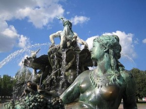

# ＜天权＞不重要的众神之夜

**我们在这个世界上出现过，我们留下了自己的痕迹，哪怕无人问津，我们也要把自己微不足道的力量燃烧殆尽，这才算背负了作为神的尊严。你明白么，孩子，这才是神的职责，我们神从不担心自己没有信徒，因为我们在这里就证明这世上有我们的信徒；我们神从不担心自己的存在有没有意义，因为存在就是我们唯一的意义。”**** **

 

# 不重要的众神之夜

## 文/李孟元（Yale University）

 

凡丁·马辛坐在铺满灰尘的吧台旁边，摆弄着手里的啤酒。这个地方明显是临时安排的，他闷闷不乐地想，从地板上的死老鼠到残破不全的玻璃窗都是。虽然理事会的人年年都抱怨入不敷出，但四年一次的聚会好歹也找个能落脚的地方才说得过去吧！

毕竟，我们是——

没等他想完这个茬，一位不知从哪个角落里杀出的老者就提溜着另一瓶还在冒泡的啤酒款款坐在了马辛旁边。老人身上的西装打着补丁，但熨得很平整，花白的眉毛又浓又认真，灰色的眼睛明亮而深邃，周围包裹着深不见底的皱纹。他看着满面愁云的年轻人，拍了拍他的肩膀。

“小伙子，怎么不去舞池里玩玩啊？”

马辛盯着老人一脸鼓励的神情，偏头看了看老人背后载歌载舞的人群，然后发出一声无奈的叹息。

“那也叫舞池么……你看地上的洞，还有那灯……我真搞不懂这帮人……还乐在其中的……”他举手示意着酒吧中央正跳得兴起的众人，然后压低了声音说道：“都不顾忌自己的身份么。”

老者本来举到一半的酒瓶停在了半空中。他的眉毛微微扬起，手里的酒瓶却徐徐落下。

“小伙子，你叫什么名字。”

马辛仿佛如梦初醒般，顿时在椅子上坐直起来。

“哦失敬失敬，我叫马辛，凡丁·马辛，敢问前辈的名讳是？”

“老头子我谈不上什么名讳，叫我潘就行了，英克·潘。”

马辛的表情顿时变得诚惶诚恐。

“潘先生！久仰大名，您在我们小字辈里可是口口相传的名人啊！荣幸之至荣幸之至，可是……”年轻人的脸上闪过一丝困惑，“您难道不该在马路对过儿的希尔顿酒店里跟……跟_那些_人在一起么？”

“哈哈哈，那都是陈年往事了。”老者嘴上笑着，眼睛却眨也不眨地盯着马辛。“小伙子，你是管什么的？”

马辛七分惭愧、三分自豪地吐了吐舌头，手伸到后脑勺抓了抓头皮。

“我……我是自动贩卖机之神。”

“哦？”老者露出了好奇的表情。“是在坎·苏打的部门工作？”

“哈，没错……不过我只是人家手底下打杂的而已，每天干的活儿就只有趁人类不注意的时候把自动贩卖机里的空位置填满，让他们总感觉那些机器里的东西取之不尽、用之不竭，除此之外也真没什么。坎·苏打是我的老上司，但这几年大红大紫的康特·赛普森也开始给我委派任务了，所以平时还算忙碌。”

老人哈哈大笑了几声。

“年轻人嘛，有事做总是好的！“

马辛听得很不是滋味。掌管避孕套的赛普森是个极难对付的神，不光爱对马辛指手画脚，还经常给他派一些让人摸着头脑的工作。不过老前辈肯说鼓励的话，自己无论如何还是得客套几句。

“您这可折杀我了，您管的那片儿才是无处不在，但凡有什么写写画画的事儿不都得看您的脸色么？听说您一毫秒做的工作就必须绕地球三十圈，那可真不是省心的活儿。”

老者不置可否地点点头，垂下目光，端起酒瓶往喉咙里灌了一口。

“以前是比较忙，最近……哈哈哈，最近倒嫌冷清了。自打麦克若·索芙特那个小妮子横空出世以来，老头子我的活儿就一日少过一日。过去谁人不用钢笔写字，大街小巷都是卖墨水的店铺。现在也就小部分附庸风雅的人类还好我这一口；这不，今年聚会之前我的存在感已经排不上一等神的位置了，于是就被分到了这边。”

老人轻描淡写地说完，微微一笑，又举瓶往嘴里倒了一咕隆。

马辛的嘴张得圆圆的，像看历史片儿一样心下忐忑地望着老人，支支吾吾了半天才说出话来。

“潘……潘先生，这也太不公平了。那些天天颐指气使的家伙，什么普林特·帕布莉卡森，什么吉福特卡德·康泊妮，不都是靠着您提携才有今天的么？”

“那也是人家自己在人类社会吃得开，才有今天这种地位。我就是帮人家提供点老掉牙的经验和物质支援，谈不上什么提携。”

“——可是，可是您贡献那么大，也不该跑到这种老鼠洞里面来受罪吧！“

马辛戏剧性地伸直双臂，摊开双手，示意整个酒吧都属于“老鼠洞”的描述范畴。

“小伙子，这有啥的？你别看马路对面歌舞升平、纸醉金迷，我一个过来人倒觉得那边比不上咱这儿。”老人像偷传机密一般凑近了马辛，“你以为他们玩得开心？一个一个都跟那儿互相算计呢。你别看地球上有六十五亿人，哪个神都不会嫌自己的存在感太多。一级神的位置就那么些，所有人打破了头皮往上挤，尔虞我诈，损人利己，一天到晚都是这种事儿。然后每隔四年被叫到一块儿还得笑脸相迎，口蜜腹剑，老头子我是没力气跟他们磕了！“

说到最后，老人的声音越大，等到全部说完，他抄起酒瓶，对准布满斑点的嘴唇一饮而尽。

马辛看在眼里，疼在心里。这个世界就是这么残酷，优胜劣汰的规则对神一样适用。他还记得当年掌管电报的特拉·格拉佛老前辈几乎是在一夜之间从呼风唤雨的人物变成了无人问津的古董，到如今只能徘徊在博物馆之间收集一点点屈指可数的存在感。但他从来没想过像潘老头这样，在他印象里一直不可或缺的神明也会有失宠的一天。

“那您现在……做些什么呢？”

老人放下空空如也的瓶子，看着马辛，两腮的法令纹昭示着慈祥的笑意。

“小伙子，你不用替我担心。老头子我虽然不中用了，但还是有事情做的。帮小娃娃们学习书法，往他们墨水瓶里加料，在他们父母书房里偶尔露一两手……做我一个垂暮之年的老神该做的事。而且你有所不知，其实在这边儿我也能看见不少旧相识——”

老人回身抬手，冲着舞池里一番指点。

“你看那个，浑身绿油油的老不死的，那是泊斯托·梅欧，邮政之神。还有那个，随声听之神，索尼·沃克曼。他旁边那个浓妆艳抹的老姐，梅尔·施佛利，从几百年前就是骑士风度之神，还有麦·斯贝斯……还有……”

马辛呆若木鸡地听着老人慷慨激昂地介绍，发现自己刚才鄙视了半天的那群人里有一大半都是耳熟能详的人物。蜂窝煤之神，卫生皂之神，学生头之神，干脆面之神……怎么会，人类真的如此喜新厌旧么？自己从出生起就仰望了十几年的这些老神，居然在这样一片肮脏不堪的酒吧里借着昏黄灯光像群魔一般乱舞，靠低廉的酒精和过期的食物找到存在的动力。他下巴无力地垂着，找不到想说的话。

“孩子，这不是一个适合神的年代。他们——”老人指了指窗外的街道和高楼“——变化得太快，好多像你一样的娃娃神还没学会走路就被新出生的给替代了，结果存在感积不起来，永远也长不大，而且他们不像老头子我这样混了个古董的身份，若没有别的神帮忙照料经常不明不白地就死了。我一个过时的东西，还能跟你这样的年轻人在一块儿喝酒，说老实话已经很满意了。”

老人露出了善意的笑容，手扶在年轻人颤抖的膝盖上，紧紧握住。

“孩子，你要明白一点，没有哪个神是长生不老的。不要说一级神，就连那些已经形而上化的宗教神也有陨落的时候。我们只要出生，就注定会来这个地方。马路对面沐浴着灯光和美酒的那些人现在看上去很美，但他们自己也知道，无论多么努力，多不想看到自己存在感流走的那一天，人类早晚还是会找到更好的替代品，而他们的位置也会在眨眼的功夫里被一声不吭地取代。但是你明白么，孩子，我们的存在不是徒劳的！这个世界少了我们当中的任何一个，就不再是这个世界了。我们在这个世界上出现过，我们留下了自己的痕迹，哪怕无人问津，我们也要把自己微不足道的力量燃烧殆尽，这才算背负了作为神的尊严。你明白么，孩子，这才是神的职责，我们神从不担心自己没有信徒，因为我们在这里就证明这世上有我们的信徒；我们神从不担心自己的存在有没有意义，因为存在就是我们唯一的意义。”

说完，老人拍了拍马辛的膝盖，从座位上起身，转头走回舞池中央的方向。凡丁·马辛看着他沧桑的背影渐行渐远，脸上不由自主地浮现出一丝笑容。他从口袋里掏出一把小面值的钞票和一堆几分几角的硬币，数出酒钱放在身旁的吧台上。凡丁·马辛悉心拾起余下的零钱，站起身，跟着老人步进了永恒。

 

（采编：孙梦予；责编： 徐海星）

 
