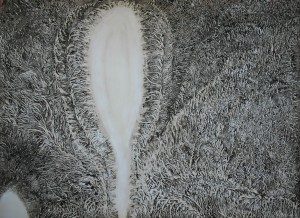

# ＜天权＞为什么批判“小资”

**说小资喜欢用流行的文艺，什么“新”的“后”的主义来标榜自己。这确实是一种文化消费的表现。学者可以批判文化成为消费，但是作为生活在这个时代环境下的人群来说，文化消费是一种需求，当物质成为生活的主导，精神信仰缺失，消退了古典的情趣，那么有更高追求的人只有不断地在消费中寻找和建立新意义和乐趣。**

# 为什么批判“小资”

## 文/ 宋桃子（华中科技大学）

 

最近看《文化麦当劳》和《文化街垒》两部文化批评的著作。其实我一直对文化批评不甚了解，在我看来，文化批评大致是对当下现实生活中出现的文化现象、文化作品和文化名人的一些反思和剖析。恰好我也时常也爱思考这种问题，于是企图从此二本书中窥探著名学者是如何条分缕析地论述及铺搭文章的。不料有些观点和话语实在是无法赞同，所以想把自己的想法表达出来。

我喜欢伍尔夫的文化评论，或许可以称之为文学评论。语言机警睿智，一语中的却不失偏颇。可以行云流水地将自己的思想和所述人物的思想在脉络上一语贯通，因为她对作者及其人其事其思想是相当理解的，所以才能代其言之所想言与所不能言。

由此，我想到伍尔夫在对待评论时的一番见解，她说我们看待一个作品时“不要向作者发号施令，而要设法变成作者自己，做他的合作者和伙伴，如果一开始就退缩不前持保留态度并且评头论足，你就是在阻止自己，不能从你所读的书中获得尽可能丰富的意蕴···然后我们把书与书比较，我们再不再是作者的朋友，而是他的裁判官，作为裁判官我们再严苛也不算过分···

伍尔夫给我的感觉就是一个自由的精灵，在文字从中跳跃，她善打比方，把整个自然界都融进她的文章中了，相反那些西方的术语，她几乎不用，但是这也没能将她的思想打折扣，她依然是二十世纪最伟大的现代作家之一。

所以，西方的学术或者说哲学术语并不是证明思想深度的唯一途径，理论书可以让我们学到很多颇有深度和见地的词语，把那种充满辩证色彩和丰富生命力的词语被拿进文本进行分析不是一件难事，但是有人却会挥霍这些词语，造成一种表面的深奥，却省略了最丰富的内涵。还有一个弊病是术语容易进入另一个语境，形成自圆其说的理论，然而局外者无法看清楚伪劣。

由于我不是专业人士，所以大片术语的评论文章我就略过了，挑了些大致能够读懂的，能用我的经验逻辑和常识判断的文章。《文化麦当劳》有明显的“海派”叙事的风格，提出了一些有意思的概念，例如《海子：从精神家园到精神病家园》，是现代意识的颠覆和反叛，而从传统的角度难以将这两者联系到一体。

《卫慧：肢体表演或者文字秀》一文中我不禁想为卫慧辩驳，文中先将卫慧贴上了“肢体写作”的标签，许多当代女性写作者似乎很少逃离这个荆棘冠，这一特指女性的批评词汇打上了男权的特质，在此不展开讨论。然后文化评论家不知不觉将批评时代和批判作家混为一体，我认为这是有失公允的。文中认为她用华丽的语言包裹膨胀的欲望满足文化消费者的需求。“卫慧精心挑选了这些时髦而有品位的词语构筑了一个‘高雅’的走廊。她对这些词语的挥霍，恰恰满足了附庸风雅者的需求···她选择内衣为文字载体，与其说有什么颠覆或女性意识，不如说是对文化消费的迎合。姓名在小说题目以及内衣上的凸现，具有典型的商标意识”。这里与其说是对卫慧的批判不如说是对这个时代的消费文化的批判，或许是对卫慧迎合这个时代的消费者的批判。

我认为这是这个时代的作家的特质，无可厚非。大多数作家都会了读者的阅读而写作，当然不排除有少数顺从自己的内心追求纯粹文学的信仰者，但是一部作品一旦被搬上了货架，它就是商品，作为商品它就会满足消费者需求。消费规则如此，一个生活于这个消费时代的作家不能扭转消费结构和方式，许多人说她是文化工业上一颗螺丝钉，但这种螺丝钉的地位不是她可以左右的。批评家可以批判这个时代，批判消费文化，但是不能让一个作家来承担文化商业所造成结果。

这种批判思维在傅雷对于张爱玲的批判那里就有了彰显，他认为张爱玲不应当在乱世之际尽写些男欢女爱，麻醉群众，不够积极。张只是战乱时代的无助的普通人，靠文字谋生而已。张是个作家，不是一个救世主，她有她的表达原则和方式，不必像其他激进作家一样喊革命后号。不是每一个作家都会像鲁迅先生那样写小说是为了整治国人的病根，这是高尚的，但是没有这样做的作家不能责怪她卑劣。

说到文化消费，总是容易和一个词联系起来——“小资”。他们就是那些受过完整教育有过一定阅读里的年轻人，“他们不愿意做一名不合时宜的思考着，他们倾心于放纵自己欲望的火焰，他们不能反省自己的处境，他们不愿意承认自己的肤浅和软弱，他们有需要获得承认”。《村上春树：情欲爆米花的哲理迷魂汤》中着重描述了一下“中国小资”，“他们又不可避免地感染上流行感冒一样的‘青春病’，这种青春病的主要症状是空虚、感伤、迷惘，它的高发地段往往是弥漫着现代性焦虑的都市。不论从时间还是空间上看，青春病都毫无疑问地成为小资们的集体病症”。

不知什么时候小资的出场就成了一个负面的词语，小资一出场，大家都唯恐避之不急，生怕惹上了瘟疫似的。这种印象恐怕是来源于批判小资的东西太多了吧。可是小资究竟是什么呢，没有来得及了解都已经躲得远远的了，怕被划成“小资份子” 。就我所知的小资，其文化起源地应该是法国，起源于众所周知的法国塞纳河左岸咖啡厅。那些游荡于都市有着精神自由却囊中羞涩的穷作家经常在咖啡厅集会、谈天，写作，阅读。于是这些形成了浓郁的左岸文化特质，这被认为是小资的滥觞。移植到中国，“小资”大概是指有较高文化修养的都市白领，在星巴克等一些优雅的环境里追求阅读快感等文化享受的群体。

这一群人在不知不觉中成为了众矢之的，成为了评论家张口就来的批判对象。一般都会说他们追求时尚和文字快感，缺乏思考和承受沉重的能力。王晓渔先生更为精辟地说“大多数具有中国特色的小资们，无非只是些穿着西装的文化民工”。这种正义凛然像是一种知识分子对于“伪知识分子”缺乏真实内涵的批判。

小资的生活式确实存在着许多弊病，过于陶醉于自我情绪，给人一种未发育完全的感觉，或许称之为“后青春期综合症”，缺乏成熟的公民的担当。但是这种批判我觉得还是有些过火。都市白领中爱好文艺的人，由于没有走上从事文化研究的道路，不能像评论家一样整日深入研究和思考。那么闲暇之余追求一下文化享受，可以慰藉劳绩于机械复制中的心灵。都市白领的生活压力迫在眉睫，那么文学艺术不可避免成为一种消遣读物，所以他们追求的是一种轻便和流行的阅读，也许是没有反思的能力，也许是没有反思的精力。总之其中有无奈之感。

说小资喜欢用流行的文艺，什么“新”的“后”的主义来标榜自己。这确实是一种文化消费的表现。学者可以批判文化成为消费，但是作为生活在这个时代环境下的人群来说，文化消费是一种需求，当物质成为生活的主导，精神信仰缺失，消退了古典的情趣，那么有更高追求的人只有不断地在消费中寻找和建立新意义和乐趣。

批判小资的浪潮中似乎透露着一种对于消费文化的恐惧和排斥。我想类似于这种批判是很容易的，就像用自己做得到的去批判人家没条件做的。这跟批判农民大叔整天盯着自己的一抹三分地有异曲同工之妙。

有市场的地方就有消费，市场对于我们有过长久农业文明历史的国家来说是近一两百年来的舶来客，那么当文化脱离了官方而遭遇市场时，新一轮的激战又开始了。

 

（采编自投稿邮箱；责编：陈锴）

 
