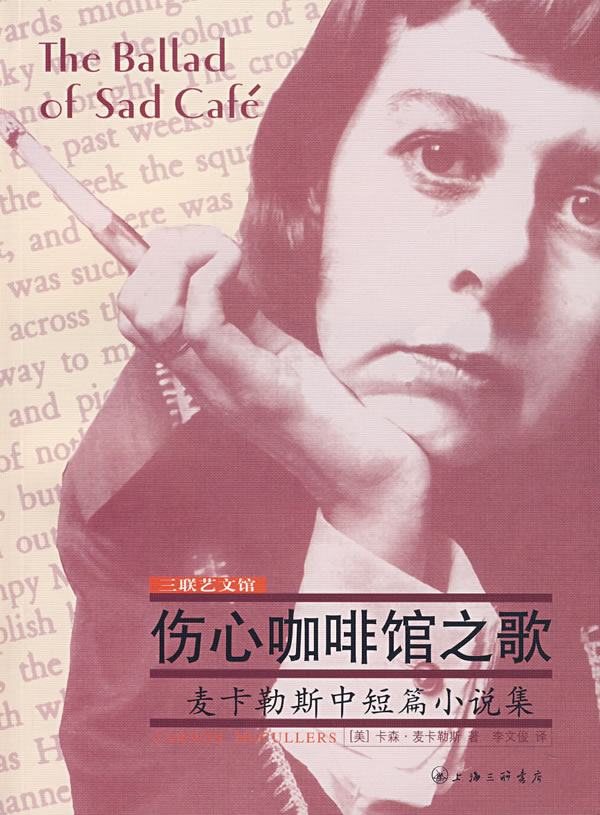

# ＜天权＞从《伤心咖啡馆之歌》中分析灵与肉的不可调和性

**男人通常追求肉体上的欢愉，而女人则大多希望精神上的寄托。比如一对爱侣，女人能接受的仅仅是精神上的爱慕，而男人偏偏想从女孩身上得到更多。猥琐下流的故事藉此产生。《伤心咖啡馆之歌》正是这样的故事。**

### 

### 

### 

# 从《伤心咖啡馆之歌》中分析灵与肉的不可调和性

### 

## 文/宁（天津科大）

### 

### 

殷时钞：

你好。

任何人的任何行动都非毫无理由。正像我们分开那么多年，高一的时候还是会翻墙为你带去小纸条一样，当时迷恋你的美色。那时的你情窦未开，嫩得流水儿，而且美貌配上小巧的身体，以及那种娇羞与冷艳（在我眼中现在仍是这样），堪称完美无瑕。因此十年后你让我看《伤心咖啡馆之歌》的时候，我认为这可能是正在变得肤浅至极的你的少数几样珍宝了。或许你从其中看到了什么但是你表达不出来，或许是你所需要的，或许是你所恐惧的，无论如何，总是你认可的。

### 

### 

可惜只找到《伤心咖啡馆之歌》一篇。开始以为是描述美国风土人情以及某种小资情调萧索故事。但不是我想的那样。《生命中不能承受之轻》的大概意思是：我们肉体上对性的需要很容易对付，精神上对爱的渴求却令人绝望。有时候我们寻找自己爱的人，有时候我们又被爱自己的人逮到。这居然也就是《伤心咖啡馆之歌》的内在意义。当然小说很偏心地强烈推荐了去爱别人。因为那不用去负任何责任。“爱情是发生在两个人之间的一种共同的经验”，作者首先定义了什么是爱情。

通常我们的初恋就能很明显地辨别出来，究竟是那个小伙子追求的哪个姑娘，而姑娘心一软羞涩地答应了。到后来发现与那个男孩沟通越累越困难——无论是言语上的还是精神上的。剩下的只有肉体上的交流，一次又一次的交合来加强精神上的联系。这份沉重压迫人类几百几千年，使人堕落。很遗憾我也未能逃脱。

** **

倘若男子或女子没有足够了解而走到一起，凭借的是所谓“爱的力量”或“性的力量”，就像金箔和铝箔仅仅用手揉搓在一起，无论多么用力，永远无法融合。但是真正意义上的完全适合的一对爱人在整个世界上根本不存在，因此往往产生两种情况：心灵抗拒而肉体渴望；肉体抗拒而心灵渴望。你属于哪一种？

接下来的问题就是，男人和女人想的是否一样。男人通常追求肉体上的欢愉，而女人则大多希望精神上的寄托。比如一对爱侣，女人能接受的仅仅是精神上的爱慕，而男人偏偏想从女孩身上得到更多。猥琐下流的故事藉此产生。《伤心咖啡馆之歌》正是这样的故事。如果男方恰好也是尊重精神寄托而不在乎肉体交合，那么问题迎刃而解。去爱别人，改变的是自己，所以对人类来说更容易一些。

这就上升到一个高一点的层次：爱别人和被别人爱。小说里写道：“几乎每一个都愿意充当恋爱者。道理非常简单，人们朦朦胧胧地感到，被人爱的这种处境，对于许多人来说，都是无法忍受的。被爱者惧怕而且憎恨爱者，这也是有充分理由的。因为爱者总是想把他的所爱者剥得连灵魂都裸露出来。爱者疯狂地渴求与被爱者发生任何一种可能的关系，纵使这种经验只能给他自身带来痛苦。”

主人公艾米利亚小姐是一个夹在两个男人之间的角色。马文·马西爱她的一切，为了她甚至可以修正自己的灵魂。艾米利亚本身没有任何需求，无论是精神上还是心灵上，宛若十年前的你。李蒙表哥则相反，他甚至没有什么爱，却正赶上艾米利亚情窦初开的大好时机。两端截然不同的爱情造就了两个截然不同的悲剧。幸福的生活大都相似，不幸的生活各有不同。追求美好，得到的是悲剧。

### 

### 

从很久之前我开始模仿宙斯，追求一切美的东西。某次机缘巧合中认识了可爱的你，而多年后又重新相见，发现你改变了不少。你从一个爱幻想的小女孩儿变成了一个因忙碌而没时间去幻想的女孩儿，将来还会变成一个毫无幻想的女人，嫁作他人妇，或者说经商从政好手段而引得无数人追捧的单身女人。但这些都无所谓。没有幻想力就什么都无所谓了。不知道是不是枯燥无味的高中和大学导致的。比如你现在尝试静下心来，拿出半天时间什么都不去忙活，或者临睡前构思一下要写点什么，看看还能不能写出让自己满意的东西呢？

努力改变自己，从一个弱小的男生转变成一个成熟稳重的男人，是我之前竭力想做到的。但近期来看，“成为一个成熟稳重的男人”，这个愿望本身幼稚而单纯，尤其自己面对的是一个物质的世界。现今的目标变成了“做一个顾家又能挣大钱的男人”。而接踵而来的现实又让我不得不思考灵魂和肉体上的朋友关系。这思考也使我几近陷入困境，挣扎不出去。究竟是灵魂听从肉体的安排，还是肉体服从灵魂的选择？欲望这种东西越想就越无法压抑。我的整个身体在这不断冲击的想法之下变得焦虑急躁，需要一个或几个女人从肉体和精神上的安慰。

### 

### 

这难免显得太“自我中心”了吧。可你说世界上的人类哪一个不是按照“自我中心”来生活的？哪个人宣誓自己是为了某个人而活？德国的康德说过，我们永远也无法确认一个物体是真实存在的，除非我们的内心认为它存在（大意）。或许做爱所产生的阵阵快感能使我们获得真实存在感？我没有做爱的对象，只能通过不断手淫和射精来确定自己存在？面对永远无法达到的调和，或许我们能做的就是在我们最娇艳的年龄去享受最幸福的乐趣。很明显，这是一种堕落思想。 

这就是关于《伤心咖啡馆之歌》的一点看法。你一定忘掉看这小说时的感觉了。我一次次地观察，丝毫看不出任何有新意的文章，着实令人沮丧。最近在德国还好吗？习惯新的生活新的环境，新的周围的朋友或是陌生人了？对于人生有了更高的追求了？希望你一切顺利。

### 

此致

敬礼

宁

2011年4月3日0:02:41

### 

### 

(采编：黄理罡 责编:黄理罡)

### 
