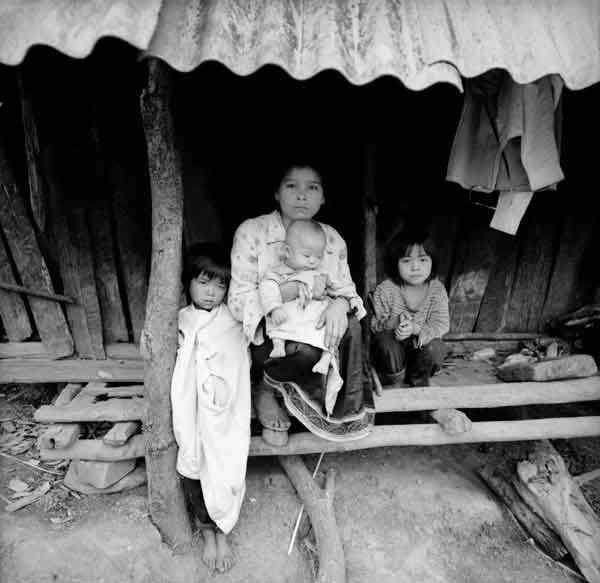
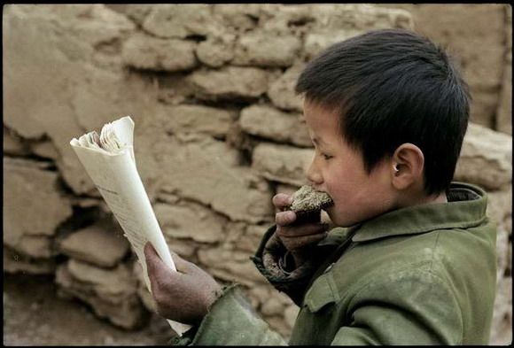

# ＜天权＞会宁往事

**卑微的个体与梦想，夹在时代轰隆旋转的巨大喧嚣之中。在他们把自己站成夕阳里一尊尊悲壮石像的时候，北京的孩子或许已出了几趟国，上海的孩子或许已用惯了电脑，更遥远的地方，美国的孩子在忙着组建自己的乐队，德国的孩子花整个下午踢足球。**  

# 会宁往事

## 文/曹高君（中国政法大学）

 

那年她十四岁。

被天灾与人祸折磨的土地上，颗粒无收已经不是新鲜的场景，更何况是连风都吹不起一线清凉的黄土高原。在一个缺失母亲的家庭，她是最小的女儿。她微微泛着土黄的卷曲头发紧紧的束成两束细细的麻花辫，顶着一张巴掌大的面黄肌瘦的脸，跟着长她约莫七八岁的姐姐，奔波在沟沟壑壑干涸的令人骇然的田野里。早上是为了挣工分，下午是为了挖草根。然而这块贫瘠的土地如同一位绝望而心碎的母亲，对着所有嗷嗷待哺的幼儿只能低垂了干瘪的乳房，除了苦涩的一无所有，还是一无所有的苦涩。

总是有人悄无声息地死于饥饿，如同她没能学会说话便离开世界的小弟与小妹。总是有人声嘶力竭地死于并不致命的病痛，如同她没看过一次医生没吃过一粒药的奶奶。贫穷像最不可言最不可破的魔障静静地笼罩在这遥远的山村。村里的大喇叭里很规律的播放着来自北京的革命宣言，大喇叭下的电线杆上拴着那只瘦骨嶙峋的老驴。某种程度上，大喇叭里的世界，对于这个村的意义，也不过如同对于那只老驴。

吃过草根，吃过草籽，吃过树叶，吃过树皮，甚至吃土。在这片土地连草根草籽都成为奢侈的时候，她需要跟着佝偻的父亲去乞讨。她不觉得羞赧，贫穷让自尊变成太过奢侈于是意义全失的幻影。然而所获无几，在一个人人都为生存而挣扎的小村，再善良的人都拿不出慷慨的勇气。

人们觉得活着就是福气，而死去甚至也不能说是倒霉。太正常了。

然而她却发疯一样地想要从命运吝啬的口袋里获取更多。

她说她想读书。

村里只有一个小学。一个班级塞着四个年级的学生。很多孩子没有纸，很多老师没有书。但是他们早上会大声地诵读，拿着一根根树枝在面目清晰的黄土地上勾勾画画。在几近坍塌的围墙外总是站着十四岁的她。只有在面对这些神秘而崇高的诵读时她的心就卑微得低到了泥土里。她知道那是另一个世界，是一个需要知识作为密码才能进入的世界，而想要去敲开那扇门，她需要从一贫如洗的家中，每个人空瘪的胃里，再掏出几颗救命的粮食，换取一块敲门的砖。她知道那是像痴人说梦一样遥不可及的事。更不要说她只是一个丫头。那个种地嫁人生子再种地的命，像是这老村的女人们与命运无声的契约，不得反悔。

然而她说她想读书。

十三岁那年她曾涕泪交流地跪倒在父亲面前，说她想读书。她承诺即使读书还会做一样多的农活，挣一样多的工分，一样操持家人的吃饭做饭。然而讷言的父亲阴沉着一张青黑色的脸，他没有钱。

于是一天又一天的，她就站在那段破落的学校围墙后，眼神痴迷地看着坐了一地的孩子们抑扬顿挫的诵读。

十四岁那年她请来了氏族里有威望的老者，她再次跪倒在老者与父亲的面前，她说她想读书。她一字不识的姐姐默默地站在她的一边，对父亲说，让她去读，她的工分我来挣，能撑过来的。

父亲在满堂老者的劝说声中默默地低了头。

十四岁，她没见过电灯，没见过电视，没坐过汽车，没吃过鱼。

但是她说那是她最幸福的一年。

那一年，她上了一年级。  

#### 二

那一年，她十四岁。

中考刚过，说大不大，说小不小。大人们总是板起脸孔各种恫吓，说这考试决定着你命里能不能上大学，而上大学决定着你这一辈子能不能有出息。她和所有十三四岁的孩子们一样一脸的茫然加一肚子的厌烦听着这些紧箍咒一样的训导，但该做的题不敢不做，该补的习不敢不补，该过的考试不敢不过。

考试前妈妈就总是唠叨，考完试，送你去会宁你姨家，让你看看人家那边的学生是怎么学习的！

于是那年夏天她到了妈妈的家乡，叫做会宁的小城。

对这小城，她毫无印象。她从小长大在爷爷奶奶身边，那个距离会宁也并不见得遥远的小城，却极其幸运地拥有一条黄河的支流。那个小村从来不缺绿色，那个小村的麦子们总是在夏天饱饱地弯着腰，那个小村的人们说着软软的“儿”字音，姑娘们都有一张张透着苹果红的小粉脸。

而对于妈妈长大的地方，除了从妈妈只言片语中得到些许贫瘠与干旱的印象，支愣在脑袋里的，不过是一个没有血肉的关键词：穷。

那年夏天她并不是被妈妈口中勤奋的会宁精神给吸引去的，她也不是被关键词“穷”给吸引去的，她是被在会宁中学里当老师兼图书馆馆长的姨父给吸引过去的。她简直无法想象能有一个听不到爸妈唠叨只有满园图书作伴的假期该能多么幸福。

但是刚下车她就觉到了自己如同异类。人们诧异甚至带几分鬼祟地看着她，一些在眉眼之间迅速流传的无声议论让她很有一阵不安。而来接她的姨妈一见到她就一阵惊骇：女孩子家，怎么能穿着个没袖子的裙子！她心里颇是一阵忿忿不平，对于这保守到有些迂腐的小城先就开始很有一点不屑起来。到了姨妈家，收拾停当口渴难忍，咕咚咕咚几口水下了肚，淡淡的咸涩固执的留在嘴里，她很不解的问姨妈，你们怎么给水里放盐呢，弄的这么苦！

表姐和姨妈哈哈大笑，说，娃儿，现在让你尝尝真真的苦日子，哪里是放了盐的，这就是我们喝的水！

她愣愣地端着水杯。她想起自己曾忿忿不平地抱怨邻居家的兰州姐姐太娇气，因为她总是嫌弃定西的水很苦。而如今端着会宁咸涩的水，她忽然意识到原来自己，自己的爸妈，姨夫姨娘，哥哥姐姐，还没有任何人尝到过真正干净的好水。

然而她很快便适应了水里那点微苦的咸涩，也一样适应了从陡峭的黄色断崖那里吹来的凌厉含沙的风。她跟在姨夫的身后疯狂地迷恋上了那个光线昏暗的图书馆，从吱呀作响的陈旧的书架上贪婪的搬着一部又一部大砖头回了家。在穿过校园的时候她还是能与许多十三四岁，十五六岁的目光相遇。他们飞快的羞涩的递来一两瞥目光，然后低下头消失在砖砌的教室背后。她再也没有穿那件无袖的连衣裙，但她想她身上实在还是有某种闲散与这个校园的气氛不符，否则明明就是学生打扮的她不会总是无端端有种无法融入的感受。她也一样偷偷打量着这些妈妈口中勤奋到如同自动上了发条般的同龄人。

姨妈家的厨房正面对着学生的宿舍，每到校园下课的铃响，她都蹭蹭窜到厨房里，看着窗外四处游走的学生们。这里鲜见时髦的服饰，在她的小城里已经时兴了几年的牛仔裤在这里还是少有人穿。大多数的孩子们都穿着好似明显大于他们年龄的衣服，很有一点满园小大人的滑稽感。这些虽与她的小城不同，并也并非天差地别。然而还有一些更加微小却迥然的区别，埋藏在这些年轻的脸庞深处。

他们的面孔有种令她陌生的成熟与沉重。即使是比她更小的孩子。傍晚五六点之间，是他们的晚饭时间。她清清楚楚地看着鱼儿一样的学生们从教室里游出，却没有涌向小卖部，没有涌向食堂。很多人自带着一个发黄的馒头，默默地寻到一个安静的角落，磨毛了边的布鞋在黄土操场上安静无声的来回，只有含着一口馒头的嘴还在含混不清地念着奇奇怪怪的古文或英文。夕阳好的时候，整个天空都笼罩着冶艳的一抹抹彩云，从断崖那边掠过成群成群带着剪刀尾巴的燕子，断崖下的伊斯兰教堂准时响起巨大如梦魇的诵经声，整个小城都笼罩在一层说不清道不明的宗教感中，肃穆不已。她常常瞠目结舌的看着夕阳在黄色的断崖上画下伤口一般的阴影，她总是听着古兰经的诵吟被某种悲伤压抑的莫名，脑海中瞬息万变的闪过古今中外诸多小说的情节。然而世界在她眼里已经斗转星移了好几回，楼下的学子们却只是静静的站成了一尊尊沉默的佛，以相同的姿势握着半个馍一本书，依旧念念有词。

她觉得他们与她似乎并无不同，却又有什么是那么的不同。

很多年后她回首看如血的夕阳里那些苦读的身影，她找到一个词去形容他们与她的不同：使命感。

他们孤独的倔强的单薄的身影里，全是使命感。被贫寒的父母倾其所有的付出所灌注的使命感，被恶劣的故乡环境所催生的使命感，被读书改变命运的渴望深深雕刻骨子里的使命感。那种使命感带着一点倔强，一点茫然，一点孤注一掷，全都砸在他们薄薄的书本里。每个字，每个词，每个题，都是一点扭转命运的希望所在。

卑微的个体与梦想，夹在时代轰隆旋转的巨大喧嚣之中。在他们把自己站成夕阳里一尊尊悲壮石像的时候，北京的孩子或许已出了几趟国，上海的孩子或许已用惯了电脑，更遥远的地方，美国的孩子在忙着组建自己的乐队，德国的孩子花整个下午踢足球。

那年她十四岁，她在下着雨的会宁夜晚，啃着契科夫川端康成的小说。她将近二十岁的表姐，在备战她第三次高考。

 

#### 三

十四岁第一次上学的妈妈一直都对我说，我不能理解你们这代人，能有机会读到那么多的书，但是没有一个愿意好好读。

我一直都记得那年会宁的夏天，低飞的燕子和如血的夕阳，古兰经里满操场吟咏着的学子。

因为一篇关于会宁教育的文章《读书输掉命运：甘肃会宁的疯狂教育样本》，忽然想起生命里与这小城相关的那些片段。那个夏天，我散步，游玩，读小说，每天画画，在那个古朴的小城里把自己幻想成一个游吟的诗人，对于那个小城的悲伤与赌博，我知之甚少。我不知道操场上所有那些苦读的孩子，如今是否都有了与他们的努力相匹配的生活。我也不知那些鱼跃龙门终于用读书逃离了小城的人们，他们会不会还愿回首那些夕阳如血的夏天。

十四岁的时候做梦都没有想过自己二十四岁时会登上飞往欧洲的飞机。即使我有诸多的倦怠与怀疑，但眼下所收获的所有，却真真都是一路读书，一路考试所换取。有人在文章下探讨素质教育的可能，有人在文章下痛斥体制之积弊。然而当我想起高中时候，校园附近廉价的租房里挤满的陪读妈妈，她们不识一字的眼睛里全是隐忍的，却熊熊燃烧着的期待。为那一场考试，她们赌上的不只是金钱，还有半生的自尊与希望。

让人如何对着她们的眼睛，告诉她们高考的荒唐与无奈？体制的无理与滑稽？

 

#### 四

几天前我走过了阿尔卑斯山脉。从雪山奔流而下的泉水清洌洌地划过了秋天斑斓的草原。我贪婪的用手掬起一捧一捧的水送进嘴里，我说，这水真甜。一旁也在喝水的德国人诧异地笑了，他说，我可真尝不出它甜啊。

我说，因为你没有尝过苦涩的水。

谨以此甘甜的清泉，遥祝我干涸的家乡：

愿有梦的人，都寻到属于他的那一口甘甜。 

 

（采编：麦静；责编：麦静）

 
