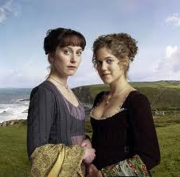
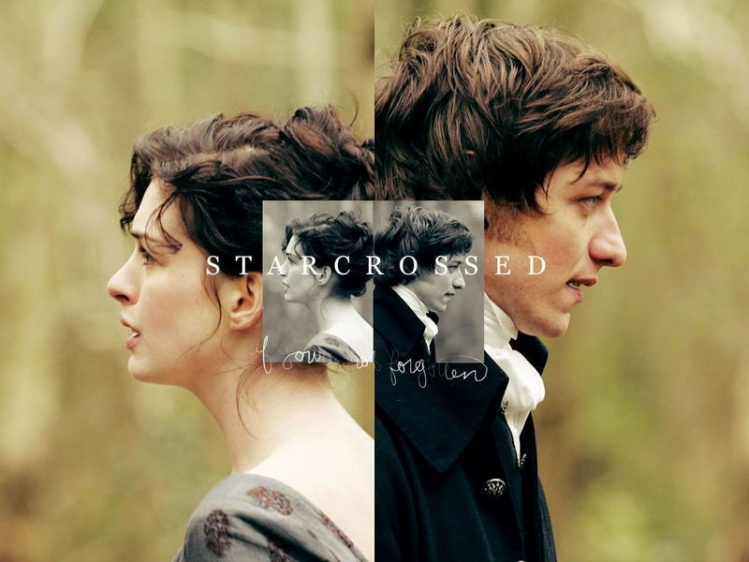

# ＜天权＞作为保守主义者的简·奥斯丁

**然而，如果我们同意小说的结局能决定小说的主题思想，奥斯丁小说的结局就成为女性主义批评中惨不忍睹的一环。为什么这些姑娘最后都归顺了男权话语？“坏姑娘”的丈夫都是一些对她们进行说教的人，她们最后都用丈夫的观点代替了自己的观点。奥斯丁小说的结婚最被大众所喜闻乐见，然而却在学院批评中被认为是“无可救药的”。**

### 

### 

# 作为保守主义者的简·奥斯丁

### 

## 文/ E姑娘（中国人民大学）

### 

### 

人们对于简·奥斯丁的最大误解就是人们对她的普遍共识。 通俗文化的欢喜呼声把简·奥斯丁推崇为言情小说教母。在过去的30年来，奥斯丁小说被轮番改编成电影、电视剧。她最受欢迎的作品《傲慢与偏见》拥有超过十部影视改编版，著名的如1940年电影（劳伦斯·奥利弗）、2005年电影（凯拉·奈特利）、1980年电视剧、1995年电视剧、美国犹他州女大学生版、印度宝莱坞版和英国单身女记者版，数之不尽。 绝大多数影视改编本把奥斯丁小说诠释为言情喜剧——美貌聪明的女主角和英俊多金的男主角如何从相识到结婚。很难说是影视作品决定了主流观众的口味，还是主流读者对小说的解读决定了影视作品的叙事框架。普通读者，尤其是年轻的女读者，是如此地迷恋奥斯丁小说中的幽默感和恋爱题材。他们很少想到一个问题：为什么奥斯丁小说能成为学院级别的名著？这些小说中的哪些内容，能吸引大学校园里一众老女人们和少数几个老男人们，几十年如一日地研究来研究去？ 细心、严肃和忠实的奥斯丁迷们应该开始接触简·奥斯丁小说的另一面了——或许可以称之为阴暗面。奥斯丁小说充满阶级性，世故、虚荣而且势利。关于奥斯丁小说的严肃文学研究足以将她扯下言情教母的高台。 文学批评家玛丽莲·巴特勒把简·奥斯丁形容为一个保守主义者，称她是“反雅各宾的”，指出她的小说均有浓厚但微妙的说教意味。她六本小说的女主角可以被分为两类——好姑娘和坏姑娘。坏姑娘（《傲慢与偏见》的伊丽莎白，《爱玛》的爱玛，《诺桑觉寺》的凯瑟琳）在小说开场时活泼、机灵、不可一世，随着情节的发展她们总要被（往往是男主角）证明是错误的——她们意识到自己视域狭窄，未能分辨黑白，不懂带眼识人。在小说的结尾，她们会嫁给一个更为靠谱的男人，她们也将改正错误，学会稳重地待人接物。而好姑娘（《理智与情感》的埃莉诺；《曼斯菲尔德庄园》的范妮；《劝导》安妮）在小说的一开场就明白这些；她们会矫正他人的行为，并且最终因为自己的正直而获得爱情。 

 用马克思主义文艺理论最能简单清楚地解释奥斯丁的保守性。《傲慢与偏见》发生在资本主义上升期的英格兰乡村。贵族、地主和佃农的对立，逐渐要被资产阶级的出现所打破。达西先生和宾利先生有一个常常被读者忽视的巨大区别：达西先生属于封建旧地主，他家拥有半个德比郡的地产，而宾利先生来自一个刚刚获得商业财富的资本主义式的家庭，置购内瑟菲尔德庄园等房产是他巩固自身地位（将金钱转化为地产）的尝试。 在奥斯丁小说中，做生意发家的角色并不高贵。简·奥斯丁总是描述宾利家的人不愿意提及自己的钱财从何而来，抑或住在伦敦商业区的加德纳夫妇被人们看不起。而且，读者可以发现，在讨论一位男性角色的身家时，奥斯丁对土地、房屋比对金钱数目更为敏感。奥斯丁本人对于欧洲传统的封建形态显然更为明晰，而对资本主义持保守观望态度。 用新历史主义批评的老生常谈说来，在《傲慢与偏见》中，伊丽莎白本来具备一种“颠覆”气质。伊丽莎白·贝内特出身于中产乡绅家庭，她的亲戚也并非都十分体面。然而她并不对贵族阶级抱有彻底崇拜；她觉得如果达西先生或德布尔夫人傲慢无礼，那她便大可以鄙视他们。面对德布尔夫人的恐吓时，伊丽莎白声称“我父亲是个绅士，达西先生也是个绅士”——考虑到贝内特先生和达西在阶级上的巨大差别，这句经典台词的含义是“成为绅士不靠出身而靠品行”，也即社会为个人提供精英流动的可能性，而非封建世袭制的一切均以出身定论。对于像柯林斯先生那样卑躬屈膝的人物，简·奥斯丁并不看好。 这是《傲慢与偏见》最具革命性的部分，然而这一萌芽始终未能成为小说的主导。伊丽莎白是一个“坏姑娘”——“颠覆”之后是“制服”——威克姆被证明是坏人，达西先生才是忍辱负重者。伊丽莎白不得不承认错误，不得不承认傲慢贵族其实拥有某种真正的崇高。在小说的结尾，当伊丽莎白成为达西太太，她很难再继续当她的中产革命家，因为她已经被封建旧贵族所收服。我们不难预料，她会逐渐开始行使德布尔夫人原本拥有的某些社会职责，譬如考虑如何花费德比郡佃农上交的租金，诸如此类。伊丽莎白即使还拥有她的机灵和女性智慧，也无法完全打破贵族夫人的定义——事实上，我怀疑，在她看见彭伯利庄园的广袤土地和气派建筑时，她就已经不再试图革命了。 值得注意的是，具备这种颠覆气质的除了伊丽莎白之外还有反派角色乔治·威克姆。威克姆试图谋求比他的阶级更高的人和事，在一个保守主义者的叙事中这样的尝试必然失败。事实上，读过查尔斯·狄更斯的代表作《远大前程》的读者不难发现，威克姆和皮普有很多相似之处。奥斯丁对威克姆不留情面，然而狄更斯对皮普的欲望（贵族阶级的女性、更高的社会地位、更多的收入）表示理解，也对他的遭遇（帮助罪犯、违反法律、事业无成）深感同情。维多利亚时代的狄更斯显然比五十年前的简·奥斯丁更为前卫。尽管奥斯丁晚于英国小说的创始人菲尔丁、迪福、理查森，但就连迪福的《鲁滨逊漂流记》甚至都比奥斯丁小说更具新时代的色彩。 当然，奥斯丁小说的主题始终不是威克姆的事业，而是女性角色的婚嫁。奥斯丁的阶级势利也体现婚嫁主题上。在《爱玛》中，爱玛·伍德豪斯这个“坏姑娘”一度认为孤儿哈莉特可以跟体面人家的男性般配，但她最后被男主角奈特利所“矫正”，痛改前非般意识到哈莉特的出身只能配得上一个富农。在《傲慢与偏见》中，夏洛特·卢卡斯嫁给了一个糟糕透顶但可以维持体面生活的男人，尽管这并非正面情节，但奥斯丁竟然从未对卢卡斯有过真正的指责或惩罚。读者并未被她引导向厌恶夏洛特；读者厌恶的是小妹莉迪亚，她和一个没有财产的男人私奔，哪怕她其实是真的喜欢他。 在《劝导》中，安妮·艾略特喜欢上一个一文不名的男人，后在亲友的规劝之下离开了他。多年后此人衣锦还乡，和安妮重归于好。女性读者应该避免把奥斯丁的恋爱经验解读为：当一个男人一文不名时你便有理由甩了他，你大可以等到他衣锦还乡之后再投怀送抱，诸如此类。 

 除了马克思主义文艺评论意外，奥斯丁小说也是女性主义批评的战场。她的女主角具有很多讨人喜欢之处，不论是“好姑娘”的温柔坚定还是“坏姑娘”的反叛精神，都很容易让读者意识到女性独立的重要性。稍微有一些女性主义想法的读者也很容易喜欢上伊丽莎白·贝内特和爱玛·伍德豪斯。 然而，如果我们同意小说的结局能决定小说的主题思想，奥斯丁小说的结局就成为女性主义批评中惨不忍睹的一环。为什么这些姑娘最后都归顺了男权话语？“坏姑娘”的丈夫都是一些对她们进行说教的人，她们最后都用丈夫的观点代替了自己的观点。奥斯丁小说的结婚最被大众所喜闻乐见，然而却在学院批评中被认为是“无可救药的”。 这是女性主义批评的主流观点。但是仍有批评者认为，必须考虑当时的社会环境以及女性的卑微地位。嫁给封建旧贵族在一定程度上也是好事。譬如，我们可以想象达西夫人必定具有某种社会影响力，而贝内特夫人顶多只能抱怨她的五个女儿而已。 然而这并不是否定奥斯丁小说的价值。她是英国文学史上最早开始专门关注女性的独立性和命运的作家中最成功的一个。她在乡村几户人家的婚嫁题材中所容纳的社会话题历久弥新，值得反复品读。作为小说家，奥斯丁同时具有幽默感和道德说教性，其技法四两拨千斤，被后世作家反复效仿。最重要的是，我们常说，一个好作家应该是既“高”又“低”的，应该同时具备严肃文学批评和通俗阅读的意义。 对于迷恋达西先生的诸多女读者来说，理解嫁给达西先生这一概念的种种阴暗之处，倒是有利无害。但大众的欢喜呼声究竟在多大程度上愿意接受象牙塔里的埋怨？这仿佛又回到了那个让我们感觉曙光暗淡的话题： 文学批评的意义，仅在文学批评家的身上最为重要而已。“普通读者”何求分一杯羹。 

### 

### 

（采编自投稿邮箱 责编：陈锴）

### 

### 
