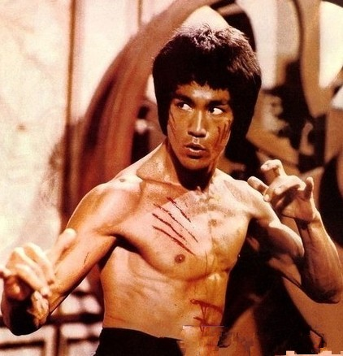
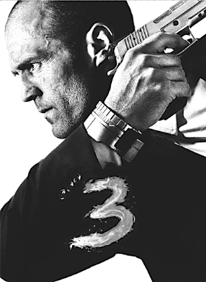

# ＜天权＞保安

**我时常需要在这傻逼世界中探出头换换气，却不敢将鳃长久暴露于寒冷稀薄的空气中。这时我总会怀念起那个半睡半醒慢悠悠的人。早忘了自己啥时候开始认定这个世界很傻逼，但好像已经不重要了。身边做生意的朋友信这信那，假意真心，嫖情赌义，推排江湖，不这样做便似愧对了这个时代，愧对人身。小常如果活在这里，又会跳支怎样的舞？**  

# 保安

## 文/黄金颊

 

 **1、混吃等死**

当一个男人身无一技之长，又懒，或者刚到一个新的城市、刚失掉上一份工作，对未来暂无规划的话，他可以去当保安。校南门站岗的老郑就是从食堂洗碗工跳槽过来的，工资降到一半，换个不累。三十来岁的人，安时处顺起来很可爱。

我在高中老师拿我撒野的时候往他脸上甩回了一巴掌，淡然跟父亲说我不念了，我自己出去闯。一周后在社会哥轻蔑的目光下落荒而逃，认定自己胆量不够吃江湖饭。在建筑工地干了三天后开始了持久不愈的腰疼，父亲说跟你表叔混饭去吧。表叔是大学保卫科科长。

这个城市治安环境良好，地痞最多去收校旁小吃摊的保护费，真牛逼的官二代富二代不会来上这二流学校，车里藏刀子棍子还拿出来张显的事情并不常发生。虽然学校在本市上有“鸡窝”的美誉，私家车只是在夜里款款开到女生宿舍楼下，与我们自是井水不犯河水。学生上山（学校依山而建）见网友被奸杀，下海游泳淹死，甚或玩轮滑摔死，都不关我们事，只劳我表叔每年对新生做次例行安全教育。开水房出现露阴癖，我们躲在暗处等待缉拿，就算是最让人兴奋的事了。

做保安根本别指望攒钱，所以大家更倾向于活得潇洒些，可毕竟潇洒不到哪去。宿舍里充斥着橡胶乳房、杂志海报，连食堂看门大爷都会一脸贱笑来求我帮忙往MP4里拷片。偶尔喝高了看开了来状态了，又恰逢兜里有两百块闲钱，我们会坐345路公交，过七站下车，不久后挎着个二十到三十脂粉气浓重的姑娘走进一个暗黑阴湿筒子楼，若干分钟后懊悔着出来，到街对面坐七站回去。

保安都是很讲义气的，因为没什么别的好讲。讲义气的方式具体表现为今天你出菜钱我出酒钱，明天你出酒钱我出菜钱。食堂的菜不放油，我们更喜欢吃小摊上稀奇古怪天南海北的名吃，地沟油香。卖河北大饼的是一对母子，儿子半脸雀斑一头黄毛，兜唇厚眼皮，每天都要向买饼的几个大学生仰着脸很认真地的说自己很瞧不起大学生，因为他们每天都在玩。自己高中时物理学得极好，若非没钱供大学，一定会成为科学家。那几个爱听的大学生每次都一愣一愣的，说这说那。这时候母亲则会把皱纹笑得更深，给学生多秤上二两饼。

其中最能尖声发义愤的那个学生连番补考不过，连留三级后退了学，去附近一个网吧当网管，也算落叶归根。轮班间隙我常去打CF，进门会先递他一根红塔山。有一次他不无得意地的跟我讲，自己正在混吃等死，别小看一根烟，这就是福利，这就是权威。如果不给这根烟，机器我说不给开就不给开。看我有点愕然，他亲切地的把手往我肩上一搭，笑眯眯说你也在混吃等死。

好像真没谁的机器他没给开过，后来我照常去他家网吧，烟照给。不过他说得对，我是在混吃等死，兄弟们在混吃等死，表叔看上去风光，熬钟儿拿钱，也在混吃等死。放眼望去，多少人都安于混吃等死。这是个傻逼的世界，我们都在傻逼地的活。

也或许并不是这样。如前所说，大部分人把保安当个落脚处，总有一天会找到个工资多出几百块钱的工作，跟我们依依惜别然后杳无音信。不时接到个电话，装表叔的声音吓我，未果后兴奋地的承认自己换号了，问过得咋样答案千篇一律还能咋样，末了说保持联系有空找你玩。当然没来玩，也没联系因为我也换号了。有钱的人换手机，没钱的人换手机卡。他想起来给我打，也只不过是喝醉了寂寞。这就挺好，这就是缘分。

 **2、龙哥** 

学校里共存着若干武术社团，太极螳螂拳七星螳螂拳跆拳道空手道云云，有兴有亡，常数十个左右。其中我最交好的是散手协会，因为外国人的功夫中国人不能学，而练传统武术的往往脸无表情，每个下午提根棍子凶巴巴穿越操场，一副吃了屎的样子。散手前任会长义正词严地的告诉我，散手是中国人的功夫，武术套路以外的都是散手！截拳道就是散手！说着，他提提裤子半蹲下，用掌抵在了沙袋上，眉头朝我一活，“腰马合一！”然后浑身肌肉线条硬了起来，一声怪叫，沙袋闷的一声。“寸拳！”会长告诉我，一般人打沙袋，响在皮上，而他则响在里面。“打人也是一样的，内伤！”

这个沙袋是会长的私人财产，毕业时被一干性苦闷青年虐得凋敝不堪，慷慨送了我。我把它挂在了保卫室门前一棵一根粗大松枝上，并迅速上升为兄弟们的偶像，因为能做出难度最高的动作，小低鞭接转身后摆腿。

从此每天晚上，练武成为了我们一大事业。天下太平，晚上学生们多在自习室宿舍操场，这块清净，表叔也不反对。我们把李小龙不无亲切地的叫做“龙哥”，而我无疑是龙哥在尘世间最好的代言人。我用自己无懈可击的小低鞭接转身后摆腿向兄弟们示范，龙哥是这样垂示我们的。龙哥与我们同在。

我说过，保安都是很讲义气的，散手协会的学生们也大多很讲义气。他们会很平等的和我们交流，因为我们共享了同一个龙哥。他们周末下午训练，巡逻过去时我总会老远被招呼，我也招呼向每个人。然后用小低鞭接转身后摆腿试试他们的新沙袋，暗记他们几个新动作，继续巡逻。

练武的时候只有小常不下场子，窝在宿舍不知道干啥。小常是个冷到骨子里淡出个鸟来的人，算不上自闭，也和我们玩牌扯淡，但不被问到一般不开口，绝无一句废话。一天到晚慢悠悠的，半睡半醒。这样的人并不讨人嫌，我甚至隐隐敬他三分。好像他也知道这是个傻逼的世界，但他没有活得像我一样傻逼。至于区别在哪，我也说不出来。或许又是幻觉，他其实就是个傻逼。我在飞扬跋扈之余会想这些，但不会想多。想多了难受，傻逼些好。

一天晚上练武结束，我从其他岗位叫来几个兄弟，凑足六个人，提了包啤酒打够级。意兴阑珊开始犯困的时候，电话响了。这电话其实就是个废物，学生自己出门不上锁丢电脑，贪图小利给上门的骗子宰，能怨谁呢？吃一堑长一智，必由之路。款目大了报警，来个胖子做做笔录，时间一久也就那么着了，谁管。但我还是把电话接起来了。

是个女生，急慌慌的说B楼前面出车祸了，要我们快点过去。我问被撞的什么人啊，女生说是位大爷。我说哦哦好知道了我们这就过去，然后把电话挂了继续够级。

学校里总养些闲人，哪位经理的远亲，谁家舅舅的外甥。不管多大事，牛逼的人不用我们管，傻逼我们去了也没用。规则运作得很好，偌大的车床哪轮得到我们操作。电话又响，我手里牌正不顺，狠狠往小桌上一摔，草，傻逼。

小常过去把电话接起来，我听见里面女生还是急慌慌地的说怎么还没来？小常说他们已经出门了，马上到。挂了电话说我去看看吧。轻轻开门走了。

我当然不至于再骂小常是傻逼，傻逼的是这个世界。牌局散了，我也紧跑两步去追小常。

果然是两个傻逼校工。老头喝酒了，赖在电动三轮前面大声吆喝让轧过去。小腿骨折并瑰丽变形，外面只能看到渗着血丝。撞人的冲我们递烟赔笑，谦卑且得意地的侧脸低声说自己是刘校长亲戚，没事。女孩扎个马尾辫，一身运动装，估计没见过啥灾啥病，守着慌得不行。我只能淡漠地的告诉她没事。

不久两家的亲戚都赶了过来，平和地的讨价还价，三轮将老头拉走了。女孩惊魂甫定，和我们顺道回去。我本想慢走拉开距离，女孩却似为免尴尬，找话说每天在校门口打沙袋的是你们吧？小常笑笑说自己不打，又指我说他是我们里面打得最好的。女孩算不上极漂亮，但干净得让人心头畅快。我刚才输牌的愤懑早已不见，调侃女孩说你可真够见义勇为啊。女孩头一低说自己刚才被吓到了，口气可能有点急，望未冒犯。我不知道是自己语调里的揶揄没被听出来还是女孩礼节周到得发假，只得干笑两声，尔后说其实以后碰上这样事儿根本不用管，直接过去就行。女孩也嘿嘿两声。大学足够让一部分小孩不再犯傻逼了。这时小常说为啥不管，该管管，有龙哥给你撑腰。说着又朝我一指。我们到宿舍了。女孩向我俩笑着一招手，我叫瑶瑶。

学校俩校区，中间是小吃街。瑶瑶宿舍在东区上课在西区，从此路过我们岗哨的时候碰上我或小常，都会灿烂的打招呼。我们也硬硬地的回笑一下。我们也继续在这傻逼世界上傻逼地的活着，龙哥继续在晚上光芒万丈。直到有一回我做小低鞭接转身后摆腿的时候没热身，闪了腰直接瘫在了地上。小常闻声从屋里出来，在我腰上摸了两把，居然即刻好了。然后皱眉问以前是不是伤到过。我惊异万分，问他是不是身上有功夫。小常说小时候跟爷爷学过点中医。从此我不管在谁面前，慢慢地的不大再提龙哥了。龙哥还是龙哥，我是我。

 **3、梯云纵**

我越来越怀疑小常是有功夫的，这当然是让傻逼世界看上去有意思的离奇幻想之一。没事的时候我会想象，一位武林高人是怎样谢绝江湖恩怨，大隐于市地的做着保安。不过小常太年轻了，和我，瑶瑶，都一般岁数，玻璃窗上的苍蝇，前途光明，出路不知在哪。

一个周六又轮到我和小常巡逻，我们照例来到操场，我照例打了几记沙袋，而后百无聊赖地的逛圈儿。前面说了，学校依山而建，高度差用台阶和斜坡填补。操场四周是石头墙，依序高低，最高的是北面，足有四米。慢慢地的我们听到上面有人嚷嚷，抬头看时，几个女孩在后面追赶，前头一个中年男人手里揣个包飞奔，他所经过的学生一路错愕。我还没来得及兴奋，小常从我身边轻飘飘闪了出去，墙上点两步翻手过了栏杆，一脚勾上男人膝弯。

整个操场人看傻了，我也傻了。男人和随后追上来的女生估计也傻了。

后面的事情继续顺理成章，男人被表叔联系公安带走，被抢的包主人是瑶瑶室友，瑶瑶也是追赶的人之一。千道万谢的时候，刚才在踢足球还有散手协会的几个学生来到墙角，跃跃欲试要跳墙，纷纷以很难看的姿势堕下来望洋兴叹。

回宿舍后我很严肃地的把门关上，说小常你真有功夫。小常说狗急跳墙听说过没，我刚才都不知道自己干了啥。我说我操你别跟我装，我急了咋上不去。小常说那是你没急到份上。我抓耳挠腮，说我不求别的就想让你指点我两招，我保证不跟人说。小常一脸苦笑说我真啥也不会，就是小时候跟爷爷瞎练了半年，他倒有功夫，不过早死了。你想学我可以把我会的记得的告诉你。

小常得到了表叔的当众表扬，不过没发钱。表叔遗憾说校方也很感动，但说保证校园安全是保安义不容辞的责任，再多给好处实难服众。教授们闹涨工资还没完呢。此外据说梅花桩协会开始研究梯云纵，能上墙的人越来越多，后来也慢慢淡了。小常说你看我说啥来着，人家不急也能跳墙，比我厉害。我继续在晚上面对沙袋怀念龙哥，但也坚持按小常教我的压腿扎马。都是后话。

被抢包的女孩翌日中午由瑶瑶领着拎了一袋水果来答谢小常，说包里虽没啥值钱的但包值钱。瑶瑶则兴奋得小脸通红，跟小常说诶呀你会轻功啊。小常又叨叨了几句狗急跳墙的鬼话。我继续调侃纯情少女，指着瑶瑶手里一本书说这么刻苦啊，周日还看书。瑶瑶笑着亮出来说是本闲书，你们平常看么？我那还有不少。我瞟了眼，《海子的诗》，笑说我们闷惨了也看，但没这么高级，说着从一兄弟床边抖搂出半本得了痨病的《鬼吹灯》。瑶瑶说小说也很好啊，改天我带几本过来。小常突然低头轻说了句，旧诗比新诗好。

我们仨都有点愣，瑶瑶室友最先反应过来，热情地的说啊你喜欢看诗啊。小常更赧然了，好似说了什么错话，支支吾吾说以前看过些。我大声道没看出来啊这地方还藏了个诗人儿。瑶瑶很仔细地的打量了小常一番，问你喜欢谁写的啊。小常挠挠头，说屈曹陶杜。我这时莫名有点恍惚，决定先关上嘴。瑶瑶室友说啊李白的不喜欢啊。小常说好是好，可我喜欢那几家多些。他们写得都很好。

后面话我想插嘴也插不进，瑶瑶也在旁静静听，瑶瑶室友大概是想用热情来增加水果的人情分量，查户口般对小常问个不停。让我越发觉得她是个傻逼。终于许是觉得收支平衡了，说要去食堂要不没饭了，以后有机会一块玩。瑶瑶突然冷不丁朝小常冒了句你自己写诗么？

小常扭捏半天，满脸通红的从自己被子里掏出了三个本子递给瑶瑶。大小不一颜色各异，惟很整齐的破破烂烂。

瑶瑶把三个本子借走了，我这次也没多话，只是继续跟小常请教压腿扎马。这次是整个世界有点恍惚。

两天后瑶瑶自己来了，把本子还给小常，说整理出了电子稿，打印了两份。她郑重其事把一份交给小常，说你写了二十万字？，另一份能送我么？小常均潦草答应。我问瑶瑶我们保安同志写得咋样啊，瑶瑶很认真地的说自己只看懂了不到一半，剩下的会边学边看。我丝毫没有惊奇，取过打印稿翻了两眼，哗啦啦的繁体字。好似代瑶瑶问小常道，你跟谁学的啊，别又说是你爷爷。小常不置可否，说这些东西都拿不出手的，要看还是看古人的吧。

瑶瑶可能也感受到了小常奇异的冷淡，很快告辞了。当时还有俩兄弟在屋角吃摊上买的炒饼，开始起哄，好像为了完成一项拖延不得的任务。

晚上小常似乎很开心，陪我踢了好久沙袋。似乎也无不凡之处，踢上去是啪啪响在皮上的，没有闷闷地的响在里面。然后颠颠地的跑去买了包酒，请我一起喝。

小常点上烟，颇神采飞扬地的问我看过武侠小说没。我说我操老子当年也曾经是品学兼优的好学生啊，都是初中给金庸古龙带坏的。小常又问如果你有功夫，会去干啥。我想了想，说要搁以前就去拍电影，继承龙哥衣钵。那现在呢？我又想了想，没想出个所以然，最后悻悻说反正不会在这当保安。小常说现在武校或者专业队出来的，拿了牌子的回去当教练，有些进大学当老师，更多的是改行做生意啥的，还有些给人当保镖，有钱又风光，其实在同辈眼里都看不起，因为那是给人卖命。我说难不成你武校出来的？小常笑笑，说武校不教真东西，就是风风火火打套路或者练些唬人假把式。我说你到底有没有功夫？小常似没听我问，自顾自抽烟，说古书上讲“侠以武犯禁”，侠客打抱不平，就是要冲这条令说句话。可很多人发现到最后其实没什么好说，自己活得和别人一样自欺欺人。然后侠客就都死了，藏着，漂着。人活在赢里，侠客活在输里。我说你说得太玄乎，要是你有功夫会做啥，会来这当保安么？小常笑纹再次绽开，保境安民，那是杨无敌干的事情，我干不了。

我俩谁都没提瑶瑶，好像守着什么默契一样。最后一瓶分了喝完都有点晕乎，拉倒睡觉。

 **4、黑土地**

文学院有个副教授，跟每批新生说的第一句话是我是中国唯一有资格得诺贝尔文学奖的作家，然后开始派发自己的得意之作《黑土地》，每人二十。此教授因而得雅号曰“黑土地”。黑土地在学校是个名人，晚上主教一门文学鉴赏选修课，据说广受爱戴，粉丝甚众，因为从不点名，不论期末去不去考试，一律高分通过。此举与其他老师为丢面子而在分数上掐小鞋的做法大相径庭。每次结课他总会做一番演讲，痛斥校领导卖地贪污诸多罪行，并留下邮箱说有兴趣的同学可联系我，我把自己受迫害的资料发给大家。学生们当然把他看做个笑话。此外有传闻多次将女学生肚子搞大了云云，这就不足为奇了，文学院教授都这副市井形象。党委书记也似大度，任由黑土地在网上发帖泼自己狗血，也没把他开了或做了。大概牛逼到一定程度是可以狗血免疫的吧。表叔跟我说这些的时候表示，人家就拿黑土地当个玩物，要不活着没劲。

奇人奇行，黑土地近期晚上在小吃街摆摊卖衣物饰品，遇到认识的学生照例高调演讲，说大学教授也要生活，自己不贪不腐，利用空闲时间赚点外快何乐不为。学生们当然鸡啄米答应，买几件小衫，相诫别再从这走。

一天晚上我和小常在门口值班，接到表叔电话，说黑土地正在小摊上被几个痞子揍，我们不要搀和。大概是书记适逢不悦吧？不搀和是一回事，打击不到我唯恐天下不乱的积极性，于是拉着小常跑了过去。

几个人都是附近小有名气的社会头目，远远围了一圈人，学生居多，低声议论纷纷。黑土地衣服架子被掀翻在地，人矮矮的杵在那儿，头发蓬乱，眼窝青黑，腮上几道血，翘着嘴角很欢乐的样子。为首的一个头目叼着烟，冲黑土地嬉皮笑脸几句话，接着一记耳光。内容无非是滋事借用的导火索，黑土地则很驯良地的仰视着头目的眼睛，每挨一下，缓缓的把头摆正。

人群起了阵骚动，是散手协会十来号人聚餐回来，见状倚着醉劲要上前理论，被其他几个头目的斜乜和旁边熟识人的揪扯吓醒大半，讪讪缩回。

我不能说是无动于衷，但丝毫没有视觉快感。同时清楚的知道，如果我做什么的话，会有很多人饶不了我。第一个就是表叔。

小常比我更木，垂手望着。这个世界哪里变了。好像被生生割裂成了好多块，来回错移浮动，我看不见，但能感觉到。

毕竟人多，头目们没敢继续过分。黑土地应该是有点感冒，血鼻涕揩得满脸都是。头目走了人群静下来后他还在左右开弓的抹，欢乐的样子没变，昂首说“同学们！这是我的第十九次，是你们的第一次！我已经习惯了……”我不是同学，叫上小常走了。临进门时回头一看，黑土地在弯腰收拾残局。没人上前帮手，人群慢慢散开。

第二天下午，表叔来找我，神情古怪的说书记遭报应了。传言，只是传言啊，书记昨夜留宿一女学生在家，被人破窗而入，俩人额头上各被刺了俩字儿。啥字儿不知道，只知道书记和女生都没来学校。传言啊，出去别乱说。不过啊，不是不报时候未到啊。

表叔很兴奋地的搓着手出去了，临走丢下句，书记家住瀚海花园的高层，十二楼。十二楼啊。不是不报时候未到啊。

小常正在巡逻，我擅离岗位跑去找到他把事情一说，直接问是不是你干的？小常一股笑从小腹鼓鼓囊囊上升直喷到我脸上，黄哥你以为我是啥啊？剑仙？十二楼啊，我真变成狗也难啊。再说这事儿一准是人传的。我去上个厕所，你去不？

瑶瑶再一次过来的时候又带了份打印稿，说是自己的新诗，要小常给掌掌眼。小常很明显强压欢喜，说自己不懂新诗。瑶瑶没不乐意，转说那你教我写旧诗吧。小常说女孩子写不了旧诗，喜欢就多看看吧。这话我在旁都听得别扭，忙打个哈哈说你常哥说得对，旧诗是古代人玩的东西，看都把这大好青年糟蹋成啥呆样儿了。瑶瑶不善于掩饰自己情绪，很冷地的问为啥女孩写不了啊。小常跟人说话有个毛病，不看对方眼睛。这回一样，慢吞吞斟酌字句，写旧诗，很，难啊。

我过意不去，出门送了瑶瑶几步。不断骂小常就是个傻逼，好似刚说错话的是我。瑶瑶没说啥，只似一道天然的屏障从前或被忽视了的，正被雨洗得水墨嫣然，趋于明晰。最后瑶瑶告诉我，出事的那个女孩就是她室友，一直没联系上。我惊奇地的问人传的那些都是真事啊。瑶瑶说不知道。

回屋没等我开口，小常蹦起来奕奕地的说，今天教你几个小擒拿手。

几天后一起洗澡的时候小常说，现在人都以为旧诗已经死了，其实没。这年头写旧诗的人不少，但多数是模山范水、阳痿早泄的习惯性撸管。诗是从前的高考，基数大了总有仨瓜俩枣能说得上话的，如今即便里头每个字小孩都认识，也能被误解到狗肚里去。知道弹古琴的吧，用指甲里最嫩的肉去拨弦，拿疼来献祭。本来好好的，干嘛非得跟我活成个死人。我说瑶瑶都说了想学，把她带出来不就有陪你说话的了。再说你能对诗这么迷，肯定也有能叫自己高兴的东西在，瑶瑶也会有。小常说这条道十个里面废九个，不教没事，教瞎了对不起诗也对不起她。我叹口气，你对人家又不熟，咋知道人家撑不下来。难得你没觉得我二，还在这对牛弹琴。小常笑了，我是把你当镜子，不是每个人都能当镜子的。你就能。

我知道小常是在狠夸我，可沉沉的高兴不起来，不光为瑶瑶。这些听起来颇有些悲壮的话为啥要轮到个保安说，又一想也释然，保安对捞钱绝望到平静了，才会去研究这些有的没的。一林子歪脖子树，小常只不过碰巧长正了。心死神活。眼前好像看到了我那大半辈子没出息的爹，跟小常比起来庸俗得多的娘，建筑工地上偷奸耍滑的、越累越傻的、越傻越笑的。又看到漂移青春的学生，脸上长痣的小姐，知过去现在未来的出租师傅。好大一片林子，纠葛郁勃，警穆到平凡。

黑土地事件过了一周，从表叔那得知书记回来了，黑土地全家走了。不知去了哪，反正离开了学校，悄儿没声的。瑶瑶那室友也离校了。这种臭老头，搁哪都活不下去。表叔超然的说。

小常得知后殊无表示，我打沙袋还是啪啪响而不是闷闷响。瑶瑶见到我们站岗或巡逻时依旧灿烂地的打招呼，不过再没聊过。我看得出来她看小常时眼光会异样，但俩人之间像有根棍子支着，没法远也没法近。小常照样抑郁，离我臆想出来的那个神话越来越偏。世界以及我们的生活，继续傻逼下去。

 **5、醉拳**

散手协会和我最玩得来的是现任会长，叫马超，人很讲义气。一天在小摊买米线的时候碰到他，问我你认识瑶瑶啊？那次看到她去你那玩。我说认识吧，不大熟。马超继续问，我就分筋错骨地的说了。马超诧异，没想到常哥还有这牛逼本事，让他帮我写首情诗呗？我要追瑶瑶，可她总朝我不冷不热的。我突然觉得很不爽，硬笑着说开啥玩笑，你们是高级知识分子，还用我们给帮倒忙？我把“我们”的重音咬得很重。马超没理会，说什么术业有专攻，总不至于为这去学写诗吧。从网上下的得怕她看出来，这样吧我去给常哥买条烟。

马超来的时候我也在，他直奔主题跟小常说了。小常和他交情不深，但好歹面熟，听完淡淡一笑，我那些玩意儿不管用。马超把烟塞进小常被子里，大大咧咧说常哥就算帮小弟个忙呗，江湖救急不救穷嘛，不会连这点面子都不给吧？常哥你看不起我。小常脸上有点硬，依旧低声说不是面子不面子的事，我从没看不起过谁。真是写得拿不出手，烟你拿回去吧，其他能帮到的地方肯定帮。讲义气的人脑子都有点坏，但不至于傻掉。马超似有所悟，转头来腻歪我。我这时也已烦了，但还不想这么跟马超翻脸，就顺着他话又推给小常。小常性子一直比我还窝囊，最后说我试试吧，烟你先拿走，若能写好的话我给你。马超感激无次，唱个肥喏走了。融进路过的几个散手会员群中，迸出一汪大笑。

我小心翼翼守着小常，终于开口说兄弟你要愿意的话，肯定不至于就做个保安。小常笑眯眯的转向我，那我去做什么呢。我咽了好多口唾沫，大概把自己也咽伤了，到底没再接下去。

父亲把我送出家门的时候，给我看网上一帖子，大学里各号励志保安，学英语的修哲学的考公务员的，弹古筝的卖萌的，哦还有个写现代诗的，其实我觉得写现代诗的都是傻逼，因为我也会写，高中那会还写过。在我看来海子顾城北岛徐志摩赵丽华罗玉凤他们写得都一个鸟样，因为他们都是傻逼。我浅薄。父亲说看见没行行出状元，当保安没啥好丢人的，保安上进了，也能活得有尊严。我说放屁，保安都是傻逼，不傻逼谁去当保安。朱之文扒了军大衣谁还一场十几万地的请他去唱《滚滚长江东逝水》？人家美国有美国梦，咱不得搞个中国梦？你说的那几个傻逼，最后拿的不还是公务员工资？现在最傻逼的是学生，学生都把保安当傻逼。不过你放心，老子乐意去当傻逼。父亲斜眼看着我，说行，你能。你说你想去干啥？我说把表叔电话给我，老子要去当保安。

其实当时我想的是，我想去地底下找龙哥拜师学艺，回来把世界上的傻逼都砍死，再回去帮龙哥把地底下的傻逼都砍死。我想起小常那天说的话，人活在赢里，侠客活在输里。原来我想做的是侠客。

光棍节那天很萧索，整个编制除了我表叔都过节了。不过我们的自嘲精神没学生那么理直气壮，晚上几个人守着屋里小电视看83版射雕的时候小吴闯进来说走看热闹去啊，有个男生在女生楼底下表白了。一帮寂寞难捱之徒蜂拥而出，小常照例是被我拉出门的。小吴路上说哎那男生就是散手的会长，跟你们一块玩的，我操，同学加会员的喊了一堆，女生真有面子。

老远就听到楼下已形成整齐的呐喊，让瑶瑶下楼来。太他妈进行曲节奏了，我印象里这辈子没见过这么热血的学生。几十号红衫军围成了个硕大的心形，马超一手一束花站在中间一张桌子上，所有宿舍探满了脑袋，上下辉映。兄弟们挤进周围更大一圈围观者，与民同乐。

表叔久历江湖经验丰富，事先交代过只要别点蜡烛啥的，不用干涉，干涉了招学生怪罪。我偷偷看下小常，一如既往的气定神闲，淡淡跟我说有啥好看的，咱回吧。

我没听他的，直直扒开心钻进去，扯扯马超裤脚，说别闹了太晚了人还得休息呢，有事明天再说。马超抽空睥睨我一眼，黄哥这才九点不到呢，兄弟我准备好几天了，今早上和石队长打过招呼了，没事放心吧。心形的节奏略被我打乱，旁边几个散手会员也笑说黄哥没事姑娘撑不了多久了一会准下来。我声音飘进自己耳朵，变得很怪，马超你下来，石队是我表叔，刚打电话说校领导嫌太闹，让我来叫你回去先，有事明天说。旁边一个狂热的会员大喊，领导算个屁啊，狗咬狗招报应了吧！都傻逼！心形大笑，马超努力挤出一丝义气，又睥睨了我一眼。我好像快哭了，听到自己声音越来越怪，学校有学校纪律啊，兄弟吃这碗饭的也没办法，回去行不行？

心形继续跳动了起来。几个平日里熟识的学生轻笑道傻逼。喊声再大我也听不见了，取而代之的是摩顶放踵的心跳声。我隐隐感到有人拽我说黄哥咱回吧。马超所站立的桌子高度与我胯部平齐，正是沙袋悬离地面的距离。前任散手会长的音容笑貌历历于我眼前。“黄哥”，他说，黄哥，小低鞭是砸人膝弯的，不用使全力，要不第二脚赶不上！黄哥，第一脚只要把对方踢得一晃，身子一低！这时候转身后摆腿不用像单做时那么高，否则也会破坏动作连贯性，而且正好摆对方头上！黄哥，这是龙哥电影里面我最喜欢的一招，小低鞭接转身后摆腿！

心跳声没了，好舒服，人群也安静了，上上下下。我诧异的看着不可一世的马会长捂脸蜷在地上，也安安静静的，乖懒猫一样微微扭动。小常出现了，单单薄薄遮在我身前。

马超爬起来了，眼镜碎了，在脸上划了一道。果然是高手，瞬息之间都能把太阳穴避开。“朋友”，他没叫我黄哥，朋友，什么意思？小常替我笑笑，说这傻逼发烧呢，打沙袋打疯了，别耽误你们，继续。马超朝地上吐口唾沫，你他妈滚开，没问你。要不待会连你一块打了。

我意识显然在那时恢复了，可惜不记得自己又说了什么，只看到心猛地的坍缩了，像泵出了一口最骄傲的鲜血。太阳穴、下颔、肋部，我一定无师自通了什么神奇的武功，因为他们的拳脚在我眼里被慢放了一千倍，让我有余裕去分析每个人的出招角度是否足够刁钻，效率是否足够划算。啊，幻觉很快结束了，我被一只软硬兼施的手凌空揪起，落在几位兄弟温暖的臂弯海洋里。不过我无心享受，因为眼前正上演自己曾在梦中见证过无数次的场景。

小常在跳舞，如果他在跳的话。若非亲眼所见，我不会相信一个男人会拥有那么曼妙婀娜的舞姿。他目光虔诚，皈依天边，出入来去云水逍遥，两手于虚空中抚触琴弦，欲说还休。眉头时而皱起，时而舒开，让我遗憾一个人究竟无法体会到另一个人的醉眠。但愿长醉不复醒，无奈人生苦短，清酒有限，小常很快恢复了他标志性的垂手而立，脚边瘫卧着一颗破碎的心脏。

会员说得没错，瑶瑶快步出楼了，她把马超半扶起来，拿过两束花，说我答应你。

 **6、一逢死士须名酒**

表叔很和蔼地的给小常递了根烟，帮他打上火。小常说我下手有数他们都没事，现在爬不起来，睡一觉第二天啥感觉都没有。表叔继续和蔼，说我知道我知道。我暗想你知道个屁。

表叔说小伙子，什么也不用多说，我都明白，我年轻的时候也练过点（我呸），不过后来都荒废了。你说的我信，但学校这边不好交代。你放心，你是小黄的朋友，我人很厚道。江湖行走都有难处，互相体谅点，对啵？

这个世界本质上确实是傻逼的，离校后我又回来过一次，听说瑶瑶翌日便和马超出双入对，但不久就分开了。那天目击的人不少，但影响甚微，只听说梅花桩方面又开始研究八卦游龙掌，说步法是技击的灵魂。不久后也消歇了，继续在操场角落拉架子。据小常说法，散手和传统武术尤其内家拳不是一个体系，就像旧诗和新诗。没高下之分，啥练好了都不错，但贪多没用，拳理不一样。他写旧诗、练传统只是自己多年的习惯，改不掉了，也不想改。瑶瑶写新诗很好，我练散手也很好。选择什么不重要，重要的是是否坚持了选择。我问坚持混吃等死好么，小常说没人会真的坚持混吃等死。向上一路，饮水自知。

小常和我都是第二天早上走的，夜里他买了两瓶十年陈衡水老白干，两包苏烟。我说你跑路的火车票还买得起么？小常潇洒一笑，说有句云“一逢死士须名酒”，黄哥你虽不至于落个为我死掉，压压惊总是要得的。

小常在屋后空地把那三个本子烧了，说人在彻底大醉之前，总有些烦恼，一旦醉后清明了，都是过往云烟。这些就是我曾经的烦恼。我说可人活在这傻逼世界上总要生出烦恼的，就像叶子每秋都落，今年扫了明年依旧不得消停。小常又笑而不语了。临别又说我骨相清奇，不会久居人下，三十岁的时候会有人给我带来一套富贵。我笑说都让你染得对钱没欲望了，你先给我算算啥时候能娶上媳妇吧。小常说二十七。

小常离开后我不再提龙哥，进厂子、摆小摊、开出租、贩器材，虚妄破除后的空白很快被金钱带来的的满足感所填充。我时常需要在这傻逼世界中探出头换换气，却不敢将鳃长久暴露于寒冷稀薄的空气中。这时我总会怀念起那个半睡半醒慢悠悠的人。早忘了自己啥时候开始认定这个世界很傻逼，但好像已经不重要了。身边做生意的朋友信这信那，假意真心，嫖情赌义，推排江湖，不这样做便似愧对了这个时代，愧对人身。小常如果活在这里，又会跳支怎样的舞？

今天是我二十八岁生日，昨天忽然想起些什么，带交往三年的女友去领了证。晚上接到一个陌生来电。

小常说他把我的手机号记在随身带的个本子上了，他在一个电话亭跟我说话。我问那本子上有瑶瑶的号码么？小常笑说你一共可以问我三个问题。这是第一个了，没有。

好好好，你现在在做什么？

老本行啊，保安，保境安民。

小常在那头大笑，把我眼泪都快笑出来了。我知道他又在说鬼话。深思熟虑后问了最后一个问题，我们还会见面么？

会的，三年后。轻轻挂断了。

操，我忘了问他是不是剑仙。

 （据真人真事改编，武侠不仅是成人的童话。世上不乏奇人，与其寻找，不如成为。与大家共勉。）  原文链接：[http://blog.renren.com/blog/250206170/882844245](http://blog.renren.com/blog/250206170/882844245)  

（采编：刘铮；责编：刘铮）

[【蝇生】火车经过的房间](/archives/40612)——做违法信号接收器的话务员，在夜里总会遇到奇奇怪怪的人。可是，这位悲伤的大叔，周杰伦真是你儿子吗？

[【蝇生】商场的地下王国](/archives/40686)——在位于商城负二楼的书店，只要畅销书的读者来过，一线明星来过，买书装饰海景房的贵妇来过，求婚的人来过，读者来了又去，谁见证了书店的繁盛与落寞呢？

[【蝇生】天仙配](/archives/40761)——除了歌颂他们是城市建设者，听闻他们讨不到工资自杀，你了解过农民工另一面吗？他们偷女人内裤，暴打工头到屎尿横流，除了猥琐和暴力，他们的人生，还有另一种可能吗？

[【蝇生】杀人公司](/archives/40630)——“农人”是行业里对收尸人的黑话，到指定的地点收尸叫“收菜”，杀手叫“厨子”。大部分厨子都是女人，因为女人好伪装，不容易被发现。另外，女厨子心思细腻，不爱留马脚。事实上，农人平时也收尸，在火葬场干活，厨子平时可能是任何人。
