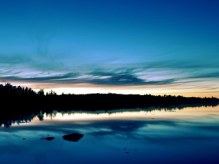

# ＜天权＞关于旅行

**旅行的人，终究是幸运的，我们有幸将自己愚钝的肉体凡胎勇敢的放置于这奇妙美丽的世界里，同时感受和被感受着。火车行驶的刹那，你看着山水和街道云烟一样从你身边呼啸而过，你穿过涓涓细流的河水，穿过鲜花盛开的山顶，和形形色色的人群，你的心，会感到前所未有的安宁。** 

# **关于旅行******

## 文/仇小丫（慕尼黑大学）

 

流浪归来，我开始想，当文字和行走已经成为我的生活状态或者一部分生活状态的时候，我会不会变得越来越“矫情”，不得不说，如今“文艺”好像被说的快成了一种近乎于“俗不可耐”的事情，好像就那么一瞬间，大家都要出门旅行，都开始热衷文字，他要去西藏，她要去非洲，去不成，死也要去，类似有那么段时间里的超女，选秀，创业一样，大家都去做了所以我也要去做，人们不但这样做，还纷纷不约而同地给它取了个名字叫做梦想，不，应该是某种不知名的内心攒动着的力量。

不知是谁说了那么句话：生活啊，不光有柴米油盐，还有诗和远方。

我觉得反过来说也是正确的：生活啊，如果没有柴米油盐，就没法有诗和远方。

一个人生活在一个时代，思维受他置身其中的物质社会的影响。那么他的梦想，到底有几分是受这个时代的影响，几分源于大众，几分源于媒体传播，几分是自己真正的梦想。比如我妈，她的观点就是，“我要是有钱我宁愿去商场买几件漂亮衣服在家跟你大姨你姥姥聚一聚吃吃饭看看电视，我才不做七八个小时的车折腾活受罪呢！”这能说，一个爱旅行的人就是一个高尚的人，反之如我妈就是低俗的人么？对于我妈那样的人来说，她没有必要也不想环游世界，在她的生命里，有比旅行更重要更有意义更加能让她开心的事情。一个大千世界里的小女人，家庭才是她的全世界，在人群中在世界里一下子就被湮没的她，却是家庭这个小世界里不可取代的崇高而伟大的妻子和母亲。旅行，不是每个人在其一生之中必不可少一定要做的事情。它可以作为一种爱好，一种状态，一种选择，正如你喝牛奶我喝豆浆你玩电脑我开电视一样。所以，于每个人来说，不管你在哪，无论你是谁，最重要的，就是活的像你自己，做自己该做的，能做的和喜欢做的事情。

于我，我没有多迷恋旅行，直到自己真正走在路上，竟开始一发不可收拾，并敢于斗胆说，不管旅行已经开始变得“俗不可耐”，还是有一天会遭“万人唾弃”，我依然选择去爱，并且爱的诚实，不但爱，还决定勇敢的用文字来记录，认真咀嚼每一处痛苦，认真回味每一滴眼泪，认真的将那些有形无形的触动化成实实在在白纸黑字，留不住风景，就留住回忆。因为我终于发现，比旅行更美好的事情，竟是用文字来记录旅行，文字就是我自己，是我把自己剖开了呈现给这世界的一种方式。

旅行是种瘾，沾上了就戒不掉。于每个行者，那种发现一个新的世界给自己身体和灵魂上带来的快感和冲击，就像一支兴奋劲注射在身上，你时而震撼，时而感叹，好像听到远方一直有一个呼唤你的声音，让你去追寻；好像感觉眼前一直有一只看不见的手，拽着你踏遍万水千山。这种兴奋感，出现在每一次的碰撞当中，每一次你看见不一样的山和水，不一样的建筑和人群，不一样的生活气息和风土人情，你就像一个躁动不安兴奋雀跃的异类，在一个全然陌生的地方，欣然接受自己被同化，被洗涤，被混血。

于是，你便带着一个地方的气息到另一个地方，你会觉得有点累，但是对于这一个自我完善自我打造的混血过程却感到无比兴奋，好似征服了自己一样。

旅行会让你知道，世界不会如你想象的那般，它远比你想的更加美好或残酷，它有许许多多你触摸不到的真实。

时而你会遇到那样一些人，他们跟你以及你身边的人完全不一样，他们用他们的方式，同样好好的活在世界上，你好奇的走进他们，而后感叹，原来人间还有这样的生活，原来生命还有这样不同的状态，原来自然给了人类这么多种选择。原来每个人都有一双翅膀，不经任何人同意就可以飞翔。原来，所谓的禁锢，只是人们终究活不出自己的内心和面对内心里另一个自己时的彷徨。

长途旅行，不仅要有勇气，更是对人身心的考验。当你疲倦到一定程度，当你孤身一人面对全然陌生的自然或人文环境，当你语言不通规矩不懂，当你遇到各种各样的麻烦，你甚至会于内心深处安静的质问自己的灵魂，我在哪里？我在做什么？我该坚持把路走完还是就这样讪讪的回去？接着你莫名其妙的接收到了各种各样的来自陌生世界的帮助，你饱含热泪，开始相信人间真情。你被那些平日里你一点都不在乎的小东西感动了，你的心变得开阔而柔软。

旅行的人，终究是幸运的，我们有幸将自己愚钝的肉体凡胎勇敢的放置于这奇妙美丽的世界里，同时感受和被感受着。火车行驶的刹那，你看着山水和街道云烟一样从你身边呼啸而过，你穿过涓涓细流的河水，穿过鲜花盛开的山顶，和形形色色的人群，你的心，会感到前所未有的安宁。

你时而是一位冷静旁观者，时而是那些置身其中的有故事的人。路过微笑，路过离别，路过酣畅淋漓的爱情，路过一个又一个的男（女）人，你忽然明白，于这千万人的千万个故事当中，很多咬着牙要记住或者遗忘的爱与恨，已无意再做清楚的区分。

你站在海边，眼睁睁看着缓慢消逝的夕阳血一样染红了面前如此博大的海，还没等你伸出手，就留下一片如此近却又如此遥远得你怎样也抓不住的阴冷的蓝，好像再也不复返。你被时光抛弃，孤单伫立于海天之间，闭上眼，是这千年不变的海风，睁开眼，是被海水抨击的带着岁月年轮的岩石。你被静止在时空交汇处巨大的安静的瞬间，突然觉得自己如此渺小，连同平日里那些你觉得好像永远也化不开解不掉的毒瘤和伤疤，也在这一刻平淡了许多。

有人问，人们到底能在旅行中得到些什么？为什么总有些人如此偏执的疯狂的不顾一切的热爱着旅行？

其实你什么都得不到，不但得不到，还要把自己谦卑的奉献给自然，它为你的灵魂注入一些新鲜的血液，再还给你的躯体。这个过程，使你忘记或者更加认清你自己。你没有身份，甚至没有性别，你只是行走在天地自然之间的一尊生命。上了路，一切靠缘分，就像出家有佛缘，结婚有姻缘，旅行也是这样，世间万物，不过一个缘字，强求逼迫不得。

如此，你便学会了用山的眼睛去看山，用云的眼睛去看云。你可以是鱼虫鸟兽，或者每一个陌生的人。

如此，目的和终点于你便不再那么重要，因为你早已成为能于一花一水，一草一叶之间寻找世界的大情怀之人。

如此，无论你身在何处，你都会用真善美的眼睛去发现和解读这个世界。

如此，你便不仅是一位行者，你已经成了一道风景。走着走着，你会突然原谅了你自己，并开始原谅这个世界。更重要的是，你居然相遇了那些来自世界其他角落里和你一样寻找爱并且渴望理解的人，你们称对方为，同类。人说，纵然情到浓时天雷地火，爱的最高境界莫过于一个“懂”字，于浩瀚宇宙苍茫人海之中，你遇到一个人，你懂他，他也懂你，那么相信我，这个世界上，已经没有人可以给你更多。

接下来我将用文字来记录那些漂泊的生活，自由的生命以及我亲身经历的故事。我依然在路上。那么你呢？

世人不识痴中滋味，以为荒唐。

如果爱，就出走吧。回到人之初，变成小孩子，任性一次，在短暂的有生之年。

 

（采编：应鹏华；责编：麦静）

 
