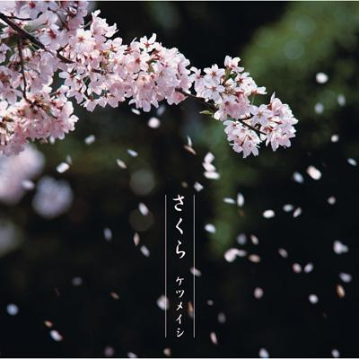
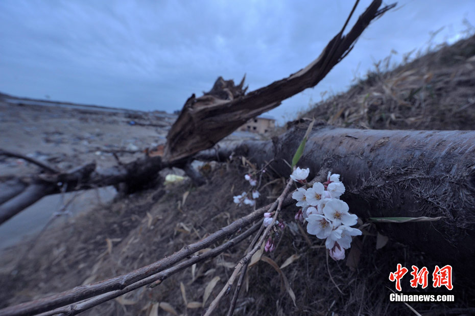

# ＜天权＞写于有樱花的四月天

**在 落花时间，那世界空了的那一瞬间回想过去种种，你是否还记得你的一生？会不会突然不知道什么是靠谱什么是不靠谱。这一生，你后悔过么？是否把时间付流水， 把真心捏粉碎？人生短暂活着就要像樱花一样灿烂，即使死也该果断离去。樱花凋落时，不污不染，很干脆。生命的绚丽就应该是盛开的樱花一样充满魅力，令人无 法忽视你的存在过的时光。**

# 写于有樱花的四月天

## 林静（华侨大学）

看见郊外的樱花树上花团锦簇，才意识到这春天已经来临。路过的小女孩拉着妈妈的手轻轻问这是否就是动画片里的樱花？这里虽然不同于动画片里的日本樱花盛开时节大片大片的花海，满树烂漫如云似霞的壮观。山上数棵樱花三五成丛点缀于绿地形成锦团，也形成“万绿丛中一点红”的画意。 极其喜欢日语里对于赏花的字眼——“花见”。不是“见花”，是“花见”，只是一个小小的倒装，却把对期待樱花的灵动全部呈现。“花见”对于整个日本是一场恢弘的仪式，日本女子们为了迎接一定要为赏花而备的“花衣”，翘首以待盛装迎接才是对樱花的信仰。 

### 

可是日本人最推崇的的场面不是“花见”而是“花雨”，那便是樱花谢世的时节。花的生命很短暂,从开放到凋谢大约只有7天，七日开放后的花谢，风吹来的时候,满树满树的樱花纷纷飘落，这种缤纷落英便是为"花雨"。我在风中眼看著心爱的花儿飘散，那一刻眼里的凝望便是泪水。樱花美得绚烂到美得有些哀伤。然后我想到了死亡，想到了武士和诗人的亲手结束生命。想到日本电影动漫中经常见到的“花雨”，在武士壮烈牺牲的时候总有樱花的飘散，还有不是哀伤而是悲壮的音乐衬托，一种华丽如诗歌一般的死亡之美。"轰轰烈烈而生,从从容容而去",不同于我的哀伤，在樱花飘散的时候，树下的人们一般都欢呼喝彩。 中国也不乏有花落的诗句，哀叹那些已经枯萎凋残的花儿，当风吹落花漫天旋转褪尽了鲜红的时候，我们对它满是同情和哀怜。我们叫做“落花”或者“花落”，这两个字包含的是暗淡而凄清的画面和浓烈而忧伤的情调，其实和日本人的“花雨”描述的是同样的自然现象。李后主“樱花落尽阶前月，象床愁倚薰笼。远似去年今日恨还同”的繁华落尽后的忧愁就像接下去的梅子黄时雨，阴郁而不绝。林黛玉的葬花吟和杜秋娘不谋而合，“有花堪折直须折”“红消香断有谁怜”的落花之哀叹。一遍遍地害怕哪一天花儿就凋谢，一群此间生命也一起唏嘘不断。 这是我们的“落花”时节对时光流逝多愁善感的性格，在生死爱恨中联想自身存在的不安和对生命迷茫。 四月天的时候我喜欢吟唱日本看樱花民谣而不是《葬花吟》，“万里长空白云起，美丽芬芳任风飘。去看花！去看花！如霞似云花烂漫，芳香飘荡美如画。"沐浴在这种“花雨”下常常是欢乐的声音。我喜欢樱花的盛开的四月天，配上这首不哀伤的歌曲。我喜欢这个时候，不是春寒料峭，没有阳光没有花朵只有湿重的苍白雾气透着清冷的孤独，也不是百花艳丽那种近于喧闹的明艳时节。人间四月正是春天里最好的一段。 而今年的四月天，日本却遇见一场巨大的灾难，在报纸上看见著名的赏樱地也是震区东京的赏樱人数减少，可是其他地方的人却多了。我多希望凄美的樱花可以給灾难后的日本带来一些慰藉和希望。 

我不知道真心说祝福这个国家是否会带来一些民族主义者的不满。可是我知道，无论多大的仇恨也已经过去了六十六年。日本65岁以上人口只占总人口21.6%的比例，而战争中15岁以下的人也不会发挥作用的，日本81岁以上的人也只占日本总人口的5.6%。现今94.4%的日本人没有在日本发动的侵略战争中发挥过作用。 过去是“人生七十古来稀”，今天人均寿命已经达到80岁，六十六年依旧是一个人的一生的绝大部分了。我们为何又在一个有限的生命中把仇恨拓展到无限呢？ 我 们的生命如同这美好的花朵一般，短暂的明媚鲜妍，一朝漂泊难寻觅。在落花时间，那世界空了的那一瞬间回想过去种种，你是否还记得你的一生？会不会突然不知 道什么是靠谱什么是不靠谱。这一生，你后悔过么？是否把时间付流水，把真心捏粉碎？人生短暂活着就要像樱花一样灿烂，即使死也该果断离去。樱花凋落时，不 污不染，很干脆。生命的绚丽就应该是盛开的樱花一样充满魅力，令人无法忽视你的存在过的时光。 看见地震后的樱花片片开放，我对自己说没有多少时间可以浪费了。巨大的变故与灾难常常让人产生一种不确定感，不知道生命还可以被握在手里多久。我开始回忆懵懂的少年时光的所有事情：认真看书过，也逃课逃考试，还有认真恋爱和失恋，生命充满着大笑、大喊、大哭、大叫……今 后，我多希望在有限的时光里，做自己喜欢的工作，面对我的生命，要像日本人一样专注。如果明天要死的话怎么办呢，我还有那么多想做的事。有时我也想，如果 我心爱的男人死在我面前，我会悲恸不已吗？还是只是安静地抱着他？我从来没有后悔过所有与你一起花费的日子，我的爱便如樱花一样是值得的。 我凝望“花开花落”瞬间的念头，多希望可以学的“花见花雨”那望一秒长于百年的心。我多么向往一颗不哀叹的心，不哀叹对待这个世界对生命的给予与剥夺。可是事实上，我现在却大声呼喊“我没有空，我没有空，我没有空，没有空去死。”呼喊过后，微微哀伤缱绻着一声叹息。 我也多希望我的的生命没有被浪费，没有被浑浑噩噩虚度一空，一去不返。那个时候，我就可以不害怕一个世界末日结束我这个生命。 

（采编：安镜轩 责编：项栋梁）

