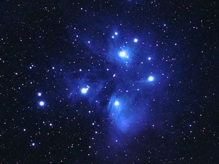
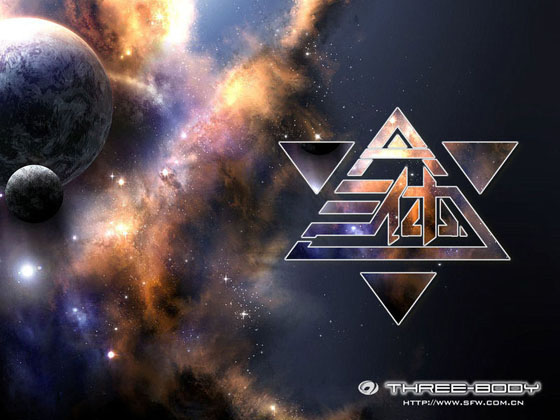

# ＜天权＞刘慈欣的星空与大地

 **刘慈欣注视着无限深远处，用他充沛的想象力给出了一幅并不光明的宇宙图景。在《死神永生》大得吓人的叙述尺度上，地球与人类，甚至占据了前两部篇幅的地球文明与三体文明的生死缠斗，最后都成为无足轻重的瞬间。“毁灭你，与你何干”，不止是三体对地球发出的信息，也可以是一个读者站在《死神永生》的结局回望，对之前所有跌宕起伏的感叹。在这个意义上，建筑在细节上的宇宙想象，把现代星空带来的陌生感推到了一个罕有的高度。《地球往事》三部曲真是“现代，太现代了”的星空叙事，它并不是顺服的娱乐工具，而开始挑战读者的勇气与承受力。在想象的世界中，刘慈欣完成了他对康德的反驳：星空永远令人敬畏，然而道德脆弱不堪。因为人类本身，最终亦不过灰飞烟灭。** 

# 刘慈欣的星空与大地

## 文/刘温克（清华大学）

星空永远是人类想象与激情的来源，而这想象与激情的面貌则与时更迭。古典学家莎德瓦尔德在《古希腊星象说》中对此有一段精彩的描述。在古代，天穹上群星的步伐踏着缓慢庄严的节奏，象征着永恒的秩序，星空是神明的领地，是凡人不能接近的彼岸。在这个意义上，古人的星空，比起现代人以被飞船、太空望远镜和人造卫 星亲手触摸过的星空，要遥远神秘得多。从另一个角度来看，却正好相反。在古代人眼中，天幕是平静的水晶穹顶，星辰是镶嵌其上的宝石。人们抬头仰望，看到的是人间的倒影：传说中的英雄、日常所用的器物、建筑、河流，组成一幅可以解读讲述的画卷，天空中上演的阴谋、冲突、悲剧与爱情，与人间的并无二致。现代人 眼中的星空则完全不同。天穹不再是封闭的，亦不再平静。“太空”或“宇宙”是 无限广大并寒冷的，星辰并非珠玉，而是散发着令人恐惧的巨大能量的火球。莎德瓦尔德说，现代人的星空也同样在人心底唤起某种庄严神圣的情感，但那与古代星空的神圣已截然不同。星空不仅将渺小强加给仰望它的人，也展示着自身对于人类的陌生。这种陌生带来的是深刻的恐惧与颤栗。

毫无疑问，人类对星空的看法发生了重大的转变。这种转变并非是随时间流逝而发生的均匀变化，而是在过去的数百年中随着现代科学的出现而跳跃前进。按照托马斯•库恩的观点，这场改变了星空的革命，也正是从星空开始。哥白尼创造了新的天文学，也开启了新的世界观。沿着哥白尼的道路前行，星空不再是用亲切的语言便能描 述的东西，想要真正理解它，不仅需要娴熟繁复艰涩的数学工具，还需要从远离日常的极端条件下取得的观察数据。天地之间的和谐对应打破了，人类在陌生的宇宙 中不再有家园感。 然而，无论人类如何看待星空，关于星空的故事总是长盛不衰。在古代人们创作神话与歌谣；在现代，地面的灯光使遥远的星辰形容黯淡，但科幻小说仍然以探索 性的目光注视太空。古代与现代的星空故事，彰显了古代和现代的一切异同。正如神话反映了古人的生存根基一样，科幻小说或许是以一种间接却有力的方式探索现 代文明的终极意义。在今天，现代的荷马与赫西俄德们，从星空中读出了什么？ 在上面所提到的对星空看法的转变将要完成之际，恒星生成的星云假说的提出者，伟大的哲学家康德，在《实践理性批判》的结尾处写道，“有两样东西，我们愈经常持久地加以思索，他们就愈使心灵充满日新月异、有加无已的景仰和敬畏：在我之上的星空和居我心中的道德法则”。 这一富于诗意（虽然《实践理性批判》无论如何都不能说是一本诗意的书）的论断大概是这位晦涩却影响深巨的哲学家最广为人知的引语。康德是哲学史上承上启下 的人物，他的这句话本身便是一个枢纽。在康德那里，宇宙已经是物理性的，但星空与人类世界的联系，仍然以类比的形式松散存在着。时隔二百年，中国的科幻作 家刘慈欣把凝注于星空的视线收回，对康德的话作出回应：“敬畏头顶的星空，但对心中的道德不以为然”。当然，作为一个作家，随便说说不能算数，于是刘慈欣讲了一个一千五百页的故事来为这句话注脚。回首这段《地球往事》，或许我们可以知道刘慈欣已经从康德走出多远，而我们所生活的这个世界的轨迹，便也显现于这条路径之中。 

《地球往事》三部曲可以说是刘慈欣此前创作的总集。在他以往的中短篇中许多给予读者强烈的冲击，令人惊奇和赞叹的构想和风格，都在这个系列中重现并深化：《球状闪电》中的十维宇宙，《诗云》中的神级生命，《乡村教师》中的大尺度文明图景，《中国太阳》的宇宙旅行，《流浪地球》的技术气魄和沉郁悲壮，《朝闻道》中终极物理规律的力量与庄严。在《三体》系列中，《球状闪电》里已经非常突出的对技术细节逐步深入的精确构建被推到了一个更高的层次，读者沐浴在目不暇接的信息暴雨中，带有鲜明工业文明色彩的技术想象如巨浪推动着情节前进。从人物出发的、感官的视角与历史纪录式的全知叙述交替缠绕，造成令人目眩 神迷的阅读体验。正是在厚重细节的托举下，带有抽象色彩的未来历史才得以显得超越而不飘忽。在一千五百页中，刘慈欣带领读者穿越星空。这趟旅程从刚刚凝固为历史的过去出发，终点却在宇宙与时间的尽头。 

在谈到系列的第一部《三体》的时候，刘慈欣说，“这是一个关于背叛的故事，也是一个关于生存与死亡的故事”，而从《黑暗森林》开始，它似乎已经不是一句话可以描述的；《死神永生》的情节以比前两部快了几倍不止的速度狂奔到了终点后，这个故事却又变得可以概括了： 这是一个关于无法避免的失败的故事。刘慈欣注视着无限深远处，用他充沛的想象力给出了一幅并不光明的宇宙图景。在《死神永生》大得吓人的叙述尺度上，地球 与人类，甚至占据了前两部篇幅的地球文明与三体文明的生死缠斗，最后都成为无足轻重的瞬间。“毁灭你，与你何干”，不止是三体对地球发出的信息，也可以是一个读者站在《死神永生》的结局回望，对之前所有跌宕起伏的感叹。在这个意义上，建筑在细节上的宇宙想象，把现代星空带来的陌生感推到了一个罕有的高度。《地球往事》三部曲真是“现代，太现代了”的星空叙事，它并不是顺服的娱乐工具，而开始挑战读者的勇气与承受力。在想象的世界中，刘慈欣完成了他对康德的反驳：星空永远令人敬畏，然而道德脆弱不堪。因为人类本身，最终亦不过灰飞烟灭。

不过正是在宇宙图景的宏大层面，刘慈欣小说的另一个维度显现了出来（不妨说这个故事在此低维展开了吧）。刘慈欣迷恋星空，以至于他把日益专注于人性与内心的“严肃文学”视为“一场人类的超级自恋”，并希望以塑造文明整体、宇宙环境、广大空间等“非人”的文学形象为目标的科幻创作，能够给文学一个超越自恋的机会 。然而，刘慈欣的小说却都多少地具有“大地”的主题。无论是《乡村教师》开篇的乡土描写，还是《超新星纪元》的现实关怀，再或者《全频带阻塞干扰》中令人感到熟悉的民族主义与爱国主义，都未曾离开现实的地面，甚至可以说，是有意识地眷注中国的历史与现在。在《中国太阳》的结尾，主人公在飞向宇宙深处之时，仍然“牢记那个国度西部一片干旱土地上的一个小村庄，牢记村前的那条小路，他就是从那里启程的”。而整个《地球往事》以中国六十年代的灼热回忆开场，终结于另一个宇宙中一片金色的麦田。在鄙弃了康德心中永恒的道德律之后，仰望星空的刘慈欣，双足也并没有离开大地。 刘慈欣的大地，与他的星空一样，充满可以触摸的细节。即使主要是以未来世纪为背景的《地球往事》系列，也充满了具有“中国特色”的场景、对话与情绪。不仅来到未来的章北海能从司令官口中听到“接到任务先说不行，这不是我们的传统吧”，三体文明在地球的代表智子是以一个时而柔美，时而残忍的日本女人形象出现，便足够让人产生现实的投射。更何况，在用武士刀砍杀争抢食物的地球人之后，智子所说的是“人类自由堕落的时代结束了，要想在这里活下去，就要重新学会集体主义，重新拾起人的尊严！”这些细节无关技术，也并非作者曾经论述过的“科幻形象”，只是此时此地的直接投射，但它们从另外一个角度击中了读者，给他们以情感上的震撼。或许很难判断，刘慈欣小说对于一部分人无可抗拒的感染力，更多是要归功于那些有关“星空”的放肆想象，还是此类植根于“大地”的切近描摹。 然而刘慈欣的大地不止于细节。旨在想象星空的“黑暗森林”理论，不意竟如古代的神话一般，盛满大地的倒影。“宇宙社会学”的两条公理说，“第一，生存是文明的第一需要；第二，文明不断增长和扩张，但宇宙中的物质总量保持不变”。这两条公理描述的是一个拥挤的、充满恶意与危险的宇宙。实际上，如果把“文明”替换为“物种”，“宇宙”替换为“环境”，这基本上便成了进化理论中“生存竞争”的标准陈述，而如果把再替换为“国家”和“世界”，则以复杂的“战略思维”争夺“生存空间”的强权政治景象，又赫然显现。如果抽空技术细节和只是若隐若现的宇宙演化，《地球往事》系列便是一部太空版的近现代史。而这或许可以解释许多读者何不能释怀于最后的结局，执着地讨论着故事中地球文明反败为胜的机会——这一切与那段通过教科书、影视和通俗文学在中国读者心中固化出一种情感本能的历史，实在太过相近。 

对于科幻作家来说，最大的挑战与诱惑，或许就是试图超越自己的环境和时代。仰望星空的努力或有助于挣脱尘俗，但人毕竟不能揪住自己的头发拉离地面。大地 无法遮蔽星空，但可以局限观察星空的视野。比起畅想光年之外的远方和时光彼岸的未来，对人类社会切近的未来作出令人信服或是警醒的预测反倒是更加艰难的事 情，原因无它，只是我们每个人都深深浸淫于当下的社会，很难摆脱它加诸我们身上的限制，甚而都根本不会察觉。科幻文学已经产生了大量的经典，但《一九八 四》仍然孤独地在人类的未来徘徊。《地球往事》是陌生的星空与熟悉的大地扭结成的绳索，它的面貌像宏原子的弦状原子核一样，是变幻不定的。 不过，或许刘慈欣正如最早的希腊哲学家泰勒斯，因为专注于星空没有注意脚下而掉进井里，读者却没有资格像那个故事中的女奴一样嘲笑他。至少对笔者而言， 正是刘慈欣小说中属于大地的那一部分，能够轻易唤起一种精神上的乡愁。虽然地球已成往事，这个故事的气味和神韵却总令人想起二十世纪末的中国。在那时，科学有清新刚健的气味，是戴红领巾的儿童们内心向往的、通往美好未来世界的一扇门。  

（采编：陈锴；责编：陈锴）
