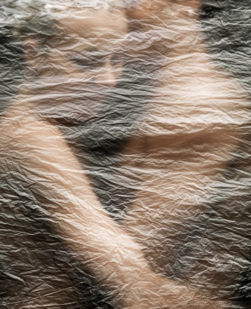

# ＜天权＞初秋彷徨帐

**人本身就是一种可悲的动物，孤独是人永远无法去除的梦魇。即便这一刻两人牵着手穿过大街小巷，即便是紧紧相拥，人与人之间，依旧是有那永恒的心之壁。期望通过任何一种感情的方式来突破这种隔阂与沟壑，都是徒劳的、荒谬的。未婚妻君和我，都不是没有经历过感情、没有体会过感情之脆弱背叛的小孩子，两个人真诚相待有多么难得，相遇相知有多么珍贵，相爱相伴有多么艰难，也略知一二。**

 

# **初秋彷徨帐**

## 文/张苏樊（星联士官学院）

 

最近武汉多雨水，那天牵着未婚妻君在街上觅食，我指着路边的树叶说，你看，秋天要来了。那树叶的更替这么分明，零星掉落的尽是一些全然金黄的叶子，而树上又全是绿油油生机勃发的一片。未婚妻君说着自己最喜欢秋天，我抬头想找找有没有渐黄的一两片，想象冬天的时候这树枝上都是云的故事。

牵着的手心慢慢渗出汗，未婚妻君的体质和我相似，虚而寒。有时候她会望着一个地方发呆，不知道在想什么，过了一会忽然就捏着我的手说：我们去买蜜蜂吧。于是周六的下午，我迷迷糊糊地上了公交车，最后发现坐错了，为了换零钱跑去买了零食。最后终于又是跑又是颠儿地出现在约定的地方，我把零食递给她解饿——她似乎总是很肚子饿。她说我知道这附近有一家蜜蜂店，我以前去过一次，可是当时没有带钱，没有买。她还说当时那个店员对她很好，给她介绍了很多蜜蜂的知识，所以很不好意思，所以今天一定要去那里买。

亲爱的，蜜蜂不可以吃啦，蜜蜂是有小翅膀会嗡嗡飞，还会蜇人的虫子君啦，甜甜的好吃的那个是蜂蜜。

后来在蜜蜂店里待了很久，店员已经不是当时的店员，不过也是很热情的阿姨。我第一次知道原来蜂蜜还分这么多种类，原来花粉也可以食用，未婚妻君尝了一些觉得特别苦，但最后还是买了玫瑰花粉和两瓶蜂蜜。一直到最后未婚妻君都对荷花花粉耿耿于怀，因为那一种是可以美白养颜的，可惜是性寒的，她不能吃。

那之后我们才第一次真正牵手。事实上，一直到这一刻，我们对于此对于这一切，都是十分忐忑的。这种感觉不易表述，但也无需表述。人本身就是一种可悲的动物，孤独是人永远无法去除的梦魇。即便这一刻两人牵着手穿过大街小巷，即便是紧紧相拥，人与人之间，依旧是有那永恒的心之壁。期望通过任何一种感情的方式来突破这种隔阂与沟壑，都是徒劳的、荒谬的。未婚妻君和我，都不是没有经历过感情、没有体会过感情之脆弱背叛的小孩子，两个人真诚相待有多么难得，相遇相知有多么珍贵，相爱相伴有多么艰难，也略知一二。

心里反复提醒着自己，甚至告诫对方，不可以，太快了，我们应该再慢一些！但事实上，无非是那些伤口作怪，某些往事只需在脑海里气若游丝地一声低鸣，就可以让人不寒而栗。呵，你忘了昨日虔诚的少年么，可如今他又在谁的梦里？甚而某些尚未发生的事情也可以一闪而过就让人举步维艰。是啊，怎么可能一帆风顺，之前受过的刁难与挑战，还需再面对一次，以及先前没有能越过的坎坷，甚至自己还没有来得及见识的抉择。

于是就越发觉着认真是多么可贵的品格，未婚妻君与我，并不能确保今后的完满，但一个认真的态度，是我们的共识与原则。在相互吸引的时候，了解而倾慕，在相爱相知的时候，理解而慰藉。和未婚妻君相互喜爱着，却都不会说出爱字，因为这感情还没有醇厚到那份深情，我们有了态度，还需要时间，剩下的，交给缘分。这事情急不得，不是互诉三句我爱你，就能够保一生幸福平安的低俗剧情。

那天心情糟糕，跟四郎君抱怨，四郎说你若是变成你的猫形态就可以了，那样他们就认不出你了。我说那么我便去你寝室看电影，到了深夜还可以看球赛。四郎君说色狼。

如果我变成猫，那一定是一件比现在快乐的事情。我会一大早潜伏在店铺门口，抓住机会抢到一袋子板栗，我想我需要走很远才能找到凌波门栈桥。那里已经没有栈桥了，可我是一只猫，栈桥并不是我的所爱，我应该把板栗藏好，在下午的时光里好好打个盹，可是这样的玩耍又是十分痛苦的，湖边的风里带着水草腥香，那分明就是鱼儿在对着我摆尾挑衅，即便我是一只不喜欢吃鱼的猫，这种蔑视也太让愤怒了。大概到了晚饭的光景，就会循着路径找去四郎君处，我想总归她会认出我的，毕竟如此神气又有脾气的猫是不多见的，不请我吃饭是不可以的，我不吃鱼我要吃甜的水果豆花。晚饭之后就屈尊移驾四郎君在武大的行宫，据说四郎是用快播看丁度巴拉斯的，但是我既然是一只猫，自然是不感兴趣的，我要用四郎的电脑看美剧，然后再吐槽说以后再也不看这种没意思的片子了哼。之后便是在桌子底下睡一觉，等到了晚上四郎君会爬起来看球赛，我就趴在桌子上打哈欠剥板栗，看着她对5kb一秒的渣网速嘟嘴巴，心里默默地把中国电信的电缆用猫砂全部堵住。然后四郎君在百般调试无果后会突然陷入一种类似产前焦虑的状态，为了防止她把面膜泥塞进我耳朵里，我会高贵冷艳地叼着我的板栗走掉。

大街上很冷，可我是一只猫，我有绒毛，而且我偷吃了四郎君抽屉里的零食。我想我需要走很远，要穿过东湖，要走过很多十字路口，要躲避车水马龙，要非常机敏地逃脱倒霉熊孩子对我的抓捕，还要十分神气地战略性绕过汪星人的据点。最后我到了我的目的地，我把板栗袋子轻轻放在枕边，把身上的露水抖掉，我想我还是有点冻着了，我的小肉掌有些脏，所以我提前去洗了洗，我发现上面已经被割划了很多伤口，但是没几天就会好的，我让你为我准备的水，似乎又被你自己忍不住喝掉了。阳光不那么恰当地照进来，我想我的新形态对你来说很陌生，我只能害怕地缩起来，躺在你的被子上。可我知道你一定会认出我来，我在变身前就准备好了一块小牌子，挂在我的脖子上，喏，未婚妻君，一颗我都没有偷吃。我的心不再跳动，身体却不断发抖，这不是我曾经做过的噩梦，是我最好的一个结局。

 

（责编：应鹏华）

 
