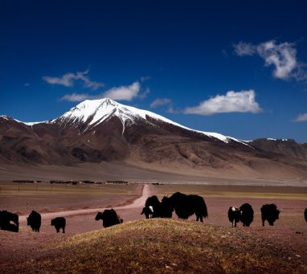

# ＜天权＞北京的金山上

**这一切，总让人想起Gentile，这位新黑格尔主义者，法西斯政权的辩护者与支持者，Gentile说道：“一切为了国家，没有什么可以反对国家，没有什么在国家范围之外。”** 

# 北京的金山上

## 文/达央（西北民族大学）

 

“殖民主义和帝国主义对我来说并非抽象，而是特殊的经验和生命的形式，具有几乎不堪忍受的具体感。”

——艾德华•萨义德

这里海拔3200米，傍晚成群的野狗游荡在草原上，夏日丰盛的季节里，它们显得心情愉快，一点没有敌视你的意思。 

D的宿舍里，一架80年代的卡式录音机播放着甲壳虫的专辑，音量被调到最大，60年代的摇滚乐至今让人热血沸腾。“你要一场革命，还是一部宪法？”在当时“五月风暴”的游行活动中，西欧的年轻人执迷于激进的左派哲学、毛主义，愤怒的情绪与浪漫主义革命理念充斥于以理性著称的欧洲文化中。而红色的中国正在准备继续进行一场更为暴力的思想与文化的大革命，它向人们宣称乌托邦的实现需要以无数激烈的、持续不断的革命来完成，并且以宗教笃信式的偶像崇拜与同一化的集体主义为精神信仰。

共产主义的口号至今依然让人心醉与神往，以至于这场人类历史上空前的浩劫在结束30多年之后，无数的官员与知识分子仍然痴迷于这场红色革命的所谓精神遗产，这既是这个千年古国实现伟大复兴的必要手段，也是重构价值信念的内核所在……

间隙，乡政府的大喇叭突然传来歌声，那是《北京的金山上》，一首在藏区几乎家喻户晓的作品，和我们同坐的牧人竟也用含混的汉语哼唱着，这首原本属于山南地区的古老歌谣，象征着对于宗教的虔诚，对美好生活向往的祝酒歌，被进藏的艺术家改编成为对毛与社会主义的崇拜与赞美，而这一次，早已不是先前的老版本，它被编成综合了藏语、康巴、安多语以及汉语，融合了现代的电子音乐混音与激烈的摇滚节奏，换成最为时髦的现当代藏族歌手在官方的场合吟唱，也为了吸引年轻人的关注。比起藏族民间的弹唱歌手，他们更加符合官方的审美形态与价值标准，他们代表了藏人的新面貌，新气象，代表了藏人对伟大祖国的感激与祝福。是在伟大复兴的时代背景下“藏族最出色的艺术家”。 

这一切，总让人想起Gentile，这位新黑格尔主义者，法西斯政权的辩护者与支持者，Gentile说道：“一切为了国家，没有什么可以反对国家，没有什么在国家范围之外。”

D用一个屏幕开裂、按键模糊的手机劝说牧人们将孩子送到学校，开学已经三天，还有一些孩子未能按时返校，D的表情严肃，身后的墙上悬挂着更登群培的一张肖像，他被裱在相框里，面容憔悴，而又目光深邃。这位才华横溢、放荡不羁的“疯狂的喇嘛”被视为藏族现代化与启蒙运动的开拓者，也是个人主义的提倡者，他质疑固有的宗教秩序，提倡宗教改革与现代政府，以及建议发展国防，普及世俗教育。他还深谙马克思主义，由于其大逆不道的理念触动上层顽固的宗教势力而遭逮捕、羁押，精神崩溃而死，而他的一生则似乎影射了之后无数藏人的命运。

他同样也是西藏的命运。 

（采编：麦静；责编：麦静）

 
