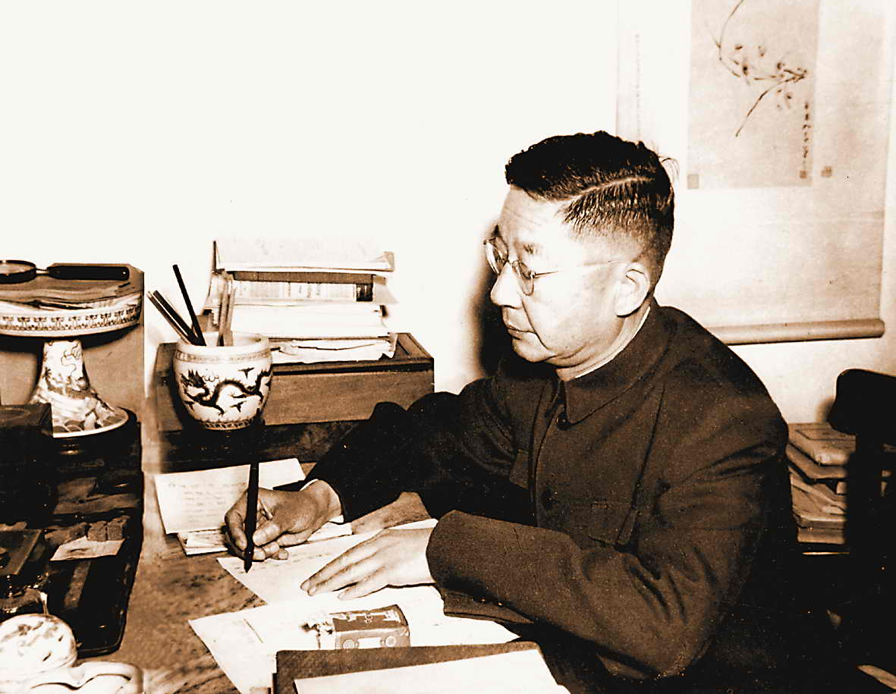

# ＜天权＞卢瑟，伦敦和《金瓶梅》

**即便很多人說，今非昔比，比起那些世纪初的大牛们，我们这帮人只会花钱跷课打dota──可是当年的大师也还尚且没有被光环笼罩，是和我们一样漂泊在外的留学生罢了。看着我身边的人，就算他们再不靠谱再窝里斗，我也希望那些四处奔走的有志青年里有胡适也有陈独秀，泡在图书馆刷gpa的学霸里藏了个陈寅恪，而即便是尝尽辛酸念着归乡的窘迫“卢瑟”里也总有个会成为老舍的C.C.Shu。 **  

# 卢瑟，伦敦和《金瓶梅》

## 文/吴昕悦（Wellesley College）

 

这一切是从那个无聊的下午开始的。

新英格兰入冬之后阳光变成了奢侈品，所以午后天气好的时候我就会跑到图书馆三层靠窗的小沙发上读书，正好旁边是中文书架，学得头昏脑胀就去抽几本读。这次正好翻到埃氏所译的《金瓶梅》，记得Egerton是个英国怪人，花了十五年时间把我国第一淫书翻译成英文结果出版过程中障碍重重，于是只得把淫秽描写段落替换成拉丁文（！简直就是一个英式笑话了。自古以来爽歪歪的篇目都是教士的特权，连舶来品都不例外= =），后来有人干脆把拉丁文的段落摘出来单独翻译出版成一部艳情小册子，再加上海外华人抗议此书有辱国体（我们国体甚贵，于是被辱就是一件很轻易的事情了，就像越是自视甚高的贵妇人越容易觉得自己被人轻慢了），完整本一直拖了很久方付梓，而在很长一段时间里埃氏的译本也是此书唯一的英文译本了。

在扉页上Egerton写明了致朋友C.C.Shu。对于读书，我一向是个好事之人，于是留了个心去读序言，果然后面提到：如果没有这位好基友根本不敢说自己能够完成此举等等（without the untiring and generously given help of Mr. C.C. Shu, who, when I made the first draft of this translation, was Lecturer in Chinese at the School of Oriental Studies）。那么这个中文讲师是谁呢？时势造英雄，世纪初那帮漂洋过海的哥们大多牛得发亮，随便一个路人甲刨根问底一下都大有文章。

于是我就顺藤摸瓜去查了这个中文讲师，果然不出所料，初相逢还是旧相识。

1924年来伦敦大学东方学院教中文的年轻讲师，Egerton的好基友好室友 C.C.Shu同志，全名 Ching Chun Shu， 中文即舒庆春，字舍予，笔名老舍。

不过这个时候帮着室友翻译《金瓶梅》的中国留学生还不是老舍，他甚至还没开始自己的写作生涯，这位大龄青年C.C.Shu每天都在纠结我们现在一样纠结的问题：没钱啊没妹子啊家里的老妈啊食堂难吃啊。──当然，这么痛苦的不仅仅是我们也不仅仅是他，俞平伯留学英国之际就因为“洋食难吃，课业艰深”索性从学校跑路了，好基友傅斯年一路追到马赛都没能把此君劝回来。

固然我们总是抱怨留学生质量下降，比起当年那些大牛，现在的我们俨然是一群酒囊饭袋。但是──时过境不迁。当年的留学圈也和现在一样分为三档： 康奈尔大学的普通青年胡适期中考试狂飙GPA后还能给自己煮碗鸡丝面然后继续打牌；高帅富徐志摩出入各种大师的宅邸犹如逛自家花园，动不动还更新条微博说我今天又碰见宅男女神林徽因了；而二逼青年C.C.Shu──穷得叮当响，每年挣250磅花300磅；吃食堂吃出胃病，养不起，只能去廉价的中国餐馆喝一碗一先令的汤。至于外貌，据宁恩承回忆是这样的：“舒同学一套哔叽青色洋服冬夏长年不替，屁股上磨得发亮，两袖头发亮，胳膊肘上更亮闪闪的，四季不论寒暑只此一套，并无夹带”当时的C.C.Shu穿着长年不换（！）油光闪闪的唯一一套衣服走在伦敦街头，那种超然脱群的程度绝对不亚于宅男秋裤外穿游荡在上海外滩。更悲剧的是：身边连个妹子都没有还老被那个奇葩的英国室友抓起来半夜一起研读《金瓶梅》……

于是，二逼青年就这样被活生生地逼成了文艺青年。

这位C.C.Shu同志就是在留洋的时候开始动笔杆的，“二十七岁我到英国去。设若我始终在国内，我不会成为小说家──虽然是第一百二十等的小说家。到了英国，我就拼命地念小说，拿它作学习英文的课本。念了一些，我的手就痒痒了。离开家乡自然想家，也自然想起了过去几年的生活经验。为什么不写呢？”（《我的创作经验》老舍）

我对于老舍的书读得又并不多，甚至在此之前不能相信此人也留过洋，因为很多留学生的文笔是能够读出来洋味道的，比如邵洵美仿得一首漂亮的英国诗，比如闻一多《死水》之仿美国新诗派──而老舍自始至终一口珠圆玉润的京片子，把这个城市琢磨得像核桃一样玲珑。现在必须大叹自己浅薄：贵公子们吟诗做赋是早在出国之前就熏陶出来的，而另有剩下的一些人笔耕不辍是漂洋过海内心憋火不吐不快一点点给逼出来的。这个背井离乡说着一口标准Chinglish的中国留学生在读了大本大本的英文小说后码起了方块字，这些文字在异国他乡的肚肠里像饥饿一样凝结， 而字字句句却都是在北京灰蒙蒙的冬天里就着西北风从冰糖葫芦的甜渍里浸泡出来的。

暑假的时候有朋友采访留学生，问什么时候最想家。我实话实说是饿的时候，思乡是一种最本能的情感，就像饥饿一样。这些漂泊在外的人啃着洋面包嚼出来的爆肚香气，那才是北京最地道的滋味。

我另好奇的一件事就是一个孤身在外的大龄青年是用怎样的心态去翻译《金瓶梅》的（我假定看我这篇文章的都是成年人了，成年人那点见不得人的事儿我们也动不动拿出来见人了）。因为那个年代没有新东方，留学生之间牵线搭桥的鹊桥业务还一片荒芜。即便是现在，中国留学生和美国姑娘恋爱也并不是主流。可以想见热情如火的美国女郎看见穿着长年不换的过时衣服的宅男C.C.Shu也不会是一张看见了东方王子的花痴脸孔。

在C.C.Shu成了老舍之后，他开始写一部书叫做《二马》，讲的是一对中国父子在伦敦和一家寡妇的暧昧纠葛。有趣的是批评家总说这部作品是“不写实的”，这幻想的华人与白人的罗曼中藏了几多辛酸就不得而知了，因为并非人人都是徐志摩，能一掷千金在欧洲名媛之间吃开一个小圈子。那会儿的宅男们也尚且没觉得为祖国扬眉吐气的重要途径就是搞定个洋妹或者是看着欧美小电影来一发让“两大帝国伺候我一个”。

C.C.Shu及其同道者大概是羞涩而自卑的，一如我的某个男闺蜜一看到金发大妹子跟他打招呼就僵住，等人家过去好远才说“那个是我们楼的大美女……”郁达夫在《烟影》里描述留日的男学生在路边碰到结伴走的日本姑娘，擦肩而过的时候姑娘们咯咯笑成一团，他被这笑声挠得心里一痒，旋即又有几分羞怒：她们定是猜到我是中国人了……

在赵毅衡先生书中翻到的另一则留学生情事和诗人朱湘有关。朱湘本人自视甚高，并且特立独行,算是个升级版C.C.Shu。因为C.C.Shu同学憋了三年快揭不开锅了才开口跟学校提加薪的事情，而此君在芝大以退学著称──但凡他觉得教授有“辱华“言论他就退课，一门一门地退，一直退到退学。其中他记叙說和一个美国女孩子有了恋爱之情，两人在校刊上以诗答情，你来我往。上个月我去芝加哥，本想查查芝大校刊看看到底是哪位女士，但最终还是行程紧张未能成行。但我倒是更同意赵毅衡的观点：那就是此事也许更多的是朱湘一厢情愿的夸张，因为对诗传情之事实在更像是《红楼梦》的情节而不是美国女孩子的行事方式。比起跨国恋情，我更相信是那个愤世嫉俗的中国青年瞥见了一双失焦的蓝眼睛，然后从里面读出了一个在异国他乡贴心贴己的林妹妹。

我不知道当时的C.C.Shu是否也是同样的心境，但是老舍本人绝口不提他在英国和人一起翻译《金瓶梅》的故事，至少文革时候这一条本应被大张旗鼓批斗的罪名并没有被揪出来。我猜想，当他跳湖自尽前徘徊那一整天的时候，心里可曾记起那个在破公寓的落魄青年，一边读狄更斯的小说一边翻译一本淫书──男女情爱，世事无常，黑黑白白翻了一遍又一遍。 我和一个朋友說我要写C.C.Shu还是个留学生的事情，他问我有意义吗。今非昔比。 而对我而言，留学生离乡的情境，百年以来，是多么惊人的相似。 即便很多人說，今非昔比，比起那些世纪初的大牛们，我们这帮人只会花钱跷课打dota──可是当年的大师也还尚且没有被光环笼罩，是和我们一样漂泊在外的留学生罢了。看着我身边的人，就算他们再不靠谱再窝里斗，我也希望那些四处奔走的有志青年里有胡适也有陈独秀，泡在图书馆刷gpa的学霸里藏了个陈寅恪，而即便是尝尽辛酸念着归乡的窘迫“卢瑟”里也总有个会成为老舍的C.C.Shu。

和百年前一样，各路英雄豪杰平地暴起，但当他们尚不自知自己將改变这个国家命运的时候，他们和我们一样扪心自问，走了这么远的路到底是为了什么？

有人找人脉，有人找德先生，有人找赛先生，有人找绿卡。

也有一些人，他们磕磕碰碰地走遍万水千山，鼻青脸肿，在留学生圈里被笑成了卢瑟，但他们也一样找到了一件受用一生的珍宝。

那就是孤独。

 ---------------------------------- 感谢林绍宇----------------------------------  

（采编：尹桑；责编：尹桑）

 
