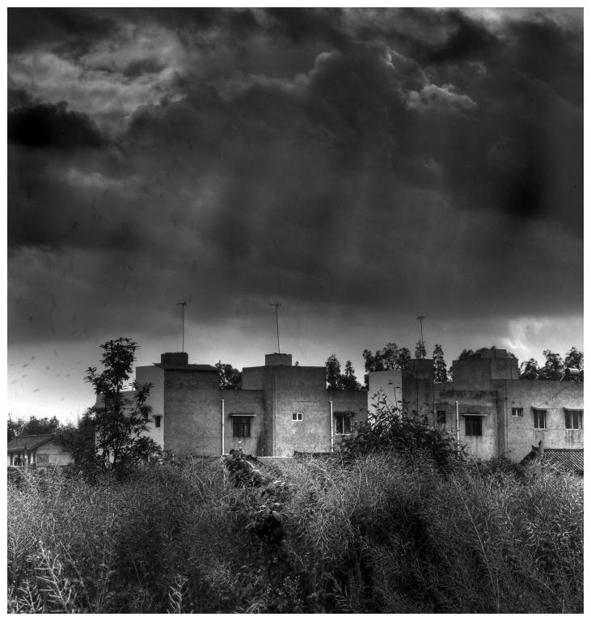

# ＜天权＞发达资本主义时代的写作者：为何我如此热爱黑夜

**有一个夜晚，一盏一盏汽灯在塞纳河两岸点亮，从远及近，又由近及远。城市生活在模糊的整全里，破碎的黑夜迎来了一波又一波游荡的波西米亚人。巴黎是地上一座城，地球是天上一颗星。游荡者波德莱尔一辈子只挣了一万多法郎，衣衫褴褛的游荡在气氛氤氲的午夜巴黎，吸血鬼一样的出版商，鬼魅般的资本家，嘈杂的切玻璃的声音，机器轰鸣的过往，都在午夜的巴黎消失了。此时，这个无助的年轻人，坐在咖啡馆的角落里，享受着稠人广坐的咖啡馆里，他惧怕人类，又离不开人类，只有在巴黎，才有忧郁，只有在人群中，才有孤独。** 

# 发达资本主义时代的写作者：为何我如此热爱黑夜

## 文/张亮（北京大学）

 

为一双鞋她出卖了灵魂

但在卑鄙者旁边，我扮出，

伪善的小丑般的高傲，老天爷耻笑，

为当作家我贩卖我的思想。

——波德莱尔，写给街头行人的诗 

某一天晚上，我一个人坐在斯多格咖啡馆最靠里间的位置，这样我可以躲开人类。人类之所以让我恐惧，是因为我想和他们发生关系，我想让他们读我写的东西，为此我必须找到一个出版商，或者一个杂志社，必须说服他们，我写的东西能卖很多钱，如果不比《梦里花落知多少》卖的更多，至少不比《杜拉拉升职记》卖的更少。事实上，我擅长写东西，但不擅长说服出版商，出版商总是扳着一副面孔：“你的这个东西，群众们估计不会喜欢啊，过时了，现在大家都喜欢小清新，你能不这么尖锐么？”

“玩世不恭，玩世不恭，你又回到了过去，能不这么玩世不恭么？”

“稿子先放这里，先放着，我们再想想，再看看，再斟酌斟酌，再考虑考虑。”

“张亮，你是叫张亮吧，我个人以为，你这样写作姿态是反人类的。只有反人类的作家才不考虑人民群众的口味。这里，就是这里，你居然写道，如果爱情是需要各种条件来确定的，比如长相、金钱、阶级，那么有一天，如果我们被硫酸毁了容，被金融危机整的颇了产，被社会大变动堕落成贱民，那么我们就不配爱一个人。所以，如果爱情是依靠这些条件建立海誓山盟，那它就是虚伪的，一旦条件改变，爱情就不复存在，那么真正真挚的感情，就是一夜情。至少这一夜，不会有改变。你这样的说法，简直只能是，反人类。我可以问你一个问题吗，一个私人问题，你是不是经常搞一夜情？”

“小张，我们看过你的稿子了，一致的意见是，结尾太阴暗了，你怎么可以说只有从中国逃走才有希望呢？我们是主旋律出版社，要考虑政治影响。”

“真搞不懂你们年轻人，一天到晚在想些什么？我哪年的？我84的，什么，你说你比我还大两岁？”

“你的小说文字不错，就是你的考虑市场，这样吧，你写职场小说怎么样，我这儿有一大堆，有办公室恋情的，有官商勾结的，有金融界的，有国企央企的，没生活？没有关系，我这儿有一大堆问卷调查 ，都是女白领，你还可以去世纪佳缘，我有熟人。。” 

晚上，我近似虚脱，我坐在咖啡馆里，我码我的字。我承认我喜欢黑夜。在黑夜里，人民群众会像大海的潮汐一样自然的引退，各种社会主义者，文艺青年、小清新、白领、富二代、官二代、宝马、奔驰、起重机、杜蕾斯都会自然隐遁。水泥盒子无处不在，市场凭空消失了。重要的是人民群众的品味消失了。空旷处只剩下歪着脑袋的癞皮狗、烧烤摊前露出淫笑的最后一批饕餮着。常春新苑背后有野合着，一上一下，有节奏的活塞运动，湖边上偶尔有保安对我赞叹，口活儿好。夜晚卸下了人民群众最后的面具，夜晚抛弃了必须忍辱负重的一切。古代人不会同意我，他们都说过午不食，“晨兴理荒秽，带月荷锄归”，他们睡觉睡的早，下午三点吃完晚饭，天刚刚黑就睡了。白天意味着劈柴、放马，面朝大海，春暖花开，意味着无处不在的诗意和我们现代人花几万块钱去九寨沟海螺沟马尔代夫东非大裂谷寻找的自然。夜晚意味着豺狼、强盗、强奸犯，山坡上出没的盗墓者随身带着洛阳铲，那里流传了数百年的传说关于聂小倩。古代人害怕黑夜，就像现代人害怕白天，比如我，魑魅魍魉都在白天，阳奉阴违的出版商，呼啸而过的重型大卡车，加长林肯里伸出的黑丝美腿，停满了北大的国学研究班的宝马奔驰，中关村汹涌的人群，林立的钢铁森林，窒息我全部思维的地铁人头——那一群无所不在的人类，蚂蚁一样爬满了整个地球表面、内部、天上，无所不在的人类都在嘲笑我吊丝的本质，他们之所以都在集中在白天出现，不过是为了嘲笑我吊丝的本质，他们不愿意衣锦夜行。

我生活在群众之中，生活在光天化日之下，这是我痛苦的源泉。雨果喜欢生活在群众之中，他掌握了群众运动的方向，他在《悲惨世界》里想象着一个喝醉的群众从死尸堆中苏醒，手拿啤酒瓶接受政府军的枪毙，他描写拿破仑最后的龙骑兵穿越枪林弹雨高呼皇帝万岁冲向地狱，他赞美其丑无比的敲钟人爱上了美艳无比的吉普赛女人，最终，他被十万法国人抬护送着，尸体封存在先贤祠。

一句话，他认为自己高高站在人群之上，群众是海洋，他是港湾，群众撞击着他，他引领着群众，他快乐的生活在群众里。

波德莱尔惧怕群众，他是一个深夜的游荡者19世纪的巴黎是游荡者的天堂，正如19世纪的伦敦是流浪汉的天堂，不同的是，巴黎憎恨布尔乔亚，伦敦生产他们。跟我一样，波德莱尔把自己看做吊丝，把自己看成该隐，而雨果永远是成功者，他懂得群众的方向。波德莱尔的的大脚趾永远从皮鞋的破洞里张扬，裤子上的破絮永远在风中摇曳，雨果则永远是美食的爱好者，光洁的中国瓷盘，鲜艳的领结，黑色燕尾服。19世纪的巴黎，流浪者波德莱尔永远在穷困中挣扎，不去理会拉马丁五百万法郎的版税，巴尔扎克金子做的权杖，雨果取之不尽用之不竭的人民群众。他唯一知道的是，像个波西米亚人，真正的像一个波西米亚人，与人类保持距离。19世纪的巴黎，像21世纪的中国西部城市成都一样，生活在凌晨之后才刚刚开始。白昼是它的处女膜，黑夜是它的子宫，生命在子宫里生长，有烤猪皮，烤羊鞭，还有冰粉跟能叫糕。

有一个夜晚，一盏一盏汽灯在塞纳河两岸点亮，从远及近，又由近及远。城市生活在模糊的整全里，破碎的黑夜迎来了一波又一波游荡的波西米亚人。巴黎是地上一座城，地球是天上一颗星。游荡者波德莱尔一辈子只挣了一万多法郎，衣衫褴褛的游荡在气氛氤氲的午夜巴黎，吸血鬼一样的出版商，鬼魅般的资本家，嘈杂的切玻璃的声音，机器轰鸣的过往，都在午夜的巴黎消失了。此时，这个无助的年轻人，坐在咖啡馆的角落里，享受着稠人广坐的咖啡馆里，他惧怕人类，又离不开人类，只有在巴黎，才有忧郁，只有在人群中，才有孤独。

“同学，可以用一下你的电脑么？”午夜的北京，斯多格咖啡馆，一个陌生的女人站在我面前。 我认识她，一个校内好友，一个北大女生。

一个熟悉的陌生人让我惶恐，她要干什么，她究竟想要干什么？

“我要发一个电子邮件，谢谢了。”

“好的，你先用。”我快步走出斯多格，人类让我窒息，包括眼前这个漂亮的女子。等我离开她，才想起她确乎是漂亮的，有黑色的卷发，丰满的胸部。我花了二十分钟忘掉这些，估摸着这时她应该已经不在了。

当我回到斯多格，意识到我是一个写作者。女生不见了，从我视野里消失了，我长舒一口气。电脑依旧在那里，屏幕上是我码了一半的字。我坐下来，继续意识到我是一个写作者，一个黑夜里的游荡者，窗外几声蟾蜍发出交配般的呻吟，我陷入沉思中，我又离开了这个正在交配着的世界。

“同学，可以打搅一下么？”又是一个人！妈的，又是一个人，人类，你能不能离我稍微远点？

“怎么？”

“你是在写小说么？”这时我看清这个人的嘴脸，秃顶，微笑，温和，衣着考究但是看不出品牌。

“是的。算是吧，但也许永远出版不了。”

“哦，是吗，可以发给我看一下么？我有兴趣看看。”男子胸前背着一个巨大的单反，许多小资文青梦寐一生的结晶。

沉默，持续的沉默，直到我手里多了一张名片。

“谢谢你，我先走了。”

名片上写着：“宁波市XXXX公司董事长XXX。”

有人说，在一个发达资本主义时代，一切文艺创作者的必然宿命，不是成为吊丝，像波德莱尔那样，就是被人民包养，像雨果那样。那么我呢，是否可能被这个资本家包养？ 

我写过一本小说，叫《田文亮的奇异生活》，第一次，出版商要我阉割了结尾，因为过于阴暗，第二次，出版商欺骗我，要我改掉了题目《北大，给我一个姑娘》。在一个发达资本主义时代，如果不是耽美或者穿越小说，不是切小鸡鸡，就是换掉脑袋，一个著名写手或许能避免这些，因为他已经实现自宫或者自己洗掉了脑袋，比如郭敬明或者韩寒。

当你在黑夜里遭遇资本家，当一个资本家向你伸出橄榄枝，当这个资本家还夹带了一个神秘的女人，我该怎么办？

当那个董事长消失在暮色里，我做出了我与这个世界隔绝的又一决定，把那张写着他名字电话的名片扔进了咖啡馆外的护城河里。

他也许只是无意间看到了我的只言片语，也许只是我的一个隐秘的读者，但当我联想起白天所发生的一切，联想在无边黑夜里我的孤独享受，我就头脑发热的冲出咖啡馆，把这指向白天的联系扔向空中。

我不知道这是否是对的，我只知道，我是如此热爱着窗外无边的黑夜。

最后的集权者是资本家操控的市场，就像打败了所有国王的罗马一样，它最后变成了一个皇帝。比起一个集权的政府，市场更让我感到恐惧，它诱奸了大部分人，并让被它诱奸的人强奸了剩下的少数。或者，让他们变成疯子. 

（采编：何凌昊；责编：麦静）

 
