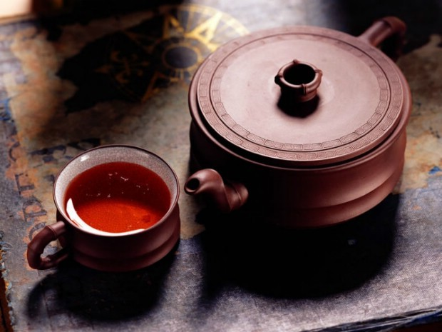
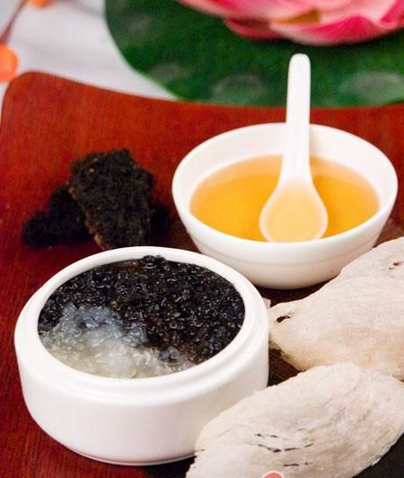

# ＜天权＞吃茶去

**相比喝酒，饮茶要麻烦了一些，也因此平静了一些，理智了一些，捧着质感的茶具，轻揭茶盖，看茶叶在水中慢慢舒展，翻转，回旋，就像造物主骄傲而仁慈地凝视他的子民，浸在氤氲的茶香里，未尝茶味便已先醉了。** ** **

# 吃茶去

## 文 / 陈识（暨南大学）

七碗受至味，一壶得真趣。

空持百千偈，不如吃茶去。

——赵朴初

从前有座山，山里有座庙，庙里有个老和尚人称赵州。一天，有两个外乡的和尚前来拜访问禅，赵州问其中一个：“你曾经来过吗？”回答：“没有来过。”赵州说：“吃茶去。”又问另一个：你曾经来过吗？”“回答：“曾经来过。”赵州说：“吃茶去。”引领二僧的监院和尚比较迷茫，就问：“怎么来过的你让他吃茶去，没来过的你还让他吃茶去呢？”赵州就叫了监院的名字，监院答应一声，赵州说：“吃茶去。” 以上是禅宗的著名公案之一，我在比现在更年轻的时候对其不以为然，认为不过是故弄玄虚的文字游戏而已，现在渐渐觉得，佛祖拈花，迦叶微笑，正法眼藏，以心传心，本来严肃的佛教传入中国那幽默智慧的一面却也有趣，而赵州又偏用茶作载体来个当头棒喝，颇有妙不可言之处。 我是个粗俗的人，不懂品茶，酒是很喜欢喝几口的。喝酒的好处在于，随时随地，随心所欲，酒虫萌动，当即便拈起几块大洋，换几瓶酒来，走在月下，坐在岸边，独酌尽觞，浇胸中块垒，或者呼朋引伴，吆五喝六，独乐不如众乐，月朦胧鸟朦胧，醉他娘的个一塌糊涂，今朝有酒今朝醉，明日愁来明日忧。喝茶却没有如此随意，当然先要有茶叶，唐代茶圣陆羽在《茶经》中说，茶者，南方之嘉木也。这嘉木横向上又分多种品类，纵向上又分几个品级，好茶叶的制作工序相当繁琐。然后是好水，这泡茶的水也是分级的，“山水为上，江水次之，井水又次之”，名曲“二泉映月”中的无锡惠泉即因泡茶水质好而被称作“天下第二泉”。 

### 

水开了，还要有好茶具，清末民初时有个叫辜鸿铭的老头，精通九国外语，有13个博士学位，却保守得要命，至死不剪辫子，酷爱三寸金莲，有人对一夫多妻制提出异议，此人指着桌上一堆杯具，悠然道，你看那一个茶壶要配好几个茶杯，哪见过一个茶杯配好几个茶壶的？梁实秋说，盖碗究竟是最好的茶具。陶瓷和紫砂固然是上品，没有条件珐琅和玻璃杯也未尝不可。而像我这样用海碗却被认为是不合时宜的，妙玉小姐有言曰，一杯为品，二杯即是解渴的蠢物，三杯便是饮牛饮骡了，唉，喝杯茶容易吗？ 尼采在《悲剧的诞生》（注意，不是《杯具的诞生》）中区分出西方文化中的两种倾向，以酒神狄俄尼索斯为代表的感性的狂放的酒神精神，和以日神阿波罗为代表的理性的克制的日神精神。而在这里我并不想把喝酒和饮茶对号入座，我就不太感冒洋鬼子最喜欢搞的二元对立。喝酒固然有酒神的一面，而独酌未必尽兴，众饮又难免有应酬之嫌。相比喝酒，饮茶要麻烦了一些，也因此平静了一些，理智了一些，捧着质感的茶具，轻揭茶盖，看茶叶在水中慢慢舒展，翻转，回旋，就像造物主骄傲而仁慈地凝视他的子民，浸在氤氲的茶香里，未尝茶味便已先醉了。饮茶是慢的，是宁静的，是平淡冲和的，是认认真真地要享受精致的生活的，虽比喝酒少了豪气，却也同时少了杀伐气，相比喝酒时那“千金买醉，借酒浇愁”的企图忘却的不自信的执着，饮茶是“本来无一物，何处惹尘埃”的，饮茶是稀释时间的艺术。每一个过程，都恰如其分地控制着时间的节奏，而非被时间控制，人在这种慢而悠然的氛围中，找回了被功利和技术剥夺了的久违的主体性，在认真地饮茶时，不用担心没完成的工作，不再挂怀和老友一时的芥蒂，也不必去想明天要给上司送什么礼对下属训什么话，而是想象着进入了一个异度空间，纯粹的时空，这里的茶倒是扮演了忘川之水的角色，帮助我们的逃离，那是暂时的包含着无奈的洒脱的逃离，在这一点上，饮茶与喝酒又异曲同工地结合在一起了。茶苦，酒辣，苦乐本是交融一体，那放浪形骸及时行乐的眉宇间，又何尝不锁着些无人理解也不求人理解的忧郁呢？ 饮茶是一种心态和境界，“矮纸斜行闲作草，晴窗细乳戏分茶”，固然是好诗，却是没有真正饮茶的心态了，否则放翁先生也不会彻夜难眠巴巴地听了一夜春雨。红尘万丈，熙熙攘攘，利来利往，佛教八苦中就有“求不得”，多事之秋，怀才不遇，陆游的心境岂是这清茶可中和的？虽说茶禅一味，但禅的真正精髓是那茶背后的平常心，矫揉造作而谈禅，就会闹笑话，不巧的是，名满天下的东坡居士也闹过这种笑话。 子瞻同志当年和佛印的住处仅一江之隔，二人经常探讨佛理。一日，东坡自以为有所悟，急就禅诗一首，其中有“八风吹不动，端坐紫金莲”句，遣书童过江给佛印送去，未料那和尚批了俩字“放屁”，东坡气死了，亲自过江找佛印理论，却见和尚指着那首诗，慢悠悠地说，你不是说“八风吹不动”吗，怎么一个屁就把你弄过江了？ 周作人说：“喝茶当于瓦屋纸窗之下，清泉绿茶，用素雅的陶瓷茶具，同二三人共饮，得半日之闲，可抵十年的尘梦。喝茶之后，再去继续修各人的胜业，无论为名为利，都无不可，但偶然的片刻优游乃正亦断不可少。”好个苦茶庵主人！遥想去年秋高气爽之时，一日室友有老乡造访，当即取出其家乡潮汕功夫茶，泡在仿紫砂茶具里，我们一边“牛饮”，一边配着潮汕小吃，聊南北风俗人情世故，看阳台外九层楼视野下的这座被高楼大厦覆盖的城市，实在别有风味，令人难忘。 中国传统的文化（甚至整个东方文化）有时也像这禅宗，像饮茶和喝酒，她是松散的缺乏思辨的，不是像西方严密逻辑推理下硬邦邦的条分缕析，抽丝剥茧，打破沙锅问到底的那种智慧。她是一种感性的不绝对的不过度阐释的耐人寻味的留有余地的哲学，是一种花非花雾非雾的美学，她是书法里的留白，国画里的泼墨，这种哲学的表现方式本身就是一种智慧。黑格尔洋洋洒洒数百万字解释辩证法，我们的祖先却随随便便画了一黑一白两条鱼。西方数学家们为二进制的应用编写了一大堆严谨的公式，我们却画出了八卦图和河图洛书。米兰昆德拉说，人类一思考，上帝就发笑。人的思想永远有局限性，西方用执着的求知精神试图跳出局限，举轻若重，而东方却更喜欢悠悠然地把思考当做游戏，在形象的寓言、比喻、图画中获得超越，举重若轻。写到这里，我突然想起庄子，那真是个有趣的人物，正如东方的智慧一样，富有弹性，含蓄，而且有趣。 

### 

如何是佛祖西来意？小小的芥子又如何纳得那万里须弥？有多少人就有多少解释，我喜欢这种多元和包容，即使我也不知道怎样去解释，那么，就正如维特根斯坦所说，对不可说的，就保持沉默。 

（采编：黄理罡 责编：黄理罡）
