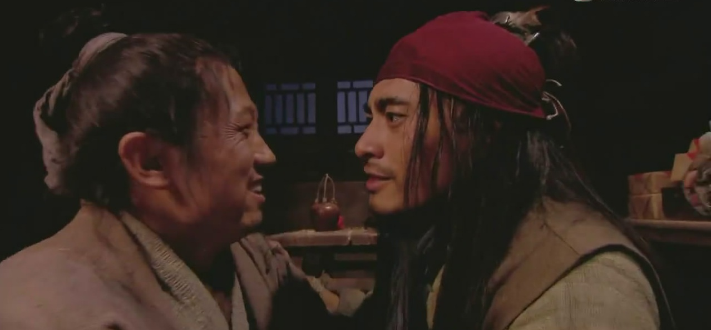

# ＜天权＞哥哥（上）

**紫石街武松走过无数遍，头一回是万众瞩目地被人敲锣打鼓抬过去的，仿佛是在梦里一般。武松内心却无欣喜，坐在轿上望着四周人头攒动，只觉得诬他为贼的商人在这人群里面，不敢赏钱的看官在这人群里面，懦弱怕事的老僧在这人群里面，他们所爱戴的不是侠义好汉，只是一个遥不可及的英雄人物，一个打死老虎的怪力武夫。只有被武大接到家中吃酒时，武松才觉得真正回到了清河。**  

# 哥哥（上）

## 文/刘铮（中央财经大学）

  **一**

又是站在县衙门口的屋檐下抬头看着天，武大觉得这几片云很是眼熟。

武松这次被收监是因为一拳把酒肆的小二肋骨打折了，还顺便打伤了几个酒客。如果跟上回一板凳打断王麻子的腿一样是关押三天，今天应该要放人了。

悉悉索索地，突然有雨点滴答在紫石街上，幸好提早收摊来衙门候着，不然可能会被淋湿吧。

门开了，一个土兵走了出来。武大赶忙迎过去，哈腰陪笑，捏了身上几个口袋，掏出半贯钱：“军爷，你买点酒喝。”

那土兵接过钱，原本虎着的脸也有了笑意：“武大哥忒客气了。你老弟没啥事，那天打了二十杖，凭他那铁身板，只算得打练筋骨。县官老爷说了，罚钱他也掏不出几个铜板，还是在土牢里关三天不给饭吃，武松的饭量咱衙门也养不起。”

“谢谢军爷了，武二以后要是再进去了，还请稍稍照顾一点。”

“哎，休说照顾，牢里最狠的狱卒都不敢招惹这魔星，你老弟就是牢里最狠的。大概还有几刻就该放人了，我先走一步了。”

等武松出来时，衙门的门马上又关上了，好像是怕他再回去似的。

武松回头呸一声，隔着门骂道：“等着瞧，老爷有朝一日拆了你们这狗屁衙门。”

“饿不饿？”武大从怀里掏出一包炊饼，尚温热。

武松接过饼咬一大口，嚼得起劲：“可恨那店家给差拨使了钱，我吃的那二十棒打得十足狠，害我半日不能起身，那棒疮到今也只好了大半。”

“嗯”，武大听了，点点头：“那店小二只怕现在还躺着不能动弹吧。”

“那厮也可恨，我不过一时手上没有现钱，赊了他几角酒，就揪着我不松。我把他推开，那厮就叫唤杀人了，听得我心头火起，擂他一拳。”

“哥哥不是不给你钱使，近来饼卖得不好，手上的钱吃饭都紧，你是知道的。你应该赊过几回了吧，那小二也不好做。”

武松嚼饼不言。

“这雨越下越大了，咱等雨歇了再行吧。店里还有几个客人是怎么要挨打？”

“他们在旁边起哄，说我八尺男儿喝酒的钱都没有，还要靠一个侏儒养活……”

“……”

“他们也没说错”，武大显得很局促，眼睛瞧着脚底下，显得更矮小：“我是天生个子矮。”

武大生下来时，脸如树皮且身形佝偻，爹娘也没对他期望太多，好歹养活就行。

武松从小就浓眉大眼仪表堂堂，还有点过于强健威武。爹娘对小儿子也就视若珍宝、寄予厚望。尽管闲钱不多，还是请家教先生教武松识字念书，念着他有一日考取功名、官袍加身。武松年纪越大对先生越烦，直到一天抢过戒尺把先生打跑了，那年武松十岁。

爹娘又从武松身上看到了习武的希望，虽然耗资甚巨，还是咬牙将他送到武馆中跟师傅学刀棍拳脚，念着他将来在边庭使得一刀一枪，博个封妻荫子。

不料武老爹一日发急病暴亡，武大娘坚持让武松继续留在武馆，于是省吃俭用、日夜操劳，却在三个月后过劳猝死。断了供养的武松被师傅冷言讥讽，悲愤之下出手将师傅打伤，第一次进衙门。那年武松十三岁。

那年武大也只有十五岁，他跑到别的县学得做炊饼的技艺，此后便日日挑着担当街卖饼，养活自己和弟弟。弟弟自视甚高，而且从小没干过活，这种事情他是做不来的。

武松成了清河县有名的闲汉，饱食终日，四处晃荡。他爱凑热闹，好出风头，死撑面子，又受不得讥讽，自然隔三差五会与人打架。

武松瞧不起武大，觉得卖烧饼的人绝非好汉，但也承认他确实是个好哥哥，因此敬他爱他。

武大经常担心武松饭量大吃不饱。

武大有时卖着饼也会向人夸口自己有个弟弟能把三百斤的大石抛起作耍。

天整个昏暗了，大雨似泼地般倾下，耳里净是哗哗的雨声。

两人等乏了，索性坐在门前的台阶上。武松身上的衣服是新做的，尽管这几日被折腾得黯淡了，武大还是舍不得让衣服淋雨。

“武二啊，我觉得你以后可以当个步兵都头，手下管几十个兵。咱清河县的都头我瞧他在拳脚上就比不过你。”

“呔，这都头只会每日去衙门画个卯，然后坐下喝茶。真要跟我对上，三拳打得他趴下。当个都头有什么意思，每月领得几个钱？县官家里有宴席时还要在旁边伺候着，跟家仆有什么两样？”武松很嫌弃这个志向。

武大叹口气：“我是想呐，要是你当了咱清河的都头，能慑得那些地痞无赖少作恶。当年要不是那群泼皮逼咱娘纳捐，娘也不至于累死。我总惦记这事。”

武松也被触到了伤痛，半响才回话，声音低沉了很多：“我以后会做一个好汉，行走四方，到一地就杀一地的恶霸。我想名扬江湖，受人称赞。我不想当官府的狗。”

“哟，大英雄是吃我的饼长大的，真是高兴。”

 **二**

等武松再回到清河县时，他成了县里的都头。

盼得武松回了，武大那张树皮也似的脸笑成了一朵花，赶忙把他拉到家中吃酒。

武大很少沾酒，两杯下肚脸就红了，絮叨起来。

我当时正在路边卖饼，突然听得一声“打虎英雄来了”，遥遥望见一大群人堵街塞巷地涌过来。前面的人敲锣打鼓，后面是几人抬着那景阳冈的死大虫，再后面是打虎英雄挂着红缎子坐在轿上。我看那人的身形姿态有八分像你，赶忙扔了摊子奔了过来。

我个子太矮，凑近了倒只能看到路人的脑袋，正跳着脚想瞧一眼。旁边有人说道：“那不是武二吗？在外头闯荡了两年，回来就做了一件大好事。”我听了心头一惊，直似半夜捡了元宝般欢喜。

又听得有人赞：“不是这个威武汉，怎地打得这个虎！”我真想扯着他说那英雄叫做武松，是我亲生弟弟！唉，不过凭我这摸样，只是惹人笑话。

眼见他们抬你进了县衙，我挤不进去，只得靠在别人背后听你和县令相公说话。听得你说：“小人托赖相公的福荫，偶然侥幸打死了这个大虫，非小人之能，如何敢受赏赐。”我只捂着嘴笑，武松在外头磨了两年，回来会说话了。

县令说要参你做县里的都头时，我心一吊，生怕你回他一句：“我不想当官府的狗。”你又道：“若蒙恩相抬举，小人终身受赐。”到底是出去见过世面了，讲话体面有分寸，这话我就说不来。我那混账弟弟终于晓事了。

这两年没有你四处惹事，我算不受苦了。只是有时路过县衙，总觉得你正在里面吃官司，我要在外听候。还有趁你不在时，紫石街的那群恶少都来欺负，常想要是你这个祖宗在，谁敢放个屁。

你这一出去真是一点音讯都无，你要是死在外头我就在家给你设个牌位祭你，你要是没死总要托人回来报个平安。你这好死不死的，我端午要多包十几只粽子，重阳要多买几斤雄黄酒，就是不见你回。

你当初说要打赢几个成名人物，杀几个恶贯满盈之人再回来。你就是这样死性，没干成事连音讯都不给一个回来。你要是不成名就不是个人吗？就不是我弟弟吗？我就不会挂意你吗？颟顸畜生恁地可恶。

嫂嫂，你出去再买些酒肉果品回来，叔叔饭量大酒量大，只怕还没吃痛快。

武二，你瞧我这新讨的嫂嫂如何？模样还过得去吧。我这一世本不存婚娶的念头，不想你这煞星去了之后便运转了，非但屋子赁了间大的，还娶了个人。你嫂嫂原是县里一大户家的使女，主人要缠着她，她不肯依，那人记恨，就赔了些嫁妆将她白白地嫁给我。

我晓得自己模样骇人，那主人是要存心作践她。只是既然命里有安排，我就好好待她，须使她不烦恼，她也是苦命的人呐。你嫂嫂做得一手好针线，饭菜也做得好，家里的事样样顾得来，我时时感激她。

我常向嫂嫂念诵你，今朝望着你来了，她也高兴坏了。

武大边说话边喝酒，越醉话越多。

最后武松将他扶上了床，他眼直直地看着武松，嘴里仍自含混不清地念叨：“你嫂嫂跟我说了，亲兄弟不比别人，我为你清了一间房来家里过活，你若不搬来，我两口也吃街坊邻居笑话……”

武松走时，嫂嫂亲送出门。武松道：“夜深不便，且在衙门里再歇一宿，明日带铺盖行李搬来”。

妇人道：“叔叔，是必记心，奴家在这里专望。”

 **三**

踏在熟悉的紫石街，月光如水，树影柔和，街边的房舍中传来细细的鼾声，每一步都能听清自己的脚步声，武松觉得自己很久没有像这样踏踏实实地踩在大地上。过去的两年，每一天都是像踩在棉絮或是荆棘上，内心不曾如此安逸平和。

行走江湖的滋味他尝到过了。

在伞盖山，从剪径强人手中为行商夺回了财物，商人掏出五两银子作为答谢，武松从小不会谦推，也就受了。揣着沉沉的五两银子，武松决定护送他到县城。经过县衙时，那人突然揪住武松不放，大喊贼人在此，将武松告官，说他勾结强人骗取财物。

行经揭阳镇时，盘缠用尽了，寻一个行人繁密的地，耍枪棒讨赏钱。围着看的人多，喝彩的人多，把盘子递了一圈却无人给钱。武松浑身才学使尽、好话恶话都说了，看官们仍自不动，白耗了大半日气力。有人悄声告诉武松，他在这地头卖艺未曾先去拜会穆家兄弟，这俩霸王吩咐了诸人分文不要赏他钱。

在瓦官寺投宿时，见得庙里颓圮破败，只剩三五个面黄肌瘦的老僧，围坐着等一小锅粟米粥熬熟。老僧们谈起歹人占了寺庙，逐走群僧，卖了物资园土，又强抢邻村的民女，终日饮酒作乐。言及痛处，恨不得食肉寝皮。武松听了心动，走上前想问个仔细，老僧们却惶恐缄口。武松再言要除此祸害，众人好似躲避瘟神般起身便走。

这江湖远非说书先生口中那般壮烈古风，这世道并不喜欢好汉义士。

身无分文走投无路时，武松仍不甘心就此灰头土面地回到清河，听闻横海郡柴进仗义疏财招贤纳士，便去沧州投奔他。柴进赏识武松的武艺与豪气，尊他为上宾。武松常醉酒，性格急猛，庄丁招待不周提拳就打，久之整个柴家庄没有一个道他好的。众人常在柴进面前说他不是，柴大官人虽不赶他走，渐渐待他慢了。

武松在柴家庄患了疟疾，无一人来问讯。他架不住身上阵阵发冷，讨了一只火盆在走廊烤火。那一个孤寒的夜里，黑暗无人的走廊上，武松像只狗一样蜷缩着身体，偎着火盆，突然念起武大，想起这世上只有哥哥会不休不竭地欣赏他待他好。武大性格懦弱，佝偻乏力，自己走了之后只怕县里的泼皮无赖都会欺负他。

武松突然失声痛哭起来。

后来，武松认识了郓城押司宋江。宋江杀了一个烟花妇人，带着弟弟宋清来柴家庄躲避追捕。见他兄弟二人相亲相爱、形影不离，武松记起幼时家教先生带他念的一句论语——“人皆有兄弟，我独无”，再也按捺不住，当下清点行装，辞了宋江与柴进，往清河县行去。心中只念着要见哥哥，半刻也等不得。

行到半路，武松醉上景阳冈，打死了一只祸害多时的大虫。

武松两年里走遍四方，想做英雄而不得，老天就是如此作怪，偏让他在离清河还有十几里地方功成名就。紫石街武松走过无数遍，头一回是万众瞩目地被人敲锣打鼓抬过去的，仿佛是在梦里一般。

武松内心却无欣喜，坐在轿上望着四周人头攒动，只觉得诬他为贼的商人在这人群里面，不敢赏钱的看官在这人群里面，懦弱怕事的老僧在这人群里面，他们所爱戴的不是侠义好汉，只是一个遥不可及的英雄人物，一个打死老虎的怪力武夫。

只有被武大接到家中吃酒时，武松才觉得真正回到了清河。

武大攥着他的手直唤弟弟，武大那张丑脸醉得通红，武大含混颠倒地说酒话，胜过所有的赞誉与奖赏。吃饭时突然碗一沉，嫂嫂拣了一大块肉夹给武松，武松只觉得鼻子一酸，借着酒盖脸，赶忙揩眼角，自娘死后再也没有人给他夹过菜。

如今成了县里的都头，往后每日去衙门画个卯，做好分内的事，与人应酬往来不失身份。等攒够了钱就挨着哥哥起一幢房屋，娶一个勤劳本分的姑娘，生几个孩子，教他们识字打拳。

下半辈子，武松不图声名与富贵，只求一点关切与真感情，便足以活下去。

夜深无人，武松踱步在紫石街，数着道旁一间间亲切的店铺：姚二郎的银铺，赵四哥的纸马铺，张叔的馄饨摊，胡太公的冷酒店，徐三的枣糕店，再过去，就是哥哥摆摊的地方……

等得天明了，又会是热闹祥和的光景。

 

（采编：麦静；责编：麦静）

 
