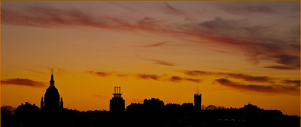
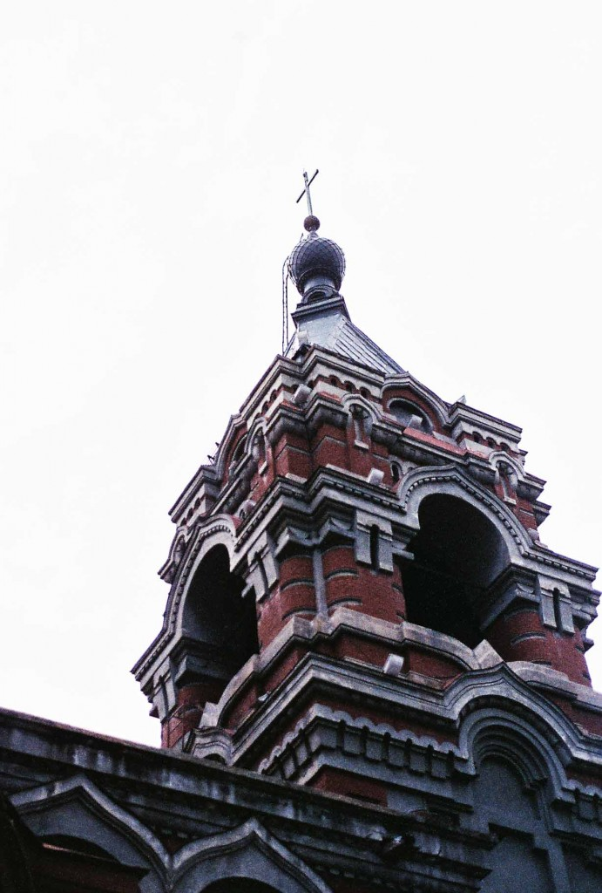
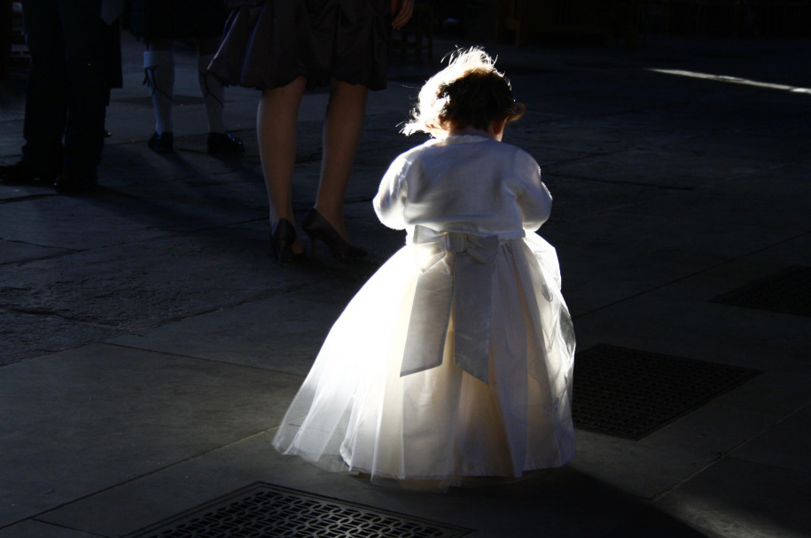

# ＜天权＞哪里跑

**其实跑路最好，免费去享受人家奋斗来的果实。可是你的思维、语言、食物都有隔阂，找不到那个想起来就让你下体肿胀的大奶子姑娘找不到那个能拉过去就躲进永和豆浆喝酒吃肉的老王，你的心灵没有归属，作为一个有良知的人，你的内心会煎熬。** 

# 哪里跑

## 文/王鹏宇（University of North Dakota）

 

#### 1 通灵术

人生最美的遭遇都在意料之外。

从斯德哥尔摩的地铁站出来，扑面而来的从四百年前到一百年前的老建筑，红的黄的黑的古铜色的白颜色的五颜六色的墙壁和红的黄的黑的古铜色的人群，广阔的河滩和在河滩上悠然散步的海鸥，聚集在屋顶上密谋夺取人类都不敢打扰的海鸥政权的鸽子，几百年不变的雕像已经硌了几百年脚的青石路和几百年没变过的阳光。行走在古城区，大脑是多余的产品，我用我的眼睛思考我用我的肺感知我用我的鼻子来品尝。

三栋小楼的交界处有一个门面很小的小屋，老板也不立什么牌子，走进去里面大大小小都是当地画家画的油画。这幅躺在不显眼处的画立即吸引了我。因为淋过雨而变成了暗棕色的墙壁，夜色下更显幽暗而绵长的青石小路，墙壁上的窗，和窗子里，小路上反射出的摇曳蜡烛光，远处是两个撑着伞密语闲谈的人。几乎是在顷刻间我穿越时间空间，化身画中人，我听得见周围啤酒馆的喧哗声我看得见因为雨水更加有质感的烛光我闻得见那贰佰五十年前空气的味道，炉灰渣鸟粪树叶上的灰尘和不知道怎么溅上去的泥点子混合着从树根到树干再从树叶边缘分泌出来的代谢物集中在的那一颗雨水里，我犹如亲眼目睹，滴落在我身边姑娘的肩上。我和这幅画一见钟情。

倾家荡产地买回来，放在包里，长出一口气，推开门，和老板再见，走出去的刹那又被惊讶震撼得鸡皮疙瘩林立，眼前的景色，分明是画中物，二百五十年一样的墙，一样的树，只缺少黑天，和雨路。提着画走在路上，这次我分明就是画中人，也许有哪位画家也在画这午后的小街吧，二百五十年之后，同样的画作也叫一位来自地球那边某位男女魂不守舍，穿越时间空间，灵魂附着我的体。

#### 2 弥赛亚

下午最不该做的就是跑到西什库天主堂做弥撒。听到一半就实在听不下去了，如果国内的神父都是这样传道的，那怪不得我们的天主教就只能忽悠底层民众了，任何一个有独立思考精神和道德操守的人为我们的神父折服了才是怪事。来北京一年多，大小教堂去过几个，能安下心来做礼拜的地方真少。经过政治阉割，经过中共改良的宗教已经变味了，传道手段越看越像我党洗脑：恫吓与威胁，赎买与诱惑。

教堂奇怪的建筑风格，中式的人物画像，教堂内五颜六色的彩旗标语，土洋结合还挂上对联，最不舒服的是做礼拜的一双双恶毒的眼睛，空气里弥漫的依旧是自私、戒备、无爱的气味。你坐在人们身边，依旧地小心翼翼。神父在上面说：你号称信了主的道，却还是吸烟、吸毒、嫖娼，不做个好爸爸，不做个好儿子，不做个好丈夫……神父又说，两会召开时，胡锦涛说过的这个幸福指数，全球幸福指数最高的是墨西哥，第二是菲律宾。为什么？因为墨西哥80%的人信奉天主教。你看菲律宾地震海啸频发，为什么那里的人快乐，因为他们信奉耶稣啊……神父，我不得不怀疑你的职业水平和道德操守。

主，想认识你，亲近你，总是艰难又坎坷的。

你是皮特，你是磐石，你是我的弥赛亚。

#### 3 王鹏宇你好啊

巧起来它就是能比小说还过分。

现在越来越相信一见钟情，总觉得一个人的境遇，思想，信仰尤其是心境，都会明白地写在脸上，喜欢还是不喜欢，看一看，闻一闻，三秒钟，胸中自有分明。上次去曼谷，看中一个石刻的烛台，小和尚撑船渡江，船前面搭了一个台子，安放蜡烛。小和尚眉目分明，安详自得，看了就欢喜。一问价钱，太贵，但又喜欢的紧，和店主砍价“400？Too much. Could it be cheaper?” 店主笑呵呵的指指小和尚，用不很灵光的英语说：“You, look like him. OK,300.”然后还要再送我两个木雕的树叶。弄得我高兴又羞愧了一下午，有佛相的人不会这么不要脸地使劲砍价吧……女人还好，可以蒙骗她也蒙骗自己，我和你一见钟情，这是其实是因为你奶大腿长口活好，而你一眼看上一个男人，死活觉得跟他以前认识，你们俩肯定有相同信念相似经历你们必须成为好朋友，这个就太说不过去了。

我们是在张鸣出他的新书讲辛亥百年时认识的，在雷颐的辛亥百年又见过，后来又在大小讲座里照过面，因为机缘巧合或者说是不巧合吧，不是他忙就是我忙，从没好好聊过。这次傅国涌的辛亥百年里他又来了，不能再放过，拉去吃饭。

从路上就开始聊，从开始就知道了，我们都是在不投缘的人面前木讷，在缘分面前，都是他妈的大话痨。从单向街还没到地铁站呢，我就简明地知道了他的身世，基本上是男人的榜样，混完大学混街头，年轻时全国从南到北转了一圈，连好多小地级市都呆过几年，在辽宁某地和退伍军人、艺术学校老师、没落子弟等人结拜，混吃喝，让我想起了孔二狗的《黑道风云二十年》，说到得意处还和我吹嘘，“当年那条街，原来混的一帮人的大哥见了我们都是要上烟的。”说到和某艺校留着黑长发的帅老师结拜泡妞时眉飞色舞，我眼前浮现的分明是蒋介石和戴季陶，我差点八卦地问他你们有没有留下蒋纬国做当年证物，哈哈哈哈。泡妞泡到了真命，轰轰烈烈地谈了场恋爱，后来不出意外地谈成重伤，家财散尽。现在辞去闲职，流落北京，研究各种不靠谱的学问多时，准备下周回宁波老家，做老本行，开个财会公司，四十多了，得挣点钱了。和老哥谈天说地，由敏感词说到敏感词，再到敏感词，不亦乐乎；请老哥吃饭，永和豆浆吃盖饭，不亦乐乎；老哥突然问我，你信面相吗，其实面相有道理的，点头称是，不亦乐乎；老哥突发感慨，我已经成为农二代，有家回不去了，在家里已经没有人能这样在马路上邂逅，拉进馆子谈天说地喝酒吃肉了，价值观相差太远，只有北京上海养得起我了。惊诧莫名，点头称是，不亦乐乎。

临走，老哥说，能结识你，不亦乐乎。我说，留个电话吧，可以联系。老哥说好，掏出电话，问，你叫啥。我说我叫王鹏宇，老哥惊诧莫名。我说老哥你叫啥，老哥说，我也叫王鹏宇，王鹏宇的王，王鹏宇的鹏，王鹏宇的宇！

#### 4 魑魅魍魉

找到了个好网站，有禁书的音频在线，坐着看电脑玩累了就找出来倒着听，我把床拆了只睡床垫子，近似于榻榻米。刘结巴同志的某国沉沦做铺垫，听到拉萨1959时不觉发现自己睡着了，又醒，也不知道是几点，抬眼望见黑洞洞的卧室门，音响里还说着当年康巴抗暴运动和后来的屠杀，脑子里的妄想又起，总觉得那个门里要爬出来一个什么怪物，人样的脑袋绿眼睛，蜘蛛的身体八条腿，简直分分秒就要爬进来，吓得自己不敢睡觉，心里腾腾跳。呵呵真逗，都多大了，还会吓唬自己相信怪物。

从三号会所出来，真后悔下午参加了这个沙龙。会上大家踊跃发言，甚至说出了只是因为西方国家现在领先，所以我们才来找原因说他为什么领先，如我们现在军事世界第一能两个大洋同时作战货币是世界储备货币那西方又该来说为什么我们领先了这样的胡话，一个搞金融的能说出其实我不觉得我们现在落后了这样的话。我真想替他喊一句我党万岁万岁万万岁，夸他一句你真是马列主义好子孙。

小孩获取知识最主要的渠道是课本，成年人最主要的渠道是媒体，在由我党控制的课本和媒体对历史大肆地篡改和隐瞒真相后，我们自觉地生活在大国盛世之中，自主地选择遗忘。对智慧的渴求难道不是天生的吗，对真相的渴求难道不是天生的吗？最奇怪的是为什么貌似读了很多书，知道各段历史的人会思考出这样的结果，我们和平崛起，我们伟光正。

我想起了我从小就受到的残暴教育和仇恨教育，我们所有人都是被这么教育着长大的吧，致使我至今都在拔毒刺而拔不完，致使在思维方式上和思考能力上先天不足，更可怕的是对人心的糟蹋，暴虐和孱弱，连着心长着肉，使我无数次地遭到拷问。从小就没有体会过有无私的爱，没有感知过正义，我们不相信正义和爱的力量，不相信正义和爱会有力量，甚至不相信会有正义和爱。 也不知道这是谁的悲哀。

魑魅魍魉。

能做的，只剩祈祷了吧。

#### 5 哪里跑

其实跑路最好，免费去享受人家奋斗来的果实。可是你的思维、语言、食物都有隔阂，找不到那个想起来就让你下体肿胀的大奶子姑娘找不到那个能拉过去就躲进永和豆浆喝酒吃肉的老王，你的心灵没有归属，作为一个有良知的人，你的内心会煎熬。

哪里跑。

能做的，也只有祈祷了吧。

 

（采编：麦静；责编：麦静）

 
