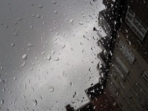

# ＜天权＞在我荒瘠的土地上，你是最后的玫瑰

**流亡的实质是流离所失，衣食不保，但从表象上来看却有种波西米亚似的的浪漫主义情怀。他行过许多的路，承受住痛苦进行战斗，他也去爱，去歌唱。在战火方酣的巴塞罗那，他拿出了《西班牙在我心中》，行经秘鲁高岗遗址，他留下了《马丘比丘之巅》。蕴藏在他内心世界的浓浓爱意催生了无数情诗，包括《船长的诗》。**

### ** **

### ** **

# **在我荒瘠的土地上，你是最后的玫瑰******

### ****

## **文/李嘉轩****(****北京师范大学****)**

### 

### 

你成为这些习作的读者而我成为作者，纯属是不期而遇的巧合。 --- Jorge Luis Borges 1. 请原谅我太爱博尔赫斯，必须用他的诗句作为开始。 

我能用什么来留住你？我交给你一条狭窄的长街、孤注一掷的日落、还有荒郊的冷月。

我交给你一个人的痛苦，他曾向那轮孤月久久凝望。

我交你我已死去的先辈，人们用大理石纪念他们的幽灵。

……

我交给你我写的书中所能包含的一切洞明悟力。

我交给你在生活中我所有的男子气概或幽默。

我交给你一个从未有过信仰的人的忠诚。

我交给你我设法保全的核心—不营字造句，不和梦想交易，不被时间、欢乐和逆境触动的核心。

我交给你,早在你出生前多年的一个日落之际看见的一朵枯黄玫瑰的记忆。

我交给你你对自己的解释，关于你自己的理论，你自己的真实惊人的消息。

我交给你我的寂寞、我的黑暗、我心的饥渴。

我试图用一切来打动你，用我的困惑、危险与失败。 

我想起了纪伯伦的字句，痛苦在你身上刻的越深，你能承载的幸福便越多。我寄希望于诗人们，希望他们，在被命运无情解剖之后仍能够用语言呈现这些伤口。我希望他们能够让诗句像刀锋般划过阅读者的心，然后撕开同样深刻的伤痕。 我曾在博尔赫斯的世界中埋没了若干日子，纠缠在他那无休无止的魔境、在他的时间迷宫中不能自拔。我将他奉为诗人的神明，我迷恋于他的时间和空间、生命和死亡、天堂和地狱、暂时和永恒、圆形和周期、镜子和迷宫、书本和梦幻、文学和游戏、黑暗和失明、神话和酒吧、匕首和决斗、骑士和恶棍、街角和郊区、月升和日落。博尔赫斯的寓意往往令人迷惑不解，因为他认为譬喻必不可少；他的诗句中往往充斥着大量的历史事件与人物、希腊神话与典故，因为他下笔之前总是善意的假定读者的知识面与他一样涵盖古今中外，可事实上我和大部分他的读者一样，对他的自由运用的庞大典故几乎一无所知。 他醉心于瞬间即永恒一类的话题，近乎固执的重复着他对无序性时间的偏爱。有时他让因果颠倒；有时他只承认现在；有时他干脆让时间停滞。“时空”这个在我们这里循规蹈矩的概念被他玩弄于股掌之上，拉长或压扁，扭曲或打结，多么奇特大胆的博尔赫斯式的幻想美学。他用无与伦比的清晰说：“时间是一切构成我的物质。时间是带走我的河流，但我即是河流；时间是烧掉我的火，但我即是火。” 

 2. 我迷恋一切诗，可诗是死去之物，是必然死去的爱情。 如爱默生所说说，一本诗集就是一个魔法洞窟，里面住满了死人。一首诗写完了，它的生命也就结束了，直到有人把它再次唤醒。就像柏拉图创造出对话录，复活了苏格拉底（对话录实际上是苏格拉底的语言，而被柏拉图说出），就像耶稣在四位门徒中重新复活一样，读者创造出了死去的诗，人，历史，还有汩汩流逝的时间。 譬如那部流传已久的荷马史诗，尽管历史早已尘埃落定，但还是在后代的阅读中被一次次唤醒，100多年前，波涛汹涌的特洛伊战争在一个叫约翰·济慈的诗人笔下复活，那是他荷马史诗的感受： 

之后我觉得我像是在监视星空，

一颗年轻的行星走进了熠熠星空，

就像是体格健壮的库特兹。

他那老鹰般的双眼，盯着太平洋一直望去。

而他所有的弟兄，心中都怀着荒诞的臆测彼此紧盯。

他不发一语，就在那大山之巅。

——济慈《初读查普曼译荷马史诗》

这几行诗真是巨力万钧，气势磅礴，震耳欲聋，古老的希腊和已经作古的查普曼在济慈阅读的时候恢复了生气。而我在某个夏夜轻声念出的时候，也唤醒了因肺痨病殁的济慈，以及那只永远吟唱啼血的夜莺。

四年前的上海，我还徘徊在诗歌的门外，在一本“一生要读的”的诗歌杂合体里看到那些有很常见的注释，如“博尔赫斯……阿根廷……生于布宜诺斯艾利斯……”之类的字句。于是不免想起来地理老师曾经灌输的概念：上海的对面，是一个叫做布宜诺斯艾利斯的城市，阿根廷的首都，拉丁美洲第二大城市。后来再去查阅资料，才知道布宜诺斯艾利斯在南纬34°西经58°，而上海在北纬31°东经121°，地理上称之为“对跖点”：在地球的直径两端相望，时差12小时，季候相反。

布宜诺斯艾利斯，读起来有长长的音节，恰到好处的节奏。西班牙原文是Buenos Aires，用我非常有限的语言知识来推及，可以勉强辨认出它的“好天气”的意思。从地理学的角度，这样的解释不免让人入迷。布宜诺斯艾利斯地处拉丁美洲东部沿海，属于亚热带季风气候区，夏季炎热湿润，冬季温和少雨，大西洋的巴西暖流由赤道沿着海岸线南下，带来温和的氤氲水气，化作博尔赫斯诗里的“湿气的蒸腾”（《南方》）和“潮湿的暮色”（《雨》）。Buenos Aires，那可是博尔赫斯和无数文人为之倾倒的城市，是胡里奥-科塔萨尔的《跳房子》，是黎耀辉与何宝荣的《春光乍泄》，是史诗《马丁-菲耶罗》和唐-拉米罗的荣耀，是贝隆夫人与阿根廷的哭泣。

我与布伊诺斯艾利斯相隔多远？其实很简单，如果步行，大概要花费三百个日夜，但是我如何放下手中的一切，去完成这场穿越地心的旅行？如果你我终将失去彼此，请跟随月亮飞离世界的尽头；你的小说里藏有世界的谜语，就像星星背后都藏有你的眼纹。

那是多么漂亮的一句情话，即便只是对一座城池而说。

3.

离开上海之后，我来到了几乎是这个国家最南方的城市。

这是我的南方：天空的颜色会在黄昏渐次变迁，不远处你就能看见就有一片小小的、有的点脏的海，海岸上停泊着许多不明归属的红头船。每天都会从山的深处升起低沉的云雾，它们时常遮蔽住你的太阳。树木在春天落下叶子，一也会夜之间开满新芽。冬天，风从南面的海吹来，你必须用帽子来遮掩被吹乱的发梢。

这是我的城市：这是一个有着玫瑰色天空的城市，地面上堆满了腐朽生锈的螺丝钉，还有那些废弃的巨大机器。那也是一个昏暗而迷离的城市，你随时都能看见那些用厚厚的妆容和冰冷的表情将自己全副武装的女人们。你能看见的是一个破落的城市，你闻到的是金属腐烂的味道。当然，你抬头就能看到太阳被刺穿，然后流出玫瑰红的血液。然后你看到那些在城市里的高楼，你也许能看到其中一颗颤抖的螺丝钉。是的，你感觉自己就是那颗被深深钉入现实的螺丝钉。

拂晓时分，我伫立在阒无一人的街角，我熬过了入夜之后最长的那段时光。我注视这那片汹涌而黑暗的大海，我幻想你随着巨浪而来。我尽情呼吸辛辣的灰烬与烟雾，我怀念着你转过身的侧影、组成你名字的发音、你有韵律的笑声。我把对于失去你的悔恨在黎明时向几条野狗诉说，也向黎明寥寥的晨星诉说。

世界已不再神奇，我在梦里见到钟表和微微颤动的睡着的鸟。所有人已离我而去，我不能再与你分享皎洁的月光和舒缓的花园，每晚的月亮都是我过去的镜子。我恳求我的神明或者时间的总和，让我的日子无愧于遗忘。我的名字像尤利西斯一样默默无闻，但是在宜于回忆的夜晚，或者在人们渐渐清醒的早晨，某些诗句得以以我的名字流传。或许只有在太阳西下那一方，你才能见到命运的原型和耀光。

我希望有一场大火烧干我的一切，在我身边只留下那些明明灭灭的灰烬。让它烧干我所有的知识、金钱，烧干我的笨拙的诗歌韵脚和愚蠢的文字，也烧干那片黑暗的大海、那轮孤月和那些疲倦的晨星。这样我就可以抛下一切，走到你的身边对你说：不如我们重新开始。

每个人心里总有一些遥远不可触及的事物，一个梦想、一个爱人或是一座城池。想起之前看过的一部讲述同性之爱的电影，故事发生在战火纷飞的巴以边境，两位主人公分属不同的阵营、拥有不同的信仰，但也彼此真诚相爱。在无法抗拒的命运与人生面前，其中的一人说道：如果注定有些事让我无法说出爱你的话语，那么是否可以用指尖划过你的眉头来表达？

最初读这句话的时候觉得无比浪漫，后来世事多舛，我才意识到爱一个人的过程并不会像电影或书本里那样，可以被些许文字详尽描述。我怀念过去的自己，希望听听不懂的各国语言，喜欢谈论死亡，脸上总能带着桀骜不驯的轻视笑容。但我也知道，一切经历过的时光都会倒塌。

对现在的我来说，爱情这个词更像是某种符号，仿佛每一场投奔流亡都必须要有一个有名字的站点。现在的我谈论爱情，其实沉默的心情要多于文字，没有任何哗众取宠的意思。

我们都是拼命向前走的人，我们都记得曾拥有过那么多的东西，在心里塞过那样沉重的爱。然而我们不停留，也不肯停留，我们只能一直走。别人只看见我们不间断的行迹，东面，南面，北面，这些方位是多么模糊抽象。年幼的时候，以为世界很大，什么都掌握不了。而长大之后，发现世界很小，却又其实还是两手空空。人生并没有丝毫胜利可言，挺住就意味着一切。也许美好的日子既出现在平淡如水的安稳中，也藏在水深火热的煎熬蛰伏中。

而我的南方，我的Buenos Aires，那个隐藏在黄昏、泛着金光的湖泊，就仿佛成为我久久遥望又永远抵达不了的目的地。

海明威在《白象般的群山》说：

男人说：我们可以拥有所有的东西。

女人说：不，我们不能。

男人说：我们可以拥有整个世界。

女人说：不，我们不能。

男人说：我们可以去任何地方。

女人说：不，我们不能。

4.

I no longer loved her, that's certain, but maybe I love her.

Love is short, forgetting is so long.

So, tonight I can write the saddest lines.

这种触动来自于一个智利的诗人，他叫聂鲁达，Pablo Neruda。他同样与那个属于博尔赫斯的Buenos Aires有所交集，和那个拉丁美洲最明亮湿润的城市有所交集。北岛在《时间的玫瑰》里谈到诗人们在这个城市里的交游：聂鲁达是当时智利派驻布宜诺斯艾利斯的领事，洛尔迦来阿根廷访问，不受博尔赫斯待见，却和聂鲁达一见如故。我心里突然高兴起来，我喜欢的一些诗人们竟有着这样的交集。就像我试图寻找自己跟诗歌的交集，然后以为这是缘分，一厢情愿又无端欢喜。

暮色中常常发生这样的事情，我脑海中浮现出一个人的影像，手中的书本掉落了下来，朝着暮色抹去远方一座座雕像的方向，就像你总是借黄昏隐没。当你离去的时候，是压抑的疼痛在我的心头盛开，如层层叠叠错错落落铺满整个五月的花朵。这是你最后一次让我承受的伤痛，而这些，也是我为你而写的最后的诗句。在诗集黑色的尾页上，这绝望的歌像撒在纸上的斑斑泪痕，流尽了那一次诀别的伤痛。

我迁延爱欲，我驰逐生死。我在揣测二十岁的聂鲁达，一九二四年时的聂鲁达，还有即将二十岁的我。这应该是一个为爱狂执、为欲迷魅的年纪吧。智利南方贫穷山脚下长大的这个年轻人，拎了几件衣物，披上了潮湿的斗篷、坐上了一列三等客舱的火车来到首都圣地亚哥。拥挤的校园街道，收容了他身无分文的生命；瘦长而高硕，一个苍白而浪漫的年轻诗人，经常戴著披风与宽边的帽子闲晃于街道。从智利到意大利再到西班牙，从城市到村庄再到荒岛，马不停蹄。流亡的实质是流离所失，衣食不保，但从表象上来看却有种波西米亚似的的浪漫主义情怀。他行过许多的路，承受住痛苦进行战斗，他也去爱，去歌唱。在战火方酣的巴塞罗那，他拿出了《西班牙在我心中》，行经秘鲁高岗遗址，他留下了《马丘比丘之巅》。蕴藏在他内心世界的浓浓爱意催生了无数情诗，包括《船长的诗》。

亲爱的，这样的诗人形象，让我想起了我们耽爱的普契尼的《波希米亚人》里的鲁道夫，在诗歌的王国里，他自比为丰美国度之王，在贫穷里赋诗、在绝望里诉爱。在一座空屋子里，我最后一次安静的念完博尔赫斯与聂鲁达的诗句，没有回声，却突然想起这么许久不见的你，而有了想与你说话的欲望。

亲爱的，你曾经离开了一座城、一座岛屿，偶尔回归，而后又准备迁徙、远离。还有谁更适合向我们绝望而美丽的青春述说阴谋与爱情？我在你体内众河吟唱，我的灵魂将消逝其中，如你渴求的；我的灵魂，将被你带到你所愿之处，在你希望之弓上，我瞄准我的去路；一阵狂热兴奋中，我释放我所有的箭束。

你是电光，你是雷火，你是神。我唯有膜拜，膜拜一个女人，一个爱神。我爱你时所有的女人都化成一个，所有的爱神都是一张脸。爱是什么？是痛苦、是激情、是期待，是另一个人给与你的欢乐和深情，是生命里不可或缺的养份，是自然力中最不可抗拒的作用。身在爱情中的人，总是一部分器官特别敏锐而另一部分器官特别迟钝，而我把灵敏的那部分器官全都用来赞美这人世间最难拿捏的那样东西---爱情。情诗，必有赋诗者爱欲的秘密托付，必可以复苏一个大陆的命运和梦想。

爱情只是一种温柔的暴动。

5.

聂鲁达形容自己的诗和生命就像美洲的一条大河，如同智利南方的一条湍流，浩浩荡荡奔向出海口。他把女人融入自然界，变形成为泥土、雾气、露水、海浪，企图藉自然和生命的活力来对抗僵死的城市生活，企图透过爱情来表达对心灵沟通的渴望，虽然爱情有时对我们来说相当遥远。

为什么每只爬行的昆虫都有自己的方向？鱼儿游来游去的时候会感到快乐还是忧伤？世上果真有一生只歌唱一次的荆棘鸟吗？蜗牛如果没有壳，它能变成蚯蚓吗？两个相爱的人死后，灵魂还可以相互寻找吗？当贫穷让我们颜面无光时，生命因何而光彩照人？

倚身在暮色里，我朝你海洋般的双眼，投掷我哀伤的网。夜晚的鸟群啄食第一阵群星，像爱着你的我的灵魂闪烁。因为你，当我伫立在鲜花初绽的花园旁边里，春天的芳芬使我痛楚。因为你，我喜爱睡卧在墓园里的白色雕像，那些白色的雕像默然无声，两眼一无所见。因为你，夏季沉闷的气息使我痛楚。因为你，我又去留意燃起欲望的种种标志，去窥视流星，去窥视一切坠落燃烧的事物。

在这里我爱你，在黑暗的松林里，风脱身而去。月亮在迷茫的水面上发出磷光，时光总是互相追逐。在这里我爱你，地平线也无法遮掩你。尽管处于这冰冷的万物中，我依然爱你。有时这些沉重的船会载着我的吻驶去，从海上驶向没有人到达过的地区。我想我已被人忘却，犹如这些破锚一般。我在黄昏时分停泊，这些码头显得格外凄凉。我对这种饥寒潦倒的生活已经厌烦，我喜欢我没有的东西，譬如那么遥远的你。我的厌倦与那缓慢的暮色在争辩，但是黑夜来临时，它开始为我歌唱。

我无法忘记阿波里奈的一句话，“请怜悯我们这些正在开拓非现实疆域的人吧！” 我记得在伊斯兰教的圣典中，有一个夜中之夜，在那一夜上天的所有秘密门道都会打开，瓮中的水会变得格外甘甜。在那样的一个夜晚，只要你足够虔诚，你就不会感觉到寒冷，你就会拥抱自己心中最隐秘的爱人与最崇高的神明，你就能采摘到这片早已荒芜的土地上最后的一朵玫瑰。

### 

### 

（采编：管思聪 责编：管思聪）

### 

### 
