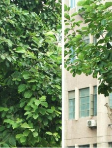

# ＜天权＞夏夔

**每年都有夏天，每年的夏天都有不一样的体验，郁郁葱葱的绿色覆盖眼帘，把浓郁、激烈、深稳内敛的气息一股脑儿地灌进你的脑袋，然后在燥热的空气里面被逼得大口喘息，仿佛就要透不过气来。**

**而总是有人在唱歌，虽然我起了这么诗意的名字，到头来还是写出了一篇这么现实主义的文章，唉，算了吧，终归是没有诗人气质，所以我从来也没能明白“恰似一江春水向东流”接在“几多愁”之后到底是个什么感觉。**

### 

### 

# 夏夔

### 

## 文/黄劲（安徽财经大学）

### 

### 

在夏天唱歌的神兽，这样的名字其实也蛮好听的吧。

每年的夏天都要来写些什么作为纪念，几乎年年不变，所以我给这篇文章起一个名字叫“夏夔”，就是在夏天必然要唱歌的怪兽，夏天这个季节，可以没有汽水，可以没有西瓜，但是真的不能没有音乐，和弦似乎由不得我们做主就在天空响亮地回旋，知了声声，鼓点一般从四面八方传来，淹没一整个夏天。

出于对夏天这个季节的无限热爱，这份赤诚每年的内容都有所不同，依稀记得最近两年一篇是用几个小故事组成的《献给夏天》，一篇是纪念暑假三人组的《琴弦》，一篇是非常非常“粘腻”的《意淫》，现在回头看这些曾经写过的东西，哈哈，还真是年少呢。

随后脑子里面出现的就是“老气横秋”。

紧接着出现的就是“从来都不曾什么什么”。

虽说每年的主题都不一样，但确确实实没变的是每年夏天的骄阳、明媚的天光和它覆盖住的，整个绿草茵茵的世界。

你会不会有这样的感觉？

击缶而歌的故事告诉我们庄子对于生命的洒脱和超然，伤逝的故事告诉我们阮籍对于爱情的执着和无可奈何，然而每天在我们生命里出现的故事，并不如书中来的那么简单和纯粹，不是借助于几坛子酒就可以消耗掉不开心的时光，不是和几个朋友出游就可以把脸上的忧愁淡化。相反地，十几年的学习教会了我们中国的一种传统写法，叫“以乐景写哀，一倍增其哀；以哀景写乐，一倍增其乐。”而我们在日常的生活中，似乎正在不厌其烦地用行动实践这一点。

但是，即使再好的修辞，自己对他人、他人对自己的不理解还是不理解，其实出于简单的原始判断，你就能摆脱那些繁复的、冗杂的社会意识影响，就像孩子们能很快地认识到谁是好人，谁是坏人，道理就是如此清晰，并没有什么难懂，也许上帝在创造人类的时候就赋予了人这样的能力，只是我们在以后的生活中把它抛弃了，或者没意识到就直接放弃了而已。

为什么不能简单一点地生活呢？

因为很简单，隔阂是无处不在的。

就像村上说的那样，我跟你说我的牙痛，你虽然知道我牙痛，但你永远也不知道我的牙到底怎么痛。

仅此而已。

写到这里，按照惯例，应该要开始描写了。因为在沉重的议论之后总要有些清新的景物描写嘛。

那今年的夏天，你准备写些什么，是芳香成海的香樟树，还是槐树下斑斑点点的日光。

今年我们写不一样的，我们来写人，男人和女人。

先写夏天的女人。

“娇柔一捻出尘寰，端的丰标胜小蛮。学得时妆官洋细，不禁袅娜带围宽。”

听说上帝把最美丽的曲线留给了女人，于是娇柔、灵动等等的词语从此与男人绝缘，在夏天的时候，男人们总是能大饱眼福，因为夏天是裙子的天下，似乎女人没两件裙子都显示不出自己女性的形象，而裙子的长短又因人而异，敢露出来的和不敢露出来的其实真的取决于裙子主人的爱好，你千万别多想了。

其实对于女人的欣赏，还在于她们散发出来的女性的魅力，这句话似乎看起来很废话，但是事实确实如此，你永远指望不上一个男人把头发慢慢拢起来的时候能有多少美感，可是女人就不一样的，她们慵懒的手法注定要在《吸引男人的101招》中间名列前茅，风中飘起的发丝被掖在耳朵后面，然后露出整个明净的脸庞，微微地再露出笑容。

她们会告诉你哪种冰激凌最好吃，哪种巧克力该用怎样的方式吞下去，她们似乎就是这样津津乐道，在冷气十足的玻璃窗内，静静地展现着她们的精致与抒情。

文章趋势止不住地要往艳丽的方向发展，这个时候应该赶紧打住，因为林语堂先生告诉我们，描写女人的时候，还是得适可而止的，否则深入下去，恐怕这个思维天赋异禀的生物也都要被神化了。

再看夏天的男人。

这个骨骼和肌肉都比女人要强大很多倍的生物体似乎身体里面只充斥着一种东西，那就叫做荷尔蒙。

夏天的篮球场上，汗流浃背和汗如雨下似乎是常用的两个词，当真的热到棉背心已经湿透了的时候就脱下来扔到一边，大吼一声继续发球，骄阳赤裸裸地灼烤着大地，男生们绷紧的肌肉，跳跃的动作恰如其分地印证了什么叫做太阳下面的刚烈。

而男人们的痛苦也是巨大的，他们承受着这个世间上除了分给女人的压力，所以说，他们除了不生孩子之外，其余的都归他们管。他们在夏天的早晨掀开空调被，光着脚，睡眼惺忪地跑去卫生间洗澡、刮胡子，然后穿上衣服，走出家门，开始一天的忙碌生活，他们身体里面涌动着的兴奋实在控制不了，于是痛苦降临在太阳升起和太阳落下的两个时间段里，不由自主。

而同时在脑子里铅块般沉淀的责任，也教会了他们在世界上什么东西才叫做担当。

所以他们又学会了忍耐。

紧接又学会了卖力。

长此以往。

便成了男人。

而这么多的男男女女，就构成了这个夏天里除了绿色之外的所有。

每年都有夏天，每年的夏天都有不一样的体验，郁郁葱葱的绿色覆盖眼帘，把浓郁、激烈、深稳内敛的气息一股脑儿地灌进你的脑袋，然后在燥热的空气里面被逼得大口喘息，仿佛就要透不过气来。

而总是有人在唱歌，虽然我起了这么诗意的名字，到头来还是写出了一篇这么现实主义的文章，唉，算了吧，终归是没有诗人气质，所以我从来也没能明白“恰似一江春水向东流”接在“几多愁”之后到底是个什么感觉。

所以，就这样吧。

这个夏天到底会遇见什么，会遭遇什么。

共同期待吧。

### 

### 

（采编：佛冉 责编：黄理罡）

### 

### 

