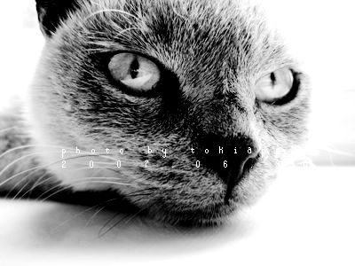

# ＜天权＞大河南街人物列传之猫王

**也有人开始低声议论起来他们离奇的群体性死亡，出现在这里难道是为了寻求主耶稣的庇护吗？而唱诗班的孩子一边伸着脖子看一边唱着歌，歌声飘扬在空旷的上方，暂时掩盖住死亡的嚣张。猫王的 “ 阿门 ” 声和着赞美诗的节奏成为一种新的礼乐。甚至在那声 “ 阿门 ” 之后，居然一堆人开始跟着一起低声 “ 阿门 ” 。他扔得很准，透过圆形窗口刺眼的光更准，把所有人都留在了黑暗的阴影里。**

# 大河南街人物列传之猫王

## 文 / 汪海鸣（上海戏剧学院）

 

每一个第一次站在大河南街的人，都不需要被人告诉，哪些是家养的，哪些是野生的，大河南街的孩子是一个专有名词，他们有几个硬性指标。

首先父母都是街上的生意人，也仅限前街的服装批发，后街的烟酒糖货市场，大河南街前半段的小吃摊子馆子，后半段的百货批发，至于西边横着巨大广告招牌的商业街，东边东仙桥的北环城路，那是另一个世界了。

其次他们都是三不管的不良少年，从学校到家长都没人指望靠上学出来的，打架闹事是不被准许的，当然如果在群架里吃亏，父亲会操着刀开着拉鸡毛的破车前去救援，开杂货店的母亲被一群混混打断了鼻梁，不会有人阻拦一边沉默地掉眼泪一边打电话预谋一场复仇的儿子，一栋楼着火后没有人比这帮孩子更知道幕后的真凶，而他们的帮派之间也界限分明，甚至有苛刻的秩序。

不管在迪厅里突击到的一群着迷摇头丸的少年，还是在梧桐雨枪战的参与者和目击者，不管在游戏室里拿刀互砍的五颜六色的脑袋里，还是在巷口喝醉睡在垃圾旁的呼噜声中，你总能一眼就捕捉到大河南街的味道，那是一种烟火味，一种你生活在其中，便永远无法摆脱的，大河南街的标签，是和劣质的奇装异服，染发，刺青，打架，辍学，早恋，暴戾情同姐妹的怪胎，并且很快参与到家族生意 —— 那一些最底层的职业里。

当然，你们大可以在一些最低俗的小说里找出我所描写的场景，他们早已穷尽了我的言辞。在座的有些观众假如有所耳闻，哪怕不了解我对于真实生活素描一样苛刻的本性，也会从过往的生活里寻找到蛛丝马迹的证据，而对此惊骇不已。

我初中才到大河南街，这里的帮派和历史我和你们一样仅限于道听途说，对于还原他们我也兴味索然，脱轨的生活使得一切超现实的厉害，我要讲的，是另一个故事，一个大河南街的孩子，他们叫她，猫王。

大河南街有多少猫呢？ 90 年代上半期这里曾经盛行养猫，一只普通的狸猫都可以卖到 20 块钱一只。每家院子里都有一只猫。他们大肆繁殖，母猫因为小猫的市场繁荣而备受宠爱。中午从街上回到家里，一路上可以闻到煮猫鱼的难闻的腥味 —— 他们在买菜分分计较时向来不吝啬花上一两块买些小鱼儿。去街边吃碗馄饨，十几平方米的店里也可以见到两三只。在某些夜晚，这些生物和新生的婴儿发出和谐而扰民的声音。

然而，不知道从哪一天起，晚上十点钟以后骑着自行车路过漆黑的街道，会看到中央的垃圾堆旁四下逃窜的一堆野猫，他们转身两步，发出潮湿而警戒的绿光。从每晚新出现在街边的流浪猫的数量上，终于可以判定猫作为宠物的身份已被遗弃。

就是在这样一个晚上，非常安静，只有一两家晚收的饭馆，发出盘子坠到水盆里的单调的声音。我坐在门口百无聊赖地发着呆，突然听到一阵风声。来自巷口深处，从前街传来，因为安静和回声而有了千军万马的效果，他们好像打游击一样走走停停，那是一种动物脚上肉垫踩在灰尘里的特有的声音。

我听见刷盘子的手停下了，人们走到店门前，临街楼上的窗户都是黑的，没有人注意到这种好像阴兵过境的鬼气森森。我站起来，看着黑暗的巷口深处，我妈从后面出来，站在我旁边，忽然我看见一群猫，身形大得跟狗似的，白白黑黑，花花绿绿，大概有几十只，呈扇形从巷口喷射出来，沉默着往东边跑，接着是一个孩子，大概十三四岁，跟在后面，光着脚，穿了一件破裙子，吹着口哨，猫慢慢停下来，孩子抓起两块砖头，往巷口里砸去，听见那边传来男孩子的尖叫和呻吟，还有渐渐隐匿的脚步声。

孩子跳了起来，表示欢呼，冲进猫群里，往东边跑了。这一切发生地极其迅速，好像一场幻觉。母亲叹了口气，说，越来越野了。

这是我第一次看见 “ 猫王 ” 。猫王最有名的是那群猫。他们都说宠物会渐渐长成和主人一个习性。这句话我是信的。谁家的猫狗出来，一眼就能认出来。而猫王的猫，自从跟了他，也就和猫王一样，不敏感，不怕人，甚至有一种莫名的清高。他们同样有着昼伏夜出的作息，不和任何地痞流氓有所瓜葛。

想说猫王，要先介绍一下那些猫，有些是失宠的，那只领头的最大的白猫就是，原先是街头拐角一家批发铝锅的老太太的最爱。没有生意的下午，两条街的人都可以看见老太太叼着烟抱着猫和路过的人搭讪，直到老太太突然死了他们才知道她原来也是有儿子的。陌生的儿子和儿媳妇顺理成章接管了铝锅店。然而大白还在赖在那里不走，大门半个月后第一次打开，开门了三天，儿媳妇才从重重叠叠的铝锅底下发现它。他们认为这很不吉利。于是儿子操起铝锅砸向一动不动的大白 —— 他们原以为它会跑的，是的，他们只是想要吓唬吓唬一下它。然而大白死了心要待在那，铝锅在猫身上发出钝响，大白站起身，抖了两下，又歪倒，撑起前爪，晃了晃，摇摇尾巴，走了。

有些呢，是离家出走的。卖菜的罗锅腰有一猫一狗，猫和狗在一个窝里长大，幼年时期猫的成长发育是喜人的，每每清晨罗锅腰打开店门，都会看到狗脸上几道血琳琳的抓痕，呜呜跑着冲到罗锅腰脚下蹭来蹭去，黑猫是不屑的，自顾自在那舔爪子，自然是迎头挨上一脚。然而在某一个节点以后，狗狗突然一夜之间长成了巨狗，罗锅腰打开店门时，黑猫冲出店门，上墙往后院逃跑了，再也没有出现。当然，每到夜晚，罗锅腰关在店门的狗总会踢门叫唤，这时候因为警觉路过店门的人，总会看到一只黑猫蹲在门前舔爪子。

还有一只大黄，因为不满被主人关在楼房里，在一个月黑风高的夜晚，从阳台三楼跳了下来。

有些呢，是猫王直接从垃圾堆旁拎回去的将死未死的小猫，猫王总有办法让他们茁壮成长。直至后来，有些人家会把一窝小猫直接放在猫王门前。

可见猫王的猫，也是一个专有名词，他们可不是会在垃圾堆旁出现的垃圾，他们意味着可以肆无忌惮地偷窃。事情最初的时候这当然是被禁止的。

有一只猫王最爱的白猫，也就是大白，和那些贪恋火腿肠的没出息的猫们不一样，对于冷鲜肉店的大块猪肉和灌香肠情有独钟。双汇冷鲜肉的老板在遭到手法高明的连续失窃以后拿着棍子连夜埋伏，等到后半夜进来的梁上君子居然是一只大白猫。由于作案经验丰富，加上黑灯瞎火的天时地利，大白甚至在香肠和冷鲜肉的选择上犹豫了一会儿才下手。它灵巧可以说是优雅地钻进了冷鲜柜台，在肉老板发光的小眼珠子底下，叼走一大块一号肉，往铁门最上方的狭小的栏杆里一跃，全身而退了。可怜了挪动着肥胖的身躯的肉老板，在挂满了香肠，堆满了绞肉机器的小门面里滚来滚去。

这只猫惹火了肉老板。肉老板不是这么容易被惹火的，他气急败坏地拉开铁门，冲到街上把棍子冲着那团白甩出去，棍子发出砸在地上生冷而委屈的声音。他狠狠砸了一下铁门，在十一月的寒风里转悠了一下老鼠眼，静静回了家。

第三天凌晨两三点，收垃圾的老头儿最早发现肉店门前大白猫口吐白沫的抽搐着的尸体。当猫王赶来时那只是一堆轻盈的绒毛了。在大白猫的旁边，还放着一块后腿肉。肉老板还在店里呼呼大睡。猫王什么也没说，抱着猫，安静地走在空无一人的街道上。他赤着的脚就像猫脚儿的肉垫，发出窸窸窣窣柔软的喘息声，消失了，像从没来过一样。太阳出来后，这件事就和夜晚一起消亡了。

然而在当年的年夜上（大河南街很多人的家和店是在一起的），肉老板正在里面哼着小曲看春晚，等着店门前的锅里咕嘟咕嘟地炖着的肉，生意太好了，简直忙不上吃饭。夜里的流浪汉决定今晚驻扎在附近，可以多闻两口肉香。我和母亲也在店里，那时候我记得还不到十二点，街上还很安静，忽然听到一声巨响，简直是爆炸了，母亲说，谁家的鞭炮，就响一声。话还没落音，只听肉老板浑厚的宛如美声一样的咒骂声回旋在街道上。我走出门，远远看见肉老板门外的小炉子已经散开在街道上了。从肉老板断断续续的咒骂声里除去祖宗爹妈等关键词，我听出来有人把他的肉盛走了，剩了个空锅，炉子里塞了个最大的爆竹，不，也许是烟花，总之，他炖着肉排骨加黄花菜的小空锅和炉子一起飞上了天。烧红的炭火四溅，打响了新年的第一炮。很快年夜的钟声和真正的鞭炮声就蜂拥而至，争先恐后地地淹没了肉老板的咒骂。

而此刻，猫王和他的猫们，已经舒服地坐在了另一家店的墙边。分配这样一份新年大礼着实让猫王费了点神，然而很快，所有的猫和猫王，就一边啃着骨头，就一边隔着窗户伸着脖子看那个叫周杰伦的在屏幕里活蹦乱跳了。玻璃窗很好得隔了音，然而反正满街只有春晚的声音，也照样看得欢乐无比。

自不用说，肉老板和猫王这一仗，算是平手了。

要说打架，猫王是打不过街上任何一个人的，然而说也奇怪，好像猫王也被划到了猫的领域里，和他们两不相干。但是谁要是惹到了猫王的猫，那就等着吧。

卖藕粉家的男孩其实也不是真的热爱欺负流浪猫，只是他妈骑着三轮车回家的道儿必经过的大河南街，街上的野猫实在是漫长归途中有趣的消遣。在不知道有猫王这号人物存在的关键前提下，这个缺心眼的孩子犯了个大错。假如生意不好，冲藕粉的开水总会剩下一些，他就会把开水倒在一次性杯子里，坐在后边的三轮车上，看见路过的野猫就泼上去，在它们奇形怪状的呼喊声里流着口水呵呵傻笑。他妈自然是不管的。

比起那些虐猫来说，这些小恶作剧实在不算什么，然而他不该泼的是猫王的猫。可不幸的是，没有人告诉他，大河南街夜晚出现的猫，都是猫王的猫。

于是在不久以后，每天从街上走路过巷口时，总会冲出一个人，他甚至连脸都看不清，就被泼了一杯开水，母亲反应过来时早就什么都听不见了，只有远处一两声喵喵。这样持续了几天以后，藕粉妈妈再也不会从大河南街路过了，宁愿从后面绕回去。

虐猫？有猫王的时候，这个名词还没发明出来，倘若存在了，那也被猫王废除了。有一帮子热爱打游戏的游手好闲的初中生，统一纯黑 T 恤，窄脚紧身黑裤子，抽着烟招摇过市。有一日另一个街区的孩子和他们打了赌，要猫王的三只猫的尾巴，分别是波斯，狸猫，还有大黄，他们就归顺大河南街的游戏少年了。他们尚不了解涉及猫王的赌是必输的。两方都过于自信了。

于是在一个月明星稀的夜晚，大河南街东西两头，和经过街道的三条巷口出口，都被占领了，这些十五六岁的孩子，带着打群架所用到的所有工具，天一黑就有组织地四散开来。

猫王的猫，在夜晚是不必飞檐走壁的。当第一只猫晃晃地弓起身子伸个懒腰从街角出现时，我当真为他捏了一把汗。最先是一两只，慢慢地出来，是一些中等大小的，散开在各处，接着是很多小猫，喵喵地走在街上，最后是游戏少年要的几只大猫，他们组成一支队伍，猫王跟在后面，吹着轻佻的调子。他们大摇大摆地往西走，西边多是经营与食品有关的行当。有时店主会把店里客人吃剩下的盐水鸭，香肠，还有特意留下的鸭屁股留在门前，等着猫王来拿。这已经成为和善良无关的一种习惯。

我看着他们走过去大约半个小时以后，一群猫就呼啦地从西边窜了回来，没有猫王。我特意看了一下，大黄，波斯，狸猫，都不在。在紧接着的咒骂声里，我分辨着棍子砸在身上，水泥地上的沉闷和干脆。大约折腾了十几分钟后，我看见猫王瘦瘦的影子，一瘸一拐地小跑着出现，他的破裙子看来一刀扯开，并且划伤了大腿，好像一根血管挂在外面。三只大猫，昂着脖子，威风凛凛地小跑在旁边。大黄的尾巴断了半截，滴着血，它没有发出一点声音，真是好样的。据说游戏少年的爹妈看到孩子的惨状后呼天抢地，猫王和三只猫连抓带咬，几乎要了他们的命。要知道，波斯，狸猫，大黄，都快赶上叮当猫这么大了。

从此以后，从店主到混混，没有一个人惹猫王和猫王的猫。他们是大河南街夜晚真正的统治者。这群声势浩大的猫在特定的季节里发出的声音，会让一些人很不满，尤其是教堂里那帮吃闲饭的。他们是有理由的，因为教堂后院是一片荒地，稀稀落落种着一些南瓜。那里似乎成了猫们举办交响乐的场地，他们对与南瓜遭到迫害早有异议，以上帝的名义不断宽恕着这些小玩意。然而这些声音，怎么，在教堂！是绝对不可以的。于是在一个平常的夜晚，猫们正在享受身体赐予他们的快感时，演奏了另一场交响乐，主题是死亡和悲伤。

我们对那晚上上帝不在场发生的屠杀一无所知。而第二天安息日发生的事，想必现在还有人记得。教堂里充斥着白头发的老头儿老太太，神甫站在讲台上正在神采飞扬，唾沫横飞地解释着关于主的真理。当时我也在场，正在阿门，阿门的低吟声中昏昏欲睡。突然最前排的老太太尖叫一声昏倒了过去。老太太在低头祈祷的时候，阿还没喊完，从窗户外飞来一只死猫，不偏不倚砸在了老太太黑色绣花鞋面上。事后证明心脏病发作还没出街就一命呜呼。接下来第二只砸到了神甫的脸上，然后是第三只，第四只，大概有几十只猫从窗户里砸到了大厅里，以至于人们的恐惧和惊慌演变成了一种更有意思的仪式。

猫是从窗户外面高墙上扔过来的，有一个孩子骑在墙头上，一手拖着一个麻布口袋，我们只能看见他晃着的两条细腿儿，每扔出一只猫，他就大声喊一声 “ 阿门！ ”

神甫和几个主持的人自知理亏，也不动声色，带着金边眼睛的神甫一手按着圣经，一手划着十字，开始命令唱诗班的孩子赶紧唱赞美诗。于是奇怪的场景出现了，老头儿老太太们以窗口为圆心有距离地呈扇形分布，看着一只又一只死猫从窗口砸到大厅的中央，尘土飞扬。他们暂时忘却了十字架上的耶稣，甚至有人开始数这些猫的数量，十二，十三，乖乖，还有！

也有人开始低声议论起来他们离奇的群体性死亡，出现在这里难道是为了寻求主耶稣的庇护吗？而唱诗班的孩子一边伸着脖子看一边唱着歌，歌声飘扬在空旷的上方，暂时掩盖住死亡的嚣张。猫王的 “ 阿门 ” 声和着赞美诗的节奏成为一种新的礼乐。甚至在那声 “ 阿门 ” 之后，居然一堆人开始跟着一起低声 “ 阿门 ” 。他扔得很准，透过圆形窗口刺眼的光更准，把所有人都留在了黑暗的阴影里。

直到最后一句歌声结束，死猫停止了飞翔。他们躺在大厅中央，人群不愿离场。人们完成了非常规的祈祷，只是好像都忘了划十字。

至于猫王，很快就因为偷窃不断被警察局收管，最后他离婚后分别成家的爹妈来了，大吵了一架，又走了。在这之后，大河南街最后一只猫，也消失了。很久以后才又重新开始出现流浪猫。

说来我很奇怪逻辑上我们会认定流浪者和流浪猫狗是一个群体。事实上他们水火不容到相互仇恨。因为流浪者要和流浪猫狗一起在垃圾堆里讨生活过日子，是一种极不和谐的竞争关系。于是后来我们知道南方时兴起吃猫肉，这些流浪者有了新的商机。每到后半夜总有一些鬼鬼祟祟的影子，设计着天罗地网。据说他们会在笼子里放上一只小鸟，或者别的什么，吸引这些野猫，当他们闻声前来，钻进笼子时，就会听见身后啪嗒一声暗响，等待他们的便是桌上一道美食了。大河南街猫早就该遭此厄运，虽然延迟了也还赶上了末班车。没有猫王，新近出现的猫来不及享受流浪的生活，便开始了新的厄运。

这就是我所知道的，大河南街，猫王的故事。

（采编：应鹏华；责编：麦静）

 
