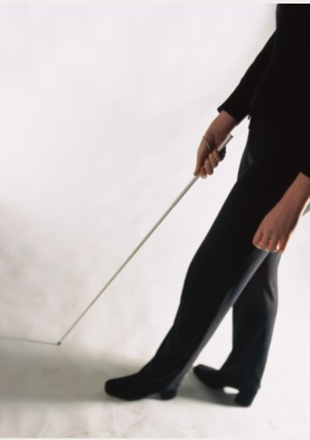
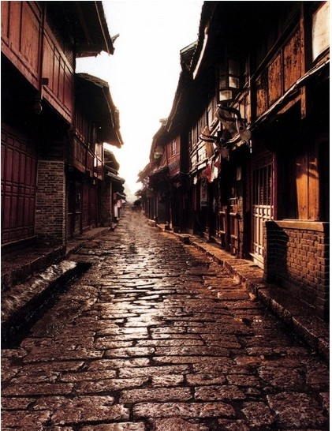
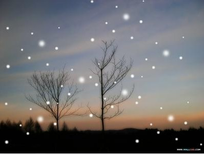

# ＜天权＞大河南街人物列传之瞎公

**瞎公站在大河南街的街头时，不知怎么想起这早些年的事儿，鼻子酸透了，心也酸透了，都是菠萝味儿，都是醋炝白菜味儿，都是酸辣粉味儿，都是夏天馊掉的饭菜味儿，都是黄桃味儿，瞎公没吃过黄桃，想来也是酸味儿，这次不走了，这次真不走了，再遇见一个流浪的女人，他再也不松手了！**  

# 大河南街人物列传之瞎公

## 文/汪海鸣（上海戏剧学院）

 

瞎公走到大河南街时就不走了，他饿了，坐了一天火车，嘴里还有对面的大学生给他泡的一盒康师傅牛肉面味儿，那还是昨天晚上的事儿了。他拄着棍儿敲敲马路中间一堆垃圾，刚下过雨，稀稀落落的关门声像一下一下揪住他的耳朵。空气里残留着食物浓郁的香气——食物是所有乞丐唯一的地图。

这里是街头了，脚下有新鲜的菠萝的蜜味儿，左手边一定有一个拉水果的小贩儿刚走，他吸溜一下鼻子，在南方的街道上，好些热带水果就是这么嚣张一整条街的，菠萝哧溜滑到肺里打个滚，余味是红烧鱼和辣子鸡，混合着没了气儿的啤酒，像个愉悦的饱嗝，暖烘烘地又窜出来，他把头转向右边，刷锅水哗啦溅在了脚边，他浑身一哆嗦，那是一家馆子了。

一只野猫窜到巷口里虎视眈眈地瞪着他，屠夫的大狗和杂货店的毛毛看见这个破旧的军大衣出现就放弃了撕咬，并且极为迅速地嗅出了四十六年的要饭史，毫不客气地叫唤起来。主人叼着烟搬着一箱啤酒回屋，转身吆喝着，毛毛，回来喽。

瞎公就对着声音的方向操着一口河南话问，老板，这是哪儿？一辆带着麻辣烫的自行车呼啸而过，他就站在马路中间，尖锐的酸辣像一枚子弹打入瞎公的味蕾，夹带着的风不要脸得把他劈成了两半，他在惊吓中抓住棍，分辨着这烟火味儿的前调是葱花味儿，鸡蛋饼味儿，奶油曲奇味儿，配着酱菜味儿，小米粥味儿，中调是浓郁的羊肉串的孜然味儿，铁板上滋滋冒油的鱿鱼须味儿，菜板上砰砰剁出的盐水鸭味儿，狗肉锅味儿，浮着一层红油的羊肚汤味儿牛肉粉丝味儿，死鱼腥味儿，卤得香地一塌糊涂的猪头肉猪耳朵香肠味儿，油炸花生米和白酒味儿，混合在一起向上飞啊飞，飞到不行了爆炸了，烟花一样散下的余味是消毒水味儿，塑料篷上干燥又润湿的尘土味儿，一个女人的眼泪味儿，尿臊味儿——

从东而来的香气洪水一样淹没了这个黑暗里的小人儿。忽然听见有个声音说，这是大河南街你不知道？

瞎公走到大河南街就不走了。四十八了，四十六年的盲史，四十四年的孤儿，乞讨生涯浩浩荡荡，脚下有两万五千里长征，什么颜色的土都尝过了，什么味儿的风景都和手指亲热过，指纹弯弯绕绕，藏着半壁江山，一路南下，走到不能再南，还回去干什么呢？

要饭的都知道在一条街上会饿死的，可瞎公每到一条街上寻摸到一处地儿就不想走，狗叫到鼻子尖儿我也不走，城管骂到眼皮子底下我也不走，要饭的本地驻民组团扔给我一身淤青我也不走，一场雨和雪爬满了军大衣的棉絮我也不走，天黑了回来刚捡来的被子被偷走了我也不走，可这一个搪瓷缸子要是晃荡几天，和胃一样空空旷旷，瞎公呷呷嘴，就知道该走了。这时候瞎公往往刚和街亲密起来，走一遭儿，街上给过一遍钢镚儿的谁都不会给同一个乞丐第二次，比起断胳膊断腿儿的，脖子长瘤的，眉毛胡子白成一团流着哈喇子的，瞎公也算要饭的里的弱势群体了。

瞎公的脚摸到大河南街的雨水里，就不走了。名字里有河南俩字儿呢，虽然在这地儿只待了两三年，眼睛能看见的记忆却都与他有关。这些浅薄的杂乱无章的符号，在黑暗里一再强化，形成坚不可摧的概念，天空就是河南那样子的，再蓝也想不到了，房屋和马路就是河南那样子的，再豪华也想不到了，女人就是娘那样子的，再美也想不到了。

瞎公遇见黄桃的时候，想着的也是娘那张脸。典型河南村里的长相，健壮，早衰，皮肤粗糙，眉眼细细平平的，长得很敷衍，话很少，暴躁，以至于回想起来根本不记得说过什么。母亲是二十摄氏度的温开水。

黄桃是一百度的，她扯着嗓子站在瞎子面前，说出的话一个字一个字就像热锅里的油点子，扎的瞎子浑身热辣辣的。黄桃说，瞎子，这街是我跟我爹俩的，你躺着的这棚也是我和我爹的，你会唱曲儿么，你会拉二胡么，塌着眼皮也不知道是真瞎还是假瞎，往那一站嘴都不用张，年纪轻轻也好意思伸着手要！白天我们去桥头你也蹲那，抢了我们生意还不说，晚上我们回街上你倒好，直接钻我们被窝里了！你他娘的要是瞎子也没见你走哪撞死！

瞎公张着嘴，从来没有一个女人能一口气和他说这么多话！抱着狐狸狗小宠物嫌弃他的贵妇人也没有，撞翻了菜摊子滚掉了一地的胡萝卜白萝卜也没有，急刹车声和咒骂也是转瞬而逝。

老头子咳嗽着说，黄桃，别说了，我冷。雪停了，街像冻上一样，瞎公一边挪出焐热了的被窝，一边念叨着，黄桃，就像是街上昏黄的路灯，觉得奇异的温暖。

太冷了，那一年瞎公又疑心自己要死在街上，年已经过去好些天了，半夜还有人放爆竹，冷不丁他都不敢上街了。那些个小鬼，看他是个瞎子，埋伏着一堆爆竹，有一个就在脚底下炸了，还有一个从天而降，他们还试图在他背着的口袋上挂上一串一百响的鞭炮！瞎公一转身，那小鬼像泥鳅一样从他手心里滑出去了。瞎公伸出竹竿就打，他们却乐坏啦！

然而生意却是出奇的好，走哪都能要到钱，怀里热乎乎捂着一叠钞票，可好几天都没买到吃的东西，街上饭店一直关到初七呢。一阵北风吹来，脚踩在硬邦邦的月光和雪花里，可真是冷。这时，一个女人在后边喊着，回来，瞎子！

那一年他三十九岁，一个人走在温州的街道上，饥肠辘辘，几乎出现幻觉。他好像听到母亲隔着远远的河在叫他，哎呀，他忧愁地想，自己这是要死了。可他究竟才三十九岁，怀里还有一叠钞票，只有贴着心脏的那一小块是热的，突突跳着，明天也整上一瓶酒，这天儿喝点酒就暖和了，也得来点荤的，饿啊，还是晌午时候吃了两个包子皮儿，馅儿被挑嘴的掏去了。傍晚时饥饿已经在胃里扑腾叫唤了，他捂着肚子，上下哄着，现在好了，饥饿也饿死了。

母亲，我可不能像你一样这样年纪轻轻就去了啊，孩儿也得吃得饱饱儿的，老得不像话了，坐在太阳底下眯着眼烤暖了，再去那边啊。这样想着，瞎公眼前一黑，直直扑倒在地上，溅了黄桃一身冰凉的月光。

醒来时瞎公已经在梦里酒足饭饱了，他满意地呷呷嘴，腹腔里肠子发出巨大的空旷的回响，他一个激灵坐起来，黄桃叽叽喳喳地叫嚷着，你个死瞎子，吓死我了，你他娘要是想死一边死去，别在我跟前整这出儿，老娘心软，见不得你这苦肉计，别说了，吃吧，看你留下那缸子里边汤水儿都冻成石头了，几天没吃东西吧，这地儿一到这时候就没东西吃，我和我爹早就攒了一堆。你尝尝这个，软的都给我爹留着了，你凑活着吃吧。

瞎公坐在黑暗里，歪着嘴嗑下一口，嘎嘣一声，嘴里硬得不像话，还以为自己牙掉了一块！渣子哗啦哗啦掉了满身都是，费劲儿分泌出一点唾沫，来回把它融化了，才知道嘴里是一块说不上有多香甜的酥饼，回潮了，早就不酥了，却奇异的好吃！

瞎公舔舔嘴角的渣，喉咙哽住了，“看”着黄桃，心里想，不走了，这次真不走了，这女人给我酥饼吃，还给我被子，许能成我媳妇哩，她不也是无家可归的可怜人么，我们离开这鬼地方，再往南走，往没有冬天的地方走。

这一夜直到天亮，瞎公才迷迷糊糊睡着，梦里也都是黄桃，虽然想着的是母亲的脸，这一点也不影响。瞎公想，天亮就给黄桃和她爹说，他们去哪，我就去哪，黄桃要是跟了我，就不让她唱曲儿了，爹也不要拉二胡了，他可以学点手艺，按摩，算命，怎么都行，以前一人吃饱，全家不饿，现在不一样了，他有黄桃了，有一个会唱曲儿的媳妇，也许还会有个大胖小子，自己瞎是害病，自己的孩子是健全的，孩子还要念书，还要识字……

瞎公第二天被开门的人踹醒的，还是高烧，太阳已经升老高了，瞎公垂死病中惊坐起，在地上空中茫然挥着手，没有黄桃，没有爹，没有二胡和小曲儿，没有暖哄哄的被子和酥饼！

瞎公瞪着眼，黄桃呢！女人呢！爹呢！路过的人哈哈大笑，说这个瞎子疯了！

疯了的瞎公在凛冽的风里晃荡，去了桥头，桥洞，桥底，去了街头，街尾，街心，黄桃呢！爹呢！都是梦么！大衣里还有酥饼的渣子，天黑了，初八了，店铺都开了，瞎公路过一家明亮的蛋糕房，蛋糕的香气在他的眼皮上注射上一道浅浅的红光，买点点心给黄桃！不是吃了她的酥饼么！再说，好像今天又没吃什么东西。

瞎公不买东西，想吃什么就腆着脸皮要，等着别人吃剩的。他在黑暗里挪过来挪过去，直到听见老板吆喝小姑娘关门收东西了，才狠狠咽了一下口水，定下心走过去，小姑娘脆生生叫着，去去去，到旁边饭店要去，我们要收了！然后一把摘掉门口的灯，灯灭了，啪的一声像扇了他一巴掌，他屈辱地站在那里，比受到上千次驱逐都要愤恨，自己站在那块浓得化不开的黑暗里，灯又灭了一盏，整个世界都要把他遗弃在彻底的黑里。

他低着头想走，又转过去，把手伸进大衣里，仰起头，他想好了，他要声音洪亮地说，给我称两块最贵的，对，就是最贵的，要两块，不，三块，一人一块，要刚出炉的，然后把叠地整整齐齐的数了不知有多少遍的钞票放在小姑娘手里，看准了，剩下的钱还够买上一床被子，双人的！

就在这时，瞎公明亮的脸刷的暗下去了，隔壁的灯一个一个灭掉，一直到脸前的蛋糕房，最后一盏灯也下班了。他定定站在风里，手僵直在心脏，心脏也不跳了，也没温度了，自己整个人就像空掉的口袋，在烈烈的风里，冻成了手里的竹竿。好几百块！一毛一毛，一个硬币，一个硬币攒着，十个换成一块！五个钢镚儿换成五块！五块换成十块！一夜都要摸几回！娶媳妇！盖房子！回河南！房子！女人！儿子！没了！

直到关门声哗啦一身巨响，像脚底踩着一个爆竹，瞎公才跳起来，溜进了夜色里。

他强迫了自己好长时间才把黄桃和钱联系在一起，有两个版本一直在心里纠缠不休，黄桃消失了，是携款而逃还是想把地盘让给这个瞎子，因为黄桃消失了，一切也终于成为无法考证的谜。

瞎公站在大河南街的街头时，不知怎么想起这早些年的事儿，鼻子酸透了，心也酸透了，都是菠萝味儿，都是醋炝白菜味儿，都是酸辣粉味儿，都是夏天馊掉的饭菜味儿，都是黄桃味儿，瞎公没吃过黄桃，想来也是酸味儿，这次不走了，这次真不走了，再遇见一个流浪的女人，他再也不松手了！

 

（采编：楼杭丹；责编：应鹏华）

 
