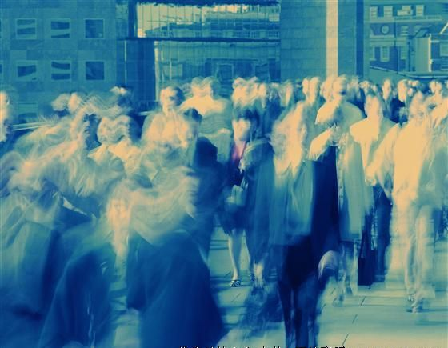

# ＜天权＞失业青年X的宿醉

**酒精上脑，X不想说话了，至少不想好好说。他赞同手枪所说的，但他也依然相信自己可以做些什么。那一瞬间他有些怀疑他的这些坚持也许只是为了固执地去辩驳手枪那该死的实用主义──X无比确信自己想要改变些什么，哪怕这改变仅仅是一个可笑的姿态。现实永远不是完美的，然而除了满怀革命浪漫主义的斗士们没人真的想要完美。**  

# 失业青年X的宿醉

## 文 / 吴昕悦（Wellesley College）

  姓名:X 性别：男 身高：174cm（不穿鞋） 体重：67kg（不穿衣） 国籍：中国（大陆） 学历：本科 梦想：世界因我而不同 座右铭：我的梦想不是梦 

无业青年X在这个夏天之前的身份还是有志青年，但是随着一纸毕业证书被某个笑得灿烂的校领导塞进手里，X就正式加入了浩浩荡荡的失业青年队伍。

X并不着急这件事，找一份工作和让生活有意义并不冲突。他在和手枪喝酒的时候也是这样重申的，那时X还没醉，于是还记得手枪不置可否地一边应声一边去瞟踩着高跟鞋风姿摇曳的姑娘。

而当X喝高的时候，他和手枪总会不可避免地谈及一些注定会不愉快的内容。

比如──X的雄心壮志。

在骨子里，青年X是个懒惰的文人和激进的斗士。X希望可以將两者合而为一互通有无（当然不是成为激进的文人和懒惰的斗士），即使不能成为鲁迅，X也希望可以向邹韬奋靠近。

手枪千杯不倒：百年树人，你总共可以活多少年，你知道种树……

我就是想种下一棵苹果树，有一天能够有一个苹果落到那个男孩的头上。

就算那个男孩能够被你改变，你的树能够结出多少果实，你的苹果就能滚得足够远吗。就算你买通老天爷让天上不下雨开始下苹果，老百姓开心只不过是因为有了免费的果子吃而不是被砸了这一下茅塞顿开。

酒精上脑，X不想说话了，至少不想好好说。他赞同手枪所说的，但他也依然相信自己可以做些什么。那一瞬间他有些怀疑他的这些坚持也许只是为了固执地去辩驳手枪那该死的实用主义──X无比确信自己想要改变些什么，哪怕这改变仅仅是一个可笑的姿态。现实永远不是完美的，然而除了满怀革命浪漫主义的斗士们没人真的想要完美。

你到底想要这个社会怎么样呢？

被问及这个问题的时候，X和很多思想大师和出租车司机一样，都有着自己的宏伟规划和美丽蓝图。米开朗基罗在雕塑大卫时，因为市民要从下方观瞻这具象征着完美和力量的躯体，他修改了原先的计划而雕刻了一个更大的头颅和脖子──为了使它看起来更完美，完美的化身偏离了完美。

所以当问及下一个问题的时候，X总是缄默的：那么，你想要怎么去做呢？

为了避免回答，X的绝技就是迅速把自己灌醉。X喝起酒来总是带着壮士一去兮不复还的表情，手里就算是五度的啤酒看上去也像是在喝五十度的工业酒精。X闭上眼睛对自己说：有个美院的落魄小伙躲在角落喝酒不意味着这里就是洛东达。你就算喝死了这儿也是北京三里屯五十年后不会成为第二个白马酒吧。

和手枪作别也许是一件错误的事情。手枪显然并没有喝尽兴，而陪酒的X开始蛇行走了。手枪有他自己的事情去忧虑，X对于手枪的落寞就像手枪对于他的困惑一样无动于衷。X沿着一片灯红酒绿走，他想这么一个人待一会，最好人山人海，最好孤独至死。

X不知道自己是怎么钻进那个低仄的小旅馆的。值班的女孩打着哈欠，一晚上一百六，押金二十，身份证。X掏了很久，颤着手臂把皱巴巴的钞票和套了发黄塑料套的身份证放在油腻的桌面上递过去，身份证上的自己笑得傻气，头发上永远翘着的一绺被照相馆的人用photoshop涂掉了，看上去好像另一个人。

X拿了钥匙以后扶着墙边找到了206房间（0的金属数字掉了）。对了三次洞眼才插进去，X一下瘫在床上（比他想象的床要矮不少，还有一种奇怪的气味）。不知过了多久，大约有一会，就像是有人打了招呼一样，门上响起了默契的敲门声。

X赖在床上一动不动，敲门声很轻软，但是毫不迟疑。

他站起来，从猫眼里看见一个姑娘淡粉色的衣衫和模糊不清的脸。他开了门。

很多年之后，如果无业青年X还在写诗，他的眼前可能有时会浮现出这么一个一身葱花味道的姑娘。她的腰身有些丰腴，但是一只手还能搂得过去，乳房比他之前的任何一个女朋友都要结实，是很实惠很容易让人亲近的（伸手去摸也不会被啪得打开），她也许精心打扮过，也许没有，无业青年X自始至终从后面抱着她，但是其实即使是用传教士做爱，第二天他也一样会记不住她的脸。

X是一个传统道德价值观念很重的人（当然这不会影响他在一个醉酒的夜晚支持一下人类历史上最古老的职业），他是讲究一夜夫妻百日恩的。这个姑娘变成了一个面目模糊的影子并非因为他把她当作一个可泄欲的雌性同类，而是因为在这个晚上，对于失业青年X来说，这个没有脸孔的姑娘是世界上所有的姑娘。

完事之后，X筋疲力竭地仰躺着，姑娘就在他旁边，他们一起躺在低矮的散发着霉味的双人床上，视线飘忽在上方斑斑驳驳的天花板和水管上。X转过身，想抱着无脸姑娘，她很平静地躺着任由他抱，还问了句如果觉得不错可以再联系她。但是X并没有这样的打算，他突然想和这姑娘说会话，就像他在大学里抱着学妹扯淡那样说会话，他想知道这姑娘在白天都在做什么，她已经接了多少客人，她的生活曾有过什么变化她希望有什么变化，她觉得幸福吗，她觉得可以改变吗……

当他想好措辞的时候侧过脸，发现无脸姑娘已经安静地睡着了。她睡得大大咧咧坦坦荡荡，于是他明白身边的这个姑娘是餐馆里用狗爬字写菜单的那一个，是公路边解开碎花裤子就蹲下解手的那个，也是在汽车站咬着煎饼吵吵嚷嚷的那一个。

所以他们如此熟悉。X知道，即使他今天没有喝醉，走进了另外一个旅馆，在另一个城市，也一样会有个无脸姑娘敲开他的门──有许许多多的无脸姑娘在城市的夜晚游荡，以至于这甚至不能算是艳遇，初相见还似旧相识。

没有脸的姑娘还在睡梦中喃喃自语，青年X小心翼翼地把手脚抽出来，房间里并没有洗手间于是不能洗澡，X掏空了口袋发现只有275块三毛，悄悄放在姑娘的枕头边，突然觉得惭愧。

出去退房的时候，前台的女孩还在值班室的铁丝床上睡觉，X想了想，决定不叫醒她，那20块的押金也就随它去了。

无业青年X从那个阴暗狭小的长满霉块（和跳蚤？）的小旅舍爬出来是北京时间上午7：20.他突然意识到作为一个昼伏夜出的有志青年，自己从来没有见过这个城市在早晨的模样。七月的阳光象流弹一样毫无保留地打在视网膜上，整个陈旧的世界都是新的：光着上身的男人在街边呼噜呼噜地吃鸡蛋灌饼，去上补习班的长相酷似的父子迈着相同的步幅风风火火，停在一边的出租车司机还没有睡醒……这些人们如此幸福，他们也许有不满，但是也不想改变──他自己是唯一不快乐的人。

带着一身未消的酒气，无业青年X昂首阔步地走进了一片幸福之中，有人侧目，无人在意。

（采编：尹桑；责编：陈轩）

 
