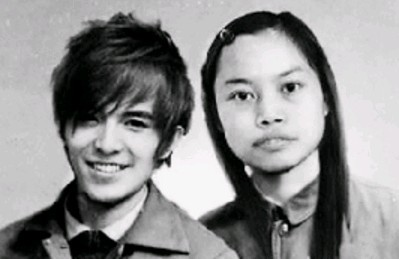
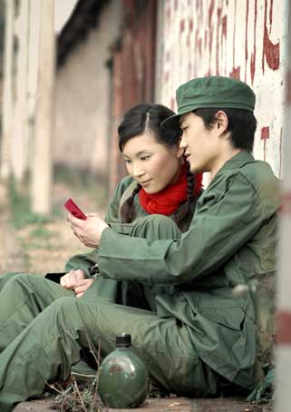
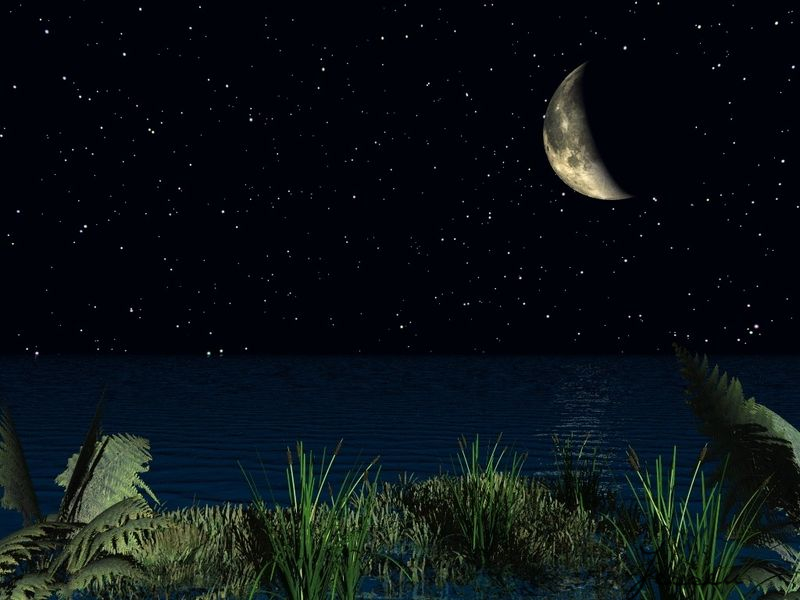

# ＜天权＞孤独的诗歌

**限量发售的诗歌就像个巨型的放大镜一样放大了你原本所有可能会有的情绪，无论是快乐还是悲伤。所以诗歌里的你，无限疯狂，无限绝望，能笑到哭又能哭到笑，如欢场又似凌迟。另外，诗歌还有无可比拟的注重结构、形式、节奏和音韵，用一种限量版的调子积淀出的音乐美、建筑美、舞蹈美、雕塑美，绘画美。诗歌，因为是限量而美丽，而孤独。**  

# 孤独的诗歌

## 文/ 林静（华侨大学）

 

作为一个活在2011年中国大地上的人，某天随意翻看一本诗集，绝不会被问到是不是学写情诗去追求姑娘，一定是被评价成“文艺青年”。如今对于文艺青年这个词语，据说一般人被称为“文艺青年”的时候，总想回复一句：你才文艺青年，你们全家都是文艺青年。

在这个时代，读诗歌的越来越少，写诗歌的也越来越少，一年以来唯一关注的文学杂志上发表的诗歌是因为诗歌的作者是凤姐。并且我也发现，凤姐的诗歌其实算这个年头的毕竟高质量的作品。事实上，如今一些卖不出去且收钱发表文章的诗歌刊物，或者豆瓣博客等地方寥寥无几的几句矫情诗歌，只能让人联想到一些经常可见，具有以下特征的人（女人的比例比较大）：平日少言寡语，“爱好”一栏填写的是“文学、电影、音乐、剧场”，打扮一定是素面朝天，经典姿势是指夹香烟，还经常冷不丁就给你来两句哲学话语句或诗歌。甚至其中还有一些最矫情的人她们鄙视正常女人热爱的一切：老公、孩子、家庭聚餐、精致妆容……同时还热爱读佛经读圣经陶冶性灵、写“诗”写小说拷问灵魂、穿民族服饰学习杨二老师……当然，就像她们这样子沉浸在自己的小世界，倒也添了几道人间风景，且不论这风景是妖相横生还是清风阵阵。

当然，诗歌以前给人的影响不是这个样子。不需要追溯的太久，起码在不少人的孩提时代还听见很多人用诗歌歌唱80年代，只是如今舒婷已经隐居海岛，汪国真据说生活还不如意。或者说哪怕是现在，我们还是看见很多00后的小朋友还和我们小时候一样，依依呀呀背着唐诗宋词和关关雎鸠。

回想起唐诗宋词还有诗经，或者看看红本子毛主席诗歌，还有圣经和史诗，起码诗歌能表达所有人类的七情六欲，也可以指点江山激昂文字。其实我们的年代，这些个诗歌的功能都有着替代的东西，比如历史论文记叙文等代替了史诗的记录功能，新闻记者采集编写的工作代替了《诗经》时代的采诗官在民间采集的工作，小说戏剧和电影都可以讲故事，散文可以表达的很多情感，随笔和时评也可以指点江山……《三联生活周刊》《南方人物周刊》、一些时尚杂志和财经杂志的发行量绝对超过《诗刊》。这些都关系到自己也关系到国家的民生问题，或者就是最贴近生活的时尚和消费等等，如果说文学的根基就是生活，其实这些也带给人以生活的温暖。如果诗歌的家国情怀是由自身境遇引发的情绪转到了民众与民生，那么我也不会认为我看这些杂志就是缺少家国责任感，很多时评都保留着诗歌那种思考。如果说诗歌可以道出生活的美丽和惊奇，而很多文章也都可以反映，尽管和诗歌文体相比，其他问题在情感表达的效果和程度上有所不同。

讲起来，每一种文体的流行都根基于它所依存的无论是上流还是中产还是底层的人民大众的工作和生活。也有很多的文体在一个个朝代和土地间遭遇几次背弃和重拾，包括唐初年的陈子昂大声疾呼要提倡散文的汉魏风骨，包括后来韩愈的古风运动的，最后陈子昂的复古更多促进了诗歌而不是散文的发展。诗歌，这个如今显得孤独的文体在我们文明史的长河里，常常在某一个阶段突飞猛进的成长，也常常在某一个阶段衰落。古代的文官需要用诗歌的文体报告更高级的官员民间情况，自然会促进诗歌的发展。古代的人没有电影和电视，就喜欢听说书人说书或者看小说看京剧，而现在有了电视和电影自然看戏的就少了，可是我们不可以因此否认电影和电视比起京剧就低人一等。

虽然说文体之间没有贵贱差别，我也无法否认诗歌的独特性质。毫无疑问，诗歌是那一份“限量版”的款。毕竟是限量版，诗歌是高级定制，用最高度的集中方式表现社会生活，用最凝练的语言，最高度饱含着作者的思想感情与丰富的想象，形象性最强。限量发售的诗歌就像个巨型的放大镜一样放大了你原本所有可能会有的情绪，无论是快乐还是悲伤。所以诗歌里的你，无限疯狂，无限绝望，能笑到哭又能哭到笑，如欢场又似凌迟。另外，诗歌还有无可比拟的注重结构、形式、节奏和音韵，用一种限量版的调子积淀出的音乐美、建筑美、舞蹈美、雕塑美，绘画美。诗歌，因为是限量而美丽，而孤独。

诗歌，其实终究也是是让人仰望的，毕竟仰望总是孤独而丰富的体验。温总理诗歌在《仰望星空》中说：我仰望星空它是那样寥廓而深邃；那无穷的真理，让我苦苦地求索、追随。我仰望星空，它是那样庄严而圣洁；那凛然的正义，让我充满热爱、感到敬畏。我仰望星空，它是那样自由而宁静；那博大的胸怀，让我的心灵栖息、依偎。我仰望星空，它是那样壮丽而光辉；那永恒的炽热，让我心中燃起希望的烈焰、响起春雷。

有那些时候，突然看着城市就累了，对声色犬马累了，对文艺清新和矫情都累了。只想找个角落安安静静地看着天空，让人类的善和人类的恶 ，还有善恶交织的不安，都在这宇宙星空里化作诗歌。

 

（采编自投稿邮箱；责编：陈锴）

 
