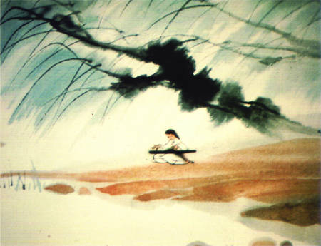
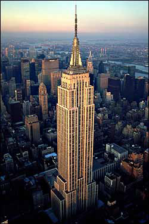

# ＜天权＞宋朝人在纽约

**第一种结局将给我带来一笔巨额的罚单，移民局也不能把他遣返回宋朝。而赵廷要是真从帝国大厦跳下来，他的梯云纵能救他吗。他会死的吧……我想到这一点打了一个哆嗦，但是转念一想，作为一个在纽约依然执著地相信天地正气相信江湖情义的人，赵廷在几百年前就应该死了。我又希冀能像三流小说里面写的那样，标志性的建筑总是有些神秘的力量，所以赵廷也许在坠落中途就直接被这样的气场吸进去，然后回到他的宋朝，那里有他在院口温酒侍梅的妻，山里有归隐的剑客，丹炉里能炼出长生不老药，有歃血为盟两肋插刀的兄弟情谊，有仗剑的少年郎和口口相传的英雄传说。**

### ** **

### ** **

# **宋朝人在纽约**

### 

## 文/吴昕悦（Wellesley College）

### 

### 

纽约是一个让人想到做爱的城市。 拔地而起的摩天大楼有细密的人群进进出出，潮湿阴暗的巷道曲曲折折地藏了裙子短得不能再短的姑娘。华尔街日报被蹬着自行车的黑人男孩飞投进清晨的呻吟里，空气中的烟草味大麻味香水味在等待被一支火柴点燃。 我是一个写小说的人，我让纽约的人海中出现一个宋代的侠客只需要一支烟的时间---中等身材，不太高也不太矮，二十出头，一袭长衫，腰上配了一柄永远也拔不出的铜剑。纽约的晨风撩人，我睁开眼睛，余光里便看见这样的一个人在我旁边的阳台上打坐。 不得不说想象力还真是难以操纵且遗祸无穷，我想了那么久身材热辣的姑娘从来没出现过，而宋朝人赵廷我只念想了一次他就在我这里光明正大地住了下去，并且每天都在我宿舍的阳台上对着整个纽约城的男欢女爱运气练功，童子功。 虽然他是被我从宋朝直接空投过来的，赵廷对于纽约的一切并没有感到太过惊讶，甚至表现上还算得体。我一开始以为这是出于大宋天朝子民的不凡气度，后来才知道，他是在用自己一套宋朝的逻辑来解释一切现代化产物。根据赵廷的理念，天地万物是由一股气来维持的，不论是电视讯号还是保时捷，驱动它们的都是一股气，或者说是与天地正道相接的力，这种力的根源是一种相信，它自古有之，只不过我们换了一种方式去相信，我们像过去相信蓬莱有仙岛那样地相信DNA相信量子物理相信上帝已死。 我问赵廷说那你每天练的这个就是为了培养自己的这股气？ 他很认真地纠正我，什么“这个那个”的，这是武功。等我内力好了，就能用这股力打通任督二脉，从此执剑江湖，扫尽天下不平事。 我说你别扯这么玄乎的，先给我表演一个胸口碎大石或者用内力吹灭蜡烛什么的。 赵廷脸红了，内力要练很久才能收放自如的，我才刚刚开始呢。一个时辰之后你就能感到我驱动的微风了。 

 我这才明白，原来我请来的还只是一个刻苦的菜鸟侠客，我觉得可笑又乏味，但是我已经不能再把他变没了---一个人进入你的生活后就不那么容易出去。 赵廷的宋朝理论偶尔也会惹点麻烦，比如他非说唐人街的疯子老李武功盖世，因为他总是神龙见首不见尾，见到人微微一笑就逃开，离得远远还招招手，颇有武林大侠隐于市的风范。我跟他说老李一家当年躲在船舱最底下偷渡过来，小女儿被闷死了，他自己也差点被移民局抓住，混在唐人街十几年连句英文都不会说，还要躲移民警察，这种隐于市的方式对于一个大侠来说实在逊到让人难以信服。赵廷对我的说法不屑一顾，并且打着拜师的主意天天在唐人街对老李围追堵截，搞得整条街鸡犬不宁，还以为移民局实行大抄底。几周后赵廷垂头丧气地对我说，手无缚鸡之力的老李并不是因为身怀绝技而有意避世或是厌倦红尘，他只是喜欢和周围的人玩捉迷藏。当赵廷好不容易在唐人街的某个巷角追上他时，玩输了捉迷藏的老李吓得嚎啕大哭，像个脏兮兮的小孩子。 不过大多数时候赵廷还算老实，我写论文打dota的时候他就在阳台上安静地打坐，并且完全无视自然规律非说吹进来的风都是他练功修得的成效。我给他看天气预报上面金发碧眼的女郎说今日纽约有风，赵廷听不懂英文，于是他让我坐在他面前等他运好功，我们就这么面对面地盘腿坐着，赵廷凝神了很久，双手下按，左手上托，右手自左臂下穿云手，虚抱成圆，清风渐起，吹拂上赵廷虔诚的面孔，放在阳台栏杆上的报纸一页一页翻起，然后纷飞下纽约的灰色街道，好像巨大的蝴蝶。 那是我和赵廷在一起最快乐的时光，我借口推脱掉别的事情宅在房间，赵廷继续修炼他的大侠梦，我以为日子会一直这样过下去，但是事情总是不会依照人的希望发展下去的，无论是在宋朝的传说还是在纽约的流言中，故事讲到一半总是会出现那个推动情节的角色----女人。 商学院的年终派对是在强尼林家在纽约市置办的房子里，我实在不忍心把赵廷扔在房间一整晚，就威逼利诱让他换上我的衣服，我企图让他刮胡子，他死活不干，我说你内力都练那么久了，刮了以后咱再用内力把胡子逼出来成不成。他毫不领会我的苦心，于是胡子拉碴地看上去活像是个拖儿带女的研究生。我转念一想，在宋朝赵廷这个年纪也差不多应该成家了，说不好还三妻四妾的，让人家在这里陪我过单身汉的生活实在太说不过去，但愿今天多几个妞喝高…… 我特意拖着赵廷十点多才到，可惜姑娘们还一个个都很清醒很端庄，和我一起上微经的杰西卡张笑盈盈地过来，实际上因为她总是跷课，我也没怎么见过她。她先是给了我一个大拥抱，然后看着赵廷笑得很甜，where are you from。 赵廷木在那里，她的笑里掺了两秒钟的不自然，然后用中文说，我怎么以前没在学校里见过你啊，你是从哪儿来的？我还没来得及插话，赵廷就毫不犹豫地脱口而出，我是从宋朝来的。 杰西卡张的杏眼瞪得滚圆，那几秒突然变得很慢---我看得到她绿色的隐形镜片在瞳仁上浮动，黑翘的假睫毛不可思议地一翕一合。她说，什么？我说是松朝市啦，在陕西的一个地方。杰西卡张皱皱鼻子，说啊松朝我听说过啊……风景挺漂亮的。风景漂亮是对所有你没听说过的鸟不拉屎的地方的最适当的称赞，赵廷显然在女人面前紧张得不知所措也不知道该怎么接话，于是我就和杰西卡张一唱一和地把这个莫须有的地方吹得山清水秀优美动人。 我问杰西卡张她最近在话剧社的表演怎么样，她用手指卷着发梢漫不经心地说了几句，然后话题一转，问赵廷他平时在这里玩什么。赵廷一下来了精神，开始推销他的武功和那一整套宋朝理论。 杰西卡张拍手说，我初中的时候可喜欢看武侠小说了。我觉得轻功最帅了，梯云纵什么的。 赵廷一本正经地说，梯云纵确实需要很好的内力，我每天都在运功…… 我在他长篇大论之前岔开话题，在这个物欲横流的地方可没人想知道什么童子功。所幸杰西卡张对武侠的事情只是礼节性的敷衍，她对谁的爸爸认识张纪中更感兴趣。 他们开始玩游戏的时候我和赵廷溜到了外面的阳台。夜风微凉，我的酒醒了一些，过会再回去女孩子们就全醉了。赵廷看起来兴致不高，我问他是不是没遇见他的菜，他摇摇头说不，女孩子们都很漂亮。 赵廷说他娘嫁到赵家那年在前院栽了一株梅树，他小时候总在树下玩，动了男女之念后就总想以后他的媳妇就应该是那样一个在梅树下静静温酒的眉目如画的女孩子，不论他仗剑飘摇在何方，心里总会有个念想：有个温婉美丽的妻在树下端坐等着他的归期，矮凳上是暖暖的浊酒和切好的牛肉。 我问他你该不会觉得杰西卡张就是你的这个妻吧。 赵廷脸红了，休得胡说。 我后来才知道他喜欢的是杰西卡张身边形影不离的那个白白净净的小姑娘。我说好啊我去帮你把姑娘带出来，却在起居室外面的楼梯间被杰西卡张拦住。她递给我一杯浅蓝色的鸡尾酒。她咯咯地笑，说你的朋友不会真的觉得自己是宋朝来的大侠吧，这个把妹的花招可不太好。我干笑几声说他看到你这么漂亮的女生就胡说八道啦，你就给他点面子吧。杰西卡张眨眨眼问，那你看到我会胡说八道吗？我一口喝尽杯中酒说，我这人喝醉了见谁都胡说八道。她盯着我的眼睛说，我想我有点醉了去楼上的房间躺一会。她离去的背影摇曳生姿，可我却没有胃口。 我到客厅，他们酒兴正酣，叫我坐下一起玩，我问刚才那个姑娘呢，他们说已经回去了。新开的香槟泡沫四溢，花枝招展的姑娘们笑声刺耳。有人拉我再干一杯，我说我就是拿一下外套，要先走了。 我找到赵廷，他还那么闷闷地坐在那里，像一个走错路的小男孩。我说走吧。他诺诺地应了。我觉得可笑，披上风衣和他开玩笑： 其实论资辈，你应该比我长了很多代，是我太祖爷的太祖爷了。但你反而更像是一个小孩儿。 赵廷站起来习惯性地敛他的长衫，却发现现在穿的是我的T恤，他回嘴说，那中原和西域岂不是也一样？ 出了门我就有点后悔，现在已经一点了，地铁站却还至少要走二十分钟。街道上潜伏着醉鬼和妓女的笑声，但我无论如何也不想拉着赵廷再回去。宋朝人的视力就是比我好，赵廷指着那个遥遥的地铁标识时，我听见了背后重重的脚步声。通向地铁站路上昏黄的灯光一下变得如此遥远，然后前面的光便被一个身影挡住了，有人在背后拍拍我的肩。 作为一个土生土长的中国人，我对非洲裔美国人这个族群的面貌辨识度一向不高，比如我经常把杰森认成汤姆把汤姆认成威廉。但是在大学里的黑人同学和在街上混的黑人我还是能分出来的，比如眼前的这几个绝非善类。 赵廷显然连这点辨别能力都没有，他还以为是我的朋友，于是一副大宋子民安之若素的表情。我赶快投诚，把手机和钱包里的二十美元统统倒出来奉上，然后拍拍赵廷的衣袋跟他们说他没有钱。黑人们慢慢站成一圈，他们问我有烟没有，我说没有不过我钱都给你们了。他们看起来还算满意，我刚要松一口气，这时其中一个戴头巾的指了指：那个东西拿过来。 赵廷的剑。 一柄永远抽不出来的铜剑，我想只有眼前这个黑人和赵廷才会把它当成什么稀罕玩意。赵廷拆了我们学校花坛里无数铜丝支架，给它做了诡异的纹饰，还封个名号叫什么除魔宝剑，国内三流剧组都不会用它当男五号的道具。至于眼前这个黑人想必是连三流的武打片也没看过，于是还觉得这是一个什么新奇的宝贝。 赵廷漫不经心地站在那里，突然发现所有人都在看着他，露出一头雾水的表情。戴头巾的黑人走到他面前，指指他的剑，摊开手掌。 赵廷没有动。 黑人回头对同伴笑笑，转过头盯住赵廷，yes， or no 赵廷在美国混了一段时间，固然不屑于学习夷语，yes和no好歹还是分得清楚的。于是我听见他在我背后坚定不移中气十足地说，no，我还没来得及绝望，旁边的黑人大哥就一个拳头就揍在了我的右眼框上，戴头巾的黑人用膝盖顶住赵廷的腹部，我听见赵廷的干呕。黑色从右上角蔓延进我的整个视野，我感到我被拎起来，掼到地上，鞋底踩上我的肋骨，有个人跌跌撞撞爬过来把那只重重的脚从我身上推开，然后被那只脚踩住右手，他吃痛地吭了一声，戴头巾的人一个钩拳打上他的鼻子。 液体滴到我的脸上，我知道那是赵廷的血。他嘶嘶地吸着气，眼神格外得亮，他的右手被踩住，于是左手继续着那个每天在阳台上重复的手势…… 我的右眼痛得要从眼眶中跳出来了，我大吼我操别他妈运功了把东西给他。 蔓延的黑色吞食了我半边视野，我看见一只手来抽赵廷系在腰间的长剑，我听见不远处小酒馆的萨克斯风和女人的调笑，金发的褐发的黑发的…… 平地里大风暴起，赵廷的衣摆吹到了我的脸上。巷道里某扇摇摇欲坠的窗掉了下来，重重摔在我们身边，溅了一地玻璃屑。停在一旁的车开始警铃大响，我抓了赵廷朝着那一片黑暗中仅存的昏黄灯光跑，遥遥听见巡逻警车的笛声，背后没有跟来的声音，我瘫在地上，从肿得睁不开的眼角看见鼻血长流的赵廷，他按着那柄破铜烂铁，正气凛然地说：仁者无敌。 

 第二天整个学校都知道我们两个半夜被人打了，最让我百口莫辩的是同性恋社团还愤愤不平地要为我们讨回公道，于是我和赵廷搅基的传闻愈演愈烈。女生们见了就跟我咂舌说你们要不是一对，赵廷为什么要为你挡拳头。女人对于搅基总是能体现出超乎寻常的兴趣，因为她们本身对男人的兴趣，她们总要和同好者喋喋不休。我必须得承认她们确实很懂男人，但是她们不懂什么是兄弟。 也许是这次脱险让赵廷对他的武功产生了莫大的信心，他开始更勤奋地练功。期末的最后一周了，我也没有时间去管他，所以我并不知道他在更勤奋地练功之外还多了一件别的功课，直到一帮叽叽喳喳的女生敲开了我的房门。 杰西卡张一张俏脸板得生硬，我刚瞄到她身后那个低着头的小姑娘，杰西卡张就开了连珠炮：和你一起住的这个到底是什么人。是你男朋友的话也就算了，还在人家女生宿舍趴着窗户偷看。 她一把把赵廷推过来，赵廷涨红了脸说不是她说的那样，我我我我我。 我不知道该说些什么。在这个宣称着民主自由的国家，侠客夜访春闺绝对和罗曼蒂克挂不上干系。我只好磕嗑绊绊地先说，首先这人绝对不是我男朋友，其次他也没什么恶意，可能就是想认识认识你们这个姑娘但是用错了方式，我替他道歉我替他道歉。 杰西卡张薄薄的嘴唇动得飞快：他不是什么大侠吗，原来他的功夫就是跳到女生窗台上吓别人啊。你要是真那么厉害那么有本事你跳帝国大厦去啊。她看看那个小姑娘又看看赵廷：就你还想认识露西亚，也不看看你有什么能耐有什么出息。 这话我也不能替赵廷接了，我总不能再重申他会武功吧。漂亮的女孩子到了这个年龄，追求的人多了就慢慢长了心眼，开始挑拣贤夫婿了。爱情这个东西谁都有，实在没有吹一吹也能有。但是车房工作资历背景就不是随便谁都能给得起的了。 而眼前这个鼻青脸肿的宋朝人什么都给不了她── 他所能给她的只有在她出生几百年前关于长安城里一树梅花的记忆。 杰西卡张一众来闹过之后，赵廷老实了很多，每天依然练功，练功的时间也长了很多。我考完试开始收拾行李，本想问他需要不需要收拾，他说他没有东西可带，还心情很好地问我什么时候的机票，我说明天晚上，他笑笑说那早点休息吧，睡得太晚有伤元气。 我醒来时赵廷没有在，我心说他不会又看姑娘去了吧真是不长记性。然后我看到桌上留的一张字条，他说长久以来承蒙照顾，希望再帮他最后一个忙，让我带那个姑娘去帝国大厦。 我的大脑嗡了一声，套了衣服就往外冲。我还不至于傻到去执行一个宋朝疯子的指令，我在出租车上祈祷赵廷最好在纽约城里迷路，这样我能在帝国大厦前面拦下他跟他好好讲讲他那可怜的爱情。我要跟他说在这里姑娘就只是姑娘而已，胖的瘦的高的矮的美的丑的ABCD杯的，不是你生死相许的小师妹举案齐眉的颜如玉。我要跟他说在二十一世纪的纽约千金依然可以买一笑，但我命却是换不得君心的……然而当我打开车门看到街道上驻足抬头的人群时我就知道，我什么都不能和他说了。 

 就像好莱坞电影里那只著名的来自原始世界的猩猩，赵廷孤独地在帝国大厦之顶坐成一个小小的白影，我看不到他的脸，但我知道鸟瞰着纽约大苹果车水马龙的每一条纹路，赵廷一定是那一副迷了路的模样。 我身边有人掏出相机，镜头拉了又拉想拍拍清他的脸，有人压抑不住的惊呼和咒骂，我跟他们说，这不是wushu，不是kung fu，是武功。他们很新奇地点点头，但我知道在他们眼里这只不过是亚洲某种尚未卷进全球化狂潮的奇门诡技：过几年好莱坞大片中就会出现，报纸上就会刊登开班教授的消息──但是不会的。没有人知道他是怎么上去的，而他怎么下来倒是很清楚：一、救援人员将把这个疯子救下来，然后罚款。二、救援失败，他跳了下来。 第一种结局将给我带来一笔巨额的罚单，移民局也不能把他遣返回宋朝。而赵廷要是真从帝国大厦跳下来，他的梯云纵能救他吗。他会死的吧……我想到这一点打了一个哆嗦，但是转念一想，作为一个在纽约依然执著地相信天地正气相信江湖情义的人，赵廷在几百年前就应该死了。我又希冀能像三流小说里面写的那样，标志性的建筑总是有些神秘的力量，所以赵廷也许在坠落中途就直接被这样的气场吸进去，然后回到他的宋朝，那里有他在院口温酒侍梅的妻，山里有归隐的剑客，丹炉里能炼出长生不老药，有歃血为盟两肋插刀的兄弟情谊，有仗剑的少年郎和口口相传的英雄传说。 我看到那个小小的白色身影在风中抱拳，我知道那是赵廷又在运功了。我掏出手机，打电话给杰西卡张，她还没有睡醒，很不高兴地告诉我露西亚昨天的飞机就回国了。 警察开始拉重重叠叠的防护网，消防车的警笛呼啸着越来越近。 屈膝按掌，弓步搂推。 我看见赵廷站在帝国大厦之巅，在拔地而起的灰色水泥森林的枝桠之上，有一个长衫如雪的宋朝人在猎猎狂风中站成一面白色的旗帜。 救援人员已经接近目标，他们用扩音喇叭喊：请你站在原地不要动。你有什么要求吗。 高风尚未降临地面，纽约的街道上安息的尘埃在人来人往中蠢蠢欲动。 左云翻掌收步。气沉丹田手心开。 呼吸吐纳，风生水起。 

### 

### 

（采编：尹桑 责编：陈轩）

### 

### 
