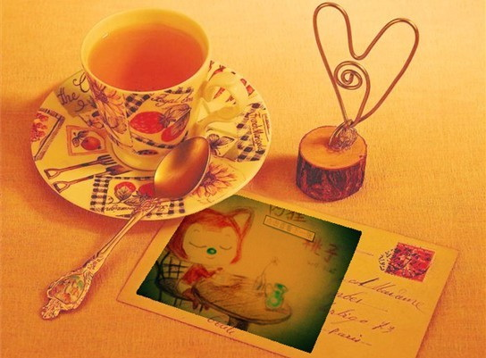
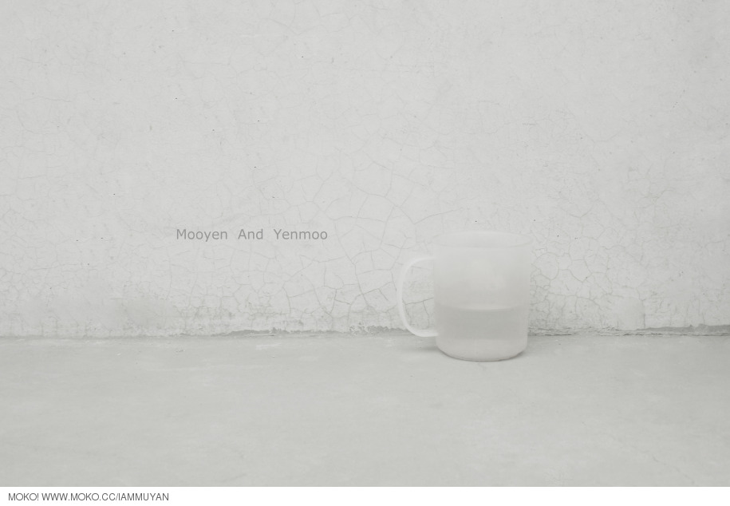

# ＜天权＞对简单的向往

**人类的天性是向往单纯的，也曾有过美好的心愿，古代中国人选择相信，虽然知道有情人难成眷属，还是爱看才子佳人喜结连理的戏剧。即便它的结构叙事是简单的，不深刻的。就像童话故事里总是喜欢一遍又一遍地讲：“王子和公主永远幸福快乐地生活在一起。”我童年的时候百看不厌。**  

# 对简单的向往

## 文/ 宋桃子（华中科技大学）

 

在电脑上 点开了阿狸的动画片，依着画面中的情节随画下了阿狸坐在桌子前幻想的样子，把他送了出去。心变得温柔和溢满温暖，对生活充满向往，相信单纯、简单、美好的人性。

桃子给阿狸寄了一封信，最后一句是：“只是我想和你分开”。阿狸满泪花满面，难过的极了，结果第二天信鸽又来了，说信还

有一页，工作疏忽落下了。原来桃子说的是：“只是我想和你分开的时候你是否也一样在想我。”阿狸看到这里破涕为笑，想到心爱的桃子感动得一塌糊涂。

这两个真性情的相爱着的小狐狸多么可爱，这个故事如此简单，就如一些人说的，这是童话故事。可是它为什么又如此动人呢，为什么阿狸受那么多人喜爱，拥有那么多粉丝呢。也许就是因为他的简单，因为人对于简单有一种原始的向往。

这个小故事其实很久很久以前就发生过了，什么时候呢，那还是好几千年以前了，还记得诗经里面的说的么，静女其姝，俟我于城隅 ，爱而不见，搔首踟蹰。一个男孩子因心仪的女孩久等不来而心神不宁。后来看终于见到女孩，又欣喜若狂。诗经里面的爱情大多如此，它的流传也许就在于执着于最初的那份美好，而且这份美好在逾越千年以后依然有动人心魂的力量。它潜藏在浮华世界的低层，是繁华落尽后的真淳，它隐匿在你不曾发觉的神经，它流淌在先人们留给你的血脉里。投我以木桃，报之以琼瑶。你爱我，我爱你，就这么简单。

但是简单的东西却不一定平常，寻常的东西却不一定容易得到。因为人性复杂，造化会弄人，上天喜欢开玩笑，撒旦喜欢凑到耳边说悄悄话。

这个时代的人们认为简单的故事仅是一个童话，是不真实的，是骗人的。不再选择相信，而更宁愿沉溺于已知的罪恶和颓废，至少这真实的，可靠的。

二十世纪的文学开始反叛古典美学，批判古典大团圆式结局的描写，认为不真实，肤浅，刻板，封闭，转而追求更为深刻的真实的多元的表达，那些越是难以阐释的东西就越深刻地表达了这个时代的复杂，《尤利西斯》、卡夫卡，荒原，每一部都艰涩得让人难易卒读，人们却又乐此不疲得对它解读，甚至解读的文字超过了原作的长度。理论大行其道，昌盛不衰，而作品隐匿到了身后。

文学往深刻复杂的道路上渐行渐远，似乎绕一个弯儿才能理解的作品才是优秀的，余秋雨太浅，毕淑敏太直，这些都不够玩味。李白三岁小儿都能吟，杜甫才是勤学苦练实力派，唐诗三百首人人皆知，宋诗才是开创境界别具一格。文学圈的价值评判似乎有意与大众保持一定的距离，以保持它的绝对权威性。

直到李娟的作品出现并受喜爱，我看到了人们对于简单的向往的回归，她是一个生长在新疆阿勒泰地区的女孩。一些知名作家评论说，这样的文字是充满灵性的，是教不出来的。

我读到这些文字的时候，心里最柔软的部分被她以为直接的方式唤醒了，凝思、静默、孤寂、爱、悲悯、浓郁的生活气息，从淡化了的生活的坚硬与微凉中发掘生之美好，对自然和生命充满敬畏，在孤独中顽强而清醒的成长。

这些文字是一则小故事，或是一段零散的对话，偶尔穿插作者的一点思考。写得是村子里的人、邻居、家人，没有好人和坏人，都是有趣的人，被上帝惩罚或者眷顾的人，最愚蠢的也有可爱的时候。

很多人爱李娟，这个并不出名甚至都不算作家的作家。也许是因为她写的就是人类最初、最基本的情感。并没有因为智识而与生命产生隔阂。于是容易引起人们的共鸣，即使她的生活离我们那么遥远，她的世界只存在于沙漠中的一个角落，但是人类的情感是相通的。

诗歌的发展走向艰涩的隐喻、象征、奇崛、冷峭的时候。大家又开始把目光转向汉代的古诗。行行重行行，与君生别离，相去万馀里，各在天一涯。对偶、押韵不是那么讲究，诗里面经常有重复的字。简单的叙述像白话一样一看就懂，冠之以“醇厚典雅”。这些确实是“学”不来的，而是发生于人类最初最根本普遍的情感，生离、死别、哀愁、忧思。

人类的天性是向往单纯的，也曾有过美好的心愿，古代中国人选择相信，虽然知道有情人难成眷属，还是爱看才子佳人喜结连理的戏剧。即便它的结构叙事是简单的，不深刻的。就像童话故事里总是喜欢一遍又一遍地讲：“王子和公主永远幸福快乐地生活在一起。”我童年的时候百看不厌。

简单是发轫于人类最初情感，对美好生活和单纯人性的向往，是的一种生存方式，一种生活信念，即便不能成全，也依然怀有希望，愿意相信。童话从来就是不是真实的，但是它让在绝境中生活的人受到鼓舞，传递美好而坚韧的力量，前路即使一无所有，你也要去相信，去相信才有希望。这就是人类代代繁衍与外界千年对抗而生生不息的力量。食指说，相信未来，普希金说，相信吧，快乐的日子将会来临。

从这个角度看来的话，古代的两性观念欣赏追求“从一而终”就可以理解了，遵从了古典美学浑圆朴素的审美范式，源自于生命本身对于完整性追求的表达，对爱情婚姻给予的美好的表达。就像现在婚恋自由，每个人都可以找很多对象，但是大家还是觉得能和初恋结婚是一件美好幸福的事情。只是这种“从一而终”显得不真实，而难以得到罢了，即使得到，也有各种性格和外在的因素让它不那么美好。于是批判这种观念，事实上它仍不失为一种美好的祈愿。

《岁月神偷》里，吴君如总是说的一句话：“人总要有信”

简单何尝不是一种信

（图：mooyen）

 

（采编：陈锴；责编：陈锴）

  
