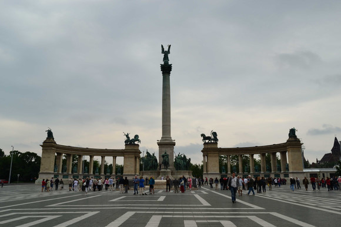
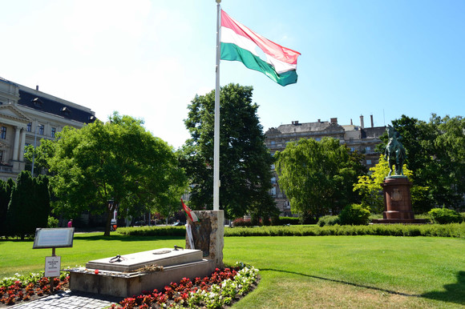
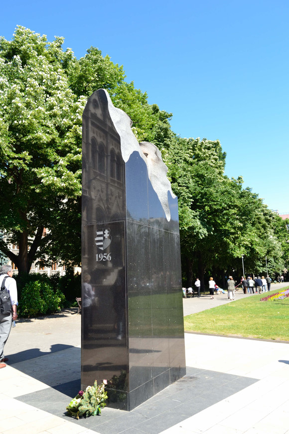
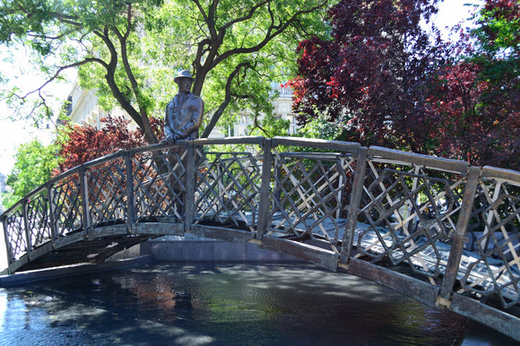
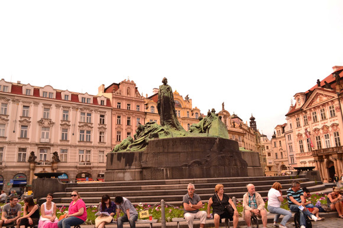
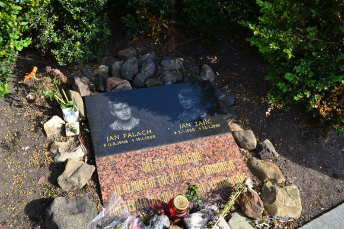
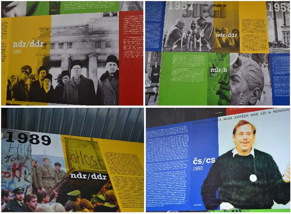

# ＜天权＞将记得进行下去

**只是就在那么一刻，当我站在瓦茨拉夫广场上看着身边那些自由的人们，看着墓碑，看着其实一直在被历史记录的卑鄙者和高尚者走过的足迹，看着他们终于生活在一个有权利直面真实的国家。我知道，我和我们所有为着记得今天所坚持的都是值得的。**  ** **

# 将记得进行下去

## 文/吉米糕（Universität Münster）

 一、 匈牙利的夜，是微醺的。女孩子们和男孩子们快乐地行走说笑，她们曲线曼妙，他们英气逼人。这国的初印象，不是破败，并非颓唐，却是自由的。 二、 英雄广场。一千多年前，一支东方的游牧民族迁徙至此。一千年后，他们的子孙建起这座 广场，向先人和他们所缔造的这个曾经无比强大的帝国致敬。七位当年马背上驰骋疆场的部落领袖，如今已化作雕像。他们以坚毅的姿态，屹立于广场中央，面前是 川流不息的世界各地的游客，和流动着永不停息的过去、现在、与未来。 

 三、 1956年，不再是帝国的“匈牙利人民共和国”，自由没有变得更多，而是濒死了。10月，学生与市民走上街头，人越来越多。斯大林的像倒了。秘密警察们开枪了。 苏联军队进来了。几千人死亡，许多人被捕，二十万匈牙利人成为难民，同情运动的时任匈牙利总理纳吉两年后被秘密宣判处死。 一切又都归于平静了，仿佛什么也没发生过一样…… 33年后，1989年。匈牙利社会主义工人党中央宣布，为那年的事件平反。政府决定 为纳吉举行国葬，许多老人带着下一代来参加他的葬礼。后来，在国会大厦的广场上，立起了一座死难者纪念碑。不远处，一面特殊的匈牙利国旗迎风飘着，旗的中 央，是一个圆洞，那是那年示威的人民愤怒的剪去了旗子中央的镰刀斧头图案，以此向极权专制抗议。 

 也是在不远处，国会大厦东南角的小桥上，纳吉的塑像静静地矗立着。小桥前总是有天真烂漫的孩子跑过。他们或许不知道，自己所生活的世界，不必再被谎言操控，是多么幸福的事情。 当阳光普照这片土地，她依然是不死的，为着所有曾经那样深爱她，并为之付出所有乃至生命的人们。 

四、 布拉格。旧城广场一如歌曲中那般风情万种。六百多年前，查理大学神学部的主任、也是后来这所学校的校长，主张恢复教会的纯洁性，发起“杯的改革”。主教与教皇震惊了，“异端” 与“主流”对抗的结果是，他被取消教籍，他被监禁8个月，并最终在康斯坦茨被处以火刑。 他叫胡斯。纪念他殉道500周年的雕像自1915年起矗立于布拉格旧城广场的一端。对于这片土地的许多人来说，他已成为一种象征。许多年后，在共产主义领导下的捷克斯洛伐克时代，许多人会在他的雕像下静静坐着，以沉默作表达。 

五、 瓦茨拉夫广场，鸽子在悠闲地踱步觅食，通往国家博物馆的大道两旁是琳琅满目的商店百货和交织的人流。这里的气氛如世界许多其他角落一样，慵懒、惬意。 

 90多年前，这里曾见证了“捷克斯洛伐克独立宣言”的诞生。 40多年前，这里曾有“布拉格之春”的复苏气息流淌。 也是那一年，8月，华约军队驶入这座城市，“春天”被戛然而止了。几个月后，两个查理大学的大学生，21岁的Jan Palach和19岁的 Jan Zajic，为了抗议苏联军队的入侵，在瓦茨拉夫广场点燃了自己。 如今，他们的纪念墓碑静静躺在广场上。 

在他们死去20年后，他们的祖国发生了天鹅绒革命。后来，当年曾发起77宪章并因此而入狱的那个名叫哈维尔的剧作家，当选为这里的总统。 又很多年过去了，已经卸任的他，给东方依然神秘的国度写了一封信，为着相似的遭遇，和那里依然被禁锢的人们。 六、 2011年6月2日的傍晚，我站在布拉格的瓦茨拉夫广场上。 许多游人，有刺眼的阳光打在脸上。 广场上正举行一个大型的图片展，是纪念结束苏联军队占领和解除华沙条约二十周年的“自由周”活动的一部分。 许多图片，讲述这个国家过去几十年中的政治和社会变迁，里面的许多身影，有那些曾经逆历史潮流而退的守旧者、刽子手，也有为着自由和尊严不懈奋斗的那些弱小却伟大的灵魂。 

有那么一刻，我的眼里全是泪水。 我们被告知，记得是痛苦的、无益的。 我们被嘲讽，那是幼稚的、无用的。 我们直到今日仍然在听到这样的声音，理想主义者，是该死的。 只是就在那么一刻，当我站在瓦茨拉夫广场上看着身边那些自由的人们，看着墓碑，看着其实一直在被历史记录的卑鄙者和高尚者走过的足迹，看着他们终于生活在一个**有权利直面真实**的国家。我知道，我和我们所有为着**记得今天**所坚持的都是值得的。 即使这仍然是一个连名字都不可以被提起的国度，却也要依然将记得进行下去。 因为历史的光，终有一日会荣耀这块选择不遗忘的土地，会慰藉那些逝去的人们，和所有后继者不死的心。 即使他们看不到，我们看不到，终有人会看到。 **编者注：本文写于2011年6月4日。**

（采编：乔 淼；责编：黄理罡）

