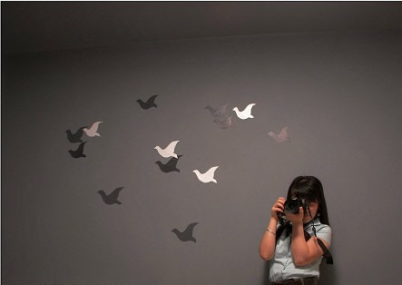

# ＜天权＞小资情调是浪漫主义的杀手

**伪浪漫者通过购买别人生产好的浪漫，或是一首浪漫的歌，一本畅销的看似有文化的书，一次为着某种艳遇准备的旅行来获得了他们心理上的满足；而真浪漫的态度、特立独行的生活方式、超越物质和世俗的羁绊的精神生活，反而成了一种反动——在这里，连“浪漫”本身都可以购买。**  

# 小资情调是浪漫主义的杀手

## 文/张亮（北京大学）

 

假设有一天，你坐在灯火昏黄的莎士比亚书店，一个不起眼的小店，海明威和萨特曾在这儿悠闲喝咖啡，在一张白纸上随意涂抹，偶尔，一个黑色头发乌鸦一样斜过头顶的漂亮小妞儿一闪而过，他们就习惯性地放下烟斗，戴上老花镜。此刻，你仿佛穿越到过去。你面前放着一本波德莱尔的《恶之花》，耳边响着贝多芬的月光曲，电脑里放着一部叫《大鼻子情圣》的法国电影，这部电影是说，有一个暗恋了表妹一辈子的表哥，临死之时，终于在表妹面前展读了自己雪藏半生未能寄出的情书，他的身体逐渐冷却，他的爱情却在体温降为零度时变成了太阳。

于是此刻，你终于流下了感动的泪水，一轮朝阳在遥远的地平线升起，普照人间，最后一滴泪水砸在情人逐渐苍白的嘴唇上，云雀冲出桃金娘密布的灌木丛，在天空中盘旋，唱出最后一曲求偶的欢歌，一头栽倒在绿草如茵的溪流岸边。

多么浪漫而感人的一幕，你终于升华了。

但如果镜头一转，你突然发现波德莱尔在巴黎街头衣衫褴褛，穷困潦倒，目光呆滞，灰溜溜的像一条丧家犬；贝多芬不修边幅，咆哮如雷，你叫他名字他半天反应不过来，花一分钟吃完一只猪肘时发出很大的声响，鼻音嘹亮，左边裤子膝盖上还有一个洞，浑身散发着莱茵河畔浓郁的乡土气息；或者是，在《大鼻子情圣》里发现，肉店老板写在纸上的十四行诗竟然被老婆拿去包肉，而那个所谓的大鼻子情人，竟然长着一个不堪入目的大鼻子，发出并不美妙的法语。瞬间，你全身长满了鸡皮疙瘩，想要撞墙而死，或者夺门而出。恰在此时，你发现自己所在的也并非莎士比亚书店，耳边完全不是悠扬婉转吹弹可破的小夜曲，而是荷尔德林蜗居了一辈子、一米阳光贵如石油的哥特式小阁楼，你就越发诅咒：“毛线，浪漫个球，他们这群龌龊的人。”

我想，这就是浪漫主义无法真正被我们接受的原因。浪漫主义者往往都是波西米亚人，赶着大篷车衣衫不整地走在恶臭扑鼻的街道上，身后是驱赶他们的警察，前面是不知通往何方的故乡。浪漫主义者永远在城市的最深处，用最敏感的笔触呼唤着不可能到达的家园。他们正是这样一群波西米亚人。浪漫主义者是最不看重形式的，或者说，看重内容远远超过形式；而真正的小资情调，往往是看重形式远远超过内容的。贝多芬不可以复制，但是贝多芬弹过的钢琴可以复制；莎士比亚不可以复制，但是取名为莎士比亚的咖啡馆可以建造；波德莱尔写《巴黎的忧郁》，周围充斥着装窗子玻璃的刺耳尖叫、锯木头的狂野旋律，一点也不美好。但这并不妨碍，我们今天喝着一杯卡布奇诺，把随意脚放在铺满阳光的石头凳子上，耳朵里塞着连通IPHONE4的耳塞，一种细微的痉挛从大腿根部一直通往腹股沟深处。这时我们终于感到，一种释然的快慰。

在这个一切可以用精致的物质包装起来的空间里，我们以为我们和贝多芬、波德莱尔身处同一个世界；但若是你陡然在熙攘的人群中，发现那么几个茕茕孑立、衣衫不整的怪人，你一定会跳起来，大叫一声“鬼啊！”

这就是小资情调。它攫取了它最容易攫取的浪漫的形式。这种形式是可以通过购买物资来实现的。

小资的生活态度是真浪漫的杀手，它伪浪漫的皮下是一颗真物质的羁绊的心，好比一只井底的青蛙，每天对着头顶那个月饼一样圆圆的天空充饥。

他们谈论音乐和文学，或者艺术与画展，只是叶公好龙，而非真的欣赏——因为别人也谈，比他们更懂的人也谈，他们不懂，就显得自己无知。这仿佛开放式超市的购物，人们争先恐后地抢购被别人抢购的产品，也许是一本畅销的文化类读物，也许只是一张新出的伪古典音乐。作为被潮流所裹挟而非创造或者引领潮流的人，他们将自己的人生目标或者所谓的人生意义牢牢地绑定在一些似是而非的“浪漫”中，实际却是前赴后继地追逐时尚与市场的方向——这和他们攒钱买最新款的单反相机、花上万人民币购买最新款的LV包包、去最流行的旅游地比如马尔代夫啊巴厘岛啊旅行是一个性质，都是对流俗的不断拥抱和消费。在一个拒绝创造力和想象力的时代里，人们对性感女人最性感的想象是AV女星，对AV女星最具想象力的想象是制服诱惑。想象力已死。

当然，他们需要显得有文化一些与众不同一些。宫崎骏说，地铁上不断抚摸IPHONE4的乘客，就像不断抚摸小鸡鸡自慰的电车大叔。这个说法过于苛刻，但毋庸置疑，IPONE4确实获得了普遍成功。

人是机器的附属，人的快乐源于成为机器的一部分，机器的更新换代是技术时代最后的想象力。

于是，伪浪漫者通过购买别人生产好的浪漫，或是一首浪漫的歌，一本畅销的看似有文化的书，一次为着某种艳遇准备的旅行来获得了他们心理上的满足；而真浪漫的态度、特立独行的生活方式、超越物质和世俗的羁绊的精神生活，反而成了一种反动——在这里，连“浪漫”本身都可以购买。

 

（采编：楼杭丹；责编：麦静）

 
